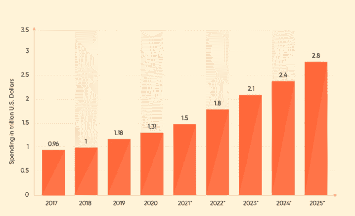
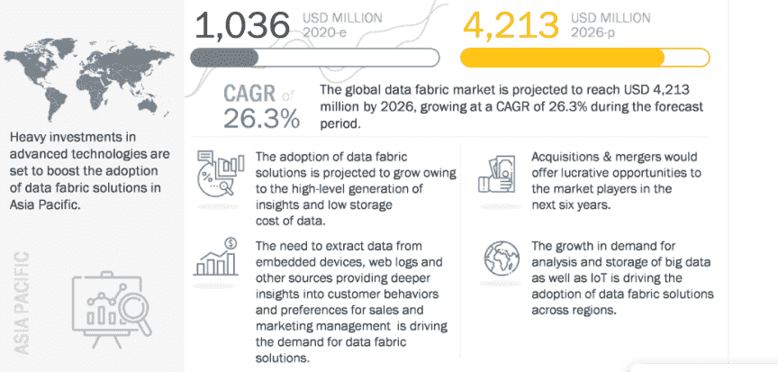
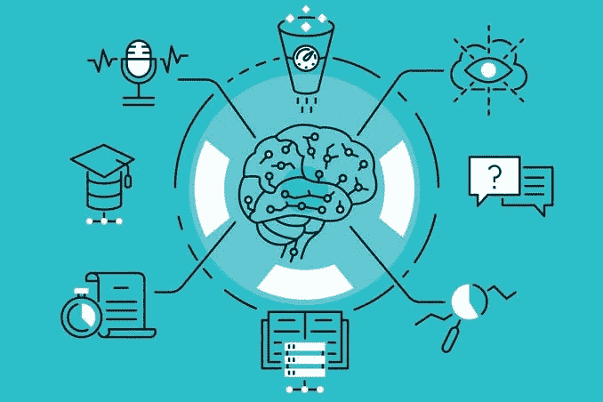

# 您应该知道的 10 大热门数字化转型趋势

> 原文：<https://medium.com/geekculture/10-hot-digital-transformation-trends-you-should-know-affd583cda46?source=collection_archive---------11----------------------->

2022 年，全球数字转型(DX)支出预计将超过 1.8 万亿美元，到 2025 年底将达到 2.8 万亿美元。( [Statista](https://www.statista.com/statistics/870924/worldwide-digital-transformation-market-size/) )

图片来源:网络解决方案

如今，企业不再满足于原地踏步，依赖相同的旧策略来保持竞争优势。

相反，他们正在寻找新的方法来创新客户体验，并以可持续增长的方式满足当今消费者不断变化的需求，数字化转型趋势正成为他们实现这一目标的主要方式。

但是这些趋势到底是什么？进一步阅读，了解 2022 年的数字转型趋势。

# 2022 年的顶级数字化转型趋势

为了在您的垂直业务中有效利用数字化转型趋势，您可以利用来自印度**顶级数字化转型公司**的 [**数字化转型服务**](https://www.valuecoders.com/digital-transformation-development-services?utm_source=digital_trans&utm_medium=guest_blog&utm_campaign=Medium&utm_id=NKY) 。将在 2022 年主导企业的数字化转型趋势包括:

# 零信任安全

随着组织继续向更加安全和高度可用的网络迈进，仍然有太多的应用程序不使用多因素身份认证(MFA)。在当今的威胁形势下，安全团队需要允许员工使用 MFA 进行访问，以便在复杂的攻击面前保持领先。

因此，当不使用 MFA 时，零信任安全有助于提供额外的安全层。零信任环境通过在移动设备或应用程序未连接到您的网络时防止对其进行未经授权的访问，在设备和应用程序之间实施访问策略。

此外，为了更好地了解贵组织的移动使用情况，建议实施零信任安全。这种方法旨在通过阻止对未连接到您网络的设备或应用程序的未授权访问来限制风险和暴露。

这将显著减少您的攻击面，同时允许授权用户在需要时从他们的移动设备安全地连接到外部应用程序。

# 2.数据结构

全球数据显示，到 2026 年，面料市场规模预计将增长至 42 亿美元。([市场和市场](https://www.marketsandmarkets.com/Market-Reports/data-fabric-market-237314899.html))

图片来源:市场和市场

企业数据结构的兴起正推动 IT 组织扩展其云服务并采用多云方法。数据结构在一个地方支持容器、弹性、边缘计算和大数据分析，从而为数字业务创造价值。

企业可以通过 CEP 引擎(对加密信息进行计算)交付具有实时洞察力的应用，而不会破坏加密。企业还应该使用 SDN 控制器或其他集中式软件程序，通过适当的网络和存储基础架构来支持 DevOps 文化。

从数字化转型趋势的早期采用者那里找到最佳实践，并确保企业不会跟不上快速变化的技术，这一点非常重要。

# 3.超自动化

自动化仍然是数字化转型的一种流行方式，但一些公司正在放弃传统工具，转向超自动化。

这些企业不是一次使用一种工具进行转型，而是并行运行多种工具，并依赖于整个体系的自动化。这种方法允许公司更无缝地运行流程，并试验新产品。

例如，如果你是一家快餐连锁店，想要推出更健康的菜单选项，超自动化将允许你创建移动应用程序，用于在结账时取食物，而不必开发全新的系统。

虽然超自动化可以为正在经历数字化转型的公司带来巨大好处，但它并不适合所有人——当然也有风险。

一些面向超自动化的计划包括:

## 内存计算

随着公司向实时流数据分析和决策发展，他们越来越多地采用内存计算。

实际上，它允许企业分析存储在公司服务器或直连存储(DAS)设备中的大量数据。

这种类型的系统不容易停机，因为它跟上内存的变化，而不是不断地从磁盘读取。例如，如果一台计算机停机，内存中的计算机将继续保持其内部状态而不会丢失。

## 橡胶胶溶剂（Rubber Peptizing Agent 的缩写）

*根据* [*德勤*](https://www2.deloitte.com/uk/en/pages/press-releases/articles/two-thirds-of-business-leaders-used-automation-to-respond-to-the-impact-of-covid-19.html) *的调查，93%的企业打算在 2023 年前部署 RPA。*

由于大数据和云存储，公司不再需要像以前那样依赖人类。为了帮助企业保持效率，机器人流程自动化(RPA)工具可以捕获企业的手动流程，并编程计算机来执行这些流程。

许多这样的系统已经在像摩根大通和汇丰银行这样的大公司中实施。虽然企业开始用自动化技术取代其大部分 IT 基础设施，但仍然存在一些重要的限制，使小型企业难以采用一些超自动化方法。

例如，雇用数千名员工的公司可以负担得起几十或几百个机器人，而较小的企业可能无法证明这样的投资是合理的。

## 4.生成人工智能

图片来源:中

这种数字化转型趋势侧重于利用算法来改善现有的业务流程和预测未来的结果。它是关于使用人工智能来补充而不是取代人类工作的增量收益。

人工智能可以通过从成千上万的历史案例中学习来优化金融系统、客户服务互动等。生成式人工智能的应用超越了大企业；生财也用于指不断创新和尝试新事物的小企业。

例如，生成性创新可以包括企业家与面包师合作，每天推出新鲜面包，或者根据当前的网站流量模式调整数字广告活动。

生成性创新的一些例子包括谷歌图片搜索、谷歌翻译和苹果歌曲识别。这些公司使用算法(规则集)来识别大型数据集(集合)中的模式，进行预测或决策(Jarvis)。

所有这些初创公司都专注于识别现代生活中的问题，并开发基于人工智能技术的创新解决方案。

这些行业随着向机器学习的快速发展而发展，同时越来越依赖于通过智能手机、智能汽车和可穿戴技术等技术获取的大量个人数据。

# 5.一切即服务(XaaS)

XaaS 是一种按需购买服务的方式。客户不必购买整个解决方案，而是可以只订阅他们需要的部分，如软件许可证或云存储，并且只为他们使用的部分付费。

其理念是帮助客户降低成本和复杂性，同时提供灵活性并消除供应商锁定(担心您被一家供应商束缚)。

有了 XaaS，企业能够以更快的速度进行试验和创新。云计算有助于让每个人都可以获得这样的服务，但是 XaaS 仍然有它的批评者；总而言之，它不一定比传统解决方案便宜。

如果您的组织需要定制才能正常运行，那么通过 XaaS 模式实现这一点可能会很困难。尽管如此，如果你的行业允许一致的许可模式和服务能力，那么 XaaS 作为一种数字化转型战略非常值得探索。

# 6.AR 云

*根据* [*ABI 研究*](https://www.wipro.com/content/dam/nexus/en/innovation/pdf/ar-cloud-the-next-generation-of-ar-experiences.pdf) *的说法，AR 云将扰乱完整的 AR 价值链，预计到 2024 年将增长 1020 亿美元。*

增强现实(AR)是一种快速增长的数字化转型应用，正在改变我们使用产品和与产品互动的方式。AR 使我们能够实时看到用计算机生成的内容增强的真实世界环境，从而创建更相关的体验。

随着云计算的新发展和带宽的提高，AR 云应用将在未来几年内起飞。开发的第一阶段将专注于联网设备——例如，在组装家具时，智能眼镜会将指令叠加到沙发上。

由于大多数物体都是独一无二的，一旦物体通过图像或视频捕获被识别并输入系统，其尺寸就可以通过互联网连接被存储和访问。

这种数字化转型趋势很复杂，很难包含在软件中，但如果你与印度顶级数字化转型公司**建立联系，这是很容易做到的。**

# **7.客户数据平台(CDP)**

**客户数据平台是一种基于云的客户数据存储库，用于收集和存储客户信息，包括行为数据。**

**企业使用 CDP 来获得对客户行为的更多洞察，以便更好地预测他们的需求。因为 CDP 聚集了如此多的消费者洞察，所以对于数字化转型工作来说非常有价值。**

**采用 CDP 的公司可以获得所有客户的实时更新，并随时访问历史客户行为，通常无需改变其业务流程或支付系统。**

**此外，一些 CDP 提供基于用户信息的个性化功能，例如位置和过去与公司产品或服务的交互。**

# **8.自动化和机器人**

**自动化和机器人技术是可以帮助您简化业务流程的两项最佳转型技术。**

**例如，机器人擅长快速执行重复性任务，这让拥有大量数据的公司有机会将人力资源从低价值工作重新分配到更具创造性的工作上。**

**一家利用自动化的公司是 Zappos 通过将机器学习和计算机视觉等技术用于物流、库存管理和客户服务，Zappos 已经成功将其履行成本降低了 60%。**

**除了提高效率，机器人还可以通过降低护理或客户服务等高压力角色的压力水平来提高员工的满意度。**

# **9.远程办公**

****

**图片来源:建筑执行**

**许多企业领导人认为，让员工回到传统的工作环境将提高生产率和创新。然而，最近的研究表明，远程办公可能对雇员和雇主都更好。**

**为了真正优化生产力，公司需要通过促进一定程度的在家工作来避免将办公室变成一个封闭的地方。远程办公可以让员工最有效地利用时间，减少干扰。**

**员工可以完全接受技术，制定自己的时间表，而不是一天八个小时被束缚在办公桌前，只要他们能实现目标。**

**管理者比以往任何时候都更容易远程跟踪员工的表现，因为现在大多数工作都有数字元素，而不仅仅是数字或可衡量的目标。**

# **10。网络安全**

**在当今相互联系的世界中，网络安全已经成为全球关注的问题。这种威胁是真实存在的，并且有据可查，许多组织都受到了黑客的攻击。**

**幸运的是，有一些方法可以保护你的数据免受网络攻击。首先，尽可能让你的软件保持最新(从苹果到 Windows 操作系统都是如此)。**

**此外，请确保您的所有设备上都安装了防病毒软件，并使用黑客难以破解的强密码(复杂性很重要！).**

**最后，投资于专门从事安全的 it 公司可能是明智的——他们可能会提供比自我管理更好的保护。他们不仅可以帮助保护您免受恶意攻击，还可以培训您的员工正确处理敏感信息。**

**这样，如果真的发生了什么事，也不会在整个组织中产生连锁反应。**

# **结尾词**

**数字化转型是一个需要精心规划和执行的过程。通过了解最新的数字化转型趋势，您可以保持领先，并确保您的公司为未来做好准备。**

**实施这些趋势中的几个就可以帮助您简化流程、提高生产力和促进创新。你会先实现什么趋势？**

**为了做出正确的决定，请联系**顶级数字化转型咨询公司**。他们将帮助您评估贵公司的具体需求，并推荐最佳发展方向。**