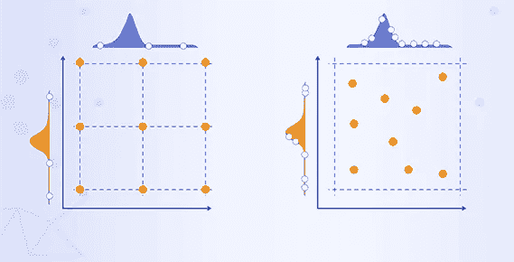

# 您的 LSTM 模型需要关注的 10 个超参数以及其他提示

> 原文：<https://medium.com/geekculture/10-hyperparameters-to-keep-an-eye-on-for-your-lstm-model-and-other-tips-f0ff5b63fcd4?source=collection_archive---------0----------------------->

Hyperparameter tuning— grid search vs random search

深度学习已被证明是机器学习的一个快速发展的子集。它旨在通过模仿人脑来识别模式并做出真实世界的预测。基于这种神经网络拓扑的模型实际上在每个行业都有应用。所有(整体)步骤中最重要的步骤可能是训练这样的模型，以便它能够在任何新的测试数据中做出稳健的预测。因此，以这样的方式选择模型的超参数(其值用于控制学习过程的参数)是相关的，即训练在时间和拟合方面都是有效的(无论模型“知道”训练数据是太好还是太差；以限制任何形式的过度配合或配合不足)。

这篇文章特别谈到了 LSTM，一种独特的递归神经网络(RNN ),能够学习数据集中所有的长期依赖关系。递归神经网络是一类处理时间数据的神经网络。长期短期记忆(LSTM)的控制流程与递归神经网络类似，它在处理数据的同时传递信息。实际的区别在于长短期记忆网络的细胞内的操作。这些操作允许 LSTM 保存或忘记信息。LSTMs 允许误差通过时间和层反向传播，因此有助于保存它们。LSTM(长短期记忆)模型是一种人工递归神经网络(RNN)架构，具有反馈连接，使其不仅能够处理单个数据点，还能够处理整个数据序列。本文针对 LSTM 模型的所有此类超限仪进行了讨论，这些超限仪是提高性能所必需的，并讨论了哪些值是最佳实践。

在我们开始调优与 LSTM 最相关的超参数之前，值得注意的是，有一些方法可以让您的系统通过使用优化工具为您找到超参数。这些方法有助于在识别和调整好的超参数时绕过更多的手动过程。在 Python 中，一些这样的工具是:

keras Tuner—[https://blog . tensor flow . org/2020/01/hyperparameter-tuning-with-keras-Tuner . html](https://www.researchgate.net/deref/https%3A%2F%2Fblog.tensorflow.org%2F2020%2F01%2Fhyperparameter-tuning-with-keras-tuner.html)

贝叶斯优化—【https://github.com/fmfn/BayesianOptimization 

网格搜索—[https://sci kit-learn . org/stable/modules/generated/sk learn . model _ selection。GridSearchCV.html](https://www.researchgate.net/deref/https%3A%2F%2Fscikit-learn.org%2Fstable%2Fmodules%2Fgenerated%2Fsklearn.model_selection.GridSearchCV.html)

应该记住，许多这样的超参数是不稳定的，因为不同的值(或者甚至相同的值和不同的运行)可能产生不同的结果。因此，确保您总是通过调整这些超参数来比较模型和性能，以获得最佳结果。

**要调整的相关超参数:**

**1。** **节点数和隐藏层数**

输入层和输出层之间的层称为隐藏层。这一基本概念使得深度学习网络被称为“黑匣子”，经常被批评为不透明，并且它们的预测无法被人类追踪。对于应该使用多少个节点(隐藏神经元)或隐藏层，没有最终的数字，所以根据具体的问题(信不信由你)，试错法会给出最好的结果。

一般来说，一个隐藏层可以处理大多数简单的问题，两个隐藏层可以处理相当复杂的问题。此外，虽然一个图层中的许多节点(使用正则化技术)可以提高精度，但较少的节点数可能会导致拟合不足。

**2。** **密集层中的单元数**

方法:model.add(Dense(10，...))

密集层是使用最频繁的层，基本上是每个神经元接收来自前一层中所有神经元的输入的层，因此是“密集连接的”。密集层提高了整体精度，每层 5–10 个单位或节点是一个很好的基础。因此，最终密集层的输出形状将受到指定神经元/单元数量的影响。

**3。** **辍学**

方法:model.add(LSTM(…，dropout=0.5))

每个 LSTM 层都应该有一个下降层。这种层有助于通过绕过随机选择的神经元来避免训练中的过度拟合，从而降低对单个神经元的特定权重的敏感性。虽然输出图层可用于输入图层，但不应用于输出图层，因为这可能会打乱模型的输出和误差计算。虽然增加更多的复杂性可能会有过度拟合的风险(通过增加密集层中的节点或增加更多数量的密集层，并且具有较差的验证准确性)，但这可以通过添加 dropout 来解决。

一个好的起点是 20%，但下降值应保持较小(最高 50%)。20%的值被广泛认为是防止模型过度拟合和保持模型准确性之间的最佳折衷。

**4。** **权重初始化**

理想情况下，最好根据所使用的激活函数采用不同的权重初始化方案。然而，更常见是，在选择初始权重值时使用均匀分布。不可能将所有权重设置为 0.0，因为误差梯度中的不对称性是由优化算法带来的；开始有效的搜索。不同的权重集合导致优化过程的不同起点，潜在地导致具有不同性能特征的不同最终集合。权重应该最终被随机初始化为较小的数字(随机优化算法的一个期望，或者称为随机梯度下降),以利用搜索过程中的随机性。

**5。** **衰变率**

如果没有安排其他权重更新，权重衰减可以被添加到权重更新规则中，使得权重指数地衰减到零。每次更新后，权重会乘以一个略小于 1 的系数，从而防止权重变得过大。这指定了网络中的正则化。

默认值 0.97 应该足以启动。

**6。** **激活功能**

激活功能将节点的输出定义为开或关。这些函数用于向模型引入非线性，允许深度学习模型学习非线性预测边界。从技术上讲，激活函数可以包含在密集层中，但是将它们分成不同的层使得有可能恢复密集层的减少的输出。

同样，激活层的选择取决于应用，但整流器激活功能最受欢迎。特定的情况需要特定的功能。例如，sigmoid 激活用于二进制预测的输出层，softmax 用于进行多类预测(softmax 使您能够将输出解释为概率。

方法:该过程是创建用户定义的函数，并让它返回与任何特定激活函数相关联的输出。例如，下面是一个 sigmoid 激活函数:

定义乙状结肠(x):

return 1/(1+np.exp(-x))

Sigmoid (log-sigmoid)和双曲正切是 LSTM 块中采用的一些更流行的激活函数。

**7。** **学习率**

这个超参数定义了网络更新其参数的速度。设置较高的学习速率加速了学习，但是模型可能不收敛(训练期间的一种状态，其中损失稳定在最终值附近的误差范围内)，或者甚至发散。相反，较低的速率会大大降低学习的速度，因为向损失函数的最小值前进的步伐很小，但是会允许模型平滑地收敛。

通常，衰减学习率是优选的，并且该超参数用于训练阶段，并且具有小的正值，通常在 0.0 和 0.1 之间。

**8。** **气势**

动量超参数已被研究与 RNN 和 LSTM 整合。动量是一个独特的超参数，它允许累积过去步骤的梯度来确定前进的方向，而不是仅使用当前步骤的梯度来引导搜索。

通常，该值在 0.5 到 0.9 之间。

**9。** **历元数**

这个超参数设置了要运行数据集的多少次完整迭代。虽然从理论上讲，这个数字可以设置为 1 到无穷大之间的一个整数值，但是这个数字应该增加，直到验证精度开始降低，即使训练精度增加了(因此有过拟合的风险)。

有利的一步是采用早期停止方法，首先指定大量的训练时期，并在模型性能停止提高验证数据集的预设阈值时停止训练。

**10。** **批量大小**

这个超参数定义了在模型的内部参数更新之前要处理的样本数。对于相同数量的“可见”样本，大尺寸比小尺寸产生更大的梯度阶跃。

被广泛接受的批量大小的默认值是 32。为了实验，你可以尝试 32 的倍数，比如 64，128 和 256。

**其他一些提示:**

除了调整超参数，这里还有一些训练 LSTM 或 RNN 模型的技巧。

**1。** **优化设置**

**自适应学习率:**为了更好地处理递归神经网络的复杂训练动态(简单的梯度下降可能无法解决)，建议使用 Adam 等自适应优化器。

**梯度削波:**梯度中的尖峰会在训练期间搞乱参数。这可以通过首先绘制梯度范数(以查看其通常的范围)然后按比例缩小那些超过该范围的梯度来防止。

**损失归一化:**将损失项沿序列相加，然后除以最大序列长度。这将使整个批次的损失达到平均，从而使实验之间重复使用超参数变得更加容易。

**截断反向传播:**由于消失和噪声梯度，任何形式的递归网络都可能难以学习长序列。尽管 LSTM 专门设计来解决梯度消失的问题，但值得注意的是，一些专业人士建议在大约 200 步的重叠块上进行训练，在训练过程中逐渐增加块的长度。

**2。** **网络结构**

**门控循环单元:** GRU 是一种替代细胞设计，与 LSTM 相比，它使用的参数更少，计算速度更快。

**层归一化:**另一种加速学习和提高最终性能的方法是对递归网络的所有线性映射增加层归一化。

**前馈层:**通过使用前馈层对输入进行预处理，可以使您的模型将数据投影到具有更简单时间动态的空间中。这有助于提高性能。

**3。** **模型参数**

**学习的初始状态:**由于将隐藏状态初始化为零，因此在最初的几个时间步骤中导致大的损失项，从而使模型较少关注实际序列。将初始状态训练为变量可以提高性能。

**遗忘门导致的偏差:**递归网络需要一段时间来学习记忆上一时间步的信息。这可以通过将 LSTM 的遗忘门的偏置初始化为 1 来改善，使其在默认情况下记住更多。类似地，对于 GRUs，偏差需要初始化为-1。

**正则化:**正则化方法(如 dropout)是众所周知的解决模型过拟合的方法。

**最终想法:**

Keras 等开源库使我们从编写复杂的代码来制作复杂的深度学习算法中解放出来，每天都有更多的研究在进行，以使建模更加鲁棒。虽然这些关于如何在 LSTM 模型中使用超参数的提示可能很有用，但您仍然需要在这个过程中做出一些选择，比如选择正确的激活函数。重要的是要记住，不是所有的结果都讲述了一个没有偏见的故事。例如，损失中最小的改进最终会对模型的感知质量产生很大的影响。如果训练损失不能改善多个时期，最好停止训练。否则评估损失将开始增加。最后，最好的结果来自于测试各种配置后的评估结果。

**参考文献:**

1.时间序列— LSTM 模型。([https://www . tutorialspoint . com/time _ series/time _ series _ lstm _ model . htm #:~:text = It % 20 is % 20 special % 20 kind % 20 of，layers % 20 interactive % 20 with % 20 each % 20 other](https://www.tutorialspoint.com/time_series/time_series_lstm_model.htm#:~:text=It%20is%20special%20kind%20of,layers%20interacting%20with%20each%20other)。)

2.LSTMs 和 GRUs 图解指南。([https://towards data science . com/illustrated-guide-to-lstms-and-gru-a-step-by-step-a-description-44e 9 EB 85 BF 21](https://towardsdatascience.com/illustrated-guide-to-lstms-and-gru-s-a-step-by-step-explanation-44e9eb85bf21))

3.将动量整合到递归神经网络中。([https://arxiv . org/ABS/2006.06919 #:~:text = We % 20 study % 20 the % 20 moment % 20 long，% 2d the % 2d art % 20 orthogonal % 20 rnns](https://arxiv.org/abs/2006.06919#:~:text=We%20study%20the%20momentum%20long,%2Dthe%2Dart%20orthogonal%20RNNs))

4.Keras —致密层。([https://www.tutorialspoint.com/keras/keras_dense_layer.htm](https://www.tutorialspoint.com/keras/keras_dense_layer.htm))

5.LSTM 网络分类中不同激活函数的性能比较分析。([https://link . springer . com/article/10.1007/s 00521-017-3210-6 #:~:text = The % 20 most % 20 popular % 20 activation % 20 functions，functions % 20 have % 20 been % 20 successfully % 20 applied](https://link.springer.com/article/10.1007/s00521-017-3210-6#:~:text=The%20most%20popular%20activation%20functions,functions%20have%20been%20successfully%20applied)。)

6.亚当:一种随机优化方法。([https://arxiv.org/pdf/1412.6980.pdf](https://arxiv.org/pdf/1412.6980.pdf))

7.使用统计机器翻译的 RNN 编码器-解码器学习短语表示。([https://arxiv.org/pdf/1406.1078.pdf](https://arxiv.org/pdf/1406.1078.pdf)

8.图层规范化。(【https://arxiv.org/pdf/1607.06450.pdf】T2

9.训练递归神经网络的技巧。([https://dani jar . com/tips-for-training-recurrent-neural-networks/](https://danijar.com/tips-for-training-recurrent-neural-networks/))