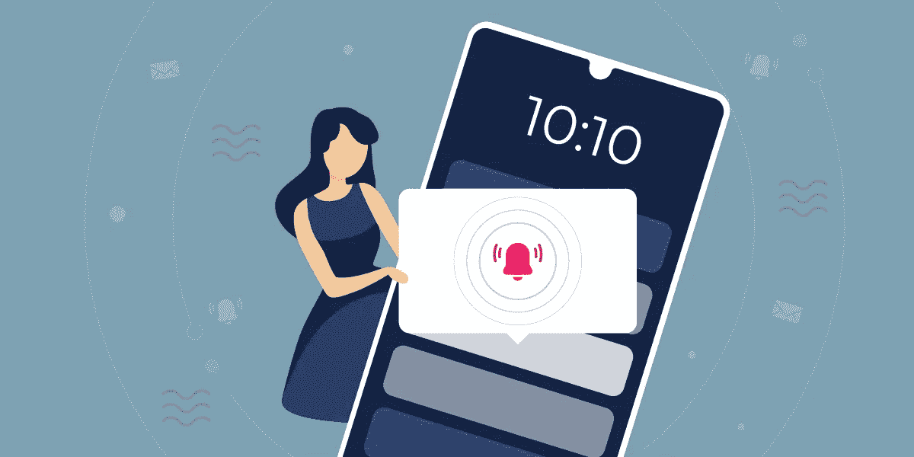

# 移动应用的 10 个推送通知提示

> 原文：<https://medium.com/geekculture/10-push-notification-tips-for-mobile-apps-827d0c636ae0?source=collection_archive---------17----------------------->

Mobile App Push-Notification

随着推送通知如今变得越来越普遍和流行，让人们回到应用程序变得越来越难。根据[一份关于推送通知影响的报告](https://www.invespcro.com/blog/push-notifications/)，推送通知的平均点击率为 10.3%。几乎在大多数行业，IOS 用户的打开率都低于 Android 用户，包括 B2B &金融、教育、游戏、媒体&娱乐等。尽管点击率很低，“移动应用推送通知可以将应用参与度提升高达 88%”。出于这个原因，许多应用程序经理、开发人员和营销人员在设计移动推送通知时都在测试和实施新的技术和策略。

# 什么是推送通知？

推送通知是从应用程序发送到用户设备并显示在锁定屏幕上的消息。它们被应用程序公司用作吸引和召回用户的必要而有效的营销策略。这种营销策略的最大优势在于，应用公司不需要用户的任何联系信息。他们只需要获得用户的许可就可以发送通知，尤其是 iOS 用户，因为他们需要[手动启用服务](https://developer.apple.com/documentation/usernotifications/asking_permission_to_use_notifications)。
然而，即使应用程序用户个人已经启用了推送通知，他们可能仍然会感到不安。那么，如何利用你的推送通知策略来更好地吸引你的 iOS 用户，而不是惹恼他们呢？？我们希望这篇文章能帮助你理解推送通知，更好地制定你的吸引策略。

# 推送通知的 3 个好处

## 带回用户

推送通知是带回用户最有效的方式。研究表明，当推送功能启用时，65%的用户会在 30 天内返回应用程序。原因可能是当用户不使用应用程序时，推送通知是与用户直接沟通的唯一方式。使用这种技术通过应用内活动或他们感兴趣的信息来吸引用户，可以很容易地将他们带回应用。

## 保持应用程序用户的参与

推送通知是保持应用程序用户参与的强大工具。它们显示对用户有吸引力的内容，并通过启动应用程序和充分利用应用程序服务来激发他们进一步探索。为了吸引和留住用户，你必须使用推送通知不断展示他们感兴趣的内容，这也是长期成功的关键因素。

## 实时机载用户

在当今的数字世界中，与 app 用户交流的最即时方式是什么？是的，它们是推送通知。当用户实际使用某个功能但选择退出应用程序时，他们可以实时收到这种消息。当 app 进行的任务完成后，push 可以通知 app 用户，并引导他们进行下一步。在这种情况下，推送通知可以作为机载用户的指南，并指导他们实时使用该功能。

# 移动应用的 10 个推送通知提示

## 1.在适当的时候请求允许

要向用户发送通知，应用公司必须获得应用用户的许可。然而，当应用程序需要他们的许可时，应用程序用户可以保持警惕。因此，他们在启用它之前会三思。为了赢得他们的信任，你应该在最好的时候请求他们的允许。例如，当用户下订单时，司机应用程序可能会请求许可。这告诉用户推送通知的价值，因为他们可以显示实时警报，如有人已经接单，司机多久会到达目的地等。在这种情况下，应用程序用户更有可能打开通知。

## 2.个性化推送通知

当信息与自己更相关时，人们会更敏感。个性化通知在正确的时间针对正确的用户。[根据位置、应用内行为、性别或兴趣对用户进行细分](https://www.appflow.ai/blog/4-models-for-mobile-app-user-segmentation)有助于个性化推送通知，因为您可以相应地设计消息的内容和风格，并在向用户发送通知时更好地寻址他们。这将有助于更好地抓住他们的注意力。例如，购物应用程序可以通过在推送中包含用户的姓名来通知用户订单的动态状态。

## 3.使用激励性词语

推送通知用于吸引用户，并激励他们在应用程序中执行特定操作。撰写邮件时，选词很重要。[在推送中使用激励词](https://clevertap.com/blog/push-notification-power-words/)可以增加点击率，因为它可以创造一种紧急和紧迫的感觉，可以使用户立即采取行动。例如，带有“限时”字样的推送比没有“限时”字样的推送更有激励性。

## 4.添加富媒体

要抓住用户的眼球，富媒体是一个很好的工具。人们对表情符号、gif、图片和视频等富媒体更感兴趣。用 gif 创建推送通知可以带来进一步的交互。因此，用户会参与到应用程序中。例如，一个视频应用程序用标题图像吸引用户，这可以提高用户的好奇心，他们最终会启动应用程序来了解它。

## 5.提供价值

应用本身应该为用户提供价值，推送通知是传递应用价值或用户将获得的价值的桥梁。例如，包含“节省 22%的钱”的促销活动被视为给应用程序用户增加了价值，因为如果他们现在购买，他们可以节省金钱。所以他们更愿意打开 app，进行购买。推送通知上显示的值可以成为促使用户参与应用的激励因素。

## 6.即时支持和鼓励

当个人连接用户时，推送通知可以是即时的。当用户被潜在的 bug 阻碍或打断时，一个告知正在发生什么以及下一步该做什么的推送通知将对用户有所帮助。当用户完成一个期望的任务时，如果他们收到一个祝贺的推送，这将是对他们的鼓励。这将为用户创造一种成就感，因此他们更有可能继续使用该应用程序。

## 7.让用户保持最新状态

让用户了解最新的应用程序功能，一方面，可以让他们坚持使用应用程序，并在应用程序中提高 LTV；另一方面，它还可以向用户提供或告知他们可以用来实现目标的新功能。例如，一个游戏应用程序会通知用户他们新更新的技能，并教他们如何在游戏中使用这些技能。

## 8.适度发送推送通知

移动应用程序用户每天都会收到许多来自各种应用程序的通知。为了避免用户感到不安和烦恼，适度地发送推送通知是一个好主意。它们应该足以激励用户，并产生一种鼓励或兴奋的感觉。研究表明，每周一次推送通知可以最大限度地防止用户停止使用该应用程序。

## 9.选择合适的时间发送

人们总是忙于他们的时间表。因此，如果你想让应用程序用户一看到通知就直接进入你的应用程序并使用它，你应该选择一天中正确的时间。发送推送的最佳时间因应用类型而异。如何选择合适的时间发送推送？首先，考虑一下用户需要你的应用程序或者可以免费使用应用程序的时间。其次，对用户行为和用户使用 app 的最常见时间做研究。最后，选择发送消息的最佳时机，查看一下参与度。您可以随时调整和重新安排推送通知，以 A/B 测试结果，并找出点击率或参与度更高的更好时刻。

## 10.与用户保持联系

推送通知是一种与用户联系的媒介。总是表现出你关心他们会唤起一种重要感。例如，在重要的节日和特殊时刻，比如他们的生日，给应用程序用户发送个人祝福，是与应用程序用户联系的一个好方法。这种信息传达了一种意愿，即你希望长期保持这种关系。

# 通过无代码工具采用动态推送通知策略

推送通知有助于应用开发者/营销人员与应用用户进行即时、便捷的沟通。然而，用代码构建推送通知需要时间和工程资源。改变你的参与策略也是不灵活的。以下是 Appflow.ai 对你的价值。
[Appflow.ai 的免编码推送通知功能](https://www.appflow.ai/remote-configuration)可以通过远程配置创建推送通知，使您能够撰写内容(支持多语言)并选择运行哪个操作系统(iOS 或 Android)。同时，您可以选择发送哪些**用户段**，并决定通知**触发**:时间触发或事件触发。这些都是在一页上实现的。这样你就不会在编码上浪费时间了。你需要做的就是编辑和点击。

Appflow.ai — Creat Push Notifications via Remote Configuration

只要选择正确的工具，发送推送通知会很容易。

# 简单地

推送通知在吸引或重新吸引应用程序用户方面发挥着重要作用。它们也是提高应用内转化率和 LTV 的好方法。然而，发送太多的推送通知可能会困扰应用程序用户。牢记我们上面讲的策略，遵守一般规则。此外，使用无代码工具发送即时推送有助于与应用用户建立有利可图的长期关系。

 [## 移动应用的远程配置- Appflow

### 及时沟通是用户留存的关键。给你的用户提供关于特别交易、奖励的信息…

www.appflow.ai](https://www.appflow.ai/remote-configuration)