# 2023 年您需要了解的 10 大医疗保健应用发展趋势

> 原文：<https://medium.com/geekculture/10-top-healthcare-application-development-trends-you-need-to-know-in-2023-f83432e39427?source=collection_archive---------6----------------------->

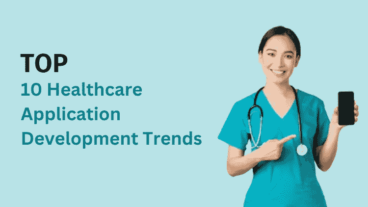

近年来，医疗保健技术取得了长足的进步，预计随着我们迈向 2023 年，它将继续发展。随着人工智能(AI)和物联网(IoT)的兴起，医疗保健应用程序开发对于改善患者疗效和提供更好的医疗保健服务变得越来越重要。

据估计，到 2023 年，医疗保健应用市场的价值将超过 500 亿美元。随着移动技术的进步，它对医疗保健行业的影响也将随之增加。很明显，移动应用将继续成为改善医疗服务的关键因素，为每个人提供更好的优质医疗服务。

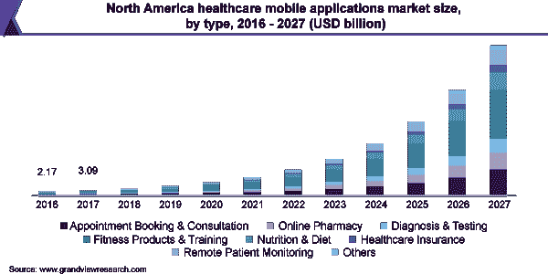

# **移动应用对医疗保健行业有什么影响？**

随着移动应用的使用，医疗保健行业正在快速变化，医疗保健应用开发成为快速增长的趋势也就不足为奇了。移动应用正迅速成为医疗保健提供商、患者和其他利益相关者的首选解决方案。移动应用程序为有需要的人提供了便利、更好的沟通和更高效的护理服务。

如今的移动应用程序设计得非常直观，为用户提供了节省时间和精力的简化体验。它们还可以安全地存储患者数据和信息。这使得医疗保健提供商可以随时随地访问他们的患者记录，不再需要纸质记录。

移动应用彻底改变了我们获取医疗保健服务的方式。它们可以用来安排预约、联系医疗服务提供者、查找健康信息，甚至远程监控生命体征。应用程序还可以提醒服用药物、安排实验室测试和查看测试结果。在移动应用程序的帮助下，医疗记录可以在提供商和保险公司之间快速共享，从而节省宝贵的时间和资源。

医疗保健应用程序开发的未来看起来非常有前途。随着技术的不断发展，移动应用将成为医疗保健行业不可或缺的一部分。我们可以期待看到人工智能驱动的应用程序的进步，这些应用程序可以分析数据以早期检测医疗问题，远程医疗应用程序可以与医生进行远程会诊，虚拟助理应用程序可以指导用户完成医疗过程。可能性确实是无穷无尽的。

# **让我们来讨论一下 2023 年你需要知道的 10 大医疗保健应用发展趋势。**

## **1。移动医疗的增长**

移动医疗的增长是 2023 年最重要的医疗保健应用发展趋势之一。随着个性化护理需求的不断增长和移动技术的进步，医疗保健组织正在转向移动应用程序，以提供更好的护理和更好的服务访问。

移动健康应用有可能改变医疗保健的提供方式，并改善患者的疗效。从提供远程患者监控功能到向患者提供教育内容，移动健康应用程序可以帮助弥合医疗专业人员和患者之间的差距。

此外，移动健康应用程序使医疗保健组织能够更好地收集数据并快速分析，从而做出更加明智的护理决策。借助移动健康应用，医生和护士可以快速实时访问重要的医疗信息，如患者的生命体征、药物和病史。这可以帮助他们识别模式，更有效地治疗患者。

此外，移动健康应用程序可用于提高患者的参与度和对处方治疗的依从性。当患者需要服药或跟踪他们的健身目标时，他们可以收到提醒。此外，他们可以轻松地与医生或护士沟通，从而更好地协调护理。

移动健康应用程序可以在患者和医生之间提供更大的透明度。患者可以很容易地查看他们的医疗记录，并就他们的治疗提出问题。这种增加的透明度可以使双方更好地做出决策，并改善总体健康结果。

由于有可能彻底改变医疗保健的交付方式，难怪移动医疗保健应用程序会成为 2023 年医疗保健应用程序的主要发展趋势之一。

## **2。互联患者的崛起**

医疗保健应用开发中最令人兴奋的趋势之一是“互联患者”的兴起。通过使用移动应用、可穿戴设备和其他互联健康技术，患者现在可以访问自己的医疗数据，并更多地参与自己的护理。

联网的患者应用程序允许用户跟踪他们的生命体征，与他们的医生或其他医疗保健提供商联系，获得个性化的建议和反馈，并随时了解他们医疗状况的最新消息。通过访问这些应用程序，患者能够更积极地管理自己的健康，改善结果，并随时了解自己的医疗保健选择。

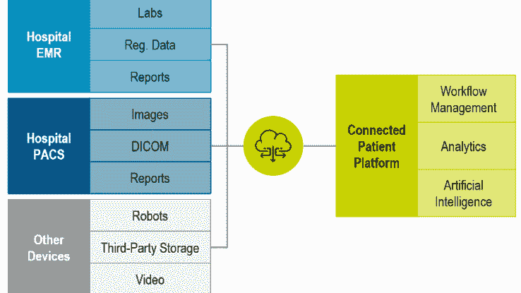

这种以病人为中心的医疗保健趋势正在改变医疗保健的提供方式。通过使患者能够控制自己的健康，医疗保健组织能够提供更好的护理，并更有效地利用资源。

此外，互联患者应用程序使医疗保健提供商能够更好地了解患者的需求，从而相应地定制治疗方案。这一趋势使得医疗保健提供者能够个性化护理，并创建更高效的系统。

互联患者的兴起为医疗保健应用开发打开了一个可能性的世界。随着新技术的不断涌现，这些应用将会继续发展，并更加融入我们的日常生活。

考虑到这一点，医疗保健组织在开发满足患者需求的应用时必须保持领先。为了在这个不断发展的环境中保持竞争力，医疗保健提供商需要准备好利用医疗保健应用程序开发的最新趋势。

## **3。患者生成数据的增加**

有了患者生成的数据，医疗保健提供者可以更好地了解患者的健康状况、生活习惯和行为。这些数据可以用来更好地确定疾病的原因，这将有助于提高护理质量。此外，这些数据还可以帮助医疗保健提供商开发针对个人需求的个性化治疗。

随着医疗保健应用程序开发的不断发展，越来越多的工具可供提供商快速、轻松地获取患者生成的数据。其中一些工具包括移动健康应用和可穿戴传感器。通过利用这些工具，医疗保健提供商可以获得关于患者健康和生活方式的宝贵见解，从而提供更好的护理。

此外，医疗保健提供商还可以使用人工智能(AI)和机器学习来分析患者生成的数据。人工智能应用程序可以分析大量数据，以便提供更准确的诊断和治疗选择。这将允许医疗保健提供者为他们的患者提供更加个性化和精确的护理。

通过利用最新的医疗保健应用发展趋势，医疗保健提供商可以更好地了解和管理他们患者的健康。患者生成的数据是一种非常宝贵的资源，可以帮助医疗保健提供商提高护理质量，并为每位患者提供个性化治疗。

## **4。移动医疗硬件的增长**

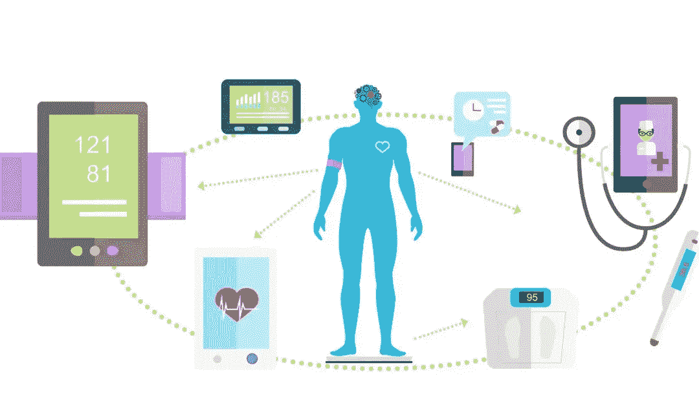

随着医疗保健提供商努力满足其患者的需求，移动医疗行业将在未来几年经历巨大的增长。作为这种增长的一部分，移动医疗硬件对于患者护理和数据收集变得越来越重要。

随着数字技术和物联网的兴起，移动健康硬件变得更加触手可及。在移动设备、传感器和其他可穿戴设备的帮助下，医疗保健专业人员可以在移动中收集患者的宝贵数据。这些数据可用于提供更全面的整体健康状况，并帮助医疗专业人员改善其诊断和治疗决策。

这不仅有助于医疗保健提供者更好地了解他们的患者，而且还使他们能够更密切地监测患者的生命体征、活动和症状，从而提供更高质量的护理。此外，它还可以帮助降低与频繁医院就诊相关的成本，并提高医疗程序的整体效率。

此外，移动健康硬件正变得更加用户友好和易于使用，甚至允许那些没有广泛技术知识的人从其使用中受益。这使得患者可以更容易地收集关于他们自己的数据，并与他们的医生分享，以便更全面地了解他们的健康状况。

随着对移动健康硬件需求的持续增长，该行业在产品开发方面变得更加创新。从测量心率和血压等生命体征的设备到可以准确检测心脏杂音的数字听诊器，移动健康硬件的可能性是无穷无尽的。这些设备在世界各地的医院和医生办公室变得司空见惯只是时间问题。

毫无疑问，移动医疗硬件的发展将持续到未来，为患者提供更好的医疗服务，并为医疗专业人员提供更好的诊断工具。对于医疗行业来说，这是一个激动人心的时刻，也是一个将对未来几年医疗保健提供方式产生持久影响的时刻。

## **5。医疗保健可穿戴设备的增长**

随着技术的不断发展，医疗保健行业已经开始利用更多的创新应用来监控患者和改善整体护理。医疗保健技术最显著的进步之一是医疗保健可穿戴设备的出现。

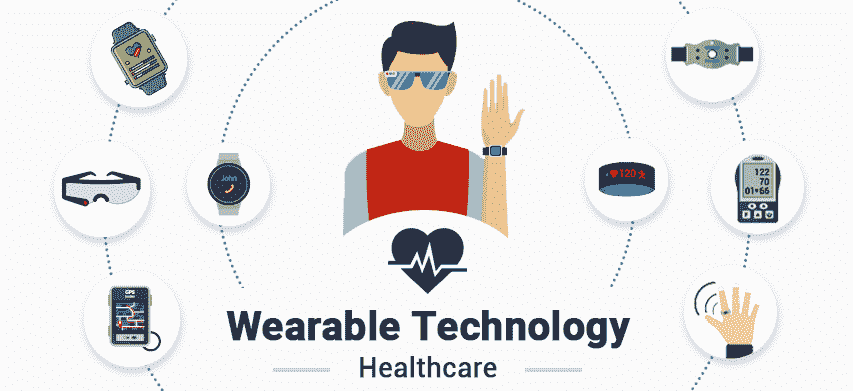

医疗保健可穿戴设备是佩戴在患者身上的设备，用于监控心率、血压、睡眠和其他指标等健康数据。这些数据可以用来指导关于药物治疗、饮食和生活方式改变的决策。此外，许多可穿戴设备还包括药物提醒或跟踪活动水平等功能。

可穿戴设备在医疗保健领域越来越受欢迎，因为它们能够为患者和医生提供可操作的见解。例如，佩戴活动跟踪器的患者可以看到他们的活动水平如何影响他们的整体健康，并做出必要的调整。此外，医生可以使用这些数据来评估患者的进展，并相应地调整治疗。

医疗保健可穿戴设备的使用正在持续增长，预计到 2023 年，它将在医疗保健行业变得更加普遍。因此，对于医疗保健组织来说，确保他们配备了正确的技术和数据基础架构来支持这些设备以及由此产生的大量健康数据非常重要。

未来几年，开发和部署医疗可穿戴设备的投资可能会激增。这将意味着对医疗保健软件开发商的需求增加，这些软件开发商在开发可以从这些可穿戴设备收集和分析数据的应用程序方面拥有专业知识。

医疗保健可穿戴设备为监控患者健康和改善护理提供了一种很有前景的方式。随着医疗保健行业继续采用此类新技术，观察这一趋势在 2023 年及以后如何发展将是一件有趣的事情。

## **6。数字疗法的兴起**

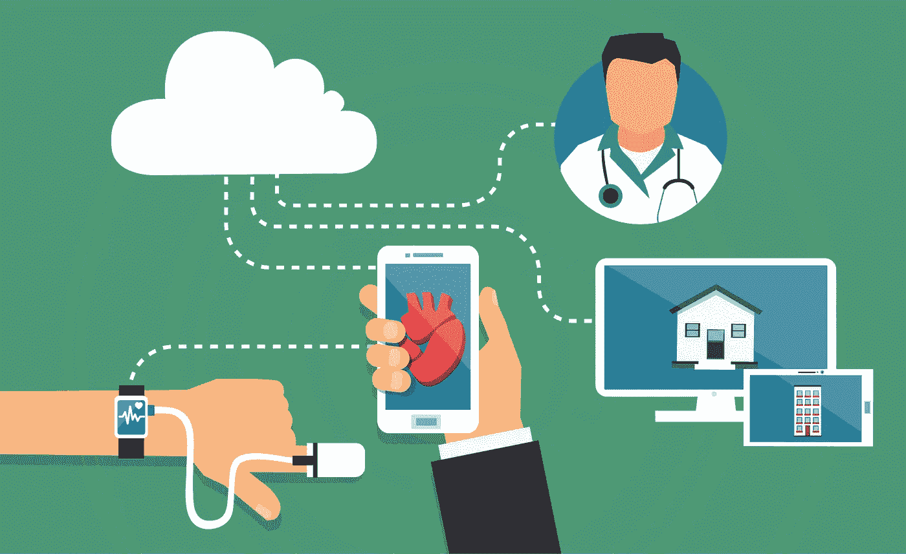

随着医疗保健系统的不断发展和技术进步，数字疗法变得越来越受欢迎。数字疗法是通过使用软件、硬件和/或数据驱动的服务来提供治疗益处的产品。这些类型的应用程序通常利用人工智能、机器学习和其他前沿技术来提供针对个人的个性化健康建议、干预和治疗。

2023 年，随着医疗保健系统寻找更好地为患者服务的方法，我们将看到数字治疗学的发展。数字疗法可以通过使用软件和数据来提供实时反馈和关于如何管理病情的建议，从而帮助管理糖尿病、心理健康问题和慢性疼痛等疾病。这种反馈可用于改变生活方式或帮助监控患者的长期状况。

此外，数字疗法还可以帮助预防性健康措施，如营养跟踪、健康跟踪和药物治疗依从性。通过为用户提供更好地管理他们的状况的工具，数字疗法在改善整体健康结果方面非常有帮助。

随着更多的医疗保健系统采用这些类型的技术，数字疗法的发展预计将在未来几年内显著增长。在这项新技术的帮助下，医疗保健系统可以更好地管理患者的健康，改善患者的预后。

## **7。虚拟现实在医疗保健领域的发展**

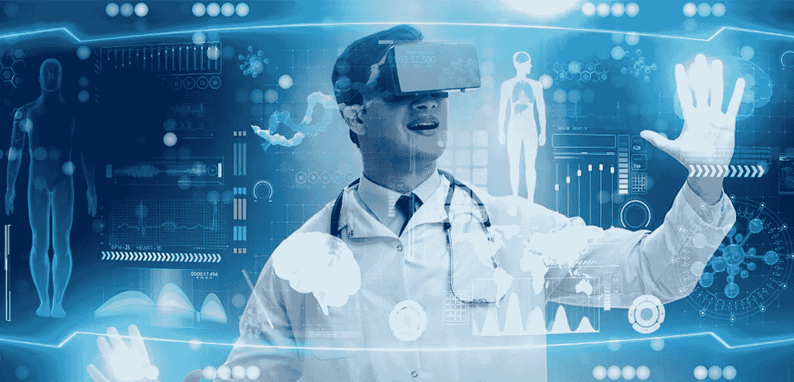

医疗保健是越来越多地利用新兴技术为患者提供更好护理的行业之一。虚拟现实(VR)就是一种在医疗保健行业快速发展的技术。虚拟现实有可能彻底改变医疗专业人员诊断和治疗患者的方式。

虚拟现实可用于提供身临其境的体验，帮助患者更好地了解自己的病情，并让医生有机会在安全的虚拟环境中练习外科手术和治疗。它还使医疗专业人员能够以互动的方式向医学生讲授解剖学和生物学。

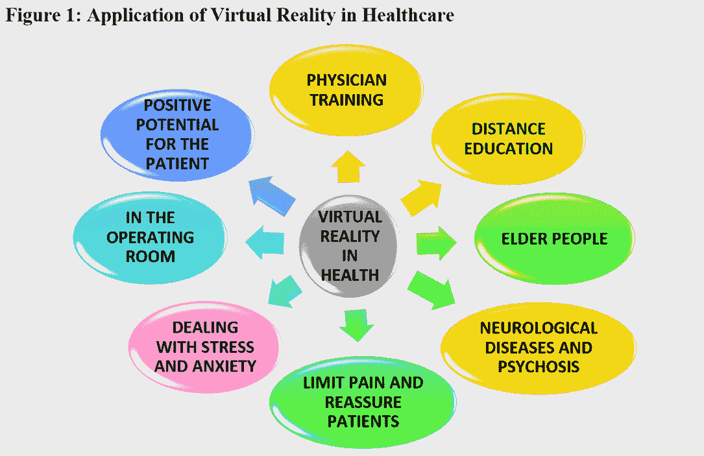

虚拟现实在医疗保健领域的可能性是无限的，它在医疗专业人士中越来越受欢迎。例如，医院正在使用 VR 来创建医疗程序的逼真模拟，以便医生可以在没有任何实际患者安全风险的情况下进行实践。此外，一些医学院已经开始将虚拟现实纳入他们的课程。

虚拟现实也有机会使患者的医疗保健体验更加愉快。支持虚拟现实的系统可以用来帮助降低压力水平和改善疼痛管理，甚至提供医院和手术的虚拟旅行以缓解焦虑。

随着 VR 的不断发展，它在医疗保健行业的应用将会更加广泛。在未来，它可能被用于改善病人的康复时间，促进与医生的远程会诊，等等。对于医疗保健领域的虚拟现实来说，这无疑是一个激动人心的时刻，它的潜力肯定会给患者和医疗专业人员带来巨大的好处。

## **8。医疗保健领域人工智能和机器学习的增加**

在医疗保健领域，人工智能和机器学习正成为改善患者护理和提高医疗保健系统效率的越来越重要的工具。

人工智能和机器学习正被用于快速准确地处理大量数据，从而更容易根据准确的见解做出决策。人工智能和机器学习也可以用来帮助自动化流程，减少复杂任务所需的人工劳动量。

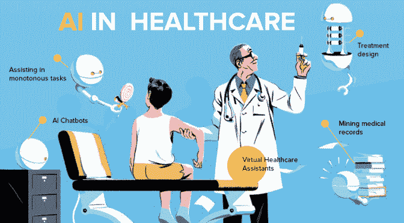

随着人工智能和机器学习在医疗保健行业越来越普遍，新的趋势正在出现，将塑造医疗保健应用程序开发的未来。例如，许多医疗保健组织开始探索使用人工智能来促进诊断和治疗。这种趋势已经在肿瘤学等领域出现，人工智能驱动的系统正被用来帮助医生确定特定患者的最佳治疗方案。

此外，人工智能和机器学习正被用于创建虚拟助手，可以与患者互动并回答他们的问题。这些虚拟助理可以帮助减少医生与患者交谈的时间，使他们能够专注于提供更高质量的护理。最后，许多医疗保健提供商正在探索使用基于语音的界面，使患者能够通过语音命令与医生或医院沟通。

这些趋势只是人工智能和机器学习如何改变医疗保健应用开发的几个例子。随着技术的不断进步，我们可以期待在这一领域看到更多的创新，为世界各地的患者带来更好的护理。

## **9。医疗物联网的兴起**

医疗物联网(IoMT)是医疗保健行业数字化转型的重要组成部分。IoMT 是连接到互联网的医疗设备网络，用于监测和诊断。这项技术已经实现了更好的患者护理，提高了效率，并改善了医生、护士和患者之间的沟通。

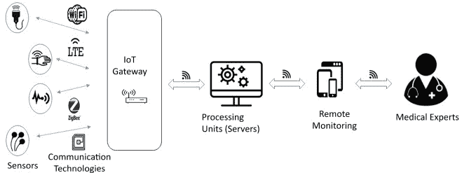

随着越来越多的医疗机构投资该技术，IoMT 每年都在增长。到 2023 年，我们可以期待看到 IoMT 技术得到更广泛的采用和使用。

随着 IoMT 的兴起，医疗保健组织能够远程监控患者的生命体征，从多个来源收集数据，并改善他们对患者护理的响应时间。这一趋势也使医疗保健专业人员更容易跟踪患者的记录，并降低与物理办公室访问相关的成本。

此外，IoMT 还有助于减少人为错误，实现更好的数据收集和分析。这将允许医疗保健提供者做出更明智的决策，并提高他们提供的护理质量。

IoMT 将促进医生、护士和其他医疗保健专业人员之间的合作。通过实时通信，医疗团队可以快速响应患者需求并提供高质量的护理。

## 10。区块链在医疗保健领域的发展

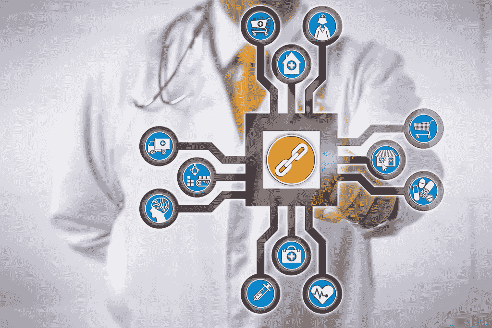

医疗保健行业正在快速发展，技术在这一转变中发挥着关键作用。2023 年，我们可能会看到的最有趣的趋势之一是区块链在医疗保健领域的增长。区块链是一种分布式数字账本系统，提供增强的安全性、透明度和可追溯性。它已经在其他行业成功使用，现在医疗保健开始探索其潜在的应用。

区块链技术可以为医疗保健行业提供许多优势，包括提高数据安全性和准确性。它还可以提供增强的患者数据隐私和控制，允许患者拥有自己的医疗记录，并确保它们被安全地存储和方便地访问。此外，它在简化管理流程方面也有潜在的应用，如索赔处理和医疗凭证验证。

在未来，区块链技术可以用于各种任务，如电子医疗记录管理、药物跟踪系统、人工智能驱动的诊断和治疗、虚拟咨询等。这可能会彻底改变医疗保健行业，在提高医疗质量的同时提高效率和成本效益。难怪如此多的组织已经在投资这项技术。

随着医疗保健组织继续采用这一创新技术，我们很可能会在 2023 年看到更多的应用程序被开发出来。得益于区块链技术，医疗保健行业将受益于更高的效率和准确性。

## **结论**

医疗保健应用程序开发自诞生以来已经走过了漫长的道路，随着技术的飞速发展，跟上最新趋势非常重要。在 2023 年，医疗保健应用的发展趋势将继续发展，以满足现代用户的需求。

从人工智能驱动的应用到更加以患者为中心的设计，开发人员将面临挑战，以创建更具创新性和效率的解决方案，满足不断增长的医疗保健行业的需求。通过了解医疗保健应用程序开发的主要趋势，您可以确保您的应用程序保持竞争力，经得起未来考验。

过去的一年向我们展示了安全可靠的医疗保健应用的重要性。开发人员必须确保他们的解决方案符合数据保护和隐私法规，并提供直观的用户体验。随着人工智能和机器学习在医疗保健应用中变得越来越普遍，安全和隐私措施也应纳入考虑范围。

医疗保健应用程序开发人员必须对新技术、创意和挑战保持开放的态度，以保持竞争力并提供最好的产品。通过了解和跟上最新趋势，开发人员可以创建为患者和供应商提供卓越价值的应用程序。

考虑到这些趋势， [**在印度雇佣移动应用程序开发人员**](https://www.appsdevpro.com/hire-developers/hire-mobile-app-developers.html) ，他们可以更好地装备自己，以满足不断发展的医疗保健行业的需求，并确保他们的应用程序在 2023 年及以后保持竞争力。