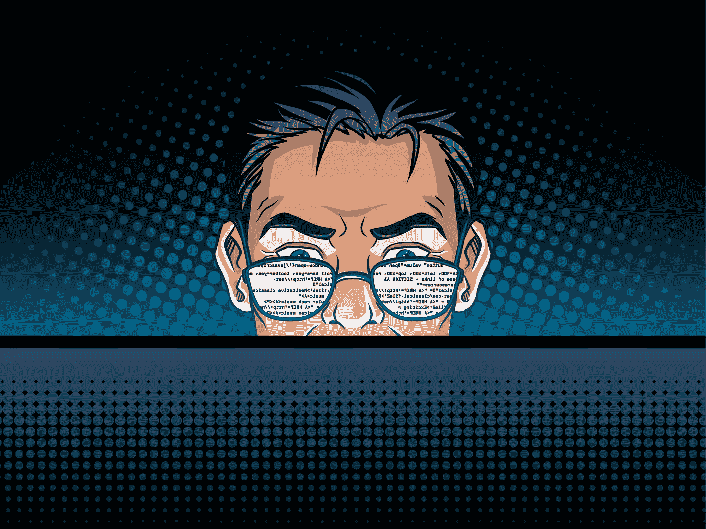
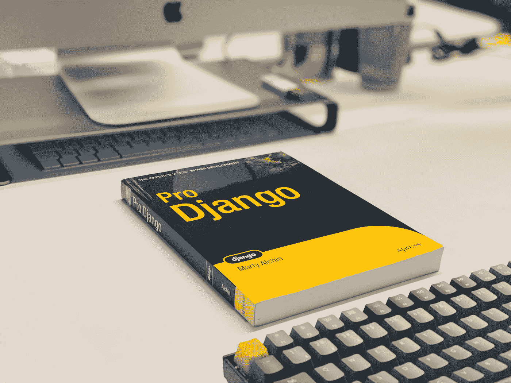

# 20 本编程书籍，教你如何通过编码达到顶峰

> 原文：<https://medium.com/geekculture/20-programming-books-for-coding-your-way-to-the-top-1fba93e95542?source=collection_archive---------10----------------------->

## 初级-高级+创造性阅读

Image via [Shutterstock](https://www.shutterstock.com/image-illustration/software-developer-work-comic-book-pop-678573529)

著名作家和性格发展专家厄尔·南丁格尔曾经说过*，*“在你选择的领域里，每天学习一个小时就够了。每天一个小时的学习会让你在三年内成为你所在领域的佼佼者。五年内你将成为国家权威。七年后，你会成为世界上最优秀的人之一。”

南丁格尔的话在不断流动的 IT 技术流中引起了最强烈的共鸣。程序员是终身学习者，通常是自学成才的，他们的多才多艺与持续的个人发展直接相关。没有什么比阅读更能推动自我发展了。

为了确切地了解编程专家在他们的床头柜上放着什么样的专业文献，我请全国的 IT 专业人士推荐他们最喜欢的行业书籍。从常青的经典著作到完善你的编码技能，深入学习一门新语言，或者将你的职业生涯提升到一个全新的水平，这里是程序员们对他们久经考验的 IT 文献的精选。这些书你已经有多少本了？

***附:一定要偷看底部的创意阅读！***

# 经典:为所有人

## 1.编程珍珠，第二版

乔恩·本特利

*“如题所示，就像真正的天然珍珠是从惊扰牡蛎的沙粒中长出来的一样，编程珍珠是从惹恼程序员的现实生活问题中长出来的。Bentley 的珍珠为那些烦人的问题提供了不寻常的聪明的解决方案，如果这本书不能让你对编程感兴趣，我不知道还有什么可以！”*

**推荐人:Amit Raj，创始人，Links Guy**

## *2.罗伯特·马丁的干净代码系列*

*罗伯特·马丁*

**Martin 的“干净代码”系列是编程文学中的永恒主题。虽然《干净的代码》是初学者的经典，但是《干净的程序员:专业程序员的行为准则》是针对专业程序员的，《干净的架构》是针对中级以上水平的专家的。在这个系列中，编程是作为一门多维度的手艺来学习的。该系列有大量实用的建议，从评估和编码到重构和测试。**

***推荐人:彼得·弗拉索夫，MightyCall 工程主管***

## **3.计算机编程的艺术**

***作者唐纳德·克努特***

**“计算机编程的艺术被认为是管理当今最幸运的软件开发者的所有结论的圣经。比尔·盖茨曾经说过，任何读过《计算机艺术》
编程的人都应该把他的收益寄给他。这本书从基本的
编程思想和技术开始，然后转移到许多编程算法及其分析，特别强调计算机内的信息表示。**

***推荐人:Shiv Gupta，Incrementors SEO Services***

****

**Photo by [Emile Perron](https://unsplash.com/@emilep?utm_source=medium&utm_medium=referral) on [Unsplash](https://unsplash.com?utm_source=medium&utm_medium=referral)**

# **初级-中级水平**

## **4.算法简介**

**“本书中讨论的所有算法都用伪代码进行了解释，这使得任何技能水平的程序员都容易理解它们。即使那些以前从未编程的人也能跟上，因为他们也能读写可读的代码！”**

***推荐人:Amit Raj，创始人，Links Guy***

## **5.新程序员生存手册**

**乔希·卡特**

***作为进入该行业的新程序员的必读之作，这本书带你超越技能和技术，并教你如何掌握程序员的职业生涯，无论是在办公室、公司还是创业公司。除了入门技术技能，这是一本为那些想在编程领域建立职业生涯，成为一名有价值的团队成员，并学习如何在短时间内推进他们的职业生涯的人准备的书。***

****推荐人:John Tito——slings hot 的高级开发人员****

## **6.搜索算法**

***作者 Aditya Y. Bhargava***

**这是一本关于日常编程挑战以及数据结构和算法学习的好书。对于没有受过正规计算机科学教育的初学者和有抱负的开发人员来说，这是一本很好的读物。这本书充满了例子，用大量的插图以清晰的方式呈现概念。**

***推荐人:Kim Desmond，CodingNomads 联合创始人***

## **7.实用程序员:20 周年纪念版，第二版**

***作者托马斯·大卫，亨特·安德鲁***

**“我最喜欢的书之一。我非常喜欢它的原因之一是因为它实用而现实。这是戴维·托马斯写的，他从事商业很长时间了，知道所有可能发生的事情。
记得第一次看这本书的时候，我立刻感觉到作者是在和我对话，而不仅仅是在给我上课。这本书提供了大量关于如何成为一名程序员的优秀建议，在我第一次阅读这本书多年后的今天，我仍然会重温其中的许多建议。”**

***推荐人:Lynda Fairly，Numlooker 的联合创始人***

## **8.头先设计模式**

***伊丽莎白·弗里曼，埃里克·弗里曼，伯特·贝茨，凯西·塞拉***

**对于中级程序员来说非常实用。这本书是对“四人帮”(*见下文)*的规范设计模式的全新诠释，对于经验不足的专家来说，这可能更难理解。*在 Head First 设计模式中，*每个模式都以一种详细而简单的方式呈现，并植根于具体的例子中**

***推荐人:Ilya Girman，软件架构师，MightyCall***

## **9.露比。面向对象的设计**

***作者桑迪·梅斯***

**“面向对象编程原则的极好介绍。这是发展基础到中级 OOP 技能的完美开端。老实说，我甚至无法表达这本书有多好，我也不明白为什么它很少进入最佳书单。如果你不了解 Ruby，也不用担心。所有的例子都很直观(Ruby 的语法也很简单)，你学习本书的内容不会有任何问题。”—**

***推荐人:蒙费克斯的财务经理 Kidyba Iryna***

## **10.代码完成**

**史蒂夫·麦康奈尔**

***“这本书通常包含简单易懂的章节。它主要关注软件工程过程，并且
很好地帮助你学习 3 条线的功能和它们的最佳
实践。《代码大全》有清晰易懂的代码，对开发人员来说更容易理解。***

****推荐人:Vinod Satapara，iFour Technolab Pvt. Ltd .技术总监****

## **11.C#中的函数式编程**

**奥利弗·斯特姆。这是一本学习函数式编程范例的好书，尤其是如果
你有面向对象编程的背景。这本书很好地解释了
函数式编程的原理，因为 C#不像 Haskell，不是专门为这种范式设计的。因此，与用纯函数式语言编写相比，将函数式编程概念应用于 C#程序需要付出更多的努力。为了从这本书中获得最大收益，你需要在初级和中级之间的水平上了解 C#(或另一种严格类型的 OOP 语言)。”**

***推荐人:蒙费克斯的财务经理 Kidyba Iryna***

****

**Photo by [Faisal](https://unsplash.com/@faisaldada?utm_source=medium&utm_medium=referral) on [Unsplash](https://unsplash.com?utm_source=medium&utm_medium=referral)**

# **中级-高级水平**

## **12.有效的 C++: 55 种改进程序和设计的具体方法**

**史蒂夫·迈耶斯**

**这本书给出了 55 个写出更好的 C++的具体例子。作者是世界上最著名的 C++专家之一，帮助 Java、C#、C 等语言的开发人员吸收“C++的做事方式”。**

***推荐人:R. Siegal，Nexus 软件系统公司***

## **13.设计模式:可重用面向对象软件的元素**

***埃里希·伽马、理查德·赫尔姆、拉尔夫·约翰逊和约翰·维里西德斯***

**常见设计问题的解决方案集合。这本书包括 23 种帮助创建可重用设计的模式。模式还包括展示如何在面向对象的编程语言(如 C++)中实现它的代码。这些被称为“四人帮”的作者是世界公认的这方面的专家。**

***推荐人:Ilya Girman，软件架构师，MightyCall***

## **14.打字稿深潜**

**巴萨拉特·阿里·赛义德**

**关于 Typescript 和 ECMAScript 的精彩介绍。这本书对于 TS 开发人员和那些从 Java 背景开始学习 TS 的人特别有用。包括 JavaScript 概述和许多简短的例子。这本书是[免费提供的](https://react-etc.net/files/typescript-book/typescript.pdf)，并且经常更新。**

***推荐人:Elya Iskhakova，初级前端开发人员，MightyCall***

## **15.Python。基于测试的开发**

**哈利·珀西瓦尔。
“Python 和 Django 中 TDD 的精彩介绍。作者很好地解释了这种开发方法，从零开始到像单元测试甚至持续集成这样的主题(一个他只涉及到的主题)。为了最大限度地利用这本书，你需要具备 Python 的基础知识和一些 web 开发的基础知识。关于 Django 的一切，在书本身就有很好的解释。”**

***推荐人:蒙费克斯*的财务经理 Kidyba Iryna**

## **16.设计数据密集型应用程序**

**马丁·克莱普曼**

**“这本书解释了为什么系统设计极其重要，并为软件开发人员在启动应用程序时应该注意的问题提供了一个很好的基础。每章从特定领域的技术基础开始，例如，数据库方案设计，然后你可以跟随一些顶级应用程序的伟大例子，以及它们管理扩展和适应大用户和数据量的方式。我真的很喜欢书中的这些例子。
首先，因为我最喜欢的应用程序被放在那里，而且是次要的，我对这个系统印象深刻，它可以通过最小的
改变来成倍地提高性能。你肯定会看到与你的特定领域的联系，并发现如何通过编程取胜的新见解。”**

***推荐人:奥尔加·鲍里斯，Alty 的安卓开发者***

****

**Photo by [Thought Catalog](https://unsplash.com/@thoughtcatalog?utm_source=medium&utm_medium=referral) on [Unsplash](https://unsplash.com?utm_source=medium&utm_medium=referral)**

# **程序员的创意书籍**

## **17.如果海明威写了 Javascript**

***安格斯·克罗尔***

**“如果威廉·莎士比亚被要求生成斐波那契数列，或者简·奥斯汀不得不写一个阶乘程序，那会怎么样？”——这是安格斯·克罗尔在这本有趣而令人惊叹的书中提出的一个错综复杂的问题。作者把简短的 JS 程序想象成是著名作家写的。在编程、诗歌和散文之间，对于所有有创造力的程序员来说，这是一本奇妙而有趣的读物。"**

**推荐人:蕾拉·谢伦科娃，MightyCall 的初级开发人员**

## **18.神话中的人月**

**“这本书帮助我们对软件开发、评估、项目管理和软件开发困难有一个很好的理解。这本书的中心主题是布鲁克斯定律，该定律指出，在一个后期软件项目中增加人力会使项目推迟。"**

***推荐人:Daniela Sawyer，FindPeopleFast* 的创始人&业务发展策略师**

## **19.简单定律**

***作者约翰·梅达***

**“这是一本旨在简化所有层次的书。在简短的 100 页的格式，它旨在钉在设计，技术，商业和生活的简单性的基础。作者陈述了 10 条“简单性法则”,按照“越来越复杂的简单性条件”排序。对于任何具有逻辑和组织思维的人来说，这都是一本有趣的读物，在编程环境中尤其有用。”**

***推荐人:Sergii Zhuravel，Absio 首席软件工程师***

## **20.工作中的程序员:对编程技巧的反思**

***彼得·高顺***

**一个名副其实的编程名人录的采访集。这本书以对话的形式写成，是一个内部人士对职业程序员的生活、职业和挑战的看法。对于业内人士或对编程职业感兴趣的人来说，这是一本很好的读物。**

***推荐人:凯瑟琳·布朗，Spyic 的创始人&市场总监***