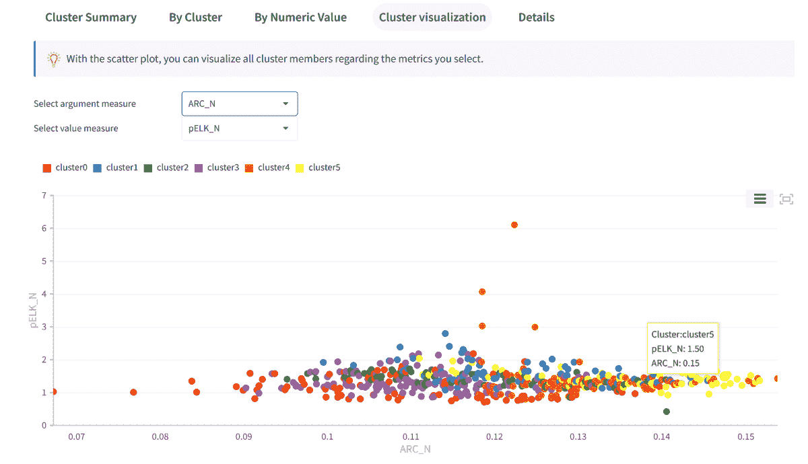
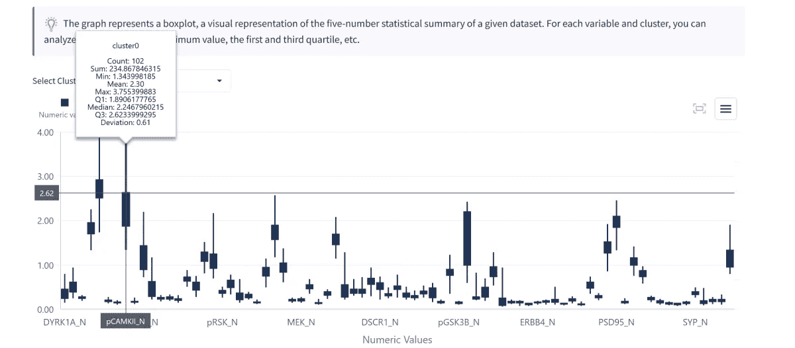

# 无监督机器学习的 3 个主要任务

> 原文：<https://medium.com/geekculture/3-main-tasks-in-unsupervised-machine-learning-e70d18bd77b5?source=collection_archive---------23----------------------->

## 这项令人着迷的技术让机器学习算法能够使用简单的、未标记的例子进行自主学习——通常会在这个过程中揭示有趣的见解。

你是不是刚刚无意中发现了无监督机器学习这个术语？

分析师通常使用它来发现数据集中的隐藏模式，它的优点在于它不需要人工干预。这意味着你不需要坐下来协助它的过程。

但是，无监督学习到底对你有什么好处，或者对你的决定有什么影响呢？深入无监督机器学习的世界，了解更多信息。

# 什么是无监督机器学习？

也称为无监督学习，它使用机器学习对未标记的数据进行分类和分析。经常用于探索性数据分析，其广泛的应用使其受到许多企业主和战略家的喜爱。

不像[有监督的机器学习](https://graphite-note.com/supervised-machine-learning)，你在没有明确价值观的情况下盲目工作。因此，它不能应用于大多数需要特定数据值或标记数据集的机器学习方法。

然而，虽然它不能直接应用于需要回归和分类结果的问题，但它对帮助您发现数据的结构很有帮助。这使得它在其他广泛的数据科学应用中非常有用——从[客户分析](https://www.forbes.com/sites/sap/2021/11/09/machine-learning-builds-customer-advocacy-beyond-black-friday-spike/?sh=4040cc7912f4)到[理解鲸鱼语言](https://www.techthirsty.com/ceti-project-launched-to-decode-whale-language/)。

Photo by [Pawel Czerwinski](https://unsplash.com/@pawel_czerwinski?utm_source=unsplash&utm_medium=referral&utm_content=creditCopyText) on [Unsplash](https://unsplash.com/s/photos/pattern-data?utm_source=unsplash&utm_medium=referral&utm_content=creditCopyText)

# 机器在这种设置下是如何学习的？

无监督机器学习模型仅使用输入数据进行学习。然后，它应用特定的算法来自动分析数据集。之后，数据被分段成组。

它的主要目标是找出它所输入的数据集中的关系。因此，当你不知道该期待什么时，它更常用于收集结果。

简单来说，无监督学习是利用输入数据来寻找输出数据的值。

# 无监督机器学习的重要性

无监督的机器学习更常用于帮助你更深层次地了解你现有的客户群。由于没有办法衡量其结果的准确性，无监督的机器学习不应该用于分析有预期输出的数据。

尽管存在缺点，但无监督机器学习仍然是一种强大的数据分析工具，可以帮助你找到未知的模式。正因为如此，它也经常被用于[网络安全](https://technative.io/why-unsupervised-machine-learning-is-the-future-of-cybersecurity/#:~:text=The%20Benefit%20of%20Unsupervised%20Learning&text=Unsupervised%20Learning%20draws%20inferences%20from,attacker%20is%20always%20changing%20methods.)来帮助确定黑客模式。

# 无监督机器学习的常用方法

无监督学习模型通常用于完成三个主要任务。根据您的需求，了解哪种方法可能适合您非常重要。看看下面这些方法。

# 使聚集

最常见的方法是聚类，它根据相似性和差异对仅输入的数据进行分组。这有助于在您提供给模型的信息中找到特定的模式，例如客户活动。

Image by the author: clusters in Graphite Note

谈到集群，目前有四种子方法。

*   **排他聚类**断言数据点只能出现在一个组中——因此得名。这通常用于市场、图像和文档分割。
*   与前者不同，**重叠聚类**允许数据点属于多个聚类。
*   **层次聚类**通常被称为 HCA，用于按照层次结构基于相似性对数据集进行分类。它通常用于组织社交网络数据，类似于将计算机上的文件分割到文件夹中的方式。
*   **概率聚类**用于解决软聚类问题。与前面的方法不同，这种方法根据数据点属于某些分布的可能性来对它们进行分组。最常见的例子之一是高斯混合模型。

# 关联规则

这种方法遵循一组特定的规则来确定数据点之间的关系。通常，它用于市场购物篮分析，企业根据特定模式分析客户活动。

你会看到这些最常用于交叉销售和追加销售策略或推荐引擎，就像你在亚马逊等市场上看到的那样。如果你曾经在你的浏览器上看到过“今日趋势”部分——这很可能是关联规则方法的成果。

# 降维

这种方法用于防止[过度配合](https://www.ibm.com/cloud/learn/overfitting)。当您的数据集具有高值密度时，降维会将数据输入最小化为更小的片段。更令人印象深刻的是，它这样做不会损害您的数据的完整性。

有几种降维方法用于预处理数据，例如:

*   主成分分析
*   奇异值分解
*   自动编码器

Image by the author: Cluster visualization in Graphite Note

# 无监督机器学习可以用来做什么？

无监督学习主要用于帮助改善用户或客户体验。除此之外，它还应用于网络安全、社交网络和系统质量保证。

从最纯粹的意义上来说，UML 可以让你对大型数据集有所了解，从而帮助你得到一个结果。下面来看看它最常见的应用:

# 电子商务

市场和网上商店经常运用“顾客买了这个也买了”的技巧。这不仅能激发客户对某些产品的兴趣，还能帮助他们进行追加销售，让他们觉得你为他们的体验提供了附加值。

# 新闻

谈到无监督学习，谷歌新闻是最好的例子之一。该平台将其文章分类到特定主题下的标签部分，以便读者更容易找到相关信息。

# 计算机视觉

对象识别是应用无监督机器学习最常见的例子之一。这些感知任务可以帮助计算机索引信息，以便识别物体，例如当您希望相机自动对焦某个对象时。

# 检测异常

虽然无监督学习可以用来发现数据集中的相似性，但它在发现新活动方面也很有效。异常通常应用于网络安全，当存在潜在的安全威胁时，或者当您的服务器中发生可疑活动时，会向分析师发出警报。

# 结论

无监督的机器学习可能无法为你提供特定的值，但在给你答案时，它非常有效。从识别您的客户活动到创建完美的推荐，这种机器学习方法不应该被忽视。

像 [Graphite](https://graphite-note.com/) 这样的平台使用无监督的机器学习来帮助你[更准确地分割数据](https://graphite-note.com/knowledge-base/general-segmentation-n-model-model-scenario)点。最棒的是，您甚至不需要学习一行代码！

如果你想充分利用无监督机器学习的潜力，那么尽快与行业专家联系是一个好主意。

【https://graphite-note.com】原载于 2022 年 3 月 22 日**。**