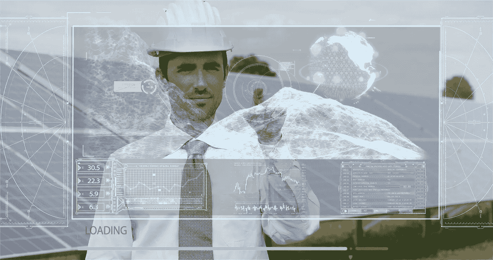

# 利用新兴技术推进企业可持续发展计划的 3 种方式

> 原文：<https://medium.com/geekculture/3-ways-you-can-harness-emerging-technologies-to-further-corporate-sustainability-initiatives-9316d530fdb9?source=collection_archive---------24----------------------->

你的公司已经有了一个回收计划，投资了关于减少各种浪费的培训，并且经常寻求合乎道德地采购材料和服务。但这真的足够了吗？你能不能把界限推得更远一点，为创造一个我们不担心可持续发展的未来尽一份力？

答案很难回答，因为我们大多数人都想尽我们所能确保留给后代一个健康的星球。但是也许有一些方法可以让你利用以前没有考虑过的技术做更多的事情。

# 虚拟现实和增强现实如何用于推进企业可持续发展计划

当你想到用[技术](https://chatc.ai/top-5-exciting-tech-trends-for-2021/)来改善企业可持续发展计划时，虚拟现实(VR)和[增强现实](https://chatc.ai/top-5-exciting-tech-trends-for-2021/) (AR)可能不是你所猜测的。但这两项相关技术是帮助企业减少环境足迹和提高长期可持续性的最佳技术。

然而，可持续发展不仅仅包括环境。可持续发展有四大支柱:

1.  **人类**
2.  **社交**
3.  **环境**
4.  **经济**

在评估您的组织可以投资的不同企业可持续发展计划时，请确保查看所有[四大支柱](https://www.futurelearn.com/info/courses/sustainable-business/0/steps/78337)。人类可持续发展关系到商业活动如何影响世界各地的社区，并确保参与所提供服务和产品的所有人都得到支持，特别是在健康和福祉方面。

社会和经济的可持续性紧密相连。两者都支持平等和所有人的权利，以及环境。经济可持续性寻求提高和维持生活水平，并尽可能有效地利用资产。最后，环境可持续性，这是大多数人都熟悉的，是确保企业尽一切努力确保他们对地球本身的影响不会对生态系统或环境造成任何损害。

这里有三个不同的例子，说明虚拟现实和增强现实如何被用来推进你的可持续发展承诺。

## 1.虚拟现实可以把海外供应商带到你面前

经历了远程工作的 COVID 时代，现在更容易看到人们如何在家工作，而不需要旅行。将这一点进一步扩展到商务会议的进行方式，当涉及到新的供应商、新的合作伙伴以及组建外部承包商团队时，对面对面会议的要求也会受到限制。

VR 可用于将当前的缩放密集型远程工作人员提升到一个新的水平。通过让人们沉浸在一个不同的环境中，他们能够以一种非常接近面对面会议的方式“会见”新的业务联系人。一直以来，没有航空旅行，没有汽车租赁，节省了大量的时间。所有这些效率都有利于可持续发展。[master piece VR 的工程副总裁杰夫·罗斯](https://filling-space.com/2019/10/03/how-will-virtual-and-augmented-reality-affect-sustainability/#:~:text=AR%2FVR%20has%20the%20potential,and%20reduce%20their%20carbon%20footprint)雄辩地描述了这项技术及其优势:

> **“虚拟现实是一种允许人们在一个完全沉浸的环境中工作的技术，无论是单独还是合作。因此，它比电话会议和 WebEx 等现有技术更适合远程工作。人们可以在不受物理空间需求限制的工作空间中共享工作并有效协作。”**
> 
> **-Jeff Ross——master piece VR 的工程副总裁**

除了工作场所虚拟现实的环境效益之外，社会和人类可持续发展支柱也受到了深刻的影响。城市不再需要容纳摩天大楼和不利于环境的交通方式。城市实际上可以变得更加以人为中心。

> **“城市可以将基础设施建设的重点放在社会生活上，而不是办公空间上。没有一栋建筑，我们也能建立一支全球性的员工队伍。只要有网络连接，你就可以在任何地方工作。”**
> 
> **-Jeff Ross——master piece VR 的工程副总裁**

## 2.通过虚拟现实对气候变化的现实描绘

虚拟现实已经被用来提高人们对积极和消极行为的环境影响的认识。该技术让用户沉浸在另一个世界中，在那里他们可以直观地看到我们的环境可持续发展计划的第一手影响，以及如果我们不致力于保护我们的地球和更可持续地开展业务将会发生什么。

如果您的企业致力于植树以抵消其环境足迹，或者向慈善机构捐款以帮助清理海洋并为全球社区做好事，您可以使用 VR 来证明这些步骤在今天是多么重要。为了向员工、领导层和股东展示企业可持续发展计划的成果，VR 可以展示世界将如何变化。Nihanth Cherukuru 解释道:

> **“虚拟现实固有的沉浸感与增强现实的真实感相结合，可以帮助我们在发自内心的层面上与人联系，从而凸显可持续生活的重要性。”**
> 
> **-Nihanth Cherukuru——国家大气研究中心(NCAR)的项目科学家**

例如，一些大型企业和组织联手展示了印度尼西亚的[林邦巴陵野生动物保护区](https://isee3d.app/blog/how-do-vr-and-ar-affect-environmental-sustainability/)将如何受到植树计划的影响。虚拟现实让人们看到雨林保护的行动。该项目由世界自然基金会、谷歌、联想和艺术科学博物馆于 2017 年完成。

## 3.AR 将有助于更可持续地培训员工

AR 可以用于大型培训练习，员工可以体验接近真实世界的场景。让新员工尽可能接近真实情况，而不需要让他们马上投入到工作中，这将有助于防止企业中代价高昂的错误(旨在减少不必要的支出，从而提高经济的可持续性)。

大企业已经在使用 AR 在受控环境中培训员工。例如，[沃尔玛和 Chipotle](https://www.business.com/articles/best-augmented-reality-uses/#:~:text=One%20way%20augmented%20reality%20is%20used%20in%20business%20is%203D%20modeling.&text=Companies%20such%20as%20Walmart%20and,try%20products%20before%20they%20buy.) 现在都在使用 AR 来培训他们的员工。AR 允许员工为他们的工作进行培训，而不需要购买材料、消耗品和办公空间。通过限制资源的生产和消费，也可以实现环境的可持续性。

# VR 和 AR 将成为企业未来的一部分

有很多文章都是关于 VR 和 AR 如何被用来提高商业底线和保持竞争优势的。但问题的核心是，技术也应该为我们的社会带来好处，既有助于我们在工作中提高资源/资本管理的效率，也有助于我们努力为子孙后代留下一个更好的地球。

*原发表于*[*https://chatc . ai*](https://chatc.ai/corporate-sustainability-initiatives/)*。*