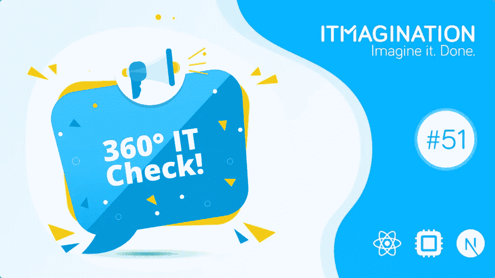

# 360 IT Check #51 —美国芯片竞赛，Next.js 布局的更新，(潜在的)新音乐流媒体平台，等等！

> 原文：<https://medium.com/geekculture/360-it-check-51-us-chip-race-an-update-on-next-js-9a2a529935f6?source=collection_archive---------15----------------------->

# 随着美国投资于芯片，世界其他地方也在投资

为了使美国更加独立于硅，该国决定大力投资芯片制造。这个北美国家的努力不容忽视——我们谈论的是 770 亿美元的“补贴和税收抵免”然而，全球其他国家在更早的时候就已经采取了类似的措施。

几十年前，欧洲和美国都比现在大得多。目前，“根据 [SIA](https://www.wsj.com/market-data/quotes/SINGY) 的数据，美国在十年内建造和维护一座先进芯片工厂的成本大约比台湾、南韩或新加坡高 30%。与中国的差距可高达 50%。”

这项投资是在该行业感觉好时光即将到来的时候进行的。“根据市场研究公司 Gartner Inc .的数据，2021 年(半导体行业)批准了约 1530 亿美元的资本支出——比疫情启动前高出约 50%，是五年前的两倍。”

**底线**

美国人的举动可能会被认为太少太晚。历史上，美国在这一领域一直很强——TI、Nvidia 和 Intel 就是显著的例子。这里的问题是竞争永远不会停止。像中国和南韩这样的国家试图超越首都在 DC 的国家，他们做到了。此外，中国还承诺以各种形式加大支持力度。“中国为其芯片公司提供现金补贴、优惠融资和税收减免。根据 SIA 对 2014 年至 2030 年政府支出的估计，它正在提供价值超过 1500 亿美元的资金。”

如果美国想要加速，那么他们需要做的比他们同意的更多，如果他们想要在该地区仍然受到尊重，并且在该行业有一些前景。这个国家是幸运的，因为它至少有两个行业巨头，尽管没有政府的帮助，他们可能会被东方公司超越。

# 亚马逊提高欧洲 Prime 价格

亚马逊宣布提高其在欧洲多个市场的 Prime 订阅服务的价格。不同国家的提价幅度不同，一些市场的最高提价幅度达到 43%。

亚马逊仅次于美国的第二大市场德国将提价 30%，英国将提价 20%。增幅最大的是法国，为 43%。

亚马逊通过强调其多年来扩大的报价以及五年多来在一些市场没有提价来证明成本上涨的合理性。新价格将于 9 月 15 日对所有新订户和续订生效。

[今年早些时候，亚马逊在美国](https://techcrunch.com/2022/02/03/amazon-is-increasing-the-annual-price-of-prime-to-139-in-the-u-s/)提高了价格，并强调除了会员福利增加之外，工资和交通成本的增加也是 Prime 价格上涨的原因。

**底线**

今年所有东西的成本似乎都在上涨。随着世界各国的通胀数字创下纪录，能源价格随着冬季末日的到来而上涨，工人们要求提高工资作为补偿，企业正在寻求平衡他们的账目。

亚马逊确实为他们的 Prime 订阅提供了过多的服务，如果你是亚马逊服务的活跃用户，他们是值得的。

问题是，家庭预算能维持多少价格上涨？随着网飞等其他服务的用户数量下降，一些订阅量无疑会被削减。

# Next.js 中布局的更新

最受欢迎的 [React](https://www.itmagination.com/blog/react-18-what-changes-does-it-bring) 框架发布了一个 Twitter 线程，展示了与布局有关的新功能集的进展。

我们在视频中看到的进展非常有希望。这些新功能似乎正在发挥作用，尽管我们还不知道一切有多稳定。

**底线**

正如我们之前所写的，*布局*有可能解决 Next.js 最紧迫的问题，所有用户都将受益匪浅:更快的水合作用，更快的第一字节时间，等等。

一些开发人员将这些变化比作试图复制 Remix 的设计，尽管在开源世界里这一点都不坏。Remix 本身复制了 Next.js 基于文件系统的路由系统，还有 [Nuxt.js](https://www.itmagination.com/blog/nuxtjs-3) 和 Sveltekit。

# 200 多的汽车专利却没有苹果车？

苹果汽车的故事可能已经是旧闻了。自 2010 年以来，该公司一直在申请汽车专利。然而，令人印象深刻的是上述获准申请的数量。现在，这个数字是 248，而且预计还会增长。

专利涵盖自动驾驶技术、乘坐舒适性、座椅、悬架、导航、电池管理、用于车对车通信的车对一切(V2X)连接等等。苹果申请的与通信和导航相关的专利最多，其次是自动驾驶。

**底线**

观察人士预计，苹果将像加州的苹果公司革新手机一样革新汽车。只有一个踏板，是一辆自动驾驶的汽车，也许该公司的工程师还有一段路要走，直到他们有一个工作产品。关键是让它“正常工作”在那之前我们什么也看不到。不是说苹果从来没有失败过([他们做到了](https://www.cnet.com/tech/mobile/apples-worst-failures-of-all-time-from-airpower-to-bendgate-to-the-newton/))。

# Spotify 和 Apple Music 可能面临来自抖音的强大竞争？

抖音的母公司字节跳动已经向美国专利商标局提交了“抖音音乐”的商标申请，引发了短视频应用程序提供新服务的传言。

这个消息不应该是一个巨大的惊喜，因为抖音自从第一次被称为 Musical.ly 以来就一直与音乐联系在一起。在阴谋论、humblebrags 和应用程序上的其他各种内容之间，应用程序的核心一直是短视频舞蹈剪辑。

字节跳动已经进军音乐流媒体服务领域，推出了一款名为 Resso 的独立应用，将于 2020 年在印度、巴西和印尼推出。

Resso 在这些国家与抖音直接联系，并提供从应用程序到他们的音乐流媒体应用程序的无缝过渡。当用户有兴趣听短视频剪辑中的整首歌时，应用程序会带他们去看整首歌。让用户留在字节跳动生态系统中的好方法。

虽然官方没有宣布新的应用程序，但谣言四起。去年冬天，字节跳动在澳洲申请了相同术语的商标，这无助于平息人们的猜测。

**底线**

对于这个以音乐为中心的应用程序来说，这一新方向看起来是一个明智之举。美国音乐流媒体市场预计到 2022 年将达到 114 亿美元，到 2027 年将达到 150 亿美元。因此，字节跳动仍有很大的空间。

考虑到超过 50%的美国抖音用户年龄在 29 岁以下，而 [30%的人甚至还不到在美国合法购买酒精饮料的年龄](https://wallaroomedia.com/blog/social-media/tiktok-statistics/)，未来有一大群潜在用户。对于抖音来说，这是一个向用户宣传的绝佳机会，这些用户可能还没有成为 Spotify、Google Play Music 或 Apple Music 的忠实用户。

【https://www.itmagination.com】最初发表于**。**