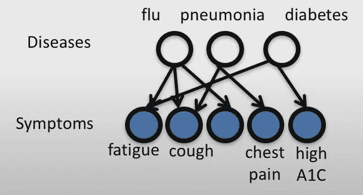
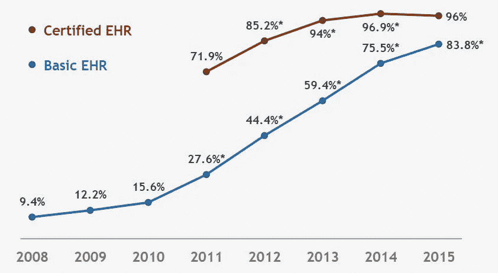

# 医疗行业为机器学习做好准备的 4 个理由

> 原文：<https://medium.com/geekculture/4-reasons-the-healthcare-industry-is-ready-for-machine-learning-c82199befbe4?source=collection_archive---------57----------------------->

## 理解健康科技和人工智能的前景

人工智能和机器学习早在 20 世纪 60 年代和 70 年代就被应用于医疗保健。斯坦福大学开发了一种叫做 MYCIN 系统的算法，可以识别严重的感染源细菌。它能够在 69%的病例中提出一种好的疗法，这实际上比当时的专家更好。

Photo by [Tom Claes](https://unsplash.com/@tomspentys?utm_source=medium&utm_medium=referral) on [Unsplash](https://unsplash.com?utm_source=medium&utm_medium=referral)

在 80 年代，匹兹堡大学开发了 intern ist-1/快速医疗参考模型。它可以根据大量报告的症状，从数百种疾病中诊断出患者患有哪种疾病或状况。在高层次上，他们将其建模为贝叶斯网络，但最初本质上更具启发性。花了 15 个人年来推导这些疾病和症状的先验。

INTERNIST-1/QMR Model Schema. Miller et al. (1986), Shwe et al. (1991).

但这从未真正整合到临床工作流程中。以结构化的方式手动收集和输入数据，然后得出诊断结果的整个过程比人类专家慢得多，并且难以集成到临床工作流程中。模型中没有真正的学习。那是人工智能，但不是机器学习。在世界的不同地方，同样的先验知识是行不通的，因为疾病和症状发生的先验概率因地区和文化的不同而不同。对于每个设置，它们都必须从头开始重新推导。很难一概而论，也就是说，它过度适应于最初开发的地方。主要的杠杆作用是依靠人的专业技能和领域知识，这是一个乏味、昂贵和不可靠的过程。

1990 年，发表了许多在医学中使用简单神经网络的论文。如下图所示，最多涉及四层，大多数至少有三层。特征的数量很少。数据是由人们手动收集、结构化和管理的，特别是为了机器学习的目的，这导致样本数量非常少。训练数据很少，并且它们不适合当时的临床工作流程。就像内科医生-1 一样，他们很难概括。

Neural Network Studies in Medical Decision Making. Penny and Frost (1996)

这些早期的努力并没有真正取得成果。但是他们确实暗示了将医学整合到医疗保健中的潜力。在过去的十年中，许多变量发生了变化，极大地改变了医疗保健行业的格局。

# 1.数据激增

在 2008 年的经济灾难后，美国政府向医院发放了约 300 亿美元的刺激计划，用于购买电子病历。这促使越来越多的医院维护大量便于计算机使用的患者数据。像[生理网](https://physionet.org/content/mimiciii-demo/1.4/)和[深度损伤](https://nihcc.app.box.com/v/DeepLesion/folder/50715173939)这样的大型数据集包含了关于患者生命体征、与会者笔记、成像数据、血液测试结果和治疗结果的数据。来自世界各地的研究人员的合作努力导致了基因组学、蛋白质组学、代谢组学和药物分子的在线数据库(如 [NCBI](https://www.ncbi.nlm.nih.gov/) 、 [HMDB](https://hmdb.ca/) 和[药物库](https://go.drugbank.com/))的监管。甚至像社交媒体(用于精神健康指标)这样的非常规医学数据来源现在也在临床研究中广泛使用，这要归功于允许研究人员快速建立在他人工作基础上的开源举措。这是决策者第一次开始影响医疗保健领域，最终打开了密集数据驱动的机器学习研究机会的大门。合适数据的可用性是构建准确有效的 ML 产品的主要瓶颈之一。[这篇](https://towardsdatascience.com/3-reasons-why-your-machine-learning-model-is-garbage-d643e6f0661)文章讨论了原因。

Percent of non-Federal acute care hospitals with the adoption of at least a Basic EHR (Electronic Health Record) with notes system and possession of a certified EHR. (Henry et al. ONC Data Brief, May 2016)

# 2.数据标准化

然而，仅仅数据本身当然用处不大。整个领域的数据标准化是改变医疗保健格局的另一个基石。ICD-10 是一个国际疾病分类和编码系统。国家药品编码(NDC)以结构化的分类法对药品进行分类和编码，以便利益相关者可以方便地访问和使用它们。LOINC(逻辑观察标识符名称和代码)是识别医学实验室记录和观察的标准。FASTA 等其他格式是基因组和蛋白质组数据类型的标准化。

医生使用 UMLS(统一医疗语言系统)来实现医疗概念的标准化，这极大地简化了软件之间的通信，并导致了医疗行业中可互操作系统的创建。OMOP 公共数据模型是另一个约定，它允许研究人员将来自具有自身复杂性的源的数据映射到一个公共数据模型中，从而允许不同数据结构之间的相互转换。其他非盈利组织，如国际生物修复协会，旨在确保可互操作的精选生物数据的可用性，并遵循特定的标准和最佳实践。所有这些标准化都有助于行业内更好的沟通和兼容性。想想语言的发展是如何导致早期文明之间的合作和统一的。同样，不同科学团体产生的生物数据现在可以很容易地相互交流，并朝着更大的目标努力。

# 3.金融机会

没有投资者的兴趣，技术进步很难持续下去。所有这些潜在的金融机会并没有被忽视。据报道，仅 2017 年就有约 56 亿美元的风险投资，预计 2021 年将翻一番。成千上万家主要专注于使用人工智能和人工智能的数字医疗创业公司已经在美国、加拿大、欧洲和印度各地涌现。保险公司受到激励去预测哪个客户更有可能生病。

事实上，因为数据在这个领域如此重要，所以企业都在竞相保护自己的权利。IBM 牵头以约 36 亿美元收购了 Merge 和 Truven Health Analytics，这两家公司都带来了海量的医学成像和健康保险索赔数据。罗氏以约 19 亿美元的价格收购了 Flatiron Health，以获得肿瘤学领域的大量电子健康记录。

# 4.技术进步

最后，明显的变化是新的机器学习算法和硬件的巨大发展。更深入和更复杂的神经网络，如卷积和递归网络，半无监督学习算法，随机梯度下降的不同变体，以及从高维数据中学习的能力，是允许模型从各种医疗数据中学习和提取尽可能多的知识的一些最大进步。去年，DeepMind 的 AlphaFold 2 解决了 50 年来仅从序列本身预测蛋白质折叠和结构的问题，这对人工智能和生命科学来说是一个巨大的里程碑。

尽管数据可用性普遍提高，但罕见疾病的发生率有限，因此在许多医疗案例中普遍缺乏良好的数据。大多数数据由跨国公司所有，这导致独立或较小的公司仍然面临数据不足的问题。生成对抗网络(GANs)已经被用于像放射学图像这样的合成医学数据，其可以容易地绕过数据可用性的瓶颈。

根据尤瓦尔·诺亚·哈拉里的说法，我们正处于生物技术时代的黎明。当然还有很长的路要走，但是好奇心是一件迷人的事情。主动预防性医疗可能成为新的规范，人们主动监测自己的健康状况，以便及早干预。这使得越来越多的数据从手机或可穿戴设备中产生。更多结构化和标签化的数据为机器学习打开了更多机会的大门。

***参考文献:***

1.  彭妮和弗洛斯特博士(1996 年)。临床医学中的神经网络。医疗决策，16(4)，386–398 页。【https://doi.org/10.1177/0272989X9601600409 
2.  米德尔顿，b，Shwe，M. A .，Heckerman，D. E .，Henrion，m .，Horvitz，E. J .，Lehmann，H. P .，& Cooper，G. F. (1991)。使用 INTERNIST-1/QMR 知识库重构的概率诊断。二。诊断性能的评估。医学信息方法，30(4)，256–267。[https://doi.org/10.1055/s-0038-1634847](https://doi.org/10.1055/s-0038-1634847)
3.  彭妮和弗洛斯特博士(1996 年)。临床医学中的神经网络。医疗决策，16(4)，386–398 页。[https://doi.org/10.1177/0272989X9601600409](https://doi.org/10.1177/0272989X9601600409)
4.  美国非联邦急症治疗医院采用电子健康记录系统:2008-2015 年。(未注明)。检索于 2021 年 6 月 20 日，来自[https://dashboard . health it . gov/evaluations/data-briefs/non-federal-acute-care-hospital-EHR-adoption-2008-2015 . PHP](https://dashboard.healthit.gov/evaluations/data-briefs/non-federal-acute-care-hospital-ehr-adoption-2008-2015.php)
5.  Sontag，2019 年春季，是什么让医疗保健独一无二？，第 1 讲，医疗保健的机器学习，麻省理工学院 6。S897

 [## 下一场革命的基石——deep mind 的 AlphaFold 2

### 人工智能是如何解决 50 年来蛋白质折叠和建模的大挑战的

towardsdatascience.com](https://towardsdatascience.com/the-cornerstone-to-the-next-revolution-deepminds-alphafold-2-2768f8d38326)  [## 疫苗是如何制造的

### 理解临床试验和药物开发的图解方法

medium.com](/science-and-philosophy/how-a-vaccine-is-produced-4f2935e4a357)  [## 学习数据科学的 5 个阶段

### 以及如何战胜它们

towardsdatascience.com](https://towardsdatascience.com/5-stages-of-learning-data-science-40bca61f11b1) 

> 附言:要获得更多关于数据科学、编程以及生物学家如何在数据革命中导航的简明扼要的文章，可以考虑关注我的[博客](https://sukanta-saha.medium.com/)。
> 
> 由于每分钟都有成千上万的视频被上传，所以过滤掉它们是很重要的，这样你就可以只使用最高质量的数据。由我亲自挑选，我将通过电子邮件向您发送您感兴趣了解的主题的教育视频。报名[这里](https://docs.google.com/forms/d/e/1FAIpQLScO4RtaXjJjYDdnEFyI3l73tcj59OGdY_cRnPGV-wsAEMhVwg/viewform)。
> 
> 感谢您的阅读！