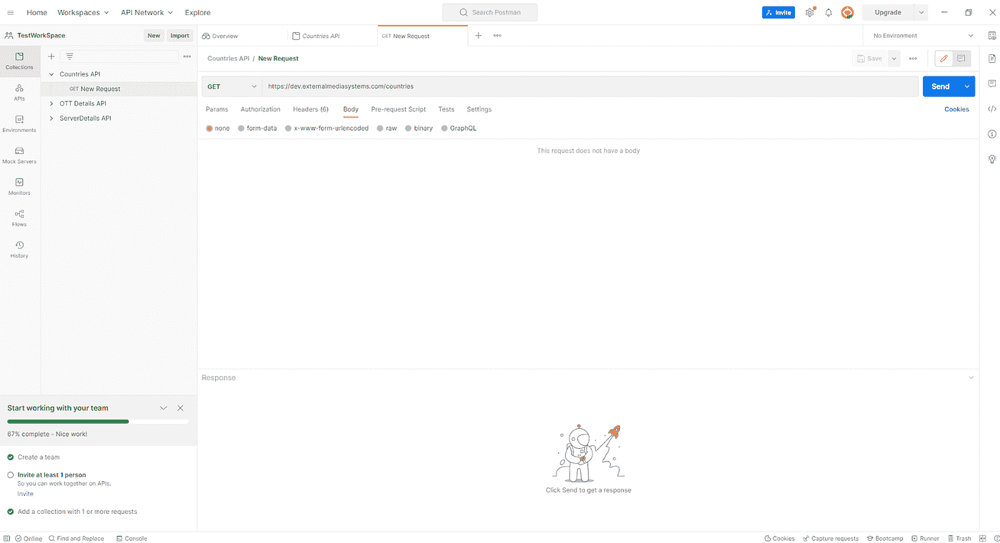
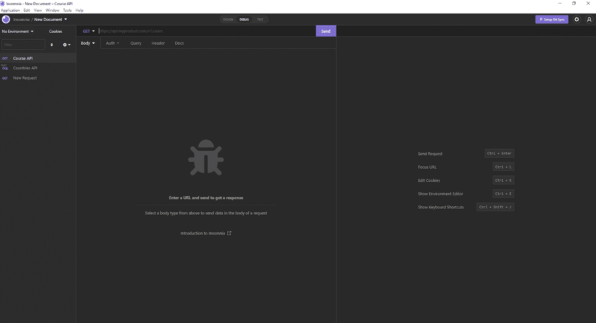
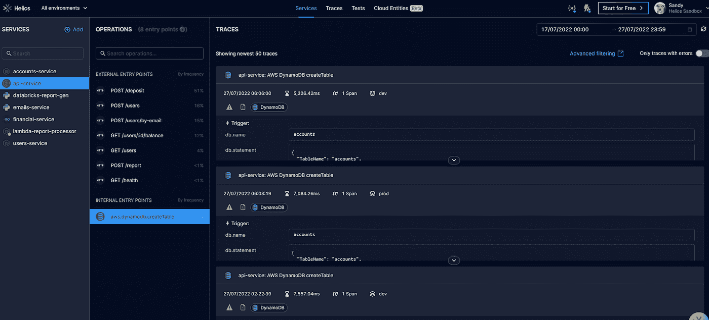
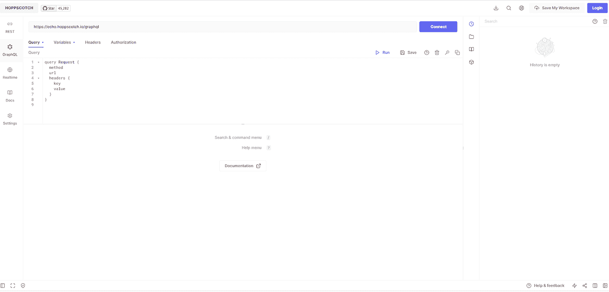
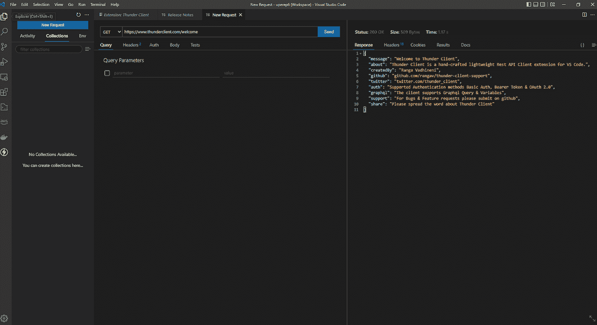

# 后端开发人员的 5 个最佳开发工具

> 原文：<https://medium.com/geekculture/5-best-dev-tools-for-backend-developers-4b2cdaf6826a?source=collection_archive---------1----------------------->

现代软件应用包括不同的集成组件，如数据库、微服务和消息系统。他们为了一个特殊的目的而合作。然而，开发和维护这样复杂的应用程序可能是复杂的，因为它涉及许多任务，如开发、测试、监控、调试和故障排除。作为一名开发人员，您将需要好的开发工具，使您能够更快地执行特定的任务，并在工作场所变得更有效率。本文讨论了任何开发人员都应该拥有的五个至关重要的开发工具。

# 1.邮递员

Postman 是最好的 API 开发工具之一，允许您从头开始更快地开发 API。这个 API 平台允许您设计复杂的 HTTP、REST、SOAP、GraphQL 和 WebSockets APIs，使用现有的 API，探索响应、测试、调试和共享它们。对于从事从设计到模拟请求的完整 API 生命周期的开发人员来说，这是一个简单的工具。

您可以使用内置的 API 认证支持，如 API Key、OAuth 1.2/2.0、AWS 签名和 Hawk 认证。邮递员可以自动检测响应语言。它还允许您将响应和请求正文格式化为不同的文本格式，以便更容易地查看它们。

Postman 不仅仅是构建 API。开发人员可以用这个强大的工具完成许多任务。《邮差》最大的特色之一就是它的收藏。它们允许您组织 API 并重用它们来消除重复工作。使用预请求脚本在 API 请求之前执行任务，使您能够使用动态参数测试 API、传递数据等等。此外，Postman visualizer 允许您可视化您的 API 响应，以便更深入地了解您的 API 行为。

# 孔失眠了

[失眠症](https://insomnia.rest/)平台还允许你按照你想要的方式对你的 API 进行分组和排序。您可以通过设置环境变量(如身份验证令牌、基本 URL 和协议)来为多个环境(如生产、试运行和测试)配置 API。

失眠最大的特点之一就是支持协作。例如，您可以创建团队和项目，并与团队和跨项目共享 API 集合。此外，您可以使用 Git 同步特性和远程集合来同步设计文档。

这个工具使您能够用许多流行的语言自动生成代码片段，包括 NodeJS、Python 和 Java。它还有助于加速 API 开发。总的来说，失眠是每个开发人员为了更快的 API 开发应该考虑的工具。

# 艾里奥斯

开发人员必须有简单的调试工具来排除应用程序的故障。否则，将需要更多时间来找到导致高优先级事件解决延迟的根本原因。Helios 是帮助您排除故障和测试分布式应用程序的最佳工具之一。它拥有执行云原生调试所需的一切。

Helios 构建于 OpenTelemetry 之上，与您现有的调试工具相集成，为您提供系统组件的完整视图。这些组件包括微服务、无服务器功能、数据库和第三方 API。您可以可视化复杂的流，例如 HTTP 和 gRPC 调用、无服务器调用、消息队列和事件流。Helios 让开发人员很容易找到他们系统中每个组件的依赖关系。此外，通过跟踪跟踪，您可以很容易地看到系统集成中的变化。

Helios 使调试变得更加容易。它显示了您的应用程序流在哪里出了问题，指出了瓶颈。只需几次点击，您就可以轻松再现这些问题。这包括复制 HTTP 请求、Kafka 和 RabbitMQ 消息、Lambda 调用等。Helios 还提供了广泛的搜索和过滤，您可以通过服务、API 调用等过滤掉错误。，缩小问题的根本原因。

此外，Helios 通过测试代码生成使[测试](https://gethelios.dev/blog/automating-backend-testing-in-microservices-challenges-and-solutions/)和验证复杂的后端操作变得更加容易。它还支持与现有测试框架的集成。因此，如果您想在调试分布式应用程序时变得高效，Helios 是一个必备的工具。

# 霍普斯科奇

[如果你想要一个没有复杂功能的简单 API 开发工具，Hoppscotch](https://hoppscotch.io/) 是一个理想的开发工具。它是一个轻量级、开源的 API 开发工具，具有极简的 UI 设计。该工具允许您更轻松、更快速地执行基本的 API 开发任务，如 REST、HTTP、GraphQL API 创建、测试和共享。

Hoppscotch 支持现代身份验证机制的基本身份验证，如 OAuth 2.0、承载令牌和 OIDC 访问令牌/PKCE。它还允许用集合和文件夹组织 API 请求，提供导出和导入功能，并添加在请求前执行的请求前脚本。Hoppscotch 非常适合喜欢简单开发工具和所有基本功能的开发人员。

# 迅雷客户端

如果您使用 VSCode 进行 API 开发，您可能需要下载另一个工具来测试它。相反，使用 VSCode 扩展来实现这个目的会更容易。Thunderclient 是一个测试 API 的轻量级 react 客户端。它提供了许多类似于其他健壮的 API 开发平台的直观特性。

它的用户友好界面让您可以测试简单到复杂的 API，而不会影响 VS 代码的性能。通过支持现有的 VSCode 主题，Thunderclient 可以很好地与您的代码集成。虽然它是一个简单的工具，但 API 创建对开发人员来说是一种更容易的体验，因为它提供了所有必要的功能，如用不同的文本类型格式化、API 类型、认证机制、环境变量、集合等。它还提供了一些高级特性，比如 API 请求监控和使用模拟服务器来模拟端点。

# 结论

开发者工具如果你知道市面上最好的工具，知道怎么用，就能成为开发者最好的朋友。本文讨论了用于 API 开发和云原生应用程序故障排除的五个最佳开发人员工具及其最佳特性。开发工具可以让您的生活更轻松，同时允许更快的开发。因此，一定要充分利用它们的直观特性。