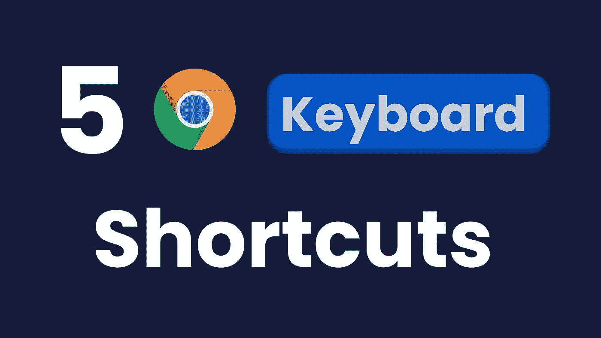

# 5 个 Chrome 键盘快捷键，提高您的工作效率

> 原文：<https://medium.com/geekculture/5-chrome-keyboard-shortcuts-to-boost-your-productivity-5c4498eafc5a?source=collection_archive---------3----------------------->

浏览器已经成为我们生活中不可或缺的一部分，现在大多数应用程序都是基于网络的。我们使用网络浏览器做任何事情，从在 Stackoverflow 上提问到预订机票。我们经常会打开大量的标签页，并且很难跟踪它们。当我们试图在标签之间切换时，这变得特别令人困惑。让我们来看看能提高我们工作效率的 5 个键盘快捷键

注意:虽然我要谈论的是 Chrome 特有的键盘快捷键，但它们应该在所有基于 Chrome 的浏览器中保持一致(Brave、Edge、Vivaldi 等)。)

# 在选项卡之间移动

点击标签可能是一个非常痛苦和缓慢的过程，尤其是如果你经常在它们之间切换的话。键盘快捷键大大加快了速度。

**Ctrl + Tab** (对于 Windows)和 **⌘ + ⌥ + →** (对于 macOS)让你移动到下一个标签。

编辑:Ctrl + Tab 在苹果电脑上也能工作，感谢[德茹瓦·斯里尼瓦斯](https://hashnode.com/@carrotfarmer)指出了这一点

额外的好处:我们也可以用 **Ctrl + Shift + Tab** (对于 Windows)和 **⌘ + ⌥ + ←** (对于 macOS)移动到上一个标签

# 重新打开关闭的标签

我们往往会误关闭标签页，但有一个简单的键盘快捷键可以重新打开最后关闭的标签页-

**Ctrl + Shift + t** (适用于 Windows)和 **⌘ + Shift + t** (适用于 macOS)让你按照关闭的顺序重新打开最近关闭的标签页。

额外的好处:如果你关闭了整个窗口，上面的快捷键会重新打开整个窗口和所有的标签。

# 在打开的选项卡中搜索

随着打开的标签越来越多，找到一个标签变得越来越困难。幸运的是，从 Chrome 87 开始，我们可以搜索所有打开的标签，以及最近关闭的标签。

**Ctrl + Shift + a** (对于 Windows)和 **⌘ + Shift + a** (对于 macOS)打开选项卡搜索对话框。

# 关闭当前选项卡

在我们使用完选项卡上的网页后，最好关闭它，这样就不会使我们的选项卡栏变得杂乱，并保持较低的资源使用率。

**Ctrl + w** (对于 Windows)和 **⌘ + w** (对于 macOS)关闭当前标签页。

额外奖励:**ctrl+shift+w**(windows 版)**⌘+shift+w**(MAC OS 版)关闭当前窗口。

# 打开新标签或窗口

Ctrl + t (对于 Windows)和 **⌘ + t** (对于 macOS)打开一个新标签页并跳转到它。

类似的， **Ctrl + n** (对于 Windows)和 **⌘ + n** (对于 macOS)打开一个新窗口并跳转到它。

所有 Chrome 键盘快捷键—[https://support.google.com/chrome/answer/157179?hl=en&co =精灵。平台% 3d 桌面](https://support.google.com/chrome/answer/157179?hl=en&co=GENIE.Platform%3DDesktop)

# 结论

我希望这篇小文章对你有所帮助，现在你可以在浏览网页时更有效率。下一集再见🤞

*原载于*[*https://blog . anishde . dev*](https://blog.anishde.dev/5-chrome-keyboard-shortcuts-to-boost-your-productivity)*。*