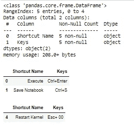
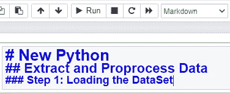

# 5 个编码最佳实践，让你看起来不像个菜鸟

> 原文：<https://medium.com/geekculture/5-coding-best-practices-that-will-keep-you-from-looking-like-a-noob-86ba35896960?source=collection_archive---------9----------------------->

## 即使是新手也可能看起来知道自己在做什么

"妈妈，你愿意玩《我的世界》还是机器人？"我 7 岁的孩子问我。他上了半天课，在我工作日的最后几个小时一直在玩游戏。当他问这个问题的时候，他的眼睛一直粘在手机屏幕上，在我不得不跑去参加另一个电话会议之前，我分心给他切苹果。我们都没有把注意力集中在谈话上，我回答道:“嗯，我想是《我的世界》吧..？老实说，我不太了解 Roblox。”“错了！”他大笑着从屏幕上抬起头，喊道。“你真是个笨蛋，妈妈。”

当我在 Mirriam Webster 中查找“Noob”这个词后，它让我想到我在其他什么地方看起来相当业余。虽然我在编码游戏中取得了一些显著的进步，但我仍然有一些工作要做，直到我可以放心地向我的许多同事展示我的代码。在很大程度上，我对自己的代码感到尴尬。我花了太多时间试图让它正常运行，我的脚本格式很好…有点草率。

**是时候让我看起来像个专业人士了。**


Photo by [Jason Leung](https://unsplash.com/@ninjason?utm_source=medium&utm_medium=referral) on [Unsplash](https://unsplash.com?utm_source=medium&utm_medium=referral)

为了准备我的判断，本周我花了一些时间回顾风格指南、快捷方式和技巧，以使我的代码看起来不像新手，我仍然是新手。以下是我收集的一些最简单有效的最佳实践。

## **1。1 个单元格中关于您的数据的所有详细信息**

我加载到 Jupyter 笔记本中的任何数据，在我做其他事情之前，我将使用这些基本命令检查数据集。 **df.describe()、df.info()、df.head()、df.tail()** 是每次加载数据集时应该检查的内容的基础。如果我发布代码给我的同事们看，没有人愿意滚动几个单独的单元格来查看这些东西。所以要结合使用 InteractiveShell:

```
import pandas as pd
from IPython.core.interactiveshell import InteractiveShell
InteractiveShell.ast_node_interactivity = "all"
df.info(verbose=True, null_counts=True)
df.head(2)
df.tail(1)
```



output from Interactive Shell

## 2.不要写超过 79 个字符的代码

79 个字符有多长？

如果你的代码有一个像下面这样的滚动条，是时候继续了。我说的继续是指移动到单元格中的下一行。

## 3.使用快捷键

我为使用 Jupyter 笔记本顶部的“运行”按钮而感到内疚。我不会坐在这里解释我为什么这样做，但是当你的鼠标滚动到它上面的时候，它会降低效率，让你看起来很业余。

我创建了一个我在日常工作中需要的最常用的 5 个命令的数组。我输出了一个数据帧，我将使用快捷键向前移动。有了这五条养成习惯的捷径，如果我要和同事一起在办公室写代码，我应该会看起来不那么傻。


Jupyter Notebook Shortcuts

我也经常使用“复制”和“粘贴”。这些使用的击键与在 Word 文档中复制和粘贴相同，我认为这很简单。

## 4.使用标记单元格来分隔代码的各个部分

有一些 Python 代码的最终用户根本不知道你是如何得到最终结果的。但是有更多的人在乎。他们希望感受到一种控制的元素，并且理解 Python 脚本所经历的过程使得非编码最终用户在你的工作中成为更多的利益相关者。帮助他们理解可以让他们在你的工作中成为更大的倡导者。将几个单元格转换为“Markdown ”,并用您的代码所实现的内容概述每组单元格。

每个语句开头的 Hashtags 定义了 Markdown 单元格中标题的大小。使用这些工具，您可以灵活地选择要包含多少细节。



Headings Sizes Before Cell is Run


Heading Sizes Output

## 5.在编码时要考虑到所有的利益相关者

正确有效的输出是必要的。然而，我经常迷失在简单地让代码一次正常运行几个小时的惯性中。没有停下来检查我的代码是否干净，我就在我的 Jupyter 笔记本上制造了一点混乱。我会不按顺序粘贴单元格，我会重新运行使我的数据错位的单元格，或者我会删除我不想要的代码行。我只是让自己沮丧。

给自己一个完成项目的时间表，这样你就可以快速休息了。对我来说，这意味着每隔一个小时，我就喝一杯饮料，花 5 分钟浏览我的整个笔记本。

在这几分钟里，我不仅重新获得了代码的参考框架，还提醒了自己我在努力实现什么。

那天我被称为 Noob，外面阳光明媚，华氏 82 度。下午 5 点，我关掉电脑，处理比写干净代码更重要的事情。我带儿子骑车去街角的商店买思乐冰。

我没有时间一夜之间成为职业选手。我发现做一些小的改变不仅仅是为了避免超长的代码行。它给了我一个参照系，让我的整体工作更有效率。