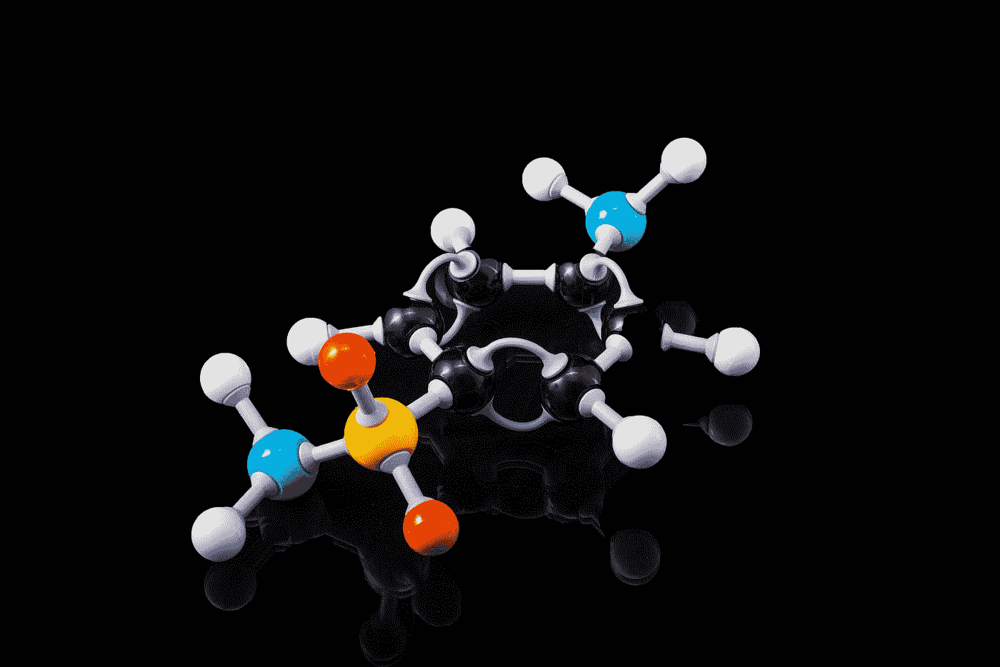

# 初学 ML 工程师的 5 个简单项目

> 原文：<https://medium.com/geekculture/5-easy-projects-for-beginner-ml-engineers-82399f3d8990?source=collection_archive---------10----------------------->

Photo by [AltumCode](https://unsplash.com/@altumcode?utm_source=medium&utm_medium=referral) on [Unsplash](https://unsplash.com?utm_source=medium&utm_medium=referral)

[据预测，到 2026 年，需要数据科学技能的工作将增加 27.9%。](https://www.analyticsinsight.net/data-scientists-will-be-the-most-in-demand-profession-in-the-next-5-years-here-is-why/)然而，可能很难产生一些想法来学习机器学习。这里有五个简单的项目供有抱负的 ML 工程师开始着手。

## 内容推荐系统

Photo by [NordWood Themes](https://unsplash.com/@nordwood?utm_source=medium&utm_medium=referral) on [Unsplash](https://unsplash.com?utm_source=medium&utm_medium=referral)

[内容推荐系统基本上是一个根据用户的行为向用户推荐内容的系统，例如用户点击的内容、以前的内容消费时间、位置数据等。](https://www.analyticssteps.com/blogs/what-content-based-recommendation-system-machine-learning)每个将用户与内容联系起来的流行在线服务都将内置一个内容推荐系统。

你可以从一种最简单的叫做[决策树](https://analyticalsciencejournals.onlinelibrary.wiley.com/doi/abs/10.1002/cem.873?casa_token=La64HdX9HnAAAAAA:J3QcbxYk3SiN5F3505GscEPGy5W4HEwCV20GSjpGcuqF1NayX_2vxuGWw8N8XoeihqG3pwffChMW_OU)的机器学习开始。也许你可以建立一个音乐播放器，记录以前的音乐。所以下次当你打开它的时候，它会提示你以前播放过的音乐。

然后你可以使用神经网络来决定一个基于上下文信息推荐的内容。从这里开始，你可以阅读谷歌学术发表的关于内容推荐系统的最新研究论文，并自己实现它们。许多学术和行业研究论文都有付费墙，但是你可以使用这个[免费扩展来移除研究的付费墙。](https://unpaywall.org/)

在这里注册我的电子邮件列表。

## 预测金融资产价格

Photo by [Maxim Hopman](https://unsplash.com/@nampoh?utm_source=medium&utm_medium=referral) on [Unsplash](https://unsplash.com?utm_source=medium&utm_medium=referral)

[金融资产基本上是股票、债券、交易所交易基金、共同基金、房地产、密码等。](https://www.investopedia.com/terms/f/financialasset.asp)这些物品的价格取决于许多因素。

您可以对您认为与价格相关的数据执行相关函数检查。然后玩玩 ML 工具，比如长期短期神经网络，看看你是否能把你创建的数据集和金融资产的实际价格对应起来。

你可能认为对冲基金对它们的算法保密，这样它们就能获得最大的利润。然而，[一些对冲基金实际上会公布他们开发的用于公众声誉目的的算法](https://quantpedia.com/)。尽管这可能不是精华。

一旦您测试了您的算法拟合能力，您就可以将它连接到现有的在线交易服务 API。[在交易网站上测试算法，看看是否能盈利。](https://3commas.io/blog/how-to-build-your-own-crypto-trading-bot-guide)虽然这可能不是精华，但他们可能会保密。

[在这里注册我的电子邮件列表。](/subscribe/@drechang)

## 动植物分类器

Photo by [Wexor Tmg](https://unsplash.com/@wexor?utm_source=medium&utm_medium=referral) on [Unsplash](https://unsplash.com?utm_source=medium&utm_medium=referral)

为了构建一个图像识别软件，你需要了解[卷积神经网络](https://www.ibm.com/cloud/learn/convolutional-neural-networks)。卷积神经网络可用于对动物和植物的图像进行分类。

然后，您可以使用更高级的技术，如[神经哈希](https://www.sciencedirect.com/science/article/pii/S1077314217302011?casa_token=eYJ8JC0_SSIAAAAA:Tq4hnQJ6ZB7eKF_thfnLPz740DLFO4qND16Bb58oxVKAEZMTKyGouThOZjI9A5LKnNVGMAy8AA)，它允许您为图像中的一组对象中的每个对象找到相同的哈希，即使该组中的每个对象都经过了排列。这种技术被苹果公司用来追踪互联网上的儿童虐待事件。

在这里注册我的电子邮件列表。

## 电子游戏，棋盘游戏，益智人工智能

Photo by [Erik Mclean](https://unsplash.com/@introspectivedsgn?utm_source=medium&utm_medium=referral) on [Unsplash](https://unsplash.com?utm_source=medium&utm_medium=referral)

大多数电子游戏、棋盘游戏和谜题都是组合问题。[组合问题基本上是这样一个问题:给定一个起始状态，你试图在给定一组可能的动作的情况下找到一组动作，以达到一个结束状态。](https://www.cs.upc.edu/~erodri/webpage/cps/theory/intro/slides.pdf)

解决一个红色立方体将是一个很好的组合问题的例子。例如，一个 3×3 的 3D 立方体有 18 个潜在的动作，这些动作将根据达到一个解决状态来改变每个面的状态。Connect 4 是另一个例子。甚至数独。OpenAI 已经发表了很多关于解决组合学的研究，比如击败世界上最好的国际象棋和围棋选手。

你可以使用代码子弹 YouTube 频道来获得这些类型的人工智能的一些想法。

 [## 代码项目符号

### 只是一个有计算机科学学位的白痴在尽力。

www.youtube.com](https://www.youtube.com/channel/UC0e3QhIYukixgh5VVpKHH9Q) 

在这里注册我的电子邮件列表。

## 科学人工智能

Photo by [Terry Vlisidis](https://unsplash.com/@vlisidis?utm_source=medium&utm_medium=referral) on [Unsplash](https://unsplash.com?utm_source=medium&utm_medium=referral)

科学界使用许多软件来收集实验数据。然而，这些计算可能会耗费大量时间和处理能力。作为一个例子，有一个软件被称为[高斯，用于执行电子结构计算，以产生点电荷。从这些点电荷中，你可以推导出分子的势能。](https://gaussian.com/)[势能被经典力学分子动力学模拟用来输出轨迹。](https://energywavetheory.com/equations/fma/)问题是这些[计算可能需要很长时间来执行](http://www.hpc.lsu.edu/training/weekly-materials/2011%20Fall/ElecStruc-2011-11-16.pdf)。然而，有了[人工智能，你可以使用神经网络加快计算速度。](https://pubs.rsc.org/en/content/articlehtml/2011/cp/c1cp21668f?casa_token=6FJ2_0V7wtUAAAAA:5MgtCuFo9-St8AUa0BgtwUb_TSQtjSsyxcT6_kvj6b-3OcQPOSo8hzDaFR4VRgRxWopYS0z1TX3YuQ)

这可能比列出的其他项目有更长的学习曲线，因为它需要一些量子化学的背景知识才能开始，并且通常需要超级计算机和昂贵的软件学术许可证。

在这里注册我的电子邮件列表。

## 继续前进吧

一旦你能够单独执行这些项目。您可以组合不同的模型来构建更强大的模型。例如，假设你想建立一个人工智能，它可以发现视频游戏的最快速度。互联网上已经有很多速度跑了。所以你不想从零开始。首先你需要建立一个**卷积神经网络**来检测玩家。然后你可以描绘出玩家的轨迹。从那里开始，用一个 Q 学习网络在一个测试视频环境中把玩家的位置映射到人类的输入。一旦你完成了映射，你就可以训练你的**监督学习网络**使用时间相关优化的速度跑的标记数据。你所学的所有积木都可以用来建造一个能在游戏中快速奔跑的人工智能。

机器学习工程实际上并不是使用一个模型来解决问题，而是结合不同的模型和技术来创建前所未有的新解决方案。

在这里注册我的电子邮件列表。

**相关内容:**

*   [如何建立一个基于内容的交付网络？](/@drechang/how-to-build-a-based-content-delivery-network-e1aa8bb237b3?source=list-6214c3278ac0--------6-------54e70b3226d9------------------------)
*   [如何备份您的媒体状态？](/geekculture/how-to-backup-your-media-presence-b1b5a9125159)
*   [JavaScript:隐私和安全的噩梦](/geekculture/the-javagate-scandal-fead695c4830)