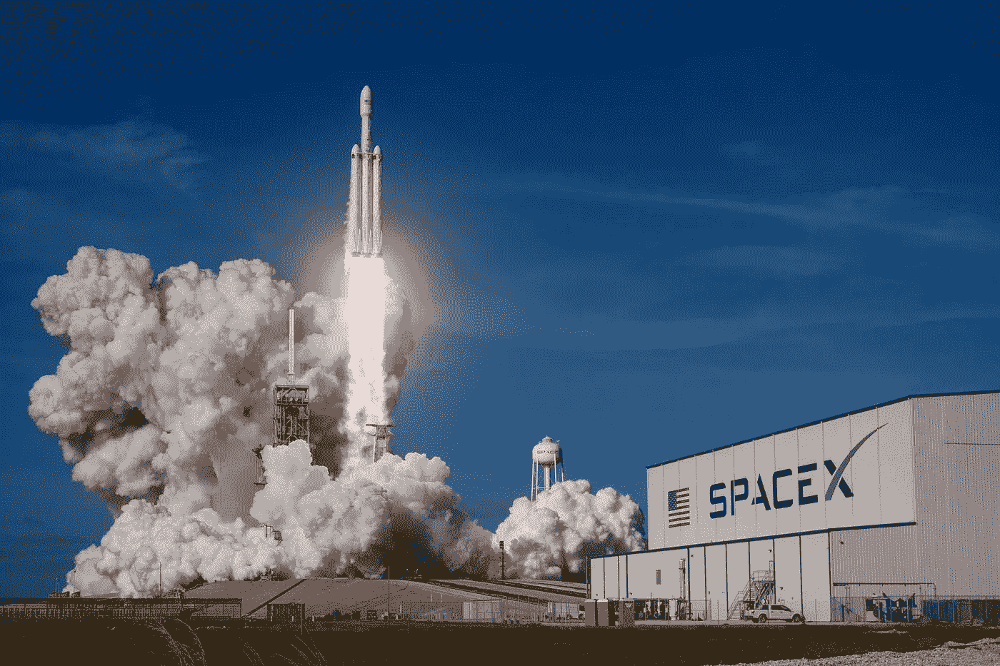

# 埃隆·马斯克构思的 5 个大型项目

> 原文：<https://medium.com/geekculture/5-huge-projects-conceived-by-elon-musk-2c7315d0c083?source=collection_archive---------29----------------------->

## 塑造明天的世界

Photo by [SpaceX](https://unsplash.com/@spacex?utm_source=unsplash&utm_medium=referral&utm_content=creditCopyText) on [Unsplash](https://unsplash.com/s/photos/rocket?utm_source=unsplash&utm_medium=referral&utm_content=creditCopyText)

如今人人都在谈论的亿万富翁埃隆·马斯克对人类的未来有着宏伟的计划，这并不是什么新鲜事。十年前，当我第一次使用贝宝时，我第一次听说了这个人。我想知道:谁是这个创新和惊人的在线支付系统背后的人？他是其中之一。

这是我第一次看到埃隆·马斯克这个名字，一个不太常见的名字。后来，每当我在新闻中听到他的时候，我都很惊讶有人会想到做这些我从小就想做的事情。

人类的发展远远落后，证据是自从登月以来，人类历史上没有真正值得纪念的事件。

工程师兼企业家埃隆·马斯克(Elon Musk)是现实世界中的托尼·斯塔克(Tony Stark)，他有许多想法和计划来推动人类作为多星球物种的早期发展。以下是其中最伟大的 5 个:

# 1.洛杉矶的地下高速隧道。

## 缓解交通拥堵是必须的

A 根据[交通排名来源](https://www.tomtom.com/en_gb/traffic-index/ranking/?country=US)，洛杉矶仍然是美国交通拥堵排名第一的城市。几年前，埃隆·马斯克在 TED 上讲述了他解决这个问题的伟大想法。

解决方案是在洛杉矶地下挖掘隧道，作为高速平台设备，以每小时 200 公里甚至更高的速度运输汽车。这将有助于缓解交通拥堵，但为了取得成功，它必须是多层的，并且要真正深入，以便让想要达到更大距离的司机能够立即做到这一点，并且最大限度地轻松和舒适。

埃隆将不得不面对的挑战之一是挖掘隧道，尤其是在城市下面，并不容易，而且也相当昂贵。

你能想象在短短几分钟内你如何从洛杉矶的一个地方到达另一个地方，而不会遇到交通问题吗？这一概念可以应用于世界上许多过度拥挤的城市。

# 2.太空 X——火星殖民计划

## 终于有人能真正看到这颗红色星球了

lon 已经谈论[殖民火星](https://www.spacex.com/human-spaceflight/mars/)很长时间了。这是一个巨大而昂贵的项目，但也有争议，特别是在埃隆·马斯克自己宣布第一批到达火星的人类将是单程旅行，永远没有机会回到地球之后。

根据 [Space X 火星计划](https://en.wikipedia.org/wiki/SpaceX_Mars_program)，我们将在 2022 年前用货船到达火星，但 2024 年前我们将只有人类在火星上。最初，船员们应该在 2026 年抵达，但现在看来，埃隆的计划更加雄心勃勃。

计划是这样的。名为 Starship 的火箭是有史以来最大的火箭，将被发射到地球轨道。燃料箱将从这里重新装满飞船，这样它就有足够的燃料去火星旅行。一旦它到达火星，星舰可以使用来自火星的资源重新填充。然后飞船可以返回地球。

这在时间上并不太遥远。对我们大多数人来说，这是一生中都会发生的事情。SpaceX 和美国宇航局已经取得的第一批成功证明，我们已经拥有了扩展外层空间的技术，但我们需要倡议和资金。

想象一下，火星上的第一批人可能无法回到地球，但对他们来说，生活在一个从未有人到过的全新环境中是多么令人兴奋…

# 3.超级高铁——高速磁悬浮列车

## 以超音速行进

T 雨从蒸汽演变到柴油，再到电和磁。但是现在，即使是磁悬浮列车也不能超过每小时 400 公里。埃隆想把这个提升到另一个层次。

时速超过 1000 公里的[超级高铁](https://en.wikipedia.org/wiki/Hyperloop)将成为最快的旅行方式。这个概念是挖掘隧道和建造悬浮管道，高速磁悬浮列车将通过这些管道悬浮起来并达到超音速。这意味着轨道不会受到摩擦，但管道内的空气可能会受到摩擦。Elon Musk 的计划解决了这个问题，因为他想用真空泵去除大部分空气，并确保空气阻力几乎为零。

大约十年后，如果所有的安全措施都已落实，并且所有的安全测试都很好，这个项目可能会成为现实。

你能想象在洛杉矶生活，在旧金山工作变得绝对正常吗？上班用不了一个小时。超级回路可以让这成为可能。

# 4.neural ink——头骨下的芯片

## 将人脑与云连接起来

尽管看起来颇具争议，但埃隆·马斯克希望我们能够直接用大脑访问互联网……不仅如此。这可能只是将人类变成超人的开始。

根据 Elon 的说法，由于人工智能正在快速发展，我们可能很快就会拥有比我们聪明得多的机器，解决方案将是使用不比普通硬币大的芯片和比人类头发还细的电极电线，将我们的大脑连接(或无线连接)到互联网。

像直接在大脑中听音乐，增强视力，或者将记忆保存到数字存储介质中这样的事情在未来可能会变得很正常。

据 Neuralink 员工称，存在的一大挑战是将非常柔软的脑组织与非常细的电线进行物理连接。还有官僚主义问题和道德问题需要克服。

我们只能对 Neuralink 持乐观态度，并希望这项技术将被用于正确的目的。最初，它旨在帮助残疾人用他们的思想移动他们的轮椅，或治疗各种行动和神经问题。

根据在颅骨中植入这种芯片的过程的便宜程度或风险程度，任何人都可以使用这种芯片，或者只有那些负担得起的人才可以使用。

# 5.starlink——环绕地球的卫星网络

## 任何地方的任何人都可以使用互联网

答世界上几乎一半的人口没有互联网接入。这包括非洲和中东地区，但也包括其他地区，主要是农村地区。

这些限制来自两个方面:一是高速互联网由海底的巨大电缆提供动力，二是即使有卫星提供互联网，它们也太少，当试图覆盖更大的区域时，信号就会变得太弱。

需要一个强大的卫星网格来环绕地球。

作为 SpaceX 的一个分支， [Starlink](https://en.wikipedia.org/wiki/Starlink) 即将实现这个想法。42000 颗卫星即将逐渐上传到地球上方，或者至少这是埃隆·马斯克的下一个目标之一。

这个高数字吓坏了许多天文学家，因为他们认为地球上任何地区的夜空都会被完全遮住，或者至少会严重阻碍天文观测。

Elon 说，这不会对天文观测产生影响，并且会采取一些措施，例如使用黑色作为天线，以及使用非反射表面。订阅所得的钱将用于 SpaceX 更大的项目，如火星殖民。

一些卫星已经进入轨道，完整的网络将于 2022 年建成。现在已经放置的卫星正在测试服务。

在全球每个地区为每个人提供高速互联网的想法似乎很棒。我们只是希望天文观测不会受到任何干扰。

感谢埃隆的大力参与和他即使在不顺利的时候也不放弃的雄心，我们可能会有一个光明的未来。到 2050 年，世界可能会与现在完全不同。一旦火星被殖民，我们可能已经是多行星物种了。也许我们孩子的孩子能活着看到我们离开太阳系。谁知道呢？事情进展越来越快…