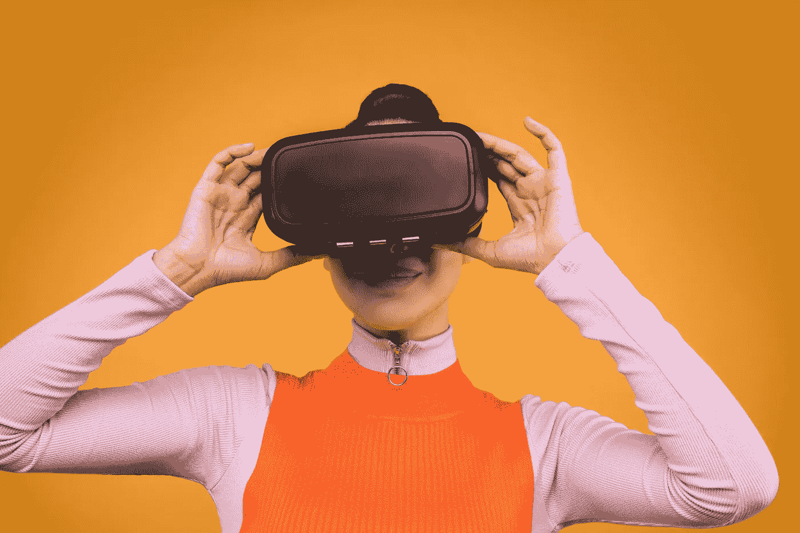
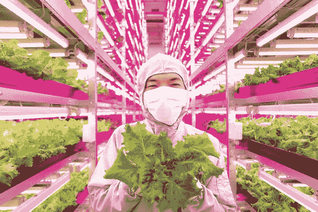
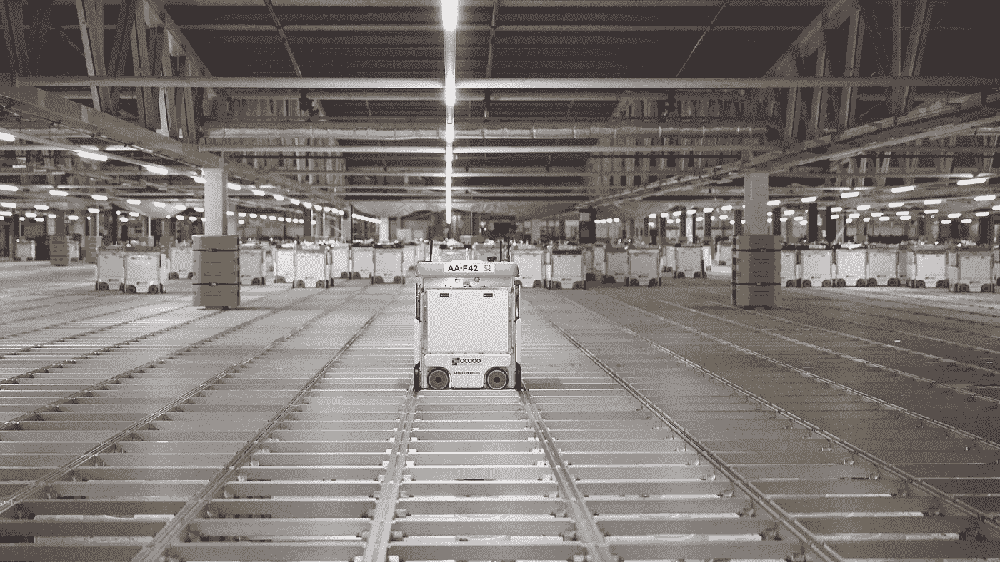
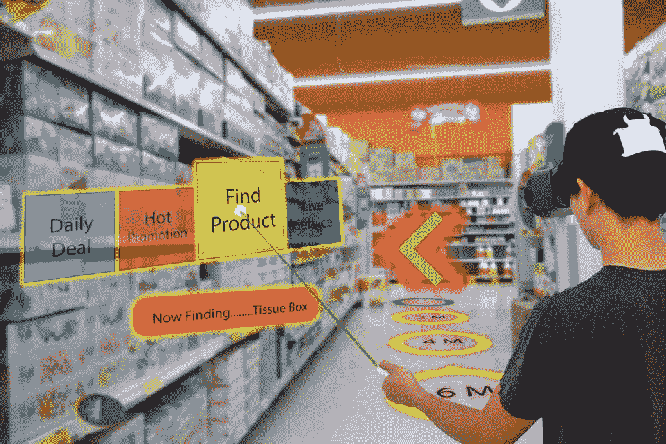
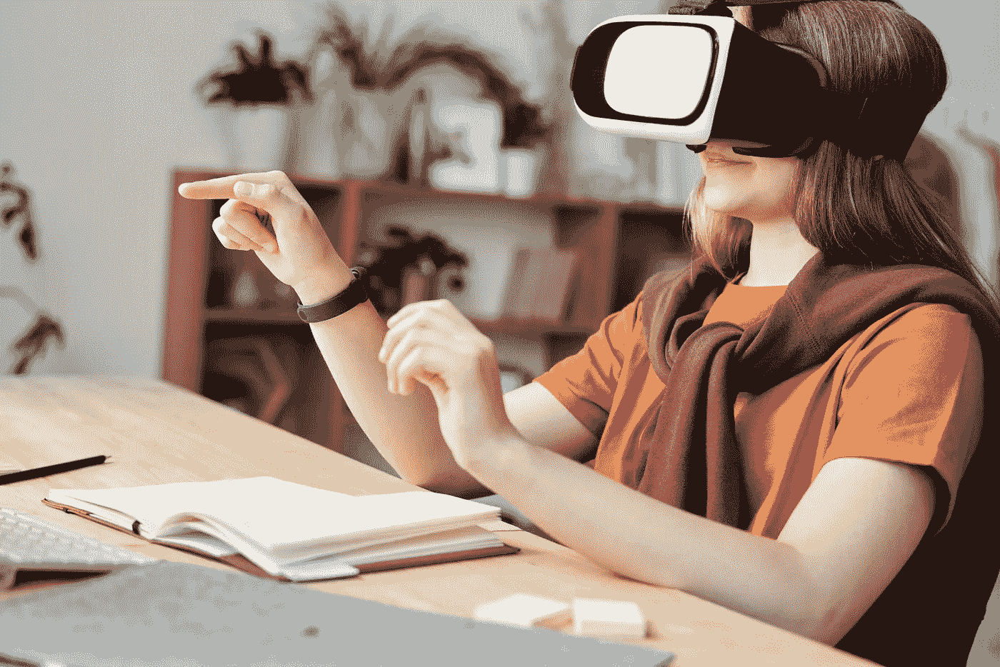
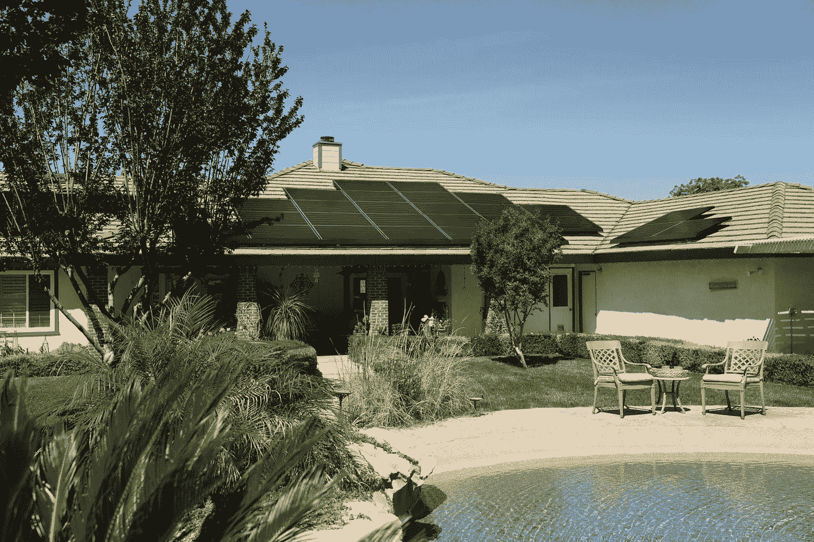
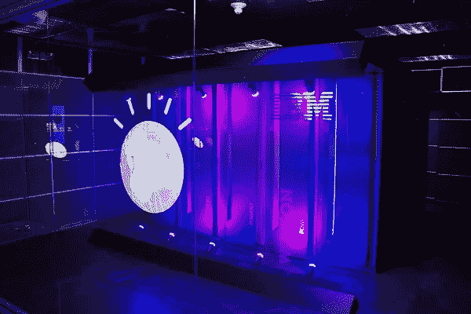

# (物联网)物联网初创公司蓬勃发展的 5 个行业

> 原文：<https://medium.com/geekculture/5-industries-where-iot-internet-of-things-startups-are-thriving-888cc16e3516?source=collection_archive---------46----------------------->

## IBM Watson——推动物联网革命的计算机。

Photo by [Sound On](https://www.pexels.com/@sound-on?utm_content=attributionCopyText&utm_medium=referral&utm_source=pexels) from [Pexels](https://www.pexels.com/photo/woman-in-orange-and-pink-long-sleeve-shirt-holding-black-and-gray-vr-gadget-3761196/?utm_content=attributionCopyText&utm_medium=referral&utm_source=pexels)

疫情促使各行业重新考虑他们的商业模式，无论是允许人们全职在家工作，还是完全重新想象他们的运作方式，正如我们在活动行业看到的虚拟活动的出现。早在我们预测到在家工作模式将成为未来几年主要行业的基本框架之前，许多组织就已经在适应这种模式，然而，它正在对每个人的身心健康造成严重破坏，这也是一个重大问题。

虽然在家工作的概念在疫情之后变得流行，但它最初是由史蒂夫·乔布斯在 20 世纪 90 年代提出的。我说的是我还没出生的时候，只有少数人能接触到电脑，互联网仅限于大学实验室的几台台式机。

> 这是对史蒂夫·乔布斯的采访，他谈到了虚拟组织，团队可以在全球不同的地方远程连接和工作。你可以导航到 6:02，他正在谈论这场革命。

我刚刚提出的观点与信息技术时代更相关，在这个时代，计算机和人类成为了最好的朋友，数据被组织起来以造福人类，但现在我们已经达到了信息技术时代的顶点，正在进入后信息时代，在这个时代，一切都将连接在一起，互联网催生了一个新术语，称为**物联网。**

但我们中的一些人仍然想知道物联网到底是什么？

嗯，科学上讲**物联网是原子的物理世界和比特的数字世界融合在一起。**到目前为止，人类只是数字世界和物理世界之间的连接，但很快，运动鞋、自行车、仓库、超市货架、汽车和酒店厨房都将连接起来，并相互交谈。据估计，到 2025 年，将有超过 800 亿台设备连接到互联网，这是全球总人口的 11 倍，5G 将成为物联网革命的关键。

我们还需要等待几年才能让物联网成为一个家喻户晓的术语，但这项技术已经在工厂、学校和长期废弃的地下隧道中开始了一场革命。让我们看看物联网正在引发一场革命的一些传统行业。

# **以下是物联网已经蓬勃发展的 5 个传统行业:**

## ***1。农业和地下农业中的物联网***

许多物联网初创公司正在试图改变作物种植方式，他们走在了正确的道路上，因为到 2030 年农业生产率必须提高 70%，才能满足人口不断增长的需求。

一家别出心裁的初创公司通过众筹方式开启了可持续农业的新篇章。这家初创企业开办了世界上第一个地下沙拉农场，名为。生长在地下，建在 100 英尺的废弃隧道网上。低于街道水平。这些废弃已久的通道被改造成了最先进的地下花园。该花园使用 LED 和水培灌溉系统，LED 用于复制太阳的光谱，水培用于为根系提供水和养分。最好的部分是水可以在这种类型的农业中重复使用，这是一个优势。农场向主要的零售市场、餐馆、承包餐饮和酒店提供沙拉。这些可持续农业技术有助于为不断增长的人口提供新鲜食物，降低每公顷的农业成本，减少食物浪费。

所有这一切都可以通过传感器来实现，这些传感器可以捕捉与空气速度、温度、湿度和水中 PH 值相关的数据。来自传感器的所有这些反馈都可以用来手动控制隧道周围的环境，以给植物提供它们一直想要的东西，给植物提供每天每一秒钟生长的最佳环境。

## 2.零售和虚拟超市中的物联网

亚马逊已经率先推出了 Alexa，这是一款人工智能虚拟助手，正在彻底改变亚马逊 Go 商店的购物体验，正如我在我的文章[中讨论的人工智能将改变我们生活的 5 种方式](/codex/5-ways-artificial-intelligence-will-transform-our-lives-99d8c5a1a445)。人工智能改善了人类过去与计算机的交互方式。但是物联网不仅仅是改善人机交互；它还涉及机器如何相互通信，以完全消除零售过程中的人工干预。

为此，电子商务巨头已经在自动化仓库上投入了大量资金，这些仓库通常被建造得像一个蜂巢，一队机器人在收到货物时储存货物，并在网上下单时收集物品。网上购物已经从我们的电脑屏幕转移到手机上，现在你可以向 Alexa 询问今天的交易，并通过与她交谈来订购你选择的物品。Alexa 将直接联系她在仓库的机器人同事来打包您的订单，无人机先生将根据您的居住地点在几分钟或几小时内将货物交付给您。

线上和线下零售商也看到了巨大的潜在虚拟现实技术，人们可以在家中舒适地参观虚拟超市并购买任何东西。这项技术的初步应用可以看到，一个戴着混合现实眼镜的人只需将罐子拿在手中，就可以看到能量饮料的全部成分。只要拿起汽水罐，你就可以看到这种汽水在酒杯和啤酒杯里的样子，或者如果你想比较两个汽水瓶的含糖量。

## 3.教育和虚拟教室中的物联网

众所周知，教育技术正在开辟教育方法的新天地。从基于云的教学到增强现实，EdTech 正在为全球的学生和教师提供新的在线工具和平台，并帮助我们满足数字时代不断变化的需求。

Photo by [Julia M Cameron](https://www.pexels.com/@julia-m-cameron?utm_content=attributionCopyText&utm_medium=referral&utm_source=pexels) from [Pexels](https://www.pexels.com/photo/girl-wearing-black-and-white-vr-goggles-4144293/?utm_content=attributionCopyText&utm_medium=referral&utm_source=pexels)

2020 年，全球对学习技术公司的投资达到 95 亿美元以上。根据 EdTech Global 组织的数据，目前只有 2%的教育实现了数字化，但市场规模是媒体行业的 3 倍。这个想法是将 150 年的传统纸笔教育流程转变为更具沉浸感的在线体验。

随着在线学习的持续增长，学校通过云管理教学的需求也在增长。Firefly Learning 是一家通过为学校提供一个直观的平台来拉近学生、教师和家长之间距离的公司。该公司为学生和教师推出了单独的应用程序，这些应用程序可以和谐地一起工作，他们根据传统课堂体验的隐喻进行设计，学生和教师可以实时互动。该应用程序允许教师授课、布置作业、提供书面口头作业反馈，并让家长更多地参与日常学习对话。对于学生来说，该应用程序相当于他们的纸质作业日记，帮助他们组织他们在学校的一天，就像他们在智能手机上组织他们的生活一样。

## **4。绿色能源和智能家居中的物联网**

Photo by [Vivint Solar](https://www.pexels.com/@vivint-solar-1479731?utm_content=attributionCopyText&utm_medium=referral&utm_source=pexels) from [Pexels](https://www.pexels.com/photo/black-solar-panels-on-brown-roof-2850347/?utm_content=attributionCopyText&utm_medium=referral&utm_source=pexels)

在过去几年中，能源生产和消费发生了显著变化，许多国家如爱沙尼亚、瑞典、比利时、奥地利等。已经转向完全无碳的能源生产模式，德国等其他大国也决定到 2030 年实现无碳。世界各地的大型电力公司，无论是公共部门还是私营部门，都在重组他们的商业模式。他们现在正从生产和销售电力转向帮助客户生产自己的能源，物联网在重组他们的商业模式方面发挥着非常重要的作用。

这些公司现在正在制造设备，通过使用太阳能电池和蓄电池生产和储存自己的电力，使家庭能够脱离电网。一个产生多余能量的家庭现在可以与一个能量不足的家庭分享，反之亦然。这些自给自足的微电网中的能源共享将完全自动化，使用基于区块链技术的智能能源共享设备，以确保共享能源的房屋获得回报。

一些公司正在建立一种叫做虚拟电力云的技术，这种技术将允许用户储存多余的能量，并以他们想要的方式使用。他们可以使用智能手机应用程序来监控产生了多少能量以及消耗了多少能量，还可以使用智能手机应用程序来查看能量产生的趋势，例如一天中的什么时候发电量最高，以及根据未来一周的天气预报将产生多少能量。

通过使用谷歌 Nest 这样的智能家居设备，家庭可以节省高达 60%的能源消耗，Nest 还可以控制你的其他家用设备，如洗衣机、冰箱、电视和热水器。通过这样做，it 可以在这些设备不使用时或在能源价格高于平均水平时将这些设备置于节能模式。在 5 到 10 年内，我们所有的家用设备都将连接到一个中央云网络，该网络将从我们的习惯中学习，并将能够执行所需的操作，而无需我们使用智能手机来控制任何东西。

## **5。服装和虚拟试验中的物联网**

Photo by [Andrea Piacquadio](https://www.pexels.com/@olly?utm_content=attributionCopyText&utm_medium=referral&utm_source=pexels) from [Pexels](https://www.pexels.com/photo/happy-woman-shopping-online-at-home-3769747/?utm_content=attributionCopyText&utm_medium=referral&utm_source=pexels)

服装行业也正在经历巨大的转变，不仅在款式和制造方面，而且在它们接触你的方式方面。

英国的一家初创企业为纺织品制造商提供了新的解决方案，正在撼动时尚业。UNMADE 是一家基于时尚技术的企业，它正在改变现代服装的生产方式。他们的技术正在帮助服装和纺织品制造业从基于库存的制造模式转向更加本地化和基于需求的模式。据其创始人称，他们的技术正在将时尚供应链从目前的制造和在仓库中储存衣服的模式转移到一个地方，在那里你只能在有人购买后制造特定的产品和按需制造模式。

顾客可以在自己舒适的家中使用 UNMADE customization editor 工具设计自己的服装，一旦他们下订单，缝纫机将在几分钟内在制造工厂启动，以最快的速度交付您的订单。

服装初创公司将改变我们在网上购买服装的方式，一种基于人工智能的技术现在可以让买家买到最适合他们体型的衣服。使用数字化身，人工智能可以建议最适合你的脸型和体型的衣服，并可以在 V 领和高领毛衣之间为你提供更好的选择。

# **总结-**

上述行业只是物联网如何慢慢改变我们周围一切的几个例子。物联网还在其他几个地方购买了一场革命，比如将个性化带到化妆品行业，女性可以个性化她们唇彩的颜色，并将其送到门口；或者在交通行业，你的汽车现在足够智能，可以自动调整方向盘和驾驶座，知道你或你的妻子今天是否会乘坐。

## **IBM WATSON——这个星球上最复杂的机器。**

以国际商业机器公司(IBM)前首席执行官托马斯·J·沃森的名字命名。沃斯顿计算机据说是地球上最复杂的机器之一。2011 年 1 月 14 日，IBM 的沃森在一个受欢迎的电视智力竞赛节目 Jeopardy 中击败了两个人，对手不仅仅是两个人——他们是两个有史以来最好的 Jeopardy！赢得 IBM 100 万美元。

IBM Watson 在一场实时直播的比赛中击败了他们，没有诡计，没有花招！

现在，这种计算机的智能正在制造业中得到利用，使各行业能够通过基于云的平台来使用它的计算能力。IBM 正在为制造企业提供一种解决方案，可以改变整个工厂的流程和运营。它正被世界各地的组织用来进行预测分析，通过使用数据物联网传感器和机器学习来降低成本。

这台计算机被认为是物联网世界的一场革命，它能够连接多个领域、行业和高等学习能力。计算机将使机器能够像人一样说话，甚至与人对话。他们设想有一天人类可以问机器，嘿！你认为你什么时候需要保养？

欢迎来到未来！再见，✌

