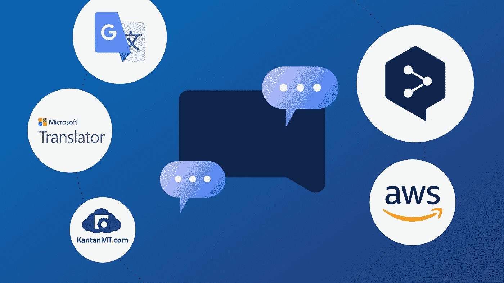

# 5 个有趣的机器翻译软件用途

> 原文：<https://medium.com/geekculture/5-interesting-machine-translation-software-uses-aed2b60af2a0?source=collection_archive---------27----------------------->

近年来，计算机已经变得很先进，在帮助我们学习语言和如何使用语言方面，它们越来越有用。例如，[语法检查器](https://writer.com/grammar-checker/)可以帮助我们发现写作中的错误，而软件也可以帮助我们跨越语言障碍。

机器翻译软件使计算机能够将一种语言直接翻译成你选择的另一种语言。一个例子是谷歌翻译，任何有互联网连接的人都可以免费使用。

谷歌翻译经常被那些想翻译网上的讨论或其他文本的人使用。

诚然，机器翻译软件到目前为止还不是特别可靠。这些算法还不够先进，无法理解语言中的[语境和情感](https://www.transifex.com/blog/2021/can-you-translate-a-feeling-all-about-transcreation/)。

然而，他们仍然可以让我们对正在说的内容有一个大致的了解，尽管可能会出现一些令人遗憾和尴尬的错误。

无论如何，机器翻译软件看起来将会继续发展。这项技术已经在日常生活中找到了一些有价值和有趣的用途。

# 旅行者援助

去一个不同的国家旅行会非常令人兴奋，会看到很多新的东西，会遇到很多人。这也是一个绝佳的机会去购买你在国内找不到的东西。

然而，除了所有的兴奋之外，还可能有忧虑，其中一部分将归因于语言障碍。

在市场购物时，告诉人们你在找什么是一件很有挑战性的事情，甚至首先到达那里也很困难。手势的组合可以在一定程度上有所帮助，但互动往往会以失望和沮丧告终。

这就是[机器翻译](https://www.transifex.com/blog/2021/what-is-machine-translation/)软件的用武之地。

翻译产品已经被开发出来翻译外语口语，用户通过耳机接收翻译内容。

小型扬声器可以帮助同一个人通过将他们自己的话翻译成当地语言来与其他人交流。

即使只有一部智能手机或一台带互联网连接的触摸屏电脑也会有很大帮助。有了谷歌翻译或类似的工具，游客可以输入他们想说的话，翻译几乎立刻就会出现。

# 翻译手语

全世界数百万人依靠手语交流。然而，大多数人没有必要使用手语，也没有学会如何使用它。依赖手语的人通常很少有人可以交流，这可能是一种孤独的存在。

令人欣慰的是，翻译服务正在发展到可以更好地翻译手语和其他口语之间的语法和上下文的地步。

这样的发展将有助于数百万人能够自由交流。新的工作机会可能会为他们打开，更不用说与更广泛的人交往的能力了。

像盲文这样的其他语言提出了不同的挑战。盲文翻译人员不需要将文本写在显示器上，而是需要以物理方式创建盲文脚本，以便能够阅读。

也许一个选择是有一个“动态”显示器，能够提供实时翻译。

# 商务电子邮件

互联网使商业比以往任何时候都更加全球化，公司可以很容易地与世界另一端的公司做生意。

网站也经常用多种语言开发，以帮助吸引更广泛的客户群。一些企业甚至有专门用外语与人打交道的部门。

然而，较小的企业不太可能有这样的基础设施资源。但他们仍然需要处理偶尔的电子邮件或其他外语信件，这正是机器翻译软件可以帮助的地方。

仅仅是将电子邮件中的文本复制并粘贴到 Google Translate 中，就能给你一个粗略的电子邮件翻译。

虽然它不是高端商业交易和准确的[本地化](https://www.transifex.com/blog/2021/what-is-localization/)活动的解决方案，但它至少应该足以满足基本的通信。

# 多语言机器人

你知道《星球大战》中的 C-3PO 能说 600 多万种语言吗？他显然会是地球上 6500 种语言的好伙伴。虽然 C-3PO 当然是科幻小说中的人物，但这并不意味着多语言机器人不能成为科学事实。

碰巧的是，有些已经在开发了。

会说多种语言的机器人可以有多种用途，比如在酒店或国际贸易展览中。这些机器人可以帮助指路和回答问题，还可以充当说不同语言的不同人之间的翻译。

对于客人来说，这将意味着更容易沟通，能够找到他们需要的东西，并有更多的宾至如归的感觉。对于东道主来说，这意味着更多的生意，因为潜在的买家会感到更舒服，他们的问题会得到礼貌和专业的回答。

# 更快的翻译

就目前情况来看，人工翻译比机器翻译更准确，但机器翻译仍然有用。

人工翻译可能非常耗时，并且由雇佣成本高昂的熟练翻译人员来执行。机器翻译至少可以加快这个过程一点点——或者很多。

机器可以处理大量文本，并几乎立即翻译出来。之后，人工翻译可以检查翻译后的文本，纠正错误或改进翻译，这也是我们建议使用 [Transifex 的 MT 集成](https://www.transifex.com/integrations/)的方式。

可能会有很多需要修改的地方，人工翻译可能还需要经常检查原文。但是这个过程仍然比让一个人从头开始做整个翻译花费更少的时间。

# 结论

随着计算机和其他技术的不断发展，很难说机器翻译将来会有什么应用。

虽然目前它的准确性和可靠性有限，但随着越来越先进的算法的开发，这些问题可能会减少。有可能有一天机器翻译软件或类似的技术会发展到完全消除语言障碍的地步。

目前，这项技术在很多情况下都是有用的，即使它并不完美。

这篇文章是由[的尼古拉斯·鲁布莱特](https://www.linkedin.com/in/nicholas-rubright-29225047/)撰写的，他是[作家](https://writer.com/blog/)的传播专家。在他的空闲时间，尼古拉斯喜欢弹吉他，写音乐，并在互联网上建立很酷的东西。

[这篇文章最初发表在这个页面](https://www.transifex.com/blog/2021/5-interesting-machine-translation-software-uses/)。