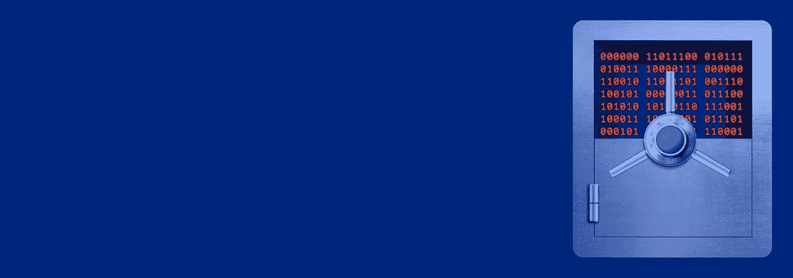

# 2021 年的 5 种主要网络安全威胁

> 原文：<https://medium.com/geekculture/5-key-types-of-cyber-security-threats-in-2021-a6e0d5927a47?source=collection_archive---------44----------------------->

在过去的一年里，数据丢失和网络事件达到了创纪录的数字。因此，网络安全已经成为每个人的头等大事，包括大型企业和中小型企业、政府和个人。让我们探讨最常见的网络安全威胁类型以及如何防范它们。

2020 年刺激了向远程工作的转变；全球 88%的公司已经过渡到在家办公。虽然办公室配备了保护良好的路由器和防火墙，但远程工作使网络犯罪分子更容易攻击更易受攻击的员工设备和网络。

2021 年， [35%的企业](https://www.isaca.org/resources/infographics/state-of-cybersecurity-2021-part-2)报告网络攻击增加。因此，更多的企业开始寻找建立网络防御的方法，通常与经验丰富的 T4 网络安全服务提供商合作

网络安全威胁包括恶意行为，目的是获取或窃取敏感数据，破坏或扰乱另一个人或组织的网络。网络攻击可能由不同的恶意行为者发起，包括个人黑客、恐怖组织，甚至是员工或承包商等受信任的个人。在本文中，我们探讨了最常见的网络安全威胁类型，并分享了一些保护您的组织免受威胁的专家建议。

# 2021 年及以后需要警惕的 5 种网络安全威胁

网络威胁每天都在变化和发展。然而，为了防止网络攻击，公司应该意识到最常见的威胁，并针对可能的违规加强其安全性。

## 1.社会工程

社会工程是操纵一个人泄露机密信息或在其设备上安装恶意软件的过程。根据 ISACA 的说法，社会工程被认为是最常见的网络威胁之一。更糟糕的是，这种威胁以各种形式和规模出现。以下是其最常见形式的概要。

**网络钓鱼**是黑客通过使用适当的徽标和名称来伪装成受信任的人或公司。黑客向一个人或一组人发送电子邮件，要求他们执行某个操作，例如验证他们的邮寄地址或提供他们的信用卡号、登录凭证或其他有价值的个人信息。

网络钓鱼可以进一步划分为子类别。例如，鱼叉式网络钓鱼是一种针对特定人的攻击。恶意行为者从网上收集关于一个人的信息，并据此修改电子邮件通信，使其听起来更有说服力。另一类网络钓鱼是捕鲸。这涉及到黑客将目标锁定在公司的首席执行官或首席财务官身上。以下是其他一些例子:

*   **可视**或语音网络钓鱼是利用电话记录并获取敏感数据。
*   **短信钓鱼(SMS phishing)涉及访问短信。**
*   **URL 网络钓鱼**是指攻击者包含恶意 URL。

引诱是指黑客通过向受害者提供他们想要的东西或利用他们的好奇心来诱骗他们采取特定的行动，例如，提供免费下载电影的可能性。攻击者也可能使用 USB 闪存驱动器，例如，在会议上把它交给他们的目标，或者把它放在咖啡馆里他们的目标可以找到的地方。虽然受害者可能认为它只是一个免费的存储设备，但黑客已经在其中加载了恶意软件，可以破坏受害者的软件。

**交换条件**非常类似于诱饵。但是，网络罪犯提供的不是产品，而是服务。例如，他们联系受害者，提出修复他们系统中的一个漏洞。但是，要访问提供的支持，受害者需要共享他们的凭据。

恐吓软件攻击包括黑客恐吓他们的受害者做某事。这种类型的攻击通常要求受害者迅速采取行动。例如，一个人可能会收到一封电子邮件，声称有人入侵了他们的帐户，他们需要立即采取行动并更改他们的凭据以保护帐户。通过响应黑客的声明并更改他们的凭证，受害者将它们交给攻击者。

**搭载**和尾随是两种非常相似的攻击类型。捎带是指罪犯跟随授权人员进入限制区域。这种攻击可以是电子攻击，也可以是物理攻击。尾随涉及犯罪分子通过紧紧跟随授权人员进入受限区域。在这两种情况下，恶意行为者可以访问敏感信息，并使用设备窃取数据或破坏系统。

## 2.恶意软件

恶意软件是利用漏洞来破坏组织网络的恶意软件或代码。网络罪犯可以在公司的软件中输入恶意代码来破坏其安全系统，拒绝访问关键信息或关键资产，并获取敏感数据。恶意软件有几种变种。让我们来看看最常见的类型。

1.  **勒索软件攻击**包括阻止用户的数据，并威胁要公布或删除这些数据，除非支付赎金。
2.  **病毒**感染一家公司的计算机系统，并在整个网络中传播。恶意行为者可以利用病毒来获利、发送政治信息或破坏公司。
3.  **木马**是插入有用程序的恶意程序。它们通常用于为网络罪犯创建访问公司系统的“后门”。
4.  间谍软件收集个人信息。然后，这些敏感数据可能会被用来勒索此人或在他们的设备上安装其他恶意程序。

## 3.中间的人

中间人(MITM)攻击是指黑客截取双方的对话或交易。例如，当个人连接到公共 Wi-Fi 网络时，知道系统中存在漏洞的犯罪分子可以中断流量并接收各方共享的信息。

## 4.拒绝服务攻击

这涉及到攻击者通过使网络超载来中断网络的正常流量，这意味着它无法做出响应。拒绝服务(DoS)可用于索要赎金或破坏运营。当攻击同时针对多个设备或系统时，这被称为分布式拒绝服务(DDoS)攻击。

域名系统(DNS)攻击是一种 DDoS 攻击，网络罪犯利用 DNS 服务器中的漏洞。因此，当用户输入他们认为是可信的地址时，DNS 服务器就会受到威胁，用户会被重定向到恶意站点。

## 5.云缺口

随着许多组织过渡到基于云的系统，越来越多的黑客瞄准了云安全。网络罪犯利用云部署中的弱点和安全错误配置来访问和窃取公司的资产和敏感数据。

# 保护您的网络免受网络攻击的主要建议

没有一种放之四海而皆准的方法可以完全避免网络攻击，但公司可以提前应对所有类型的网络安全威胁，并通过积极主动来降低风险。以下是我们为公司提供的保护网络的最佳建议。

## 教育员工

一旦你的员工得到预先警告，他们就会变得有备无患，网络犯罪分子就更难诱骗他们做某事或泄露信息。确保您的员工:

*   不要打开未经请求的链接
*   不要向第三方透露个人信息
*   使用双因素身份验证
*   创建唯一且强有力的密码
*   不要使用不安全的 Wi-Fi 网络
*   不要让他们的设备无人看管
*   保持程序和系统最新

请你的安全团队定期进行模拟黑客的培训，并观察你的员工的反应。确定棘手问题，并确保您的员工做好准备，以防这种情况真的发生。

## 采取预防措施

除了培训课程之外，请考虑以下预防措施来保护您的系统:

*   设置垃圾邮件过滤器来检测威胁并阻止网络钓鱼电子邮件到达最终用户。
*   通过配置防火墙阻止对已知恶意 IP 地址的访问。
*   安装防病毒和防恶意软件程序，定期扫描软件中的潜在威胁。
*   提供可以下载到公司设备上的安全程序列表。
*   确保只有那些绝对需要访问的人才拥有管理员帐户。
*   管理访问控制。比如只需要读一个文件的，不需要编辑权限。

## 确保业务连续性

网络安全事件通常会激活业务连续性和灾难恢复计划。确保在受到攻击时，关键业务基础架构是安全的，并且服务交付得以维持。可以采取以下步骤来实现这一点:

*   创建数据备份，并确保恢复过程正常运行。
*   定期进行[渗透测试和漏洞评估](https://labs.eleks.com/2012/11/penetration-testing-vs-vulnerability.html)以评估系统的安全性并确定其漏洞。
*   确保关键数据备份的安全。例如，一些基于云的备份可以被锁定，以防系统被持续实时备份。

# 最后的想法

随着对数字技术的日益依赖，公司也应该提高其网络安全的成熟度，以应对这种不确定的环境。经验丰富的网络安全合作伙伴可以帮助您识别安全系统中的薄弱环节，保护您的公司免受各种网络安全威胁。

[今天就联系我们](https://eleks.com/contact-us/?utm_source=medium&utm_medium=refferal&utm_campaign=Republ-cyber_threats_types_blog)如果您对如何开始采取措施防止网络攻击并降低其带来的风险有任何疑问。

*原载于 2021 年 8 月 16 日*[*【https://eleks.com】*](https://eleks.com/blog/types-of-cyber-security-threats/?utm_source=medium&utm_medium=refferal&utm_campaign=Republ-cyber_threats_types_blog)*。*