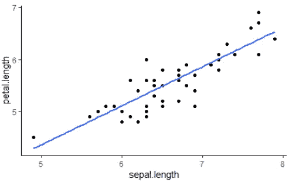
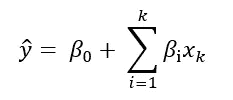
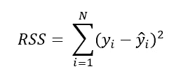

# 关于线性回归要知道的 5 件事

> 原文：<https://medium.com/geekculture/5-things-to-know-about-linear-regression-2843afc0454a?source=collection_archive---------1----------------------->

## 复杂应用程序的简单模型

在我们开始讨论线性回归之前，你可能还记得我们最近讨论过高级的[机器学习技术](https://www.megaputer.com/choosing-machine-learning-models/)，例如[神经网络](https://www.megaputer.com/2019-news-neural-networks/)和支持向量机，但是这些并不总是对数据建模最合适的工具。机器学习模型庞大、复杂，几乎无法解释。虽然它们有很大的能力，有时是解决困难问题的唯一办法，但它们的缺点可能很大，这取决于我们的目标是什么。此外，通常情况下，我们希望了解我们的模型，或者对它们的有效性有一些度量。

例如，物理学家的目标可能是理解他们的粒子相互作用模型。如果他们创建一个神经网络来做这件事，我们可能会在系统中有低误差，但我们人类对自然规律的理解不会更好。类似地，经济学家可能更关心理解选举中的政治不确定性、公共政策中的不确定性和金融市场中的不确定性之间的一般关系，而不是创建一个复杂的互动系统来防止可以应用于治理、竞选或市场交易的一般化。因此，目前，让我们从机器学习的巨大丛林回到传统统计模型的驯服和舒适的社区，其中第一个将是线性回归。

# 什么是线性回归？

线性回归是最简单的统计模型之一，但是不要让它欺骗了你。因为简单，所以它是一个强大的工具。了解线性回归从名字开始。回归分析只是一种估计因变量和一组自变量之间关系的方法。例如，给定一组关于童年测量的数据，如身高、体重、性别等，我们能否估计这些变量与因变量(即孩子成年后的身高)之间的关系？

为什么叫“回归？”大部分来自传统。这个术语起源于许多世纪前，一直沿用至今。你可能听说过“回归均值”这个概念其概念是数据可能偏离预期的“平均值”,但是经过多次观察，它将回复或“回归”到该预期值。例如，一个高个子很可能有同样高的孩子，但可能没那么高。他们很可能会“回归”平均身高，而不是比他们的父母高。

请注意，回归是对数字关系进行建模。回归的输出是一个数字。这与分类不同，分类输出输入数据的类或标签。名字的第二部分是线性，指的是在线性回归中，我们只关心*线性*关系；我们的模型将会是所有事物的总和。

让我们考虑一个简单的例子。使用传统的 Iris 数据集，检查 Virginica 品种花的萼片长度与其花瓣长度之间的关系。线性回归试图将花瓣长度和萼片长度之间的相互作用建模为最佳拟合线。

从下面的图表中，我们可以看到数据中有一个总体的线性趋势。随着萼片长度的增加，花瓣长度也以类似的方式增加。线性回归产生一个线性方程，它是系统的模型。

我们可以看到回归的结果和数据一起绘制出来。这条线是我们的模型对每个萼片长度的花瓣长度的预测。当然，会有一些误差，因为数据中存在一些可变性，但是拟合通常很好地描述了关系。这种关系的等式是:

这是一个简单的、可解释的形式，对于分析和理解非常有用。从等式中，我们可以说，对于每增加一厘米的萼片长度，我们通常观察到在海滨鸢尾中大约增加 0.75 厘米的花瓣长度。

# 线性模型是如何计算的？

现在你可能已经猜到了线性回归的一般形式。我们的线性模型是:

我们对目标变量的估计表示为偏差项或截距加上输入变量的加权和。这是一个很好的线性形式。但是给定一些数据，我们怎样才能创建一个这样的模型呢？有无限多条线可供选择，那么哪一条最好呢？我们需要一种方法来衡量我们的模型有多好。这就是误差或“残差”概念发挥作用的地方。对于每个数据点，我们想要测量实际数据离我们的预测有多远。有几种方法可以解决这个问题，其中最常用的是残差平方和(RSS)。RSS 是残差平方和。残差是目标变量的真实值和预测值之间的差值。经常有人问，为什么我们不把这些术语称为“误差”而称为“残差”，特别是因为术语“残差”似乎更令人困惑，并且是使用一个花哨的数学术语来显得重要的借口。不幸的是，完整的回答和解释超出了本文的范围，但简而言之，原因是这种差异实际上并不是“错误”在创建模型时，我们充分意识到目标变量的分布存在一些差异。完整的线性模型方程包括一个噪声项，它是一个均值为 0 的高斯函数，具有模型估计的一些标准偏差。因此，“残差”是测量这种噪声，这是在去除我们的模型的确定性方面之后剩下的。所以，我们的 RSS 是:

既然我们有了模型执行情况的度量，我们就可以比较各行来选择最佳的一行。RSS 是一种测量距离我们的线有多少可变性的方法。最佳行将具有最少的 RSS 度量。因此，要选择最佳拟合线，我们必须找到这条最小线。这听起来像是一项艰巨的任务。我们怎样才能找到那条线呢？我们不能一条一条地测试每一行，因为有无限多的行需要考虑！答案是我们使用一种叫做普通最小二乘法的方法。现在在这一点上，我们将简单地挥挥手，并向你们保证微积分和一些线性代数将从算法上为我们解决这个问题，我们不需要担心它。

# 如何评估线性模型

我们已经看到了如何使用残差方程的最小化来计算线性模型的项，但这并不是模型构建过程的结束。与网络中有数百万个模糊参数的机器学习模型不同，线性回归模型的每个参数都可以被询问和分析。回归模型产生了几个可供使用的指标。首先，有 R2 测度或决定系数。R2 衡量模型解释了数据中的多少差异。值为 1 表示模型完美地描述了数据，而值为. 5 表示模型中仅解释了数据中 50%的差异。其余的下落不明。显然，R2 值越接近 1 越好。

此外，对于我们模型中的每个系数项，我们可以计算 p 值，以确定该估计是否具有统计显著性。如果我们遇到较大的 p 值，我们可能会质疑将该变量纳入模型是否是一个好主意。在这些情况下，变量可能没有用，我们可以在丢弃它后重试该模型。一种技术是通过一次添加一个变量来逐步构建模型，并测试添加下一个变量是否会在统计上显著提高模型性能。这种技术被称为方差分析。测试我们模型的另一个方法是分析残差的分布。理想情况下，它们应该具有正态分布，并且是同质的；也就是说，它们在模型的拟合值和模型的输入值之间保持大致相同的方差。我们希望残差在我们的数据中表现相同，因为这表明表现正常。我们不希望模型在某些方面突然变得更糟，或者变得不可预测。

虽然所有这些分析再次超出了这里介绍的范围，但重要的是要理解，由于线性回归模型的简单性，这些类型的稳健、可解释和易于理解的统计分析是可能的。我们可以用对更复杂的结构来说不可能的方式来密切熟悉我们的线性模型。

# 线性模型中存在哪些灵活性？

线性回归最大的弱点是只能对直接的线性关系建模。但是世界上还有更多类型的关系是我们想要模拟的。幸运的是，有非常简单的方法将非线性注入线性回归。第一个是对我们的数据的**转换。不是直接对我们的变量建模，而是首先对它们进行变换，比如取值的对数或其他幂变换。我们的值之间可能没有直接的线性关系，但是它们的对数之间可能有线性关系。这种模型可以解释为因变量增加 1%意味着目标变量增加 X%。**

另一个技巧是**将变量的平方项**也包含到模型中。我们简单地平方我们的数据，并把这个平方作为另一个独立的变量。还有一种技术是使用所谓的**交互**。这些被视为现有变量的组合。例如，如果我们将性别和身高纳入我们的模型，我们可以包括一个术语，*性别:身高*，这只是两者的组合。本质上，这创建了两个新变量，称为*男性:身高*，对于男性来说与身高相同，否则为 0，对于*女性来说也是如此:身高*。这个交互项可以模拟男性身高和女性身高的独立影响。也许身高这个术语对女性的影响比男性更大？

# 线性回归模型的威力

线性回归模型由于其稳健性和简单性，在各个领域都非常流行。由于变换和其他技术，线性回归模型可以对数据中的各种依赖关系进行建模。因为它们的形式是明确定义的，与神经网络不同，它们具有统计属性，我们可以分析这些属性来比较模型、做出解释并得出重要信息。线性回归不仅对预测有用，它还可以做大多数机器学习模型不能做的事情——描述系统。如果您有一个要建模的数值、一个相对较短的独立变量列表，并且希望了解您创建的模型，线性回归通常应该是您的首选。

*原载于 2020 年 4 月 29 日 https://www.megaputer.com***。**