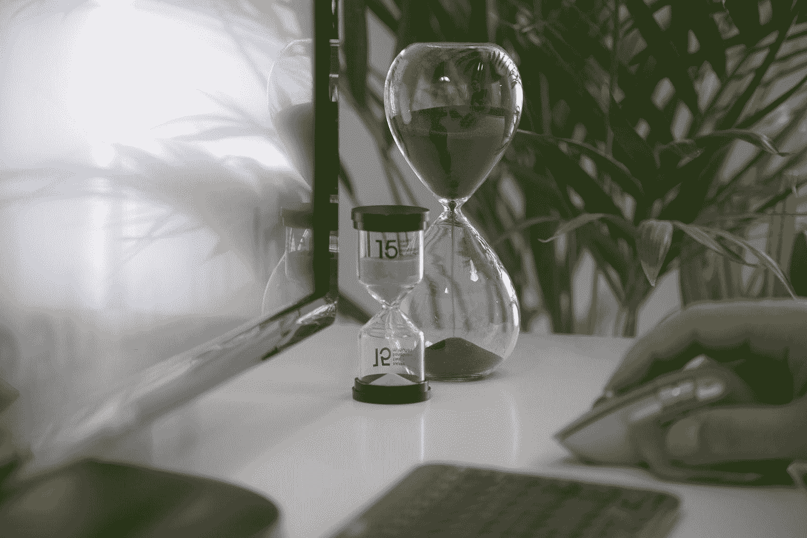

# 测试时间估计的 5 种方法

> 原文：<https://medium.com/geekculture/5-ways-for-testing-time-estimation-ed113f5d1998?source=collection_archive---------13----------------------->

Photo by [Kevin Ku](https://unsplash.com/@ikukevk?utm_source=medium&utm_medium=referral) on [Unsplash](https://unsplash.com?utm_source=medium&utm_medium=referral)

根据我的观察，我引出了几种检验时间估计的方法:

*   基于知识；
*   基于测试会话；
*   基于测试类型；
*   基于专业知识；
*   基于错误修正。

让我们深入了解每一个问题。

## 基于知识

例如，熟悉一个产品一个月的测试人员会给出一个与熟悉该产品一年的测试人员不同的评估，仅仅因为第二个测试人员知道更多的细节和缺陷。第二个测试者比第一个测试者潜得更深。当然，可能会有这样的情况，当第二个测试者患有 batophobia，并穿着水翼在水面上不停地游泳。但是让我们假设我们这里有一个勇敢的测试者。

## **基于测试会话**

**烂回答:**需要**一天/两天/一周。**非常精确，对吗？除非你有时间机器，否则你不在未来。也许你可能需要更多的时间，因为你偶然发现了不可预测的情况或者其他一些影响测试时间的外部原因。

测试人员在实际测试之前有大量的活动:

1.  阅读文档(如果有)。
2.  与团队交流，了解产品。
3.  为测试做好一切准备(测试数据、测试工具、测试用例、环境配置、获取测试所需的服务等)。).
4.  进行第一轮测试，并为缺陷创建标签。
5.  等待修复，进行第二轮测试，关闭缺陷，创建新的缺陷。
6.  重复第 4 步和第 5 步，直到产品看起来漂亮干净。穿着西装打着领带。

让我们假设我们只需要给经理一个纯粹的测试评估(步骤 4，5，6)。即使在这里，测试过程也是漫长的。想象一下，我们有一个可以在两天内测试的功能。这并不意味着，你坐在桌前，连续测试两天。你可以休息一下，因为这样你的测试效率会更高。

Photo by [Fakurian Design](https://unsplash.com/@fakurian?utm_source=medium&utm_medium=referral) on [Unsplash](https://unsplash.com?utm_source=medium&utm_medium=referral)

在每一轮测试中，你可能会有几个环节(30 分钟、1 小时、90 分钟等等。).在这些测试会议之间，你还有其他活动(聊天、与队友交谈、公司会议、午餐、茶歇、休息等。).最终，两天的测试可能会延长到一周之内。仅仅连续两天做测试是不可能达到同样的效果的。你需要那些时间间隙。

现在，我应该向经理传达什么样的评估？两天还是五天？纯粹的测试需要两天时间，但是它必须在时间上延伸，以使它更加有效和多产。无论你说什么，你的经理应该知道你的测试方法，你将能够捍卫你的立场。

**明智的回答:**如果没有错误，我需要这段时间来测试这项功能。根据产品的原始程度，测试、错误报告和后续测试的时间会有所不同。我们都知道，没有没有 bug 的产品。即使你认为你发现了所有的 bug，也不代表这是真的。在任何情况下，在第一轮测试中发现的缺陷列表(或者任何轮数)都会推迟生产就绪的日期。所以，说出你需要的时间范围，而不是具体的时间量。

## **基于测试类型**

您应用的测试类型对测试时间估计有直接的影响。时间范围的变化取决于它有多深，或者它将是什么样的测试。要么是 UI 测试，要么是 API 测试。冒烟、验收或回归测试。

例如，如果您的测试看起来像探索水面(只是为了了解水温)，这将花费很少的时间。如果你选择穿着游泳衣背着潜水筒进行深潜，可能需要更长的时间来更彻底地探索一个特定的地方。

它需要更多的准备，以便能够通过以水泡速度移动来更缓慢和细致地分析周围环境。也许你需要换几次潜水缸，或者你需要更多的人来调查。

Photo by [Vlad Tchompalov](https://unsplash.com/@tchompalov?utm_source=medium&utm_medium=referral) on [Unsplash](https://unsplash.com?utm_source=medium&utm_medium=referral)

## **基于专长**

如果你是一个 API 测试专家，那么执行时间会比一个对该测试类型了解较少的测试人员少。安全、性能测试或任何其他类型的测试也是如此。T 型专家的概念变得越来越流行。但是不要期望工作能像专家做的那样快。确保任务将由估计它的同一个人来完成。否则，如果评估是由其他人给出的(比如你的 QA 主管)，他应该考虑团队中每个 QA 工程师的专业水平。

Photo by [Austin Distel](https://unsplash.com/@austindistel?utm_source=medium&utm_medium=referral) on [Unsplash](https://unsplash.com?utm_source=medium&utm_medium=referral)

无论估计值是多少，我们都需要记住一点:

*   始终保持一个时间缓冲(20%-30%)；
*   准备好测试可以更快地完成(经理们会激动不已)；
*   准备好测试可能会超出估计(但这是另一个话题)。

## 基于错误修复

我想单独分享测试会议方法(测试迭代)的第 6 步。测试人员的构建例程将如下所示:

*   你得到第一个版本*来测试它；*
*   在*第一次测试会话*之后，您报告了一些问题；
*   然后，你得到*第二个构建*；
*   您验证错误修复并继续第二个测试会话(可能，您会再次报告一些缺陷)。

还会有几轮测试，直到产品看起来漂亮干净，穿着西装打着领带。

Photo by [Sara Kurfeß](https://unsplash.com/@stereophototyp?utm_source=medium&utm_medium=referral) on [Unsplash](https://unsplash.com?utm_source=medium&utm_medium=referral)

正如你可能从这个例程中看到的，我们修复了时间间隙。你**无法**估计和**预测**每个 bug 修复的时间。因此，您无法预测在您的第一次测试会话之后，您何时会得到一个新的构建。即使你是一个测试评估专家，并且你确切地知道你可能需要多少时间来完成测试，你也不能预测测试会因为 bugfix 而延迟多久。当然，您可以用其他活动来填补构建等待时间。然而，在一天结束时，我们都希望看到一些进展，并最终看到可见的结果。但是当这一天到来的时候？

> 您无法预测测试会因为修复错误而延迟多久。

我们需要区分测试时间和稳定构建的时间。构建稳定化的时间会有所不同，整个团队都要为此负责。在实践中，每个团队成员投入到他/她的评估中的时间缓冲应该部分地代表构建稳定时间。考虑到敏捷世界中疯狂的发布时间表，主要问题是团队**能有多少时间**。

我敢打赌，有其他方法来做精确或狭窄的估计。我把那些从我的角度来看值得关注的内容包括在内。如果你有任何其他有用的技术，我很乐意在评论区阅读。