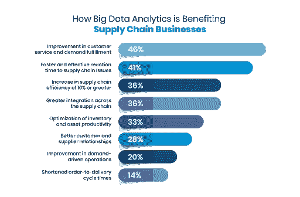

# 物流应用程序必须具备的 7 个最佳功能

> 原文：<https://medium.com/geekculture/7-best-features-that-you-must-have-in-your-logistics-app-f7c032b7d9fd?source=collection_archive---------9----------------------->

供应链管理软件行业的预计收入预计在 2022 年为[185.7 亿美元，预计增长率为 7.9%。物流、供应链和运输应用程序开发服务正在占据行业的中心位置。如今，供应链部门的流程简化和工作流管理已经成为公司的一个重要优先事项。](https://www.statista.com/outlook/tmo/software/enterprise-software/supply-chain-management-software/worldwide)

定制物流应用程序开发使公司能够利用可以跟踪、管理和监控整个供应链的解决方案。从托运预订到最终交付站，它使物流提供商能够完全跟踪整个过程。

通过[人工智能支持的物流应用](https://www.botreetechnologies.com/artificial-intelligence-solutions)，公司也可以减少高需求带来的压力。该解决方案分析供应和需求，以确保库存始终可用。通过提供实时数据和见解，它还有助于不同利益相关者之间的协作。数据分析现在在简化供应链运营中发挥着至关重要的作用。

然而，物流应用程序开发人员可以在解决方案中加入几个功能。虽然常见的功能很容易实现，但是一些高级的功能确实可以将应用程序提升到一个新的水平。

本文将展示企业可以考虑纳入运输和物流管理应用程序开发的 7 大特性。

# 物流应用的 7 个最佳特性

随着客户需求的发展，供应链也必须发展。物流服务提供商现在正在数字化他们的渠道和系统，以实现更顺畅的体验——从采购原材料到产品的最终交付。

这种发展需要几个特性来重新定位应用程序，以满足不断变化的客户需求。以下是企业在[招聘物流应用开发服务](https://www.botreetechnologies.com/logistics-app-development)时应该考虑的 7 个最佳特征:

**1)预先计划好的路线**

*   通常，司机不知道他们需要走的最佳路线。它导致交货延迟，这可能会扰乱供应链。这也增加了燃料成本，甚至可能导致客户不满。
*   对此的最佳解决方案是在定制物流应用程序开发过程中加入预先规划路线的功能。通过给司机分配路线，他们不会感到困惑，并按时交付产品。
*   这还可以让他们消除走计划外路线带来的猜测。这些路线上可能有交通，地图可以很容易地显示给他们。

**2) GPS 跟踪**

*   如今，GPS 已经成为物流跟踪应用程序开发中必不可少的工具。没有任何跟踪，就没有关于交货时间和物流系统管理方式的数据。
*   GPS 追踪是针对司机和产品的完整解决方案。它展示了车辆的实际位置、每个位置的产品跟踪(如果有几个位置要卸货)、司机正在走的路线，以及监控每辆车的位置。
*   当公司需要找到准确的交货时间时，GPS 跟踪有助于评估到达目的地需要多长时间。

**3)车费计算器**

*   在[物流应用开发](https://www.botreetechnologies.com/blog/logistics-app-development-cost-features-and-development/)中要考虑的最重要的功能之一是费用计算器。很多时候，快递公司忘记了这个功能，使用单独的机器来完成这个过程。它涉及大量的时间和包裹管理不善。
*   拥有一个费用计算器将使公司能够称重包裹，并计算出递送包裹的费用。它会计算几个参数，如车辆交付成本、时间成本、目的地地址、取货等。
*   费用计算器很重要，因为它不需要额外的系统来确定每次递送的费用。对于负担不起单独定价系统的小型企业来说，这是一个很好的功能。

**4)实时通知**

*   在当今这个充满活力的世界里，公司需要时刻准备着做出决策。虽然车辆跟踪是必不可少的，但他们还需要每一项活动的实时警报和通知。它简化了整个跟踪和监控过程。
*   任何构建物流解决方案的[企业软件开发公司](https://www.botreetechnologies.com/software-development-company)都应该包含实时通知。关于车辆状态、包裹状态、不同交付位置、紧急情况、错误交付、客户不可用等的警报。，可以帮助公司更好地管理动态。
*   实时的运输进度使交付合作伙伴能够了解不同阶段的实际情况，而不仅仅是猜测包裹发生了什么。

**5)常规驱动程序日志**

*   司机是物流业务最重要的方面。它们决定了整个流程的交付速度和效率。如果不跟踪司机的状态，公司总是不知道包裹出现任何问题的具体原因。
*   在物流和卡车应用程序开发期间，拥有一个司机可以定期登录的功能非常重要。它提供了关于司机工作时间、送货次数、每次送货花费的时间等完整信息。
*   其结果是根据对司机日志的分析，对每次交付进行适当的管理。一旦流程实现标准化和自动化，还将减少人工干预。

**6)附近设施**

*   这是许多公司回避的一个重要特征。如果司机在附近找不到加油站，他们就会被困住了。如果他们要过夜，需要附近有公司的安全仓库怎么办？万一引擎出了问题，他们如何找到修理厂？
*   考虑到司机的便利，每个[物流配送应用程序开发服务提供商](https://www.ezpostings.com/things-to-consider-when-hiring-a-web-development-company/)都应该建立一个展示附近设施的功能。它必须显示附近的车库和机械师，仓库，加油站，或司机需要的任何其他援助中心。
*   当紧急情况发生时，或者需要任何设施时，司机不必东奔西跑。他们只需检查应用程序并找到附近的最佳解决方案。

**7)聊天机器人支持**

*   每个物流应用程序开发公司都建议在供应链解决方案中加入聊天机器人。如果客户和司机在送货过程中遇到任何问题，他们将如何相互联系？
*   聊天机器人将提供常见问题的答案，这将减轻支持人员的负担。一旦送货上门，顾客还可以向聊天机器人反馈。
*   然而，聊天机器人应该提供离线支持的选项，以防在线解决不了问题。物理和数字支持的集成是物流应用的最佳选择。

# 包扎

对物流和运输应用程序开发服务的需求很大。随着供应链行业走向数字化，公司专注于实现自身的数字化。物流应用是服务客户并为他们提供卓越交付体验的第一步，也是最重要的一步。

*原载于*[*https://www . code mentor . io*](https://www.codementor.io/@parthbarot/7-best-features-that-you-must-have-in-your-logistics-app-1pzb5e1ss4)*。*