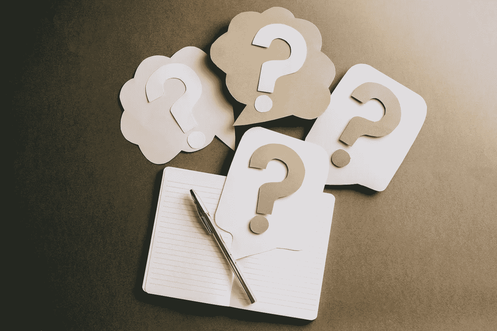

# 投资加密货币前要问自己的 7 个基本问题

> 原文：<https://medium.com/geekculture/7-essential-questions-to-ask-yourself-before-investing-in-cryptocurrencies-69dcf6371e16?source=collection_archive---------15----------------------->

## 做好这件事

Photo created by [Olya Kobruseva](https://www.pexels.com/ro-ro/@olyakobruseva?utm_content=attributionCopyText&utm_medium=referral&utm_source=pexels), from [Pexels](https://www.pexels.com/ro-ro/fotografie/papetarie-conceptual-semnul-intrebarii-ambarca-iunile-de-hartie-5428830/?utm_content=attributionCopyText&utm_medium=referral&utm_source=pexels)

投资加密货币可能会有回报，但仅限于那些知道自己在做什么的人。这种类型的投资风险很高，但如果你在开始投资第一笔钱之前，先问自己以下几个重要问题，就可以将风险降到最低。

## 1.我是否具备不犯错误所需的知识？

如果你在投资前没有被告知，犯错可能是学习过程的一部分。然而，更明智的做法是，在考虑投资之前，尽可能多地了解区块链、加密货币、金融投资、交易和其他相关主题。

在我决定投资比特币、Cardano、VeChain、Stellar 或柴犬等项目之前，我对它们都做了大量研究。我还加入了一些脸书团体，人们在那里谈论他们，我试图想象他们会对世界产生什么影响，以及他们成长和受欢迎背后的原因是什么。这些知识帮助我避免了错误，从而避免了损失。

## 2.我是否只投资了我能承受损失的金额？

投资加密领域最重要的一点是，你用于投资的金额不应该超过你能够承受的损失。这意味着，你投资的金额应该是这样一个金额，如果你做了一个没有创意的投资，而你亏损了，你应该可以接受。

举个例子，我一开始投资不超过 100 美元，但幸运的是几个月后我的投资翻了一番。即使我损失了这笔钱，也不会让我倾家荡产。尽管如此，凭借我积累的知识，我几乎可以肯定我的钱是安全的，它会成倍增长。

这些是我在这个牛市中开始的项目:

 [## 2021 年及以后要投资的 3 个重要加密项目

### 他们肯定会改变世界

medium.com](/geekculture/3-serious-crypto-projects-to-invest-in-2021-and-beyond-6214073170c6) 

## 3.我对我打算投资的项目了解多少？

我看到今天很多人投资于他们一无所知的加密项目。他们不是阅读一些关于这些项目的资料，而是进入这些脸书团体，不停地问:“这个项目值得投资吗，现在是时候吗？”等等。我对这些人的问题是:无意冒犯，但你怎么能投资于你一无所知的东西呢？

关于这个主题的更多内容，请见本文:

 [## 一些新手密码爱好者的懒惰暴露无遗

### 他们在加密组上问的 4 个常见问题

medium.com](/geekculture/the-laziness-of-novice-crypto-enthusiasts-exposed-8da2d5a800ca) 

## 4.我用来投资的平台适合我吗，可靠吗？

当你选择投资的平台时，你应该去大家都在谈论的平台，或者你通过研究发现的，其他用户认为可靠的平台。它也应该是一个你理解和喜欢的布局，否则，在开始的时候，可能会更难合作。

我一开始用的是[比特币基地](https://www.coinbase.com/)然后我换成了 [Bitpanda](https://www.bitpanda.com/) ，这是一家总部在欧洲国家的公司，就像我的国家一样。我避开了其他平台，包括币安，因为我不喜欢他们的设计。你可以选择任何你认为更适合自己需要的东西。

## 5.这是投资的正确时机还是我应该等待？

如果你问自己这个问题，你就已经决定投入资金了。你只是不知道什么时候是正确的时间，你必须研究图表，并了解加密货币的周期:牛市(价格普遍上涨)和熊市(价格普遍下跌)。

投资的最佳时机是在价格低的时候，然后在价格高的时候卖出，或者你可以有一个长期的方法，持有你的收购，直到价格上涨到足够高，以赚取更多的利润。

我写过一篇与此相关的有趣文章:

 [## 加密货币投资的正确和错误方法

### 不耐烦对耐心

medium.com](/geekculture/the-wrong-and-right-approaches-for-investments-in-cryptocurrencies-d6d08dad8871) 

## 6.我有一个安全的钱包来存储我的加密货币吗？

如果您使用交易所(例如。比特币基地、币安、Bitpanda)，你的投资将保存在他们的钱包里，这在一定程度上是安全的，但他们被黑客攻破的可能性非常小，你也必须小心不要打开可疑的电子邮件。作为替代，你也可以使用网络钱包，比如 MetaMask，它只是一个浏览器扩展。

最安全的钱包是实体钱包，也叫硬件钱包，比如账本 Nano。对于这样的设备，密钥保存在上面，这意味着黑客几乎不可能窃取它。

我还没有 Ledger Nano，所以我仍然使用 exchange 钱包和 web 钱包，所以对于初学者来说，它们很棒。

## 7.当我兑换成法定货币时，我知道我欠国家的税吗？

申报从加密货币获得的利润是每个加密货币用户和投资者的唯一责任，通常通过计算提取的总金额和投资金额之间的差额来完成。

你获得利润，例如，在我的国家，你需要给国家 10%。在其他国家，可能会有点不同。

你准备好投资加密货币了吗？如果你还没有问自己这 7 个问题，那么你可能还没有准备好。放心吧！有了耐心，你会成为一个好的投资者，但你必须先有知识。