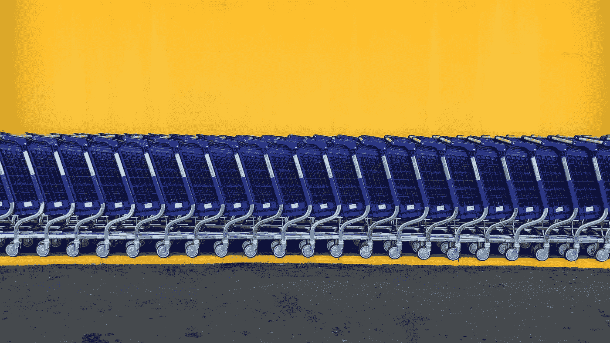
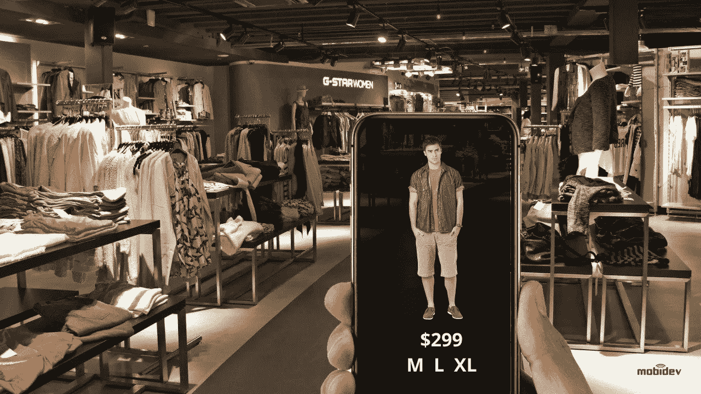

# 7 项零售技术创新将在 2023 年重振商场

> 原文：<https://medium.com/geekculture/7-retail-technology-innovations-reviving-the-stores-in-2023-6da4792dfb16?source=collection_archive---------6----------------------->

先进的技术有助于零售企业完善其客户服务的各个方面。这适用于大公司和小公司。这些技术可能会直接影响消费者，也可能会提高零售团队的效率。最重要的是，为问题提供新的创新解决方案的企业可以脱颖而出，获得更多利润。让我们来谈谈将在 2023 年塑造业务成果的七大零售技术趋势。

# 趋势 1:弥合线上和线下购物体验之间的差距

除了在实体店销售产品之外，许多店面现在还提供在线购买、店内提货(BOPIS)服务、当天送达和在线送货服务。有了这么多订购商品的新方法，企业需要以更智能的方式实现销售点系统。

*   当客人在线订购产品时，会如何影响数据库中商店的销售数量？
*   如果产品因提货订单而暂停，是否会减少销售区的数量？

这些都是现代 POS 系统必须能够回答的问题。这一点的关键不仅仅是拥有处理在线和店内购物的系统。这将需要一个与其他技术相集成的统一、互联的系统。在为零售企业创建[下一代 PoS 系统](https://mobidev.biz/case-studies/pos-application-development)时，软件工程师试图克服的一些最大障碍是整合所有现场位置和在线商店的在线和离线交易、库存和促销。

弥合线上和线下购物体验之间的差距的一个关键因素是支付。能够接受各种数字支付方式增加了客户体验的便利性和一致性。接受 buy now pay later，二维码支付，类似 Google Pay 和 Apple Pay 的虚拟支付，甚至加密货币都可以为线上线下的购物者提供更好的可访问性。这就是为什么零售业务与金融科技创新密切相关。金融科技公司提供的解决方案越实惠、越有效，零售企业就越容易组织在线和线下商店在金融方面的顺利运营。

# 趋势 2:通过室内定位简化商店导航

近年来，室内定位系统(IPS)已经成为一种趋势，用于帮助用户在 GPS 不适用的室内区域导航。然而，这项技术的应用远比第一眼看到的要多。

从表面上看，室内导航对用户导航有很大的潜力。商店、办公楼、机场和医院已经开始意识到这一点。香港国际机场在他们的[“HKG 我的航班”](https://www.hkairport-technovation.com/en/hkg-my-flight-mobile-app.html)移动应用中使用了这项技术。在零售行业，Lowes 和 Target 也在利用这项技术。

# 在商场实施 IPS 系统

为您的企业实施店内导航解决方案可能是一项具有挑战性的任务。第一步是硬件。无论是视觉标记、蓝牙信标、Wi-Fi RTT 还是超宽带(UWB ),拥有合适的基础设施至关重要。例如，Target 选择在许多地方实施[蓝牙物联网照明系统](https://www.ledsmagazine.com/smart-lighting-iot/article/16700663/target-gives-the-goahead-on-iot-lights-at-half-its-stores)。当客人在商店里用手机上的目标应用程序购物时，他们可以访问地图，帮助他们找到自己在商店的位置，找到他们需要的商品。

这种特殊的解决方案将蓝牙信标放置在销售区上方的照明系统中。然而，基于商店的布局和大小，其他解决方案也是可能的，因为使用信标可能非常昂贵，并且提供的导航不够精确。基础设施建立之后，剩下的就是开发可以利用它的软件了。

IPS 系统的潜力远不止帮助客人购物。拥有关于顾客在商店哪里购物的数据有三个好处:有针对性的建议、跟踪顾客流量和商品跟踪。

# 目标交易

当客人使用商店的官方应用程序在商店的特定区域时，IPS 系统可以跟踪他们的位置，并在他们的智能手机上为他们提供有针对性的产品和交易建议。这可以提高顾客购物时的转化率。

# 客户流量数据

更深刻的是，关于购物者在商店中的位置的数据对于改善货架上产品的位置非常有用。它还有助于回答几个问题:

*   客人进店都去哪了？
*   他们是否倾向于更喜欢商店中的某个位置？
*   店内是否有顾客倾向于避开的位置？

所有这些问题都可以通过 IPS 跟踪来回答。当然，匿名数据对于保护用户隐私很重要，但这些分析对于帮助企业主决定在哪里放置某些产品可能至关重要。事实上，当与供应商就他们应该支付多少费用来将他们的产品包含在商店的特别高流量区域中进行谈判时，该数据可能是有价值的筹码。

# 项目跟踪

用于在零售点追踪产品的 RFID 技术是有用的，但是是短程的。随着这些技术的改进，IPS 可以提供关于销售场所产品位置的更详细的数据。这不仅有助于改善资产保护工作，还可以更容易地将被移动的项目返回到正确的位置。

随着时间的推移，物联网设备变得越来越小，越来越便宜，但现在，如果要实施的话，物联网技术可能需要局限于一些高价值的物品。物业经理也可以使用这项技术来跟踪工作设备，如笔记本电脑和移动电脑。

对于订单履行等任务，零售员工可以使用他们的工作设备和 IPS 地图来查找商品在商店中的位置。如果该项目设置了 IPS 跟踪，他们可以转而导航到该项目。这在项目被错误地从其原始位置移走的情况下是有用的。

# 趋势#3:利用增强现实改变客户和员工体验

多年来，增强现实一直是零售业的重要组成部分。然而，脸书更名为 Meta 加剧了增强现实的重要性。不管你对元宇宙 AR 的未来有什么看法，毫无疑问，企业正在为客户提供更加身临其境和数字一致的体验。这至少为企业提供了许多机会，以新的、有价值的方式吸引受众。

提供这些沉浸式体验的几条途径包括虚拟试穿解决方案、增强现实驱动的室内导航以及其他应用。这是弥合数字电子商务店面和实体购物之间差距的关键技术之一。

# 买之前先试试

对零售业中的数字客户有帮助的 AR 的一些最有用的应用是“先试后买”应用。这方面最好的例子之一是[虚拟试穿技术](https://mobidev.biz/blog/ar-ai-technologies-virtual-fitting-room-development)。通过使用 AR 技术，购物者可以看到自己试穿各种产品时的样子。同样，他们也可以看到其他种类的产品是什么样子的，比如家具。虚拟试穿技术已经被丝芙兰、塔吉特百货、宜家等商店采用。

事实上，宜家的这个版本让你做的不仅仅是查看家具的尺寸和形状。Ikea Studio 可以使用 iPhones 上独特的激光雷达技术来显示房间、尺寸、窗户、门口等，以前所未有的方式可视化室内设计。

# AR 导航

虽然室内定位已经是我们讨论的一种趋势，但当与 AR 结合时，它可以进一步丰富客户和员工的体验。增强现实技术驱动的室内导航可以帮助购物者通过跟随手机屏幕上的指示找到他们在商店里需要的物品。如果实施得当，这对于购物者来说非常有吸引力，并且可以提供更多的机会在屏幕上向顾客展示有针对性的建议。

AR 导航也可以帮助零售员工。Zebra 的 TC52、TC57 和 TC77 便携式电脑是业内一些最受工人欢迎的设备，支持 ARCore。由于这些设备可以使用它们的摄像头进行 AR 导航，订单执行工人只需在他们的屏幕上寻找方向，就可以找到他们正在寻找的通道。

# 帮助零售员工完成其他任务

增强现实有助于零售人员在货架搭建之前对其进行可视化。通过使用货架图作为基础，启用 AR 的企业设备可以在销售场所显示 3D 货架图，以作为设置过程的指南。这可以使工人更容易将钉子、架子和固定装置放置在合适的位置。

增强现实也可以帮助工人识别货架的问题。结合制造业使用的基于人工智能的[物体检测技术](https://mobidev.biz/blog/object-detection-small-datasets-use-cases-machine-learning)，工人可以将他们设备的摄像头举到架子上，找到需要改进的地方。通过将货架与其对应的货架图进行比较，AR 渲染可以向工作人员显示货架的哪些部分与货架图不对齐。这可能是不合适的产品、不正确分区的物品，甚至是受损产品的标识。

# 趋势#4:人工智能智能商店自动化

在之前的每一个趋势中，人工智能都以某种方式发挥了作用。比如现代 AI 发力 AR 场景分析。然而，AI 在零售业中可以提供比这更多的好处。需求预测、库存管理和其他类型的消费者行为分析都使用人工智能。

# 自助结账的未来

由于人工智能和物联网技术的创新，自助结账变得比以往任何时候都更先进。随着传感器阵列的发展，企业可以选择为客户实现高度自动化的结账流程。这使得顾客购物更加方便。

亚马逊更进一步，推出了由 Just Walk Out 支持的 Amazon Go 杂货店模型商店。该项目使用了计算机视觉、传感器融合和深度学习。商店丰富的摄像头和物联网传感器网络可以检测消费者何时将商品从货架上取下并放入购物车。当客人离开商店时，系统会从他们的信用卡中扣除他们所购物品的费用。

这不仅需要深入了解顾客在购物车中放了什么，还需要了解商品在商店中的位置。如果一件商品从货架上移走，系统必须仍然能够跟踪它手头有多少。

然而，并不是每个企业都像亚马逊一样大。为您的商店实施先进的自助结账解决方案可能会很困难。幸运的是，基于人工智能的自助结账技术是可扩展的。自动售货机可以结合这项技术。例如，客户可以打开指定的冰箱并从中取出物品。关上门后，机器可以自动为他们的卡充值。这使得小型企业更容易获得无缝体验。

# 由人工智能驱动的库存管理

计算机和丰富的数据库驱动着 2023 年的零售业。然而，这些系统的复杂性导致了许多由错误引起的低效率。零售工人可能会发现系统中某些 SKU 的销售区数量不正确。这也导致了像密室定位精度这样的问题。解决这些问题对于企业节省时间和金钱至关重要。

人工智能可以通过几种不同的方法帮助我们更有效地管理这些库存。例如，人工智能可以分析消费者的支出，以预测某些类型的商品何时更有可能在销售大厅流动。这可能会促使系统要求对某些领域进行手动审核，而不是对其他领域进行审核。虽然审计整个商店是一项具有挑战性的任务，但只审计需要注意的区域要有效得多。

如果更先进的摄像头网络不是解决方案，也许这项工作可以手动完成，同时仍然使用[机器学习算法。](https://mobidev.biz/blog/5-essential-machine-learning-techniques)零售工人可以用他们的设备给每个货架区拍照，而不是一个接一个地检查货架上的空位。将图像与具有物体识别功能的平面图进行比较，深度学习软件可以加快这一过程。这将允许系统查看丢失了哪些项目。然而，这个系统需要仔细的分区。这种方法也可能无法检测数量，因为项目可能会相互阻碍。

# 消费者行为分析

之前，我们通过室内定位系统对商场内的客流量进行了分析。然而，分析消费者行为的潜力并不止于此。除了他们的消费习惯，我们还可以通过人工智能测量他们对花钱的兴趣以及他们的人口统计数据。这可以让企业更好地了解他们应该如何向受众进行营销。

到目前为止，重点一直是分析已经在商店的消费者，但如何吸引新的消费者呢？一家使用 Kimola 平台的商店决定利用人工智能分析的数据为足球迷改造一个位置。通过使用社交媒体账户作为数据的基础，该算法能够确定商店的最佳位置。因此，当他们为足球迷重新设计这家商店时，销售额增加了 210%。

这个想法也适用于电子商务。网上商店可以跟踪用户的行为。这包括他们的光标停留在什么项目上，他们在特定页面上花了多少时间，以及他们来自哪里。这种类型的信息是熟悉的任何网络营销使用谷歌分析。

然而，在这项技术的背后是一个强大的人工智能引擎，它可以比我们自己更快地搜索联系和趋势。

# 趋势 5:人工智能驱动的需求预测

这是世界上一些最大品牌使用的强大工具。需求预测有助于企业与客户建立信任。这使他们能够有效供应，为市场变化做好准备。这在灾难和紧急情况下尤其重要。在危机时期，供应可能会短缺。随着产品飞离货架，能够适应并获得高需求商品的商店能够繁荣发展。

亚马逊再次成为一家利用机器学习能力实现这一目的的公司的例子。这项技术还可以改善库存规划、客户和供应商的关系管理，以及物流、制造和营销。

需求预测导致更可持续的消费和生产。当需求预测更加准确时，就可以根据消费者的需求来生产和订购商品。

基于人工智能的需求预测方法比传统方法更加灵活和适应性更强。由于企业可以更快地实施机器学习，他们可以更好地跟踪客户需求趋势。随着客户行为的不断变化，您的企业对客户消费趋势的数据深感兴趣比以往任何时候都更加重要。分析这些数据以获得有意义的见解的技术是在市场中保持竞争优势的关键。

# 趋势 6:零售业中的机器人和自动化

与人工智能密切相关的是机器人技术的硬件。这有许多应用，例如交付、库存管理和客户服务。

# 自主交付

随着人工智能的进步，自动驾驶汽车也在进步。交付将在 2023 年发生变化，自主交付将成为新的规范。由 Tortoise 开发的 Safeway 手推车于去年推出，作为一种自动送货车辆。Serve Robotics，原名 Postmates X，也在为优步制造送货机器人。Grubhub 成功地向俄亥俄州立大学等大学校园推出了自主送餐机器人。该公司正在努力将其机器人送货扩展到其他校园。

企业也在探索用无人机进行零售送货。威瑞森和 UPS Flight Forward 正在努力利用 5G 技术来改善佛罗里达州的无人机送货。

# 客服机器人

零售企业也在探索用于客户服务的机器人。去年 1 月，现代推出了一款名为 [DAL-e](https://www.hyundai.news/uk/brand/hyundai-motor-group-introduces-advanced-humanoid-robot-dal-e/) 的机器人，它将在汽车展厅提供帮助。机器人可以问候顾客，并帮助他们找到满足他们需求的车辆。机器人还使用[面部识别](https://mobidev.biz/blog/custom-face-detection-recognition-software-development)和人工智能来检测顾客是否戴着口罩，并给他们适当的建议。

# 机器人库存管理

特殊的硬件有时可以帮助库存管理，而天花板和架子上安装的摄像机不能。像 [SmartSight](https://connect.zebra.com/smartsight) 这样的机器可以自动识别货架上错位的商品和销售区域的数量，并在某些商品快用完时提醒工人。

# 趋势 7:语音商务

随着 2023 年[人工智能的提高](https://mobidev.biz/blog/future-artificial-intelligence-technology-ai-trends)，自然语言处理(NLP)也在提高[。谷歌助手、Alexa 和 Siri 等智能助手在语音识别和响应能力方面变得越来越先进。他们在零售行业服务顾客的能力有了很大的提高。无论有没有屏幕，用你的声音从家里订购产品，都留下了许多有待探索的细微差别。](https://mobidev.biz/blog/natural-language-processing-nlp-use-cases-business)

到 2025 年，智能家居设备预计将在美国超过 7700 万个家庭中使用，这意味着这是一个企业可以利用的巨大机会。消费者家中的其他类型的物联网设备也可以证明是有价值的，例如具有增强现实功能的[智能镜子。](https://mobidev.biz/case-studies/smart-mirror-alexa-skills-development)这一过程中最重要的部分是确保这些设备不会打扰消费者，并且对消费者真正有帮助。

沃尔玛的语音订购是这项技术应用的一个显著例子。通过要求智能扬声器将产品添加到购物车中，他们可以完全通过语音下单。然后，沃尔玛的工作人员会把这些商品拿出来。

# 零售业技术的挑战和未来

随着颠覆影响零售业务，那些快速创新的企业将会茁壮成长。

# 捕捉和维护客户

在一个日益数字化的世界中，企业必须记住与客户进行丰富沟通和互动的价值。提供在线和面对面的沉浸式体验可以实现这一目标。

# 管理库存

由于 2023 年企业可以获得需求预测工具，管理库存变得比以往任何时候都更容易。然而，总会有挑战持续到未来。设定明确而集中的目标将有助于解决这些问题。

# 升级的问题是

随着零售业技术的进步，旧的 PoS 系统和库存管理解决方案等传统技术正在被取代。然而，在这些转变过程中，许多打嗝往往会阻碍这个过程。有时会有疏忽和不可预见的问题需要特别注意。

# 与供应商合作

将创新技术引入零售领域最重要的部分是企业和开发技术的供应商之间的关系。他们如何合作开发和维护解决方案决定了产品的成功，无论该技术是直接面向消费者还是首先帮助企业完成自己的任务。

# 未来会怎样

随着技术的发展，有许多新的利基市场等待货币化，并有机会利用。数字化转型和数据驱动的文化将继续扰乱无法适应快速变化的客户偏好、新技术和供应链的企业。这就是为什么零售公司必须为消费者提供一种他们觉得有吸引力、可及且有价值的体验。

率先与零售软件开发商就他们的需求和想法进行深思熟虑的讨论的企业，将成为未来消费者获得比以往更多信息的先行者。

作者:Liam Shorwell，作家，技术爱好者

由 [MobiDev](https://mobidev.biz/services/mobile-application-development) 移动开发负责人 [Andrew Makarov](https://mobidev.biz/our-team/andrew-makarov) 和[mobi dev](https://mobidev.biz/services/machine-learning-consulting)AI/ML 团队负责人[yeven Krasnokutsky](https://mobidev.biz/our-team/yevhen-krasnokutsky)审核。

*全文原载于*[*https://mobidev . biz*](https://mobidev.biz/blog/7-technology-trends-to-change-retail-industry)*，基于 mobi dev 技术研究。*