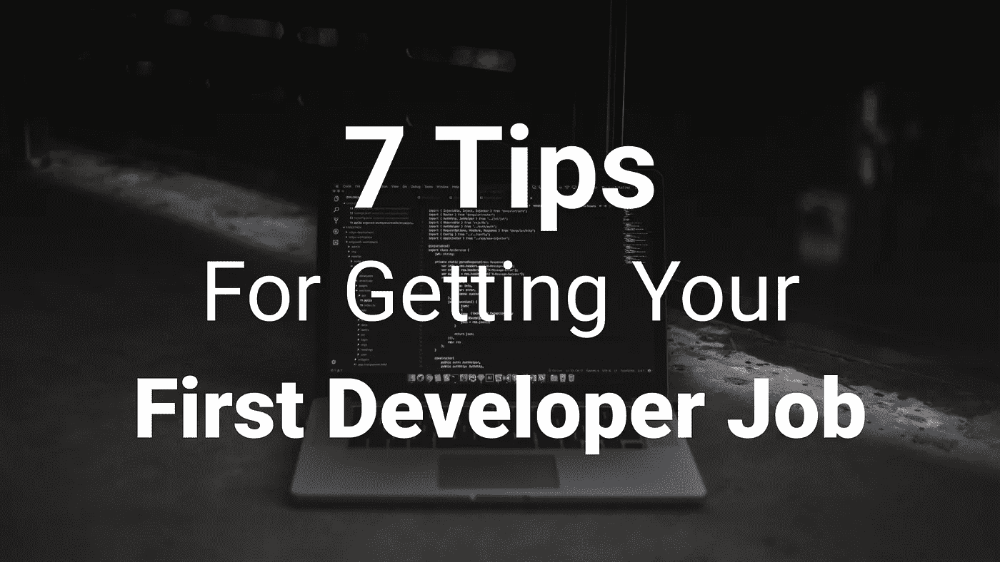

# 获得第一份开发人员工作的 7 个技巧

> 原文：<https://medium.com/geekculture/7-tips-for-getting-your-first-developer-job-27c84231b896?source=collection_archive---------35----------------------->

7 Tips for Getting Your First Developer Job

⭐️ **注**:本教程的原版可以在我的网站[这里](https://www.spencermarx.com/posts/7-tips-for-getting-your-first-developer-job)找到！
⭐️⭐️ **补充说明** : 你是初级开发者吗？如果是，那就来看看我的公司 [Aclarify](https://aclarify.com/) ！我们提供带薪学徒计划，帮助你学习训练营和大学没有教你的基本软件工程元素。你将和我们一起工作 3 个月，从事真正的有报酬的项目，为你在软件行业的全职工作做准备。

软件工程领域正在蓬勃发展🚀随着疫情各行各业对数字服务需求的不断增长，成为一名开发者的吸引力也大大增加了。市场分析只会进一步乐观——例如，美国劳工统计局预测软件工程就业增长在未来十年将达到 22%。这是巨大的！总之，这是进入软件开发领域的好时机。

作为一个在这个领域寻找工作的人，现在比以往任何时候都更重要的是，你不仅要表现出自己有能力，而且要特别适合你申请的角色。但是寻找你的第一份开发人员工作并不是一件容易的事情，当它涉及到要找到从哪里开始的时候，它会变得特别困难。🤷‍♀️🤷‍♂️

作为一名主管和高级软件工程师，我曾参加过面试，以下是我希望有人在我开始寻找我的第一份开发工作时给我的 7 个建议…

# 1 |确保您对单一技术体系感到满意

这对大多数人来说可能是显而易见的，但是如果你打算申请一个在 MERN 堆栈(Mongo、Express、React、Node)内工作的职位，你应该熟悉该堆栈中的每个元素。可能会有一些例外，一家公司正在寻求转换到一些新颖的技术或框架，因此在新工程师的堆栈上是灵活的，但通常情况下，你应该已经能够导航并有效地使用工作中日常使用的任何技术。

这里需要注意的一点是，“舒适”对不同的人有不同的含义。在这种情况下，“舒适”意味着能够跨堆栈的各种元素做基本的事情。想想…

*   在 Express +节点服务器上写出路由
*   在 React 中构建功能和类组件
*   用 Node + Mongo 实现 CRUD 操作
*   在 Express 中创建认证中间件

这个想法是:**你要做好准备，投入到你找到的任何工作中，并迅速做出贡献**。因此，你应该了解你的技术堆栈，因为它很可能是你受雇工作的堆栈。

⭐️ *注意:* **尝试在你的堆栈中包含一个标准的单元测试框架(比如 Jest 或者 Mocha)** *。在评估中小型软件公司的开发人员时，这一点经常被忽略。当在一个大的和快速变化的代码库中工作时，框架是容易和非常重要的。*

# 2 |有一个展示一切的项目

这也是相当直观的一点。大多数技术面试官会要求你深入一个项目，无论是个人的还是专业的。当你这样做时，你的目标应该是向他们证明你:

*   熟悉面试官公司的所有(或至少大部分)元素
*   在制定计划时考虑周到，一丝不苟
*   有能力执行
*   能够有效地解决出现的问题
*   对软件开发充满热情

**尤其重要的是，无论你选择什么项目，你都能够讨论至少一个你能够克服的重大挑战。这个问题应该是你可以深入谈论的话题。将这一点放在以下背景中可能会有所帮助:**

*   出了什么问题？
*   你是如何解决这个问题的？
*   您的解决方案存在哪些折衷(如果有)？
*   您的解决方案成功了吗？

当决定你打算展示哪个项目时，一定要倾向于你真正喜欢的项目——你对工作的兴趣和热情可能会在面试中表现出来(这是件好事)。

# 3 |研究常见的技术面试问题

你可能会收到至少一个阶段的技术评估，所以要做好准备！这里有一些很好的资源，可以用来练习一些常见的技术面试问题:

*   [31 个软件工程面试问题及答案](https://www.springboard.com/blog/software-engineering/21-software-engineering-interview-questions/](https://www.springboard.com/blog/software-engineering/21-software-engineering-interview-questions/)
*   [29 个软件工程师面试问题(附示例答案)](https://www.indeed.com/career-advice/interviewing/software-engineer-interview-questions](https://www.indeed.com/career-advice/interviewing/software-engineer-interview-questions)
*   [技术面试手册](https://github.com/yangshun/tech-interview-handbook](https://github.com/yangshun/tech-interview-handbook)
*   [JavaScript 算法和数据结构](https://github.com/trekhleb/javascript-algorithms)
*   [系统设计入门](https://github.com/donnemartin/system-design-primer](https://github.com/donnemartin/system-design-primer)

与朋友和家人一起练习，直到你记下这些答案。还有更多的资源，所以依靠谷歌找到更多！

我还建议你不仅要练习常见问题，还要在像 [LeetCode](https://leetcode.com/) 或 [CodeWars](https://www.codewars.com/) 这样的网站上练习代码挑战。

这里的大外卖是:**来准备讲技术理论**。**知道那些“必须知道”的面试问题**(如“什么是数组？”)**，还要准备好回答你没见过的问题**。软件工程的核心是解决问题，所以确保你准备好展示你解决问题的能力💪

# 4 |整理一份简洁的简历，在你自己的托管网站上放一个作品集，润色你的 GitHub

对于许多面试官来说，一个人的简历、作品集、LinkedIn 和 GitHub 对形成候选人的初步印象大有帮助。确保这些介质都是抛光的，非常干净。在你有机会面对面交谈之前，不要给评审一个把你从候选人名单上划掉的理由。以下资源可以帮助你在纸上留下好印象:

*   [制作你的简历](https://www.freecodecamp.org/news/writing-a-killer-software-engineering-resume-b11c91ef699d/)
*   [组合你的投资组合](https://www.youtube.com/watch?v=oEjqdodOWOk)
*   [准备好你的 LinkedIn](https://www.myhatchpad.com/insight/how-to-make-your-linkedin-profile-stand-out-as-a-software-engineer)
*   润色你的 Github

# 5 |找一个导师，和他一起模拟一次面试

如果你还没有，试着找一个愿意给你几个小时时间的软件工程师导师，坐下来和你视频通话，模拟一次技术面试。

当我开始涉足软件领域时，我很幸运地认识了几个开发人员。其中一位是我的好朋友，有一天他花了几个小时，在谷歌的一个视频分享网站上用屏幕分享的方式训练我回答技术问题。这真的很有用，尤其是在消除面试前的紧张情绪的时候！

导师也是反馈的重要资源。试着让他们对你的简历、投资组合、LinkedIn 和 GitHub 账户发表意见——他们可能会发现一个问题，这对面试官来说是一个危险信号👀

# 6 |联系声誉好的招聘公司

招聘公司是联系企业的绝佳方式，这些企业提供的职位与你的技能和能力非常匹配。他们有很多，每一个都有一个独特的流程来审查候选人，并把他们加入他们不同的候选人池(通常由技术堆栈组织)。你可以通过几种不同的方式与这些公司建立联系。

1.  LinkedIn 是一个与招聘人员开始对话的快捷工具。只要在你的 LinkedIn 上打开你的 *`Profile`* ，点击 *`Open to`* 按钮，然后选择 *`Finding a new job`* 选项。这应该让你所在地区的招聘人员知道你很乐意聊天。然后，就呆在你的 LinkedIn messenger 上，等待招聘人员开始招聘。
2.  直接伸手。现在有很多招聘公司，随着远程工作选择的增加，许多公司在地理位置上变得更加灵活。大多数网站都有某种简历提交门户，你可以通过它发送简历。我以前曾在大波士顿地区的[Motion recruiting](https://motionrecruitment.com/)工作过，以前是“工作桥协会”，他们很棒👍

当你开始与招聘人员聊天时，确保你在他们的网站和 GlassDoor 上调查了他们公司的声誉。**此外，确保只考虑那些不从你的工资中提成的公司**——有很多公司从发布空缺职位的企业中赚取猎头费，这些是你应该尝试与之合作的公司。

此外，我建议，一旦你有了可能的工作机会，就允许和你合作的公司代表代表你去谈判。通常情况下，这些代表可以增加你的工作机会，因为他们通常是你和客户公司之间的联络人。最棒的是他们的兴趣和你的一致，所以你赚的钱越多，他们也赚的越多——大家都赢了！💰

# 7 |做好失败的准备，但保持坚持和热情

像任何值得做的事情一样，失败是有可能的，尤其是在最初的几次面试中。准备好失败，准备好从失败中学习。

面试和其他事情一样是一种技巧，只要你真正做好准备并努力，你获得的面试次数越多，你成功的机会就越大

软件工程是一个充满令人兴奋的机会的奇妙领域，然而，它并不适合每个人。它可能是认知密集型的，而且发展非常迅速，迫使你不断学习。如果你对开发软件没有热情，或者没有必要，那就不值得花时间和精力去找这个领域的工作。只有爱做，才会去做。

# 感谢阅读

就是这样！我希望这些建议对你锁定第一份开发工作有所帮助。凭借奉献和坚持，任何有知识的工程师都应该能够在公司找到一个他们能够有效贡献的位置。你能做到的！💪