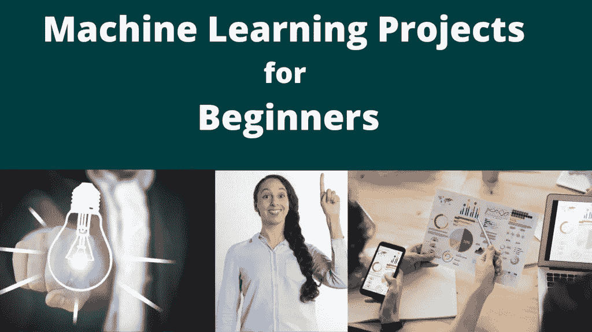

# 2021 年你需要知道的 8 个最好的初学者机器学习项目

> 原文：<https://medium.com/geekculture/8-best-machine-learning-projects-for-beginners-you-need-to-know-in-2021-55f44f6a9f33?source=collection_archive---------13----------------------->

你学过机器学习，但没有做过任何项目。然后是时候**着手一个项目**了。在机器学习中，只有理论上的理解是不够的。你的投资组合中应该有一些**高级机器学习项目**。这就是为什么我要给初学者分享一些**最好的机器学习项目**。

这些项目一定会提升你的简历，让你与众不同。所以我会建议你从这些项目中选择任何一个，然后开始实验。

现在事不宜迟，我们来看看**最适合初学者的机器学习项目**。

# 初学者的最佳机器学习项目

# 1.推荐系统

作为一个机器学习的初学者，你可以开始你的第一个项目，作为一个**推荐**系统。你必须建立一个基于用户历史推荐产品的系统。类似于亚马逊或者网飞。

可以搭建一个**音乐推荐系统，电影推荐系统等。**

对于推荐系统数据集，您可以参考到 **UCSD 门户。**在这个门户网站中，您会发现一些在 UCSD 实验室研究项目中使用的丰富数据集。

这个门户网站有各种数据集可供推荐系统使用，这些数据集来自**热门网站，如 Goodreads 书评、亚马逊产品评论、调酒数据**等。

**门户链接-** [**推荐系统数据集**](https://cseweb.ucsd.edu/~jmcauley/datasets.html)

而且你也可以在 R. 的 [**电影推荐系统上查看这个完整的项目**](https://data-flair.training/blogs/data-science-r-movie-recommendation/)

# 2.假新闻检测

世界上有很多假新闻在传播。那么如何才能区分真消息和假消息呢？…答案是在**机器学习**的帮助下。在这个项目中，你要**用 Python 编程语言建立一个模型**，这个模型可以识别新闻的真假。

为了实现这个项目，你需要构建一个 **TfidfVectorizer** 并使用一个**PassiveAggressiveClassifier**将新闻分类为**“真”和“假”。**

你可以在 [**Datacamp**](https://www.datacamp.com/community/tutorials/scikit-learn-fake-news/?tap_a=5644-dce66f&tap_s=950491-315da1&utm_medium=affiliate&utm_source=aqsazafar) 和 [**DataFlair 查看这个项目的教程。**](https://data-flair.training/blogs/advanced-python-project-detecting-fake-news/)

# 3.改善医疗保健

医疗保健行业正在广泛使用机器学习。因此，你可以从事与医疗保健相关的项目，如**疾病预测、诊断护理等。**

在机器学习的帮助下，我们可以减少**医生的工作量**，提高医疗保健系统的整体效率。

关于 [**构建疾病预测的机器学习模型，可以查看本教程。**](https://shiring.github.io/machine_learning/2017/03/31/webinar_code)

对于医疗保健数据集，您可以查看以下门户网站-

*   [**大型健康数据集**](https://www.ehdp.com/vitalnet/datasets.htm)
*   [data.gov/healthT21](https://www.data.gov/health/)

# 4.股票价格预测器

这是另一个对初学者来说最好的机器学习项目。各种公司和企业都在寻找能够**监控和分析公司业绩并预测各种股票未来价格的软件**。

作为初学者，你可以开发一个预测未来几个月股价的机器学习项目。

关于 Python 中的 [**股价预测可以查看本教程。在本教程中，你将学习如何使用 **LSTM 神经网络**预测股票价格。以及如何使用 **Plotly dash 构建仪表盘进行股票分析。****](https://data-flair.training/blogs/stock-price-prediction-machine-learning-project-in-python/)

# 5.使用 Python 进行手写数字识别

来探索和测试你的深度学习能力，我觉得这是可以考虑的最好的项目。在这个项目中，您将构建一个 r **ecognition 系统来识别人类手写数字。**

使用 Python 手写数字识别可以查看本教程 [**。**](https://data-flair.training/blogs/python-deep-learning-project-handwritten-digit-recognition/)

本教程使用 **MNIST 数据集**和一种特殊类型的深度神经网络，即**卷积神经网络**。

# 6.建立一个情感分析器

情感分析是机器学习中**有趣的项目**之一。你可以使用社交媒体帖子和推文来分析情绪。

社交媒体有许多用户生成的内容，您可以将其用于您的项目。R 中的 [**情绪分析项目可以查看本教程。**](https://data-flair.training/blogs/data-science-r-sentiment-analysis-project/)

在这个项目中，你必须根据单词的情绪对它们进行分类，例如**积极和消极。**

你也可以检查这个项目 [**Twitter 情绪分析**](https://click.linksynergy.com/deeplink?id=Vrr1tRSwXGM&mid=40328&murl=https%3A%2F%2Fwww.coursera.org%2Fprojects%2Ftwitter-sentiment-analysis) ，在这里你必须训练一个**朴素贝叶斯分类器**从数千条 **Twitter 推文中预测情绪。**

# 7.使用 Python 进行颜色检测

这是一个初级项目，你必须建立一个**互动应用**。这个应用程序将从任何图像中识别选定的颜色。根据 RGB 颜色值的不同有**1600 万种颜色**，但是我们只知道几种颜色。

所以要实现这个项目，你需要有一个我们知道的所有颜色的标签数据集，然后你需要计算哪种颜色与所选的颜色值最相似。

为了实现这个项目，你应该熟悉**计算机视觉 Python 库——OpenCV 和 Pandas。**

你可以在这里查看这个项目的所有细节。

# 8.鸢尾花分类项目

这是**机器学习初学者**的另一个基本项目，你必须根据**花瓣和萼片的长度对不同种类的鸢尾花进行分类。**

你可以在这里查看**虹膜数据集** [**。**](https://archive.ics.uci.edu/ml/datasets/Iris)

这些是一些**对初学者来说最好的机器学习项目**。。现在是总结的时候了。

## 结论

希望你在这篇文章里找到了最适合你的项目。更多项目思路可以查看**[**data camp**](https://www.datacamp.com/?tap_a=5644-dce66f&tap_s=950491-315da1&utm_medium=affiliate&utm_source=aqsazafar)[**Coursera**](https://click.linksynergy.com/deeplink?id=Vrr1tRSwXGM&mid=40328&murl=https%3A%2F%2Fwww.coursera.org%2F)[**data flair**](https://data-flair.training/blogs/machine-learning-datasets/)**等。****

**如果你有任何问题，欢迎在评论区问我。我是来帮你的。如果你觉得这篇文章有帮助，分享给其他人来帮助他们。**

**万事如意！**

**快乐学习！**