# 8 个最好的 Seaborn 可视化

> 原文：<https://medium.com/geekculture/8-best-seaborn-visualizations-20143a4b3b2f?source=collection_archive---------0----------------------->

## 使用企鹅数据集与 Seaborn 一起动手绘制统计图。


Photo by [Towfiqu barbhuiya](https://unsplash.com/@towfiqu999999?utm_source=medium&utm_medium=referral) on [Unsplash](https://unsplash.com?utm_source=medium&utm_medium=referral)

要执行数据科学项目，您首先需要了解数据。**数据可视化是理解数据的最佳方式之一。**Python 中的 Matplotlib 和 Seaborn 一般用于数据可视化。

在这篇博文中，我将涉及以下主题:

*   什么是 Seaborn？
*   散点图
*   柱状图
*   条形图
*   箱形图
*   小提琴情节
*   小平面网格
*   配对图
*   热图

让我们开始吧！

# 什么是 Seaborn？

Seaborn 是一个基于 Matplotlib 的用于数据可视化的 Python 库。Matplotlib 用于绘制 2D 和 3D 图形，而 Seaborn 用于绘制统计图。因为 Seaborn 构建于 Matplotlib 之上，所以您可以一起使用这两个库来创建非常强大的可视化。

您可以使用以下命令安装 Seaborn:

```
pip install seaborn
```

当您安装 Anaconda 时，Seaborn 会自动安装。安装 Seaborn 后，我们需要导入这个库来使用它。让我们导入 Seaborn:

```
import seaborn as sns
```

使用 Seaborn，您可以轻松加载一些用于数据科学的著名数据集。在这篇文章中，我将在 Kaggle 中使用[帕尔默企鹅数据集](https://www.kaggle.com/datasets/parulpandey/palmer-archipelago-antarctica-penguin-data)，它被用作虹膜数据集的替代物。

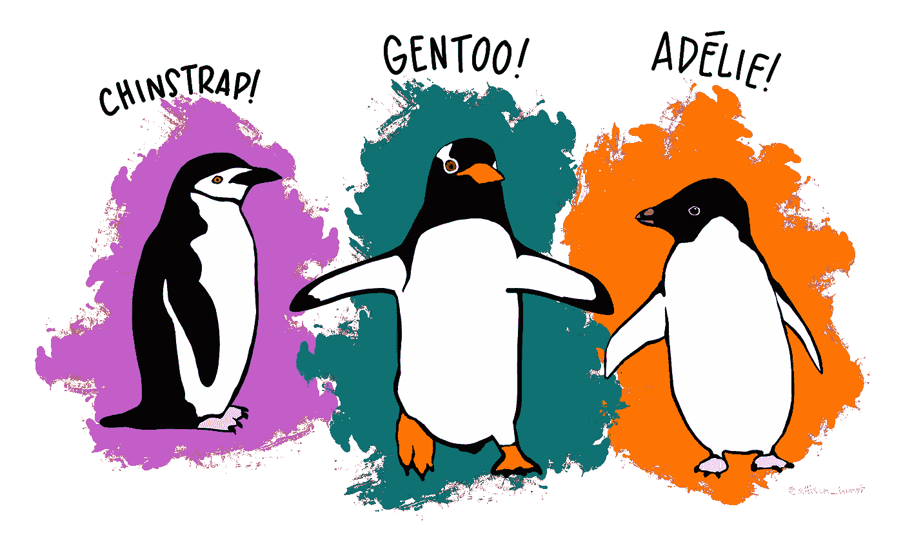

[Penguin Dataset](https://www.kaggle.com/code/parulpandey/penguin-dataset-the-new-iris/notebook)

让我们用 Seaborn 加载企鹅数据集。

```
data = sns.load_dataset("penguins")
```

让我展示数据集的前五行。

```
data[:5]
```


The first five rows of the penguin dataset

让我们看看数据集的结构。

```
data.shape

#Output:
(344, 7)
```

Seaborn 有一些你可以使用的主题。你可以用`set_theme`方法控制这些主题。让我们用`rc`参数来控制主题。

```
sns.set_theme()
# For the image quality of the graphic. 
sns.set(rc={"figure.dpi":300})
# For the size of the graphics
sns.set(rc = {"figure.figsize":(6,3)})
```

现在，让我们深入研究一下统计图表。

# 1-散点图

理解数据的最好方法是散点图。**散点图用于显示变量之间的关系。**让我们看看企鹅种类的长度和深度的散点图。

```
sns.scatterplot( x = "bill_length_mm", 
                 y = "bill_depth_mm", 
                 data = data, 
                 hue = "species")
```

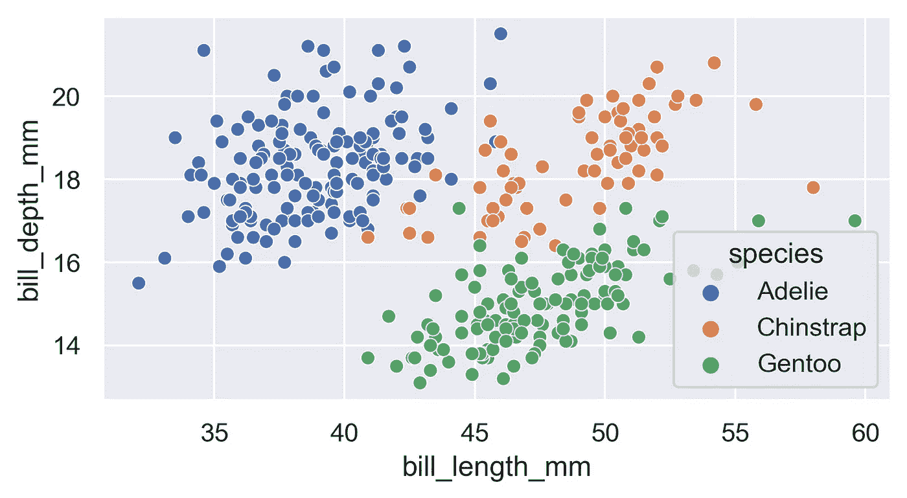

Scatter plot for penguins species

如你所见，x 轴上是竹竿的长度，y 轴上是竹竿的深度。从这张散点图中你可以看出物种之间的差异

# 2.柱状图

我要展示的第二种图形是直方图。**直方图显示了数据的分布。**您可以使用直方图来查看一个或多个变量的分布。现在让我们用`histplot`方法来看看鳍状肢长度的直方图。

```
sns.histplot(x = "flipper_length_mm", data = data)
```

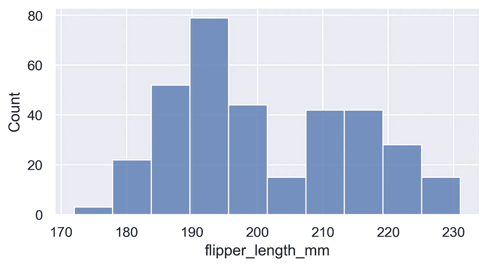

Histogram plot for flipper length

请注意，直方图计算落在间隔内的观察值的数量。也可以用`y`参数翻转图形。

```
sns.histplot(data=data, y="flipper_length_mm")
```

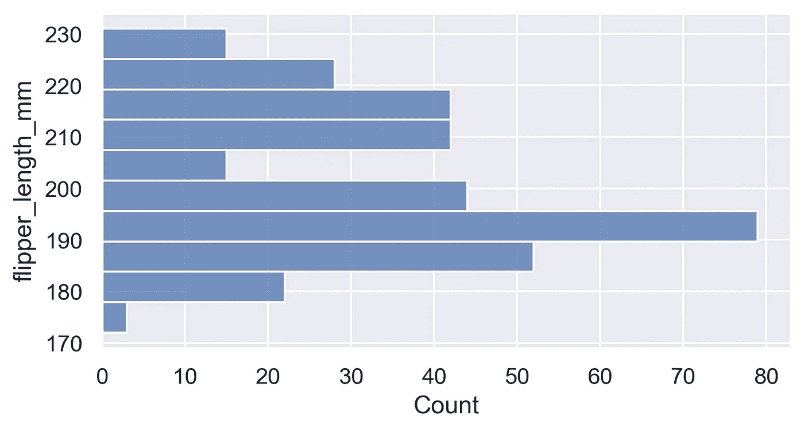

Flipped histogram plot

你可以通过`bindwidth`参数控制直方图中矩形的宽度。让我来展示一下:

```
sns.histplot(data=data, x="flipper_length_mm", binwidth=3)
```

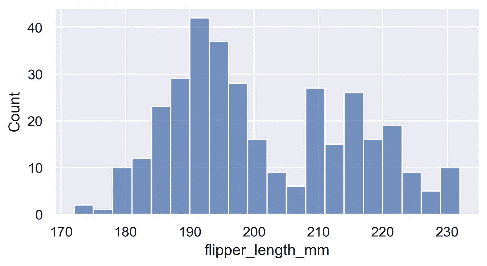

Histogram plot by controlling the width of bins

您也可以将表示概率分布曲线的 kde 添加到直方图中。让我展示一下。

```
sns.histplot(data=data, x="flipper_length_mm", kde=True)
```

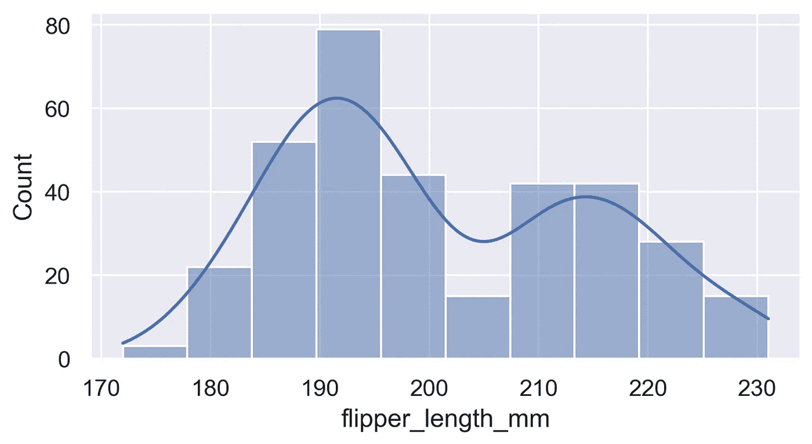

Histogram plot with kde

您可以使用`hue`参数来查看类别直方图。

```
sns.histplot(data=data, x="flipper_length_mm", hue="species")
```

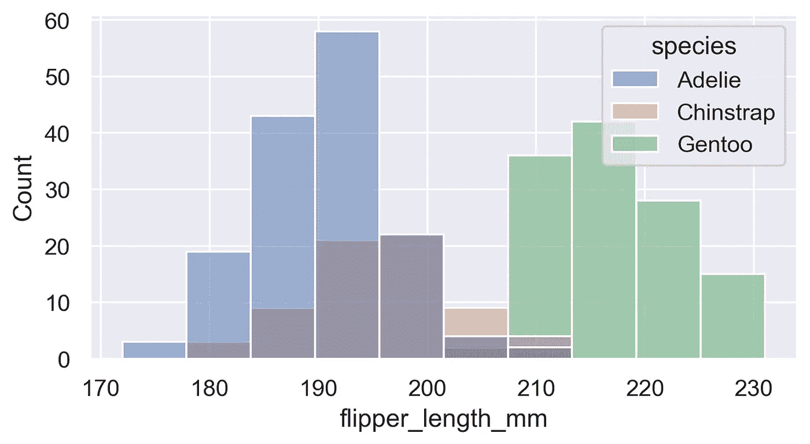

Histogram plot for penguin species

在这个图中，你可以看到显示企鹅种类的直方图。

# 3.条形图

**柱状图代表数值变量的集中趋势估计值，每个矩形的高度为**。让我们看一下显示企鹅种类鳍状肢长度的柱状图。

```
sns.barplot(x = "species", y = "flipper_length_mm", data = data)
```


Bar plot for penguin species

默认情况下，根据平均值计算条形。您可以使用另一个统计数据来代替使用估计参数的平均值。让我使用`hue`参数来按性别查看物种的鳍状肢长度。

```
sns.barplot(x = "species", 
            y = "flipper_length_mm", 
            data = data, 
            hue = "sex")
```


Bar plot for penguin species by sex

# 4.箱形图

**箱线图用于比较分类变量级别之间数值数据的分布。**我们来看看鳍肢长度按物种的分布。

```
sns.boxplot(x = "species", y = "flipper_length_mm", data = data)
```

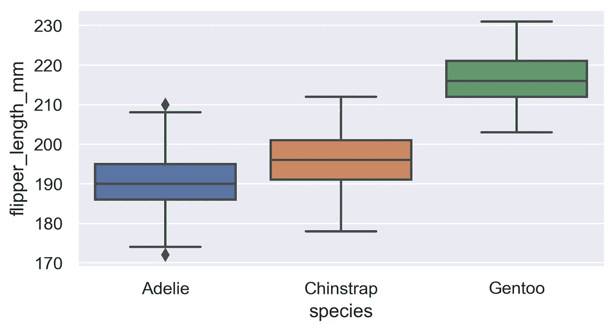

Box plot for penguin species

这里，方框显示了数据的四分位数。胡须的长度代表分布的其余部分。您可以将最小值-最大值之外的值视为异常值。你可以使用`hue`参数来查看按性别划分的物种鳍状肢长度的箱线图。

```
sns.boxplot(x = "species", 
            y = "flipper_length_mm", 
            data = data, 
            hue = "sex")
```

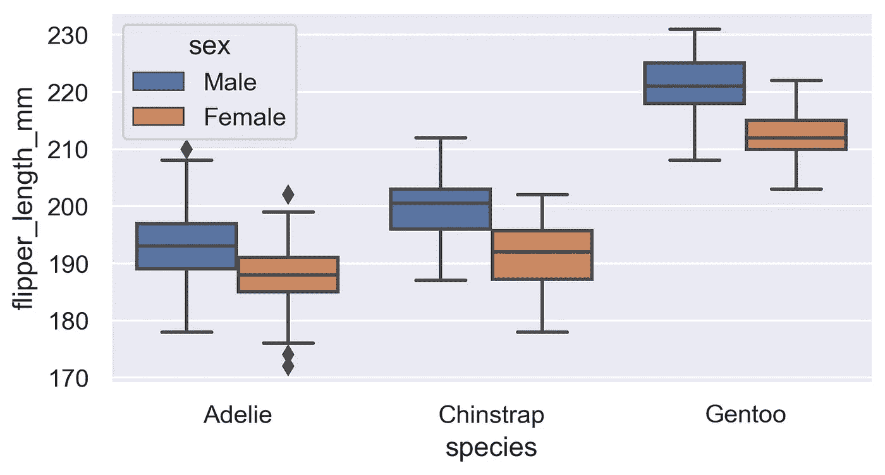

Box plot for penguin species by sex

# 5.小提琴情节

你可以把小提琴情节想象成一个盒子情节。**此图用于比较分类变量中数值的分布。**我们来看一下脚蹼长度的小提琴剧情。

```
sns.violinplot(x = "species", y = "flipper_length_mm", data = data)
```

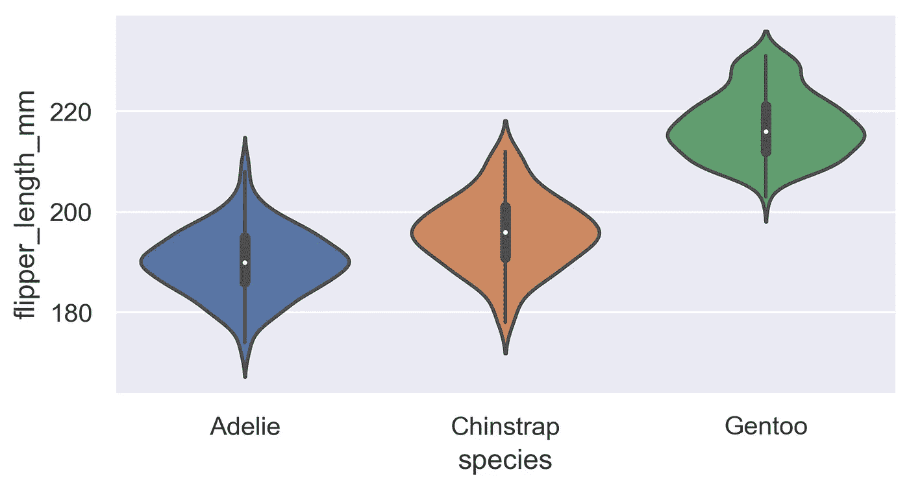

Box plot for penguin species

您也可以使用`hue`参数来查看按性别划分的鳍状肢长度的小提琴图。

```
sns.violinplot(x = "species", 
               y = "flipper_length_mm", 
               data = data, 
               hue = "sex")
```

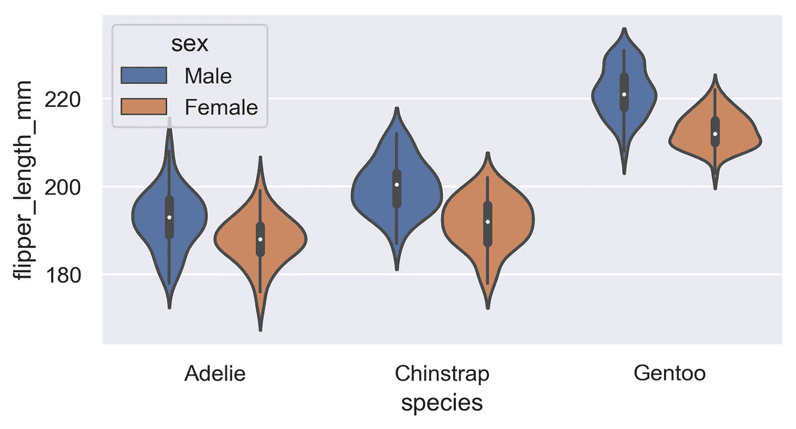

Violin plot for penguin species by sex

因此，小提琴的情节是根据性别变量单独绘制的。是不是很棒？可以用 Seaborn 画出优秀的剧情。让我们看看如何在一个图形中绘制多个图形。

# 6.小平面网格

**您可以使用分面网格查看数据集中不同子集的网格图。**举个例子，让我根据岛屿和性别变量，画出企鹅脚蹼长度的直方图。让我们分配列和行变量来给图形添加更多的支线剧情。首先，我将指定行和列中的变量。

```
sns.FacetGrid(data, col="island", row="sex")
```

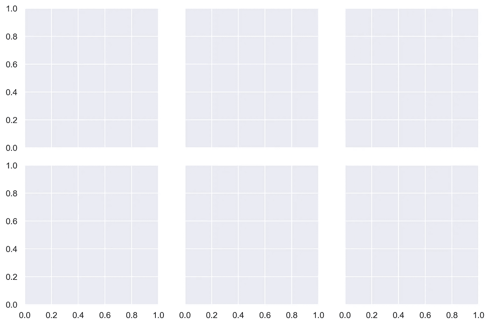

Facet grid

当您运行此命令时，会出现 6 个子区域，因为岛变量有 3 个类别，性别变量有 2 个类别(2*3 = 6)。让我们用`map`方法在每个面上画一个图。例如，让我们看看鳍状肢长度的直方图。

```
sns.FacetGrid(data, col="island", row="sex").map(sns.histplot, "flipper_length_mm")
```

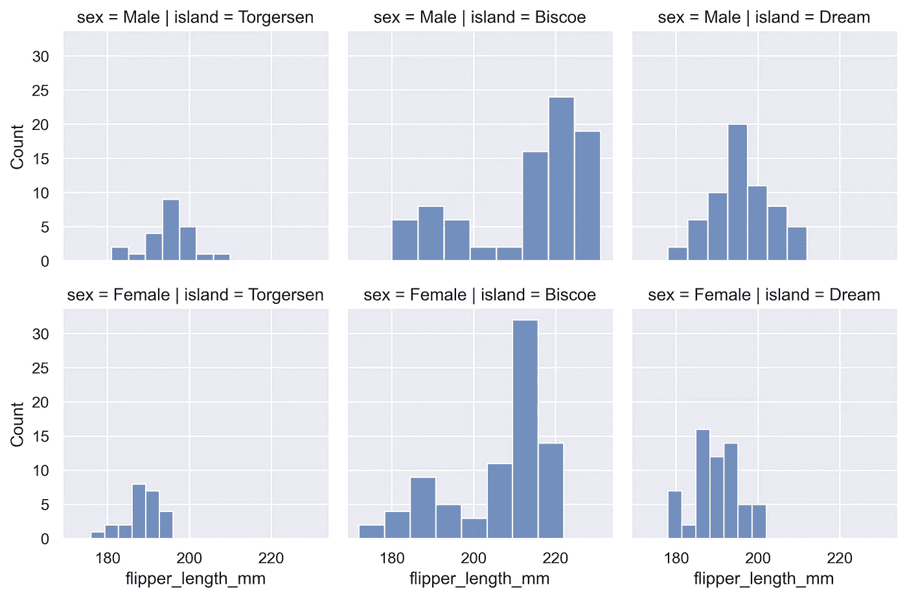

Facet Grid with Histogram

你也可以在每个面上画一个不同的图。例如，让我们看看脚蹼长度的散点图。

```
sns.FacetGrid(data, col="island", row="sex").map(sns.distplot, "flipper_length_mm")
```

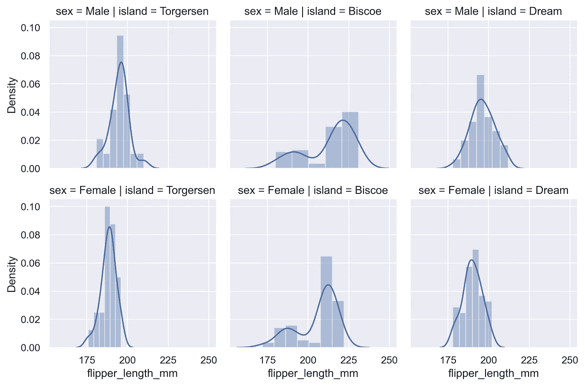

Facet Plot with displot

厉害！你可以很容易地用 Seaborn 绘制支线剧情。

# 7.配对图

查看数据集中变量之间的配对关系是数据分析的重要步骤之一。**你可以用** `**pairplot**` **的方法查看变量的配对关系。**此函数创建数据集中每个数值变量的交会图。让我们根据数据集中的企鹅种类来看数字变量对。

```
sns.pairplot(data, hue="species", height=3)
```

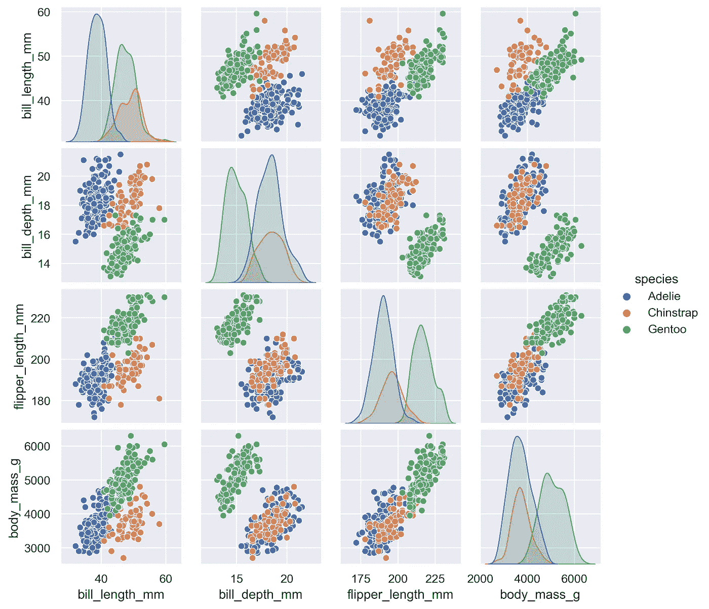

Pair plot with kde

由于变量是数字，概率密度函数会自动绘制在图形的对角线轴上。您可以使用`diag_kind`参数在对角线轴上绘制直方图。

```
sns.pairplot(data, hue="species", diag_kind="hist")
```

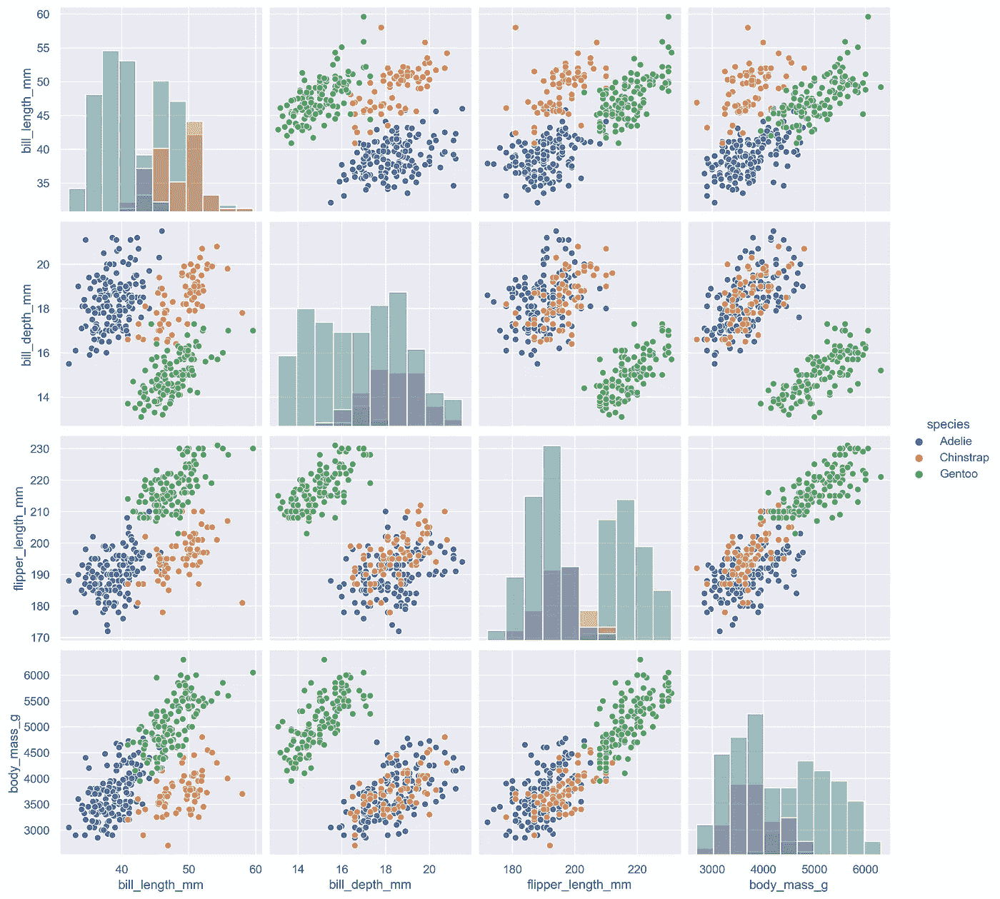

Pair plot with histograms

# 8.热图

最后，我们来看看热图。热图是一种非常有用的可视化技术。**您可以使用这种技术来查看数值变量之间的相关性。让我们用`corr`的方法来看看这个。**

```
sns.heatmap(data.corr())
```

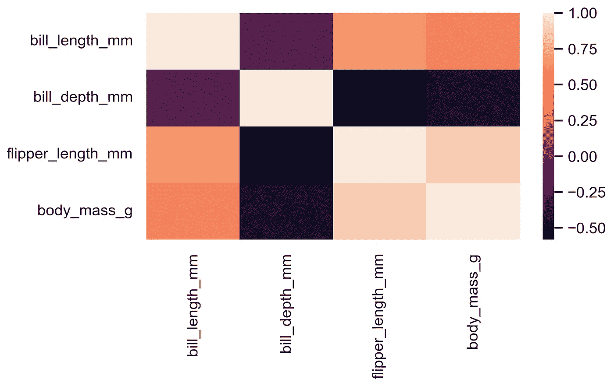

Heatmap

你可以在这个图表中看到数字变量之间的关系。您还可以使用`annot`参数查看每个单元格中的数值。让我给你看看这个。

```
sns.heatmap(data.corr(), annot=True)
```

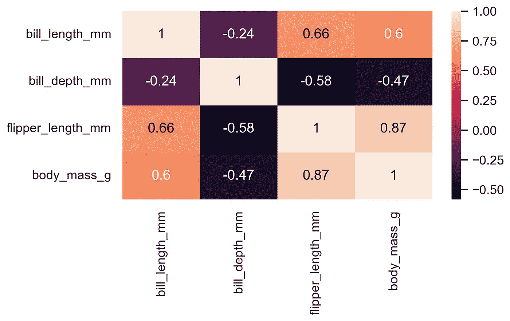

Heapmap with numerical values

因此，在每个单元格中设置数值。

# 结论

数据可视化是数据科学项目中的重要步骤之一。在分析数据之前探索数据是非常重要的。在这篇博文中，我和 seaborn 讨论了数据可视化。Seaborn 是 Python 中用于数据科学的最重要的库之一。Seaborn 主要用于绘制统计图。你可以在这里找到笔记本和数据集[。感谢您的阅读。我希望你喜欢它。](https://www.kaggle.com/code/tirendazacademy/penguin-dataset-data-visualization-with-seaborn)

别忘了在 YouTube 上关注我们👍


[提伦达兹艾](https://tirendazacademy.medium.com/?source=post_page-----20143a4b3b2f--------------------------------)

## 用 Python 实现数据可视化

[View list](https://tirendazacademy.medium.com/list/data-visualization-with-python-72919ad57b84?source=post_page-----20143a4b3b2f--------------------------------)11 stories

如果这篇文章有帮助，请点击拍手👏按钮几下，以示支持👇