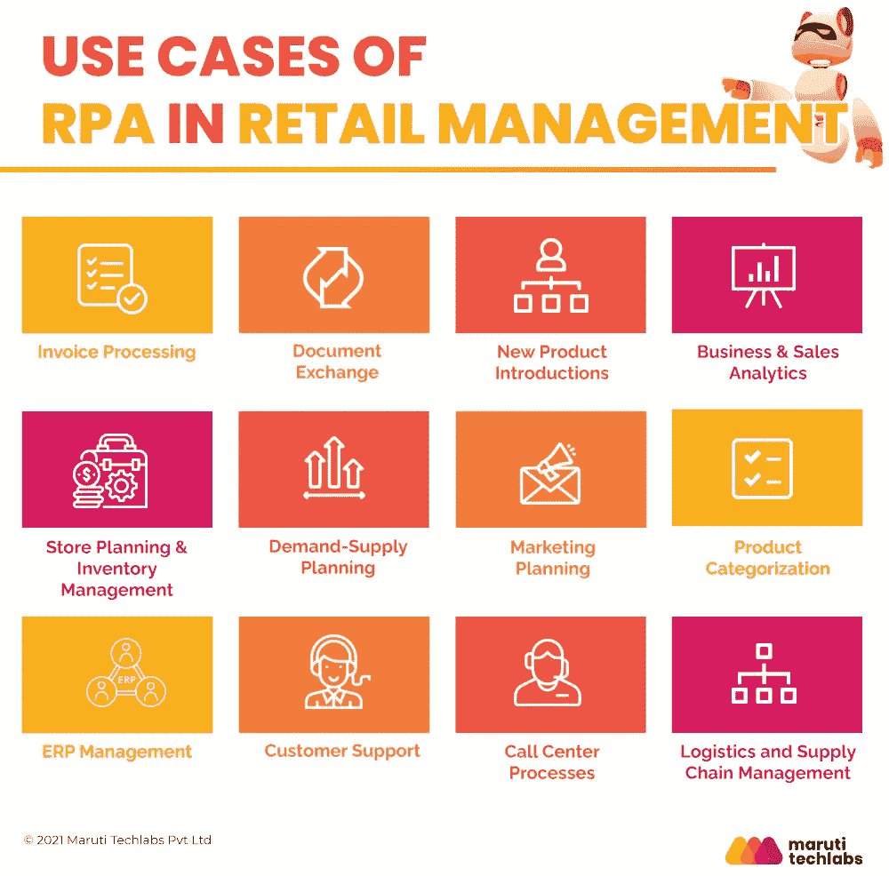

# 零售业 RPA 的 8 大使用案例

> 原文：<https://medium.com/geekculture/8-real-world-use-cases-for-rpa-in-retail-70da7c642b1c?source=collection_archive---------26----------------------->

零售业一直是全球发展最快、收入最高的行业之一。然而，随着技术的发展，整个行业的复杂性和复杂性也在增加。因此，新技术和流程的兴起不仅帮助零售商简化和改善了他们的日常工作流程，还帮助他们实现了新的成功和扩张水平。

[零售业中的机器人流程自动化](https://marutitech.com/robotic-process-automation-services/?utm_source=medium&utm_medium=content_promotion&utm_campaign=RPA_in_retail)是补充零售业增长并有效应对随之而来的挑战的最佳解决方案之一。零售行业的 RPA 提供了自动化日常任务、减少人为错误、加快工作流程和优化总体成本的便利。

在本帖中，我们将探讨零售行业的 RPA 如何在 8 大使用案例的帮助下发挥作用。

**1。ERP 管理**

基于 RPA 的企业资源规划在零售业正获得越来越多的关注。从跟踪价格变化、员工空缺、计费到生成应付账款和应收账款等日常报告，使用 RPA 管理的 ERP 几乎可以自动化所有工作，并有助于最大限度地减少人工工作量。

**2。退货处理**

产品退货是各种零售流程中的常见做法。手动管理 it 可能是一项非常耗时的任务，并且会增加公司的成本。RPA 是一个很好的工具，通过执行更改客户账单明细和库存数据库所需的所有更改，可以有效地管理零售业的退货。

**3。工作流程管理**

零售业本质上是一个以人为本的行业，客户互动主要在网上进行。然而，零售中的 RPA 允许玩家更高效地管理和促进工作流程和其他人力资源流程。零售业的自动化使得从测量时间和出勤、分配班次、工资/休假管理到评估员工绩效的一切都变得更加容易。

**4。客户支持管理**

零售业中的 RPA 在客户支持管理中发挥着重要作用。无论是提供 24×7 的客户支持还是向客户发送实时更新，RPA automation 都可以帮助零售公司使他们的客户支持变得更加快捷和方便。

从下订单到交付，基于 RPA 的高效客户支持系统为零售商节省了大量时间、金钱和精力。

**5。账户和财务**

零售行业的 RPA 以多种方式简化了客户和财务职能。无论是订单和发票处理、应付账款/应收账款管理、账户对账、订单到现金、记录到报告周期、采购到支付还是合并报表，一切都可以使用 RPA 轻松管理。

**6。需求和供应计划**

总的来说，需求和供应计划是一项相当繁琐的任务，包括寻找和收集大量数据，运行模拟，找出其中的异常，然后确认和交流计划。

RPA 技术可以自动完成所有这些任务，并帮助零售商增加产能，提高客户、供应商和员工的满意度。

**7。新产品介绍**

零售行业的新产品或产品线发布涉及大量前期投资和跨多个制造、营销和研发部门的透明度

除此之外，详细的分析是新产品介绍的另一个重要方面。RPA 自动化简化了流程，并允许零售商根据特定客户的偏好修改生产、定价和库存。

**8。销售分析**

零售业中最好的自动化想法之一是销售分析。在零售领域，需要对海量销售数据和消费者行为进行全面分析。手动创建和分析此类报告是一项极其耗时的任务。

零售业中的机器人流程自动化是一个非常有用的工具，可以绝对准确、流畅地高效分析这些详尽的报告。

**总结**

我们在这里列出了 RPA 在零售业中的一些日常使用案例。然而，在零售业中还有其他几项任务，自动化可以减少人力，最大限度地减少错误，并优化宝贵的资源。

在零售 中使用 [RPA 消除了执行各种手动任务的需要，有助于显著提高整体效率。](https://marutitech.com/rpa-in-retail/?utm_source=medium&utm_medium=content_promotion&utm_campaign=RPA_in_retail)

如果您希望充分释放零售员工的潜力，利用 RPA，并享受更高的生产率和更低的成本带来的好处，我们很乐意为您提供帮助。[立即联系我们](https://marutitech.com/contact-us/?utm_source=medium&utm_medium=content_promotion&utm_campaign=RPA_in_retail)。