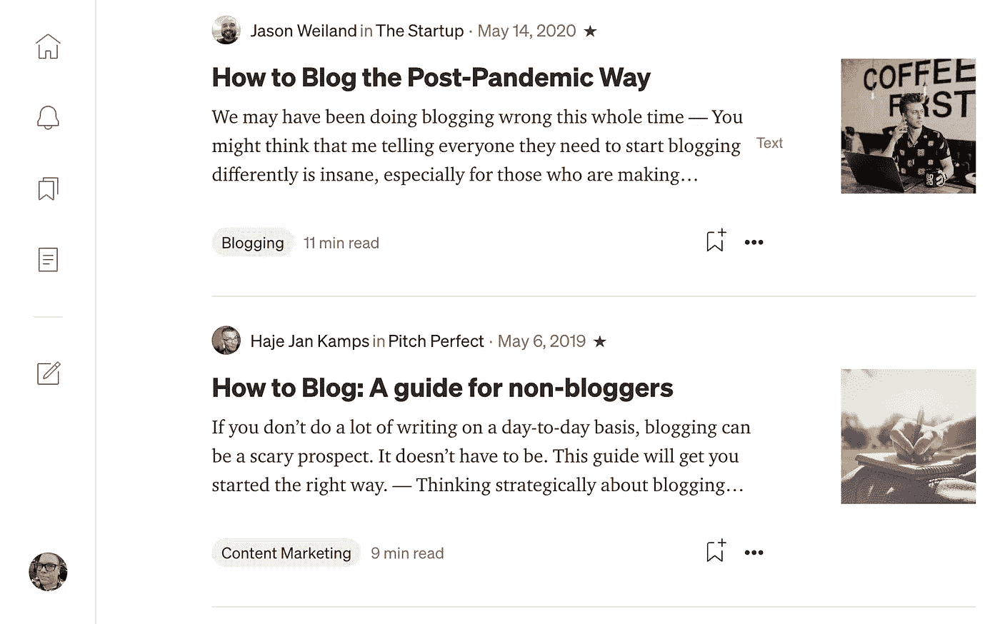

# 迈向更易发表的技术博客的 8 个步骤

> 原文：<https://medium.com/geekculture/8-steps-towards-a-more-publishable-technical-blogpost-fc7e25736fa2?source=collection_archive---------15----------------------->

## 确保你的博客优秀的协议

一位招聘经理发现了你关于某个 SQL 聚合函数及其在财务记录中的具体用例的博文，并通过媒体向你发送了一条消息，让你去他们的工作场所查看新的大量使用 SQL 的职位。他们认为你非常适合。一名招聘人员阅读了你的博客文章，内容是为什么与其他 python 机器学习包相比，scikit-learn 拥有写得最好的文档，并想与你谈谈他们的老板正在招聘的一个新的 ML 工程师职位。一家令人惊叹的技术出版物希望在最近的黑客马拉松上获得你最近的博客帖子，这样你的名字就会在充满机会的数字空间中被提及。那是梦想，对吗？

博客展示了我们作为技术专家的技能组合，(在我的例子中，是作为一名数据科学家。虽然写博客能提高你的书面交流技巧，以及你如何向他人解释你的想法，但写博客也能为你获得下一份工作带来实实在在的结果。发布你的博客只会增加发现你技能的人的范围。

但是如何写一个展示那些书面交流技巧的博客呢？使用 API，我们可以查找文档以确保我们使用正确的参数来返回我们需要的信息。但是制作一个好的技术博客的文档在哪里呢？

这篇博客文章试图提供一些这样的结构。它可以被认为是一个协议，一套指导方针或一个清单，无论你喜欢什么框架。这些步骤诞生于工作坊**博客，它们会让你注意到**我开发了这些博客，并在熨斗学校当学生的时候向那里展示了两次，作为他们课程的补充。在我的第一篇博客文章被 CodeX 发表后，我建立了这个工作室。在我的上一篇博客文章被接受为编辑推荐的数据科学之后，我知道我可以在 Medium 上为更大的技术博客社区提供一些东西。

不再装腔作势，这里是协议，八个步骤走向一个更可发表的技术博客。

# 1)关键:如何抓住观众的注意力？

让我把你的注意力集中到媒体上，以及如何在这个网站上预览文章。我在 Medium 上搜索“如何写博客”,下面是最先出现的两个结果:**如何以后疫情方式写博客**作者:[杰森·韦兰](https://medium.com/u/d573475dabea?source=post_page-----fc7e25736fa2--------------------------------)和**如何写博客:非博客作者指南**作者:Haje Jan Kamps 。



Image by the author.

两个看起来都很有趣！如果你只有时间读一本，你会怎么选择？标题，附带的图片，出版物，或者标签，但是你可能读过 Medium.com 为你预习的那三行散文，对吗？

一个 ***钩*** 是能立刻抓住读者的注意力，激发他们的兴趣，让他们想继续读下去的东西。在 Medium 上，我们有相当于一篇 Twitter 帖子长度的内容来激励读者点击我们的博客文章。我们这篇文章的链接正与其他文章的链接争夺那一次点击。

这个想法来自创造性的写作惯例，但对技术博客来说是必不可少的。毕竟，如果你正在寻找一篇关于使用 Seaborn 的博客文章，仅仅根据第一行，你会首先点击哪篇文章:

**答**:“MatPlotLib 是一个用于数据可视化的 python 库，一个漂亮但复杂的不同语法的怪物，Seaborn 是在它的基础上构建的，作为一种恢复理智的方式。”

**B**:“MatPlotLib 是一个用于数据可视化的 python 库。Seaborn 构建在 MatPlotLib 之上，作为自己的库，具有更加一致的语法。”

他们非常相似，即将讨论完全相同的信息。那么，为什么 A 听起来更有趣呢？B 缺什么？当写一个，我用了唤起的语言，即“恢复一些理智。”我让更多的我的个性和观点展现在我的作品中。相比之下，b 非常枯燥，因为没有更好的词来形容，读起来有点无聊。a 还使用了一种语言，在我的读者的脑海中放入一幅图片，使用“一个美丽但复杂的怪物。”相比之下，b 不太吸引读者的视觉想象力。

这里有一个来自大众媒体的很好的例子:

> "我第一次看到死人是在 12 岁快 13 岁的时候。"——电影《袖手旁观 Me》的第一句台词，由理查德·德莱福斯根据斯蒂芬·金的中篇小说改编

这个钩子利用意想不到的东西来吸引观众的注意力。它立即让观众的脑海中充满了关于上述尸体的更多问题，以及为什么叙述者在 12 岁时就能接触到尸体。好奇心是吸引读者的一种强大的注意力。

建立一个好的挂钩的另一个策略是从思考你的读者最感兴趣的东西开始，并在第一行给他们。我用这个策略让你(希望)阅读这篇博文，我说*一个* ***招聘经理*** *发现* ***你的*** *博文…* 在这七个字里，我已经在直接与读者对话了，(**你**，)并且可能找到一份**工作，**我猜你会对此非常感兴趣。

但是一旦我们赢得了关注，我们该怎么做呢？

# 2)信息:你想让你的读者在读完你的博客后知道什么？

你将会在你的博客文章中说很多令人惊奇和聪明的事情。你可能希望你的读者在离开你的博客时，脑子里想的不止一个。那么什么构成了一条*消息*，为什么拥有一条消息很重要？

这里的信息被定义为一个支配性的论题，一个总括性的陈述，你的帖子的每一行都将指向或证明是真实的。这个信息也可以被框定为你的听众正在寻找的东西。


Photo by [Austin Chan](https://unsplash.com/@austinchan?utm_source=medium&utm_medium=referral) on [Unsplash](https://unsplash.com?utm_source=medium&utm_medium=referral)

*这篇*博文的信息可以表述为*“如果你在写作时做到这八个步骤，你的博文会更容易发表。”*

在开始写之前有一个清晰的信息类似于伪编码一个函数。这里，我将使用一个简单的函数作为示例:

*f*(*x*)=*x*+*m*

您正在输入 *x* ，该功能将导致输出 *x* +无论 *m* 包含什么。

如果读者是 *x* ，阅读你写作的行为是函数，那么输入就是你阅读你写作之前的读者，输出就是你的读者+ *m* 其中 *m* 代表你写作的信息。

这听起来可能过于简单，但是把你的写作看作是你的读者在文章结尾留下的一个明确的价值，将有助于你的清晰，你的焦点，和你的读者的理解。

# 3)**技术清晰度**:有人能多好地理解你正在解释的概念？

技术清晰至关重要，尤其是你的一些博客文章试图总结和说明的大量技术知识。我发现自己经常去技术博客，特别是当有一些我难以理解的技术内容时。有很多方法可以让你的技术写作变得清晰，这里有一些:

1.  从与你想法非常不同的人那里获得对你写作的反馈，他们可能会指出你的盲点(你自己对某个主题的专业知识使你无法理解新手可能会误解这个主题)
2.  试着预测哪些地方可能不明确，花额外的时间解释人们可能会在哪里迷路
3.  用几种不同的方式来解释同一个想法，以迎合不同类型的智力(如语言学或使用类比，视觉，数学等)
4.  试着按照详细的线性顺序分解复杂的程序，就像你在解释一个食谱是如何工作的一样
5.  展示你试图解释的例子
6.  用简单的语言解释行话、首字母缩写词和词汇

我对技术清晰的最大建议是把你自己放在两个非常特定的人的头脑中:一个是你领域的专家，但他可能喝得很醉，很累，或者很心烦意乱；另一个是非常聪明的外星人，他对你的领域一无所知。


Photo by [Stephen Leonardi](https://unsplash.com/es/@stephenleo1982?utm_source=medium&utm_medium=referral) on [Unsplash](https://unsplash.com?utm_source=medium&utm_medium=referral)

如果你能带领这个两人小组通过写作的技术层面，你已经完成了一项了不起的工作！

# 3)受众:你的博客文章是为谁设计的？

这篇博客文章是为那些希望发表博客并有可能被雇佣的技术作者而设计的。我知道这一点，因为观众(你)是我一直在谈论的对象。

现在，这是一种很好的态度，认为你写的所有博客文章都是给招聘经理、招聘人员或你的下一任老板看的。这种态度不仅能帮助你在写作时保持动力，还能让你保持最佳状态。

然而，大多数时候，你不会作为你的技术博客的主要读者直接给他们写信。这就是求职信的作用！

无论您的博客文章是为希望通过打印来执行第一行代码的代码新手准备的(“hello world”)，还是您希望讨论预处理数据的复杂性，您都可以向您的受众发出信号“嘿，我看到您了。我是专门来找你谈的。”


Photo by [Nick Fewings](https://unsplash.com/@jannerboy62?utm_source=medium&utm_medium=referral) on [Unsplash](https://unsplash.com?utm_source=medium&utm_medium=referral)

一个非常简单直接的选择你的受众的例子，你可能在广告中很熟悉，是一个关于受众的问题列表，受众可以对每个问题回答“是”。

举一个非技术性的例子，如果我正在写一篇关于如何挑选一台新洗衣机/烘干机的帖子，我可以用它来吸引我的读者:*你厌倦了去自助洗衣店吗？厌倦了荧光灯，和硬币机拒绝你的美钞？您是否在考虑购买新的洗衣机/烘干机？如果是这样，这篇文章是给你的！*

在你的写作中，有很多不那么直接的方法来定义你的读者，但是我发现如果我在开始写作之前选择了我的读者，那么我会无意识地让我的文章适合那些读者。但是，当有疑问时，上述推销方法是一个功能框架。这里的目标是让读者感到被看见和受欢迎。

# 5)图片:你的读者会在你的博客上看到什么？

(*请注意，这一部分是在假设你，我的读者，主要是视觉读者的情况下编写的。)

这个博客，不管文字多么有趣，如果我包含相关的图片，将会对我的读者产生更有影响力和更吸引人的效果。人类的眼睛可以对颜色和构图做出反应，并且经常会尝试用文章中的图片来编故事。

到目前为止，在这篇博客中，我已经使用了 Medium 搜索结果的截图，以及 Upslash 的一系列图片。我用一个短语或一个想法来介绍每张图片，这样读者就可以把这张图片和我的整体信息联系起来。

《纽约时报》倾向于在标题中使用大幅图片是有原因的。让我们来看看下图中的一个非技术性的例子。下图给出了一个单词:*扣人心弦*，以及唐纳德·特朗普的照片。单词“cliffhanger”与这张图片搭配是什么意思，如果不提供图片，这个意思会有什么变化？


Photo by [Markus Spiske](https://unsplash.com/@markusspiske?utm_source=medium&utm_medium=referral) on [Unsplash](https://unsplash.com?utm_source=medium&utm_medium=referral)

一个好的图像(或视频)会打破你博客文章中文字的单调，但一个伟大的图像会强化一个概念或证明你的文章想要表达的东西。

为了证明我的观点，让我们做一个技术性的实验。上个月，我为我的帖子[制作了这个视频，使用了来自](https://towardsdatascience.com/using-folium-on-police-data-3207e505c649) [NYC OpenData](https://opendata.cityofnewyork.us/) 的关于 2020 年停止和搜身的数据。点击播放，闭上眼睛。

Video by the author, Link for the video clip on youtube is here: [https://www.youtube.com/watch?v=illObkP3TLQ](https://www.youtube.com/watch?v=illObkP3TLQ)

很无聊吧？它可能不会帮助你理解这个数据集是什么样子的。

现在试着睁着眼睛再看一遍。现在你可以看到，正如我所叙述的，数据集是多么难以处理。你对视频的视觉理解为我的叙述增添了意义。

不要害怕制作自己的技术流程视频！

# 6)代码:你的代码做什么或证明什么？

您的代码是您的智慧、流程和技术实力的证据。添加代码片段，例如使用 GitHub 的 Gists，是增加你的博客的战术性惊喜因素的可靠方法。有什么比在你的博客中有足够的关于你的代码的代码更简单的呢？

([GitHub 的 Gists 文档在这里。](https://docs.github.com/en/get-started/writing-on-github/editing-and-sharing-content-with-gists/creating-gists))

但是什么是好的要点呢？让我们再次使用那个食谱比喻。与此相关的所有要点和图像都可以遵循以下操作顺序:

1.  介绍要点将显示什么，就像我刚才做的那样
2.  包括要点
3.  用简单的语言陈述以上要点

如果我正在写一篇关于如何用 python 打印三个字符串的技术博客。我可以把所有代码放在一个块中，就像这样:

上面的代码定义了三个字符串。我创建了对象“all_strings ”,其中三个字符串连接在一起。然后，我使用一个 print 语句，它将显示如下输出

```
Hello World! Thanks for reading my blog, I hope you learned something useful.
```

对于这一小段代码来说，这并不是世界上最糟糕的事情。这篇博客文章是为谁设计的，这是非常简单的。但是如果观众是以前从未(用 python)写过代码的人呢？

然后，我可能想把这段代码分解成三个要点，并对每个步骤进行注释。

上面的代码展示了我是如何创建这三个字符串的。注意在 string1 和 string2 中，最后一个字符是一个空格，因为 python 不会自动在每个字符串的末尾添加空格。字符串由字符组成，在语法上用单括号“”或双括号“”括起来。

接下来，我将*连接*这三个字符串，这意味着将它们粘在一起。串联保持每个串联对象的原始顺序。你可以把这里的字符串想象成一个单词中的字母。每个字母从最后一个字母的末尾开始，A + P + P + L + E 的顺序用这种方法变成 APPLE，保持顺序不变。

上面的代码显示了如何进行这种连接。最后，我将打印 all_strings，这样我们就可以看到输出。

上面的代码将返回:

```
Hello World! Thanks for reading my blog, I hope you learned something useful.
```

当你展示你的代码时，把你的读者放在心上，当你问自己“在我写博客的时候，我应该在多大程度上分解和解释我的代码”时，让你的读者来引导你。

# 7)作者:你是谁，你给你正在写的文章带来了什么？

你在你的技术博客中包含多少关于你是谁的细节是你自己的选择。这是个人的界限问题。

你有机会选择如何展示自己。你可以直接这样做，就像我在这篇文章的介绍中所做的那样，告诉你我是如何开发这篇博客文章和我的出版历史的。在你写博客时所做的每一个选择中，你可以也将会直接做到这一点。你的节奏，你的词汇，你的信息，你如何选择你的图片，你如何写你的代码，等等，都将在你的观众的脑海中描绘出你的形象。


Photo by [Jon Tyson](https://unsplash.com/@jontyson?utm_source=medium&utm_medium=referral) on [Unsplash](https://unsplash.com?utm_source=medium&utm_medium=referral)

在我看来，这是值得借鉴的。我看过很多博客，那里作者的声音听起来要么像大学论文，要么更客观，像文档。我鼓励你在写作时使用自己的声音，就好像你在和一个朋友、家人或你关系很好的导师/老板说话一样。有上百万份大学风格的论文要读，有文档要看，但是世界上只有一个你，读起来已经很有趣了。

# 8)结论:你想如何结束你的文章？

你可能听说过这样一句话“开始强大，结束强大。”你的结论可以被认为是你的读者到达旅程的最终目的地。当你的读者在机场走下飞机，心里想着“我在那里，现在，我在这里。”


Photo by [Mantas Hesthaven](https://unsplash.com/@mantashesthaven?utm_source=medium&utm_medium=referral) on [Unsplash](https://unsplash.com?utm_source=medium&utm_medium=referral)

你的结论是一个机会，确保你的信息击中要害，回忆起你的读者与你一起走过的旅程，也许向你的读者提出新的问题，这样他们就能以新的眼光看待这个博客。

例如:

在这篇博客文章中，我们了解了如何抓住读者的注意力，如何选择文章中包含的图片，以及如何为读者解开代码。我们还讨论了为什么对你想要传达的信息有一个清晰的想法，以及一个特定的目标受众可以帮助你的受众找到那个信息。此外，我们讨论了提供技术清晰度的策略，我鼓励你在写作时用自己的声音说话。最后，我将向你展示一个结论的例子，并强调通过遵循展示的这八个步骤，你的写作会更清晰，读起来更有趣，可以发表，并有可能让你获得下一次工作面试。毕竟，你永远不知道将来谁会读你的博客！

更进一步，如果你要写一篇关于如何写文章的文章，就像我已经尝试过的，你会有什么不同的做法？关于出版，你有什么建议或技巧可以和读者分享吗？你有哪些写技术博客的秘方？

结论是给读者留下持久印象的机会，也是对读者阅读整篇文章的奖励。我的希望是，你离开这篇博客文章的时候，感觉自己被赋予了写作和解释你的想法的能力。毕竟 Medium 上的数据科学社区不缺天才，我个人的投入是，我希望在阅读您的技术博客时能够理解您的想法。