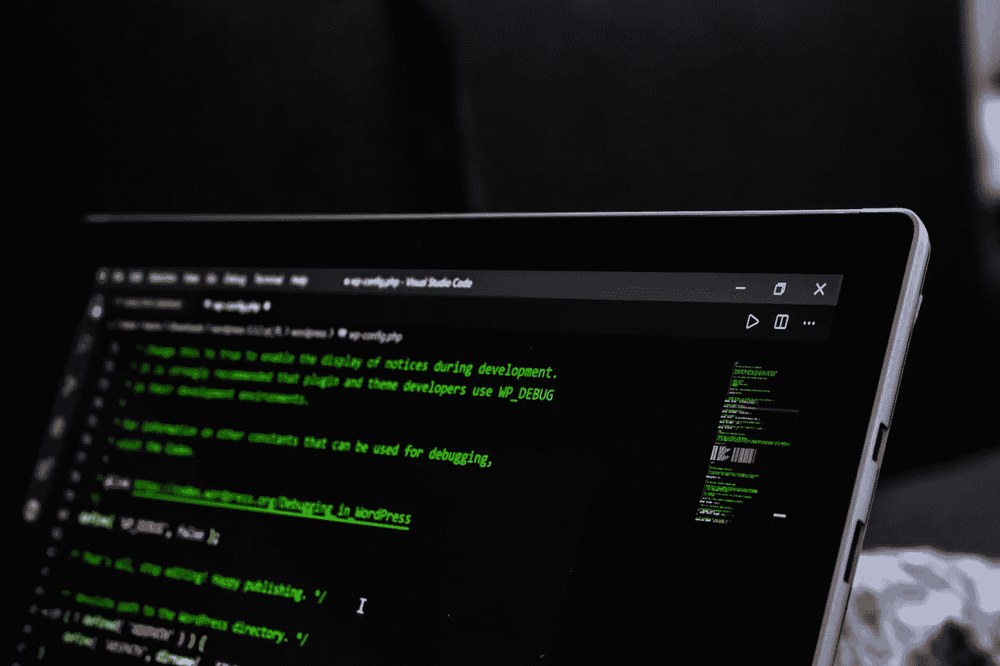

# 社交媒体破坏网络安全的 9 种方式

> 原文：<https://medium.com/geekculture/9-ways-social-media-sabotages-your-cybersecurity-88d1ec823bce?source=collection_archive---------18----------------------->

随着许多世界上最受欢迎的网站提供社交功能，社交媒体已经成为在线消磨时间的最常见方式之一。社交媒体被描述为一个数字平台，允许用户创建帐户，共享内容并与其他用户互动。主要例子包括脸书、Twitter 和 Instagram 等网站，但还有数百个不同的社交媒体网站，每个网站都提供一套独特的功能，迎合不同的人群。

社交媒体非常适合与朋友和家人联系，以及与来自世界各地的人分享想法和内容。对于企业来说，这也是一个与潜在消费者互动的好地方，吸引他们并向他们做广告。社交媒体网站如此成功的原因之一是它们出于广告目的向公司出售个人数据。品牌可以根据人们的年龄、地点和喜好来锁定目标人群，从而更容易接触到目标人群。

虽然社交媒体非常受欢迎，世界上超过一半的人口现在至少拥有一个账户，但它确实引发了网络安全问题。当注册社交媒体网站时，用户需要小心不要泄露他们的数据，成为数据泄露的受害者，或者下载恶意软件。

拥有超过 40 亿用户的社交媒体平台是黑客、骗子和身份窃贼的一大目标。因此，小心你使用的平台和你如何使用它是值得的。在这篇文章中，我们的美国网络安全专家 Alex Lysak(关于他的更多信息可以在这里找到)将探讨社交媒体和网络安全的九种不同联系方式，以及如何实践社交媒体安全。

# 什么是网络安全？

网络安全是保护设备或网络免受网络攻击、恶意软件或其他在线威胁的实践。这些网络攻击通常旨在获取、更改或破坏敏感数据，向用户勒索金钱，或破坏正常的企业活动。无论您是个人还是公司，网络犯罪分子都不会歧视您，您需要能够保护您的设备和数据免受网络安全威胁。

因为现在设备比人多，攻击者也越来越有创意，所以实施有效的网络安全措施非常困难。在过去几年中，高调的网络攻击数量有所增加，特别是那些使用勒索软件的攻击。这种类型的恶意软件加密用户的数据，使其毫无用处，除非用户屈服于要求并支付赎金。

黑客经常要求以加密货币的形式支付，加密货币的优势是比其他形式的在线支付更容易使用。根据 Scanteam 的[研究，使用加密货币进行的支付在过去几年中增加了很多，这在一定程度上要归功于安全级别的提高以及潜在的匿名性。](https://scanteam.pro/crypto/)

# 使用社交媒体时保护自己

虽然您可以使用防病毒软件和其他工具来保护您的设备免受威胁，但保持在线安全的最佳方式是采取正确的预防措施。通过在网上遵循良好的实践，你可以避免恶意软件并免受网络攻击，包括社交媒体上的攻击。

如果你想保持安全，这里有一些在使用社交媒体时要避免或小心的事情:

# 提供太多个人信息

当使用社交媒体时，用户经常填写他们的个人资料，而不太关心谁会看到他们。尽管提供你的生日、你的家庭成员、你在哪里长大等细节似乎无伤大雅，但这会让你处于危险之中。通过在网上发布如此多的个人信息，您可能会影响您的网络安全，使黑客更容易进入您的帐户，或者身份窃贼更容易以您的名义开立信用卡或银行帐户。

此外，您还应该小心您提供的联系信息，因为骗子通常会寻找电子邮件地址和电话号码。当与您的个人信息相结合时，他们可以利用这一点来创建高度可信的骗局，旨在从您的帐户中提取资金。隐私是最重要的社交媒体安全问题之一，用户应该更加小心自己的个人信息。

# 网络钓鱼诈骗

一个[网络钓鱼诈骗](https://www.consumer.ftc.gov/articles/how-recognize-and-avoid-phishing-scams)是最常见的在线诈骗类型之一，诈骗者利用社会工程来获取他们想要的信息。这种类型的社会工程包括攻击者向人类目标发送虚假消息，希望获得敏感信息。此外，该骗局还可能涉及或在受害者的基础设施上部署有害软件，如勒索软件。

使用社交媒体时，你应该时刻警惕收到的信息，尤其是来自陌生人的信息。有时，它甚至可能看起来像是您认识的某个人发送的网络钓鱼消息，通过被攻击的帐户或虚假的个人资料。

# 不安全的密码

密码对于保护您的帐户安全至关重要，无论是哪种帐户，您都应该确保使用强密码。使用弱密码是自找麻烦，因为这意味着黑客可以很容易地闯入你的帐户。不仅如此，您还应该避免在多个帐户上重复使用密码。例如，你绝对不应该在网上银行和脸书账户上使用同一个密码。

# 单层安全性

密码不是唯一可以用来保护你的帐户的东西；许多在线网站还提供双因素身份验证或数字身份证。在这里，该网站将向您的手机发送一个代码，供您使用以及您的密码。你一定要设置这个，因为这意味着即使黑客设法破解了你的密码，他们也无法进入你的账户。

# 过时的应用

社交媒体应用程序不断更新，以消除使其容易受到社交网络安全威胁的漏洞和利用。如果你希望你的设备保持安全，请确保你使用的应用程序是最新的，如果你不确定，可以查看是否有更新。此外，您可以将应用程序设置为在发布新软件补丁时自动更新。

# 不安全的移动网络

当在移动设备上使用社交媒体时，你应该小心你连接的网络。在美国使用移动数据是没问题的，但是连接到开放的 Wi-Fi 网络通常是有风险的。当您连接到不安全的移动网络时，您的设备可能会受到恶意软件和网络攻击。

# 恶意软件链接

恶意软件链接很少出现在社交媒体上，因为它们经常被举报和删除。然而，你仍然可以找到大量通过恶意软件在各种平台上传播，特别是通过私人信息进行社交媒体网络攻击的例子。如果你不认识这个人，千万不要打开这个链接，并且要非常小心你打开的链接。

# 标签和位置

社交媒体的部分乐趣是在照片中标记朋友，并分享你的位置。然而，这可能会给你带来风险。[在网上分享你的位置时要小心](https://www.equifax.co.uk/resources/identity-protection/should-you-share-your-location-on-social-media.html)，尤其是你不知道谁会看到这些信息。一些美国人在社交媒体上透露他们的位置后，他们的家被抢劫了，这也可能是一个网络安全风险。

# 隐私控制不力

使用社交媒体时，你可以控制谁可以看到你分享的内容，但你需要调整隐私设置来改变这一点。请确保您经常重温这一点，以防止与您无关的人访问您的个人数据，并确保适当的数据安全。