# ggplot2 初学者指南

> 原文：<https://medium.com/geekculture/a-beginners-guide-to-ggplot2-72b3b902a602?source=collection_archive---------1----------------------->


Image by Author

流行一句话，行动胜于雄辩，这就是为什么在数据分析领域，我们不能过分强调数据可视化的重要性。一个单一的视觉化图像有能力传达大量的信息。

在本文中，您将学习如何使用流行的`ggplot2`包在 R 编程中创建数据可视化。

ggplot2 包允许您基于图形的[语法创建数据可视化，图形](/tdebeus/think-about-the-grammar-of-graphics-when-improving-your-graphs-18e3744d8d18)由 7 层组成。

1.  `Data` —您有兴趣可视化的数据
2.  `Aesthetics` —您将绘制数据的比例尺，这是您的 `x`和`y`-轴。
3.  `Geometry` —这是你定义你想要的可视化形状的地方。
4.  `Facets` —这是将你的剧情拆分成各种支线剧情，以获得更清晰的视野的过程。
5.  `Statistics` —在这一层，您定义数据的统计摘要或趋势。
6.  `Coordinates` —这是你描述你的绘图空间的地方。
7.  `Themes` —您可以在此自定义数据中的非数据元素，如字体、图形填充和轮廓等。


在本文中，您将学习如何使用 ggplot2 绘制和解释 5 种主要的数据可视化。

1.  条形图
2.  箱线图
3.  散点图
4.  线形图
5.  柱状图

# 安装和装载 `ggplot2`包

在使用 ggplot2 包之前，首先需要从 C.R.A.N 安装这个包，C . R . a . n 是几千个 R 包的存档。

您可以通过运行下面的命令来安装和加载该软件包。

```
# install package
install.packages("ggplot2")

# load package
library(ggplot2)
```

# 钻石数据集

您将在本文中使用的数据集是 diamonds 数据集，它与`ggplot2`包一起加载。

要方便地查看数据，请运行下面的代码。

```
View(diamonds)
```


该数据集包含近 54，000 颗钻石的价格和属性。

*   `carat` —这是一颗钻石的重量
*   `cut` —这是钻石切割的质量；一般、良好、非常好、优质、理想。
*   `color` —钻石的颜色从 *D(最好)到 J(最差)*。
*   `clarity` —衡量钻石净度的标准； *I1(最差)，SI2，SI1，VS2，VS1，VVS2，VVS1，IF(最好)。*
*   `depth` —总深度百分比= z /平均值(x，y)= 2 * z/(x+y)(43–79)
*   `width` —钻石顶部相对于最宽点的宽度(43–95)。
*   `x` —钻石长度*毫米*
*   `y` —宽度为*毫米*
*   `z` —深度为*毫米*

在数据可视化的帮助下，您将使用这个数据集来回答各种问题，例如

*   最昂贵的钻石
*   最便宜的钻石
*   钻石价格分布均匀吗？
*   钻石的平均价格和中间价格。
*   钻石克拉有可能影响钻石价格吗？

# ggplot2 的结构

不管你想构建什么样的情节，`ggplot2`都有一个特定的结构。

```
ggplot(data = diamonds,
       mapping = aes(
         x = cut,
         y = price
       ))
```

`ggplot()`函数是您传递数据和美学的地方，数据参数接受您正在可视化的数据，在这种情况下是钻石数据集，而`mapping`参数接受`x`和`y`轴，如果您希望有一个变量作为`fill`，我将在后面解释。

当你运行上面的代码时，你会得到这样的结果，

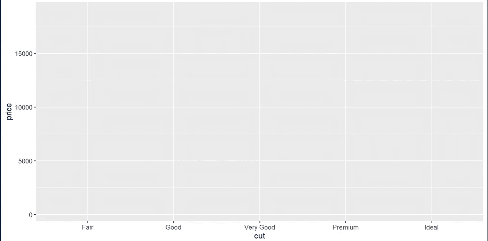

在这个图表中，您将定义想要创建的可视化类型。您还可以看到您定义的轴。

下一步是用`+`符号添加您想要创建的可视化类型。

假设你要创建 abox plott，创建盒图的函数是`geom_boxplot()`，要这样添加。

```
ggplot(data = diamonds,
       mapping = aes(
         x = cut,
         y = price
       )) +
  geom_boxplot()
```

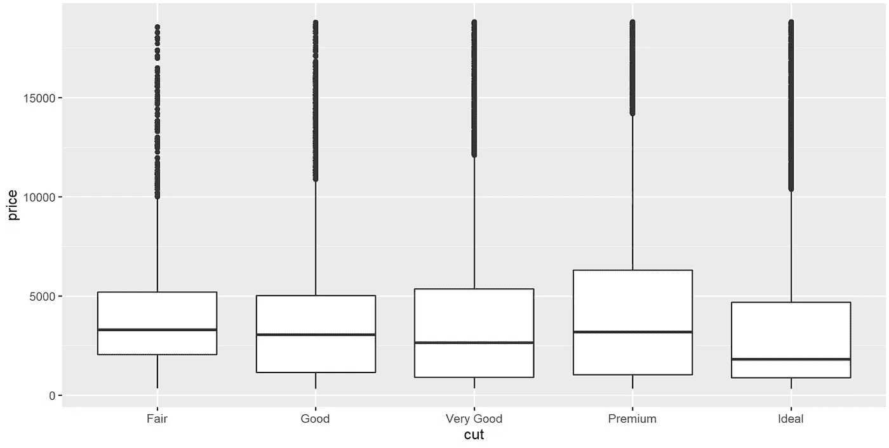

现在，只关注结构，这是你用`ggplot2`创建可视化的基础。

在接下来的章节中，您将学习如何定制您的情节。

就像您添加盒状图一样，您可以使用`+`符号添加额外的元素，直到您知道您想要添加的元素的功能。

您的可视化可以同时具有`x`和`y-axis`，或者只有`x-axis`，我们将在条形图的情况下使用。

现在让我们从最常见的数据可视化开始，条形图。

# 条形图

条形图是数据分析中最常用的绘图类型。

它用于可视化数据中分类变量的频率。

就像你现在要演示的，每颗钻石切割的频率。

你要做的第一件事是首先铺设你的结构，但是这次没有使用`y`-轴，条形图只使用一个轴，因为另一个轴是你感兴趣的钻石切割的频率。

```
ggplot(data = diamonds, 
       mapping = aes(
         x = cut
       ))
```

然后你可以添加`geom_bar()`功能

```
ggplot(data = diamonds, 
       mapping = aes(
         x = cut
       )) +
  geom_bar()
```

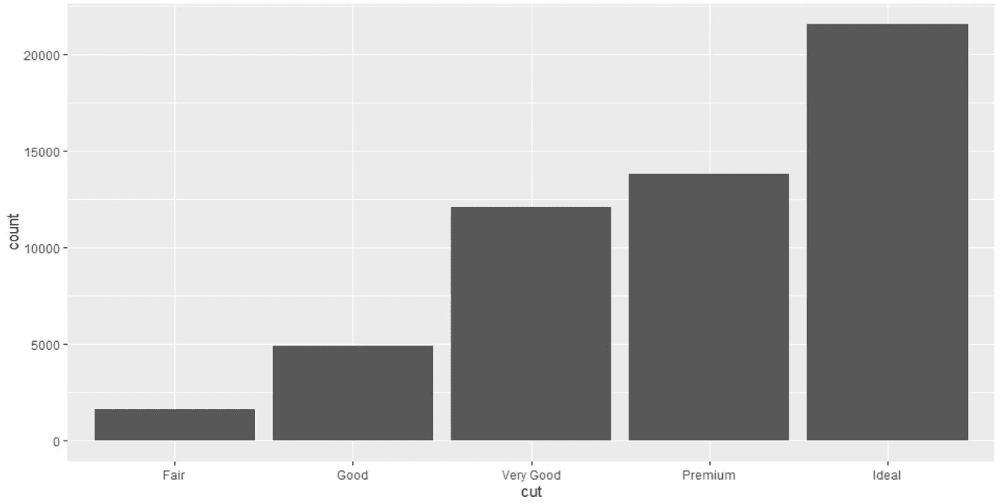

你可以从柱状图中看到，频率最高和最低的菱形。

我将把那个留给你来回答！

这个情节看起来很枯燥，让我们通过在`aes()`函数中添加`fill`参数来使它变得丰富多彩。

```
ggplot(data = diamonds, 
       mapping = aes(
         x = cut,
         fill = cut
       )) +
  geom_bar()
```

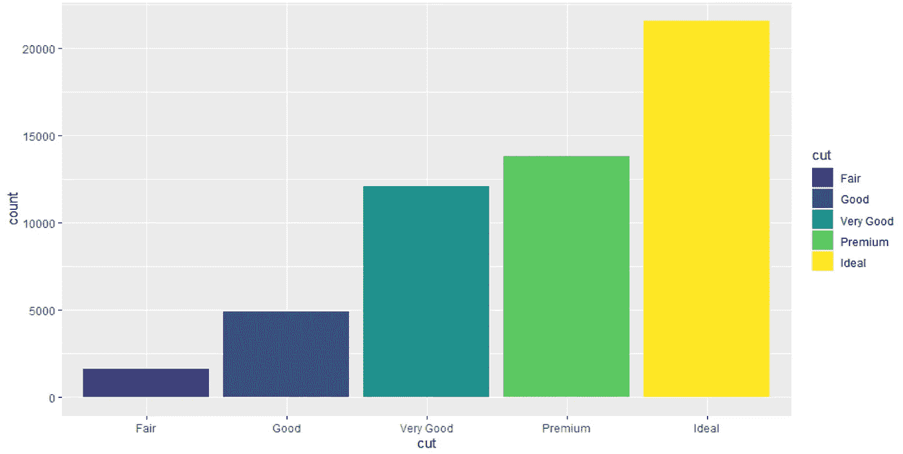

这还差不多，这叫竖条情节。

当您想要可视化的类别数量很少时，可以使用它。

如果有很多类别需要可视化，建议使用水平条形图。

让我们将钻石净度的频率可视化在一个水平条形图上，

```
ggplot(data = diamonds, 
       mapping = aes(
         y = clarity,
         fill = clarity
       )) +
  geom_bar()
```

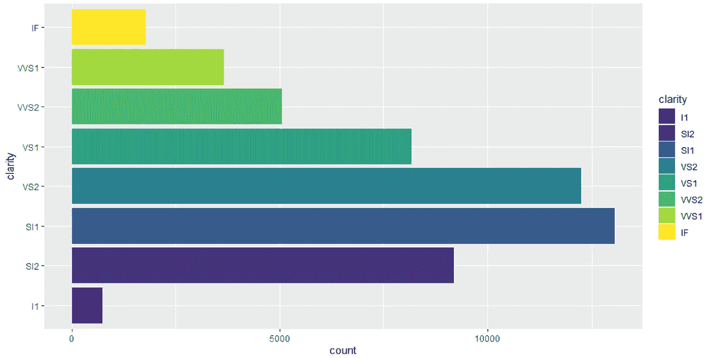

你注意到发生了什么吗？

美学中的`x`论证改为`y`。这个小小的改变是强大的，它改变了你剧情的走向。

最初，你在`x-axis`上分类，但现在你把它切换到了`y- axis.`

你也可以在竖条图上添加`coord_flip()`函数来翻转它，而不是把美学中的`x`参数改成`y`。

```
ggplot(data = diamonds, 
       mapping = aes(
         x = clarity,
         fill = clarity
       )) +
  geom_bar() +
  coord_flip()
```


耶！你仍然得到同样的情节。

你选择的方法由你自己决定，都很方便使用。

如果想看到钻石颜色在各种切工中出现的频率怎么办，怎么做？

# 堆叠和分组条形图

## 堆积条形图

堆积条形图允许您可视化一个分类变量到另一个分类变量的数值。

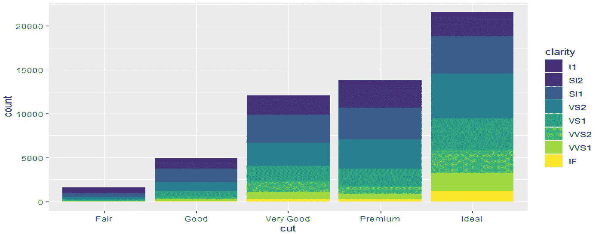

堆积条形图类似于在同一个图中绘制两个类别，不同的是，每个类别都将另一个子类别解释为子条形图。

从上面的图中，您可以看出*理想*钻石出现的频率最高，净度 *VS2* 钻石出现的频率最高，位于*理想*钻石切工下方。

让我给你一个快速的练习，在所有的钻石切割中，最不清晰的是什么？

你猜对了，这个*如果*清晰的话。

不要担心，你现在将绘制一个并更好地掌握它，你将在各种钻石切割中可视化各种钻石颜色的频率。

要绘制堆积条形图，唯一需要更改的是 fill 参数。

在前面的例子中，`x`变量和`fill`变量是相同的，这一次子类别或填充将是数据集中的另一个分类变量。

```
ggplot(data = diamonds,
       mapping = aes(
       x = cut, 
       fill = color)) +
geom_bar()
```

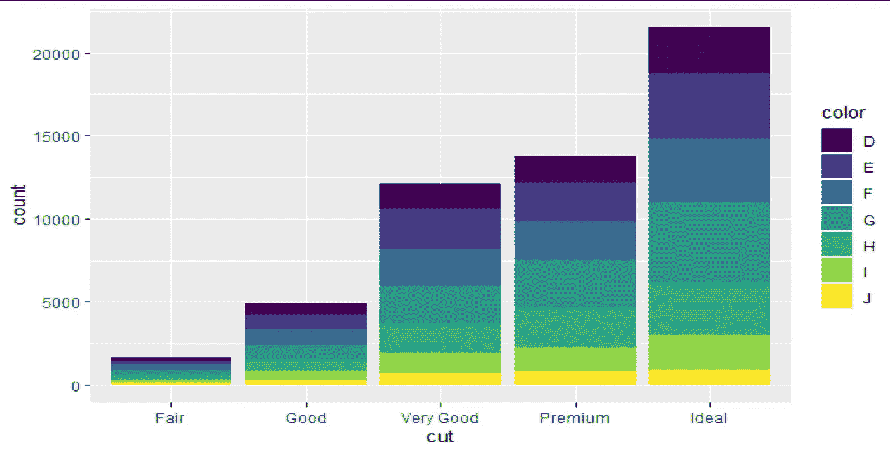

你可以看到，许多问题都可以从这个单一的图中得到答案，如颜色为 J 的钻石是所有切割中出现频率最低的钻石。

从剧情中还能承载什么信息？

## 分组条形图

与堆积条形图类似，分组条形图将并排绘制子条形图。


你可以看到，在每一颗钻石的切割中，钻石的净度都是并排的。

```
ggplot(data = diamonds,           
       mapping = aes(
         x = cut,
         fill = color)) + 
  geom_bar(position = "dodge")
```

只需添加`position = “dodge”`参数，就可以得到分组条形图，而不是堆叠条形图。

# 箱线图

箱形图是数据可视化中最全面的图之一，箱形图用于可视化基于其[四分位数](https://www.mathsisfun.com/data/quartiles.html)的数值数据的分布。

四分位数是将数据集分成四等份的值。

箱线图也称为盒须图。

这个盒状图用于可视化一个分类变量对一个数字变量，就像你要可视化一个钻石切割对一个钻石价格。

从箱线图中，你可以知道钻石价格的中位数和四分位数。

要绘制盒状图，只需在美学函数中给`x`参数一个分类变量，而给`y`参数一个数值变量。

```
ggplot(data = diamonds,           
       mapping = aes(
         x = cut,
         y = price)) + 
  geom_boxplot()
```

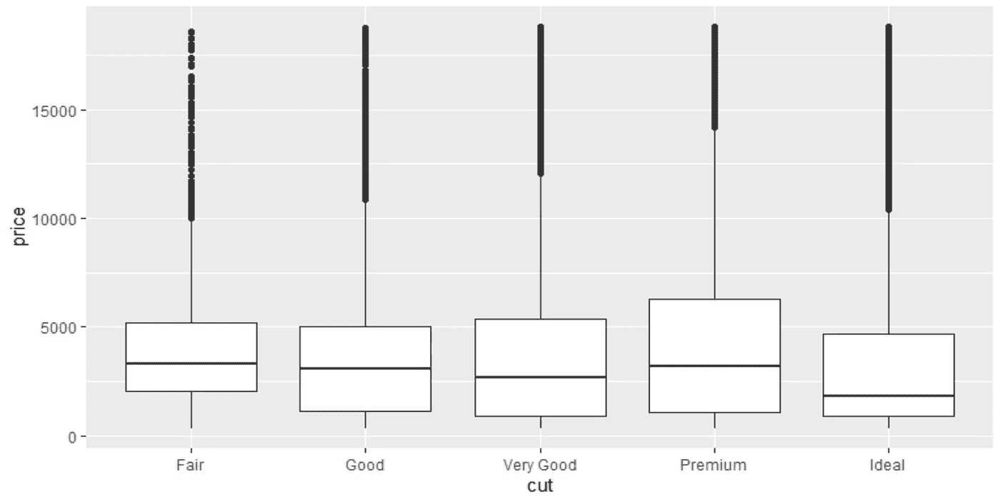

你对此如何解读？

让我们用这张详细的图表来解释一下，

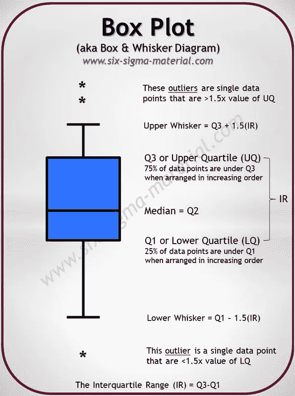

盒图由盒和须组成，因此命名为盒和须图。

我之前解释过，箱形图将一个数据集分成 4 个相等的部分，称为四分位数。

因此，你有第一个四分位数，第二个四分位数，第三个四分位数。

*   25%的观察值低于第一个四分位数
*   50%的观察值低于第二个四分位数，也称为中位数。
*   75%的观察值低于第三个四分位数
*   数据集中的最高值通常位于第三个四分位数之上，这是您可以看到最大值的地方。

回到钻石切工与钻石价格的关系图，如果你比较所有钻石切工，你会发现理想钻石的中值价格最低，而优质钻石的中值价格最高。

你还会注意到，在理想的*钻石中，低于中值的价值与高于中值的价值相比并不多，同样的情况也适用于*高级*钻石。*

较短的方框图表示特定钻石切割中的钻石价格彼此接近，就像*公平*钻石切割一样。

与钻石价格不太接近的较长时期不同，这一点可以从*优质*钻石中看出。

您可以使用`color`参数将一个变量作为颜色添加到方框图中，使其看起来更美观。

```
ggplot(data = diamonds,           
       mapping = aes(
         x = cut,
         y = price,
         color = cut)) + 
  geom_boxplot()
```

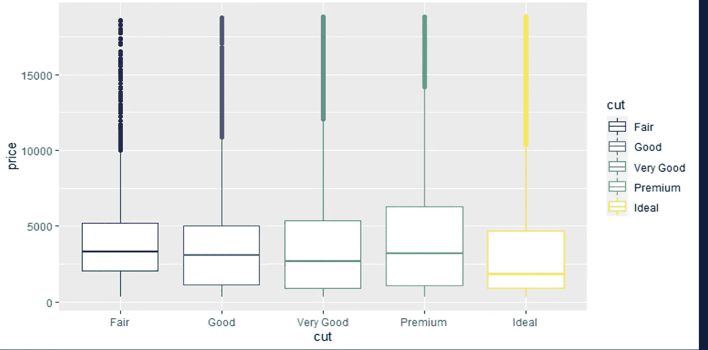

或者，如果你觉得这看起来很奇怪，就使用`fill`论点。

```
ggplot(data = diamonds,           
       mapping = aes(
         x = cut,
         y = price,
         fill = cut)) + 
  geom_boxplot()
```


# 散点图

相关性是两个变量之间关系的度量，例如，高智商的学生很可能比低智商的学生有更高的测试/考试分数。

这意味着，随着学生智商的提高，他/她通过考试的可能性也会增加。

你可能想知道为什么我要谈论相关性，散点图是测量两个变量之间相关性的传统方法之一。

散点图可以让你知道钻石的价格和克拉数是否相关，也让你有机会知道高克拉钻石是否比低价钻石更贵。

要了解更多关于相关性的内容，您可以查看文章 [*相关性在推荐系统中是如何工作的？*](/@adejumo999/correlation-how-does-amazon-know-what-i-want-56cfccfe13c1)

与上面的图不同，散点图只接受数字变量。这些变量中的这些值被绘制出来，因此图上点的方向被用来解释两个变量之间的相关性。

让我们回到菱形数据集，看看`price`和`carat`变量是否有关系。

这一次，您将传递`price`作为您的 x 轴，传递`carat`作为您的 y 轴，并添加`geom_point()`函数。

```
ggplot(data = diamonds,           
       mapping = aes(
         x = price,
         y = carat)) + 
  geom_point()
```

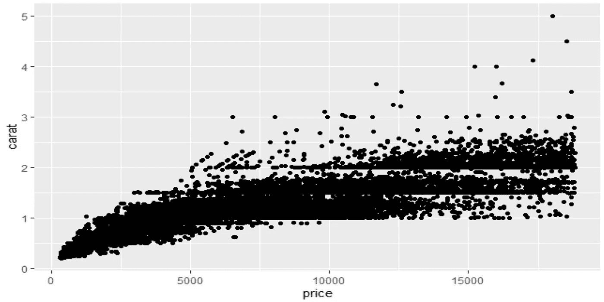

从上面的图中，你会看到随着钻石克拉的增加，钻石价格也会增加，反之亦然。

这表明钻石和克拉有很强的正相关关系。

下面的图总结了你如何解释你遇到的任何散点图。

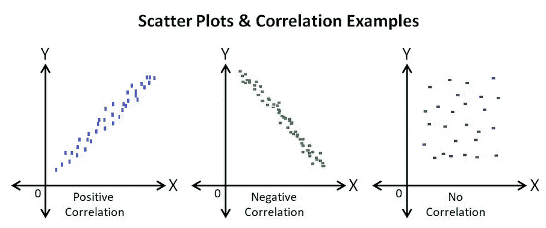

*   第一张图显示了正相关关系，就像你在上面绘制的钻石价格随克拉价值增加的示例图一样。
*   中间的图与第一张图相反，表示负相关，一个例子是学生缺课的增加和成绩的下降。一个学生缺课越多，他的成绩就越有可能下降。
*   两个变量没有关系的情况称为*无相关性*，你会得到一个看起来像最后一个图的图。

# 柱状图

到目前为止，您应该知道条形图用于绘制数据集中分类变量的频率。

如果想得到一个数据集中数值变量的出现频率呢？

这就是直方图发挥作用的地方。

直方图和条形图类似，除了前者中的条形连接在一起，而后者中的条形由相等的间距隔开。

就像柱状图一样，直方图只采用一个数值变量。

让我们通过将 x 轴设置为`price`并传递`geom_histogram()` 函数，使用直方图来可视化数据集中的钻石价格。

```
ggplot(data = diamonds, 
         mapping = aes(x = price)) +
  geom_histogram(bins = 50)
```

bin 参数允许您在图表上设置想要的条形数量。柱的数量越多，直方图上的条的数量就越多，反之亦然。

从下面的柱状图中，你会发现，大多数钻石的价格在 0 美元到 5，000 美元之间，很少有在 15，000 美元到 20，000 美元之间的。


将 bin 设置为 10，您将得到一个包含 10 列的直方图。

```
ggplot(data = diamonds, 
         mapping = aes(x = price)) +
  geom_histogram(bins = 10)
```

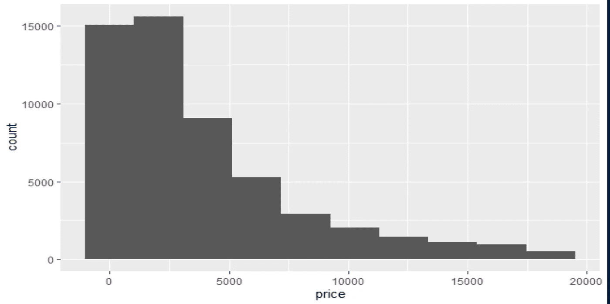

有时使用较高的频段比使用较低的频段能提供更多的信息。

# 曲线图

折线图是一种基于时间显示数据的数据可视化类型，例如了解一个国家的人口在过去几年中是如何变化的。

在线图中，`x-axis`表示时间，以分钟、天、周、月或年为单位。

与上面的例子一样，`y-axis`包含感兴趣的变量，即一个国家的总人口。

使用`geom_line()`功能绘制线形图，就像绘制其他图形一样

您一直使用的 diamonds 数据集不包含时间变量，但不用担心，我们有经济数据集，它也随 ggplot2 包一起提供。

它包含美国的经济时间序列数据，有`574`行和`6`变量。

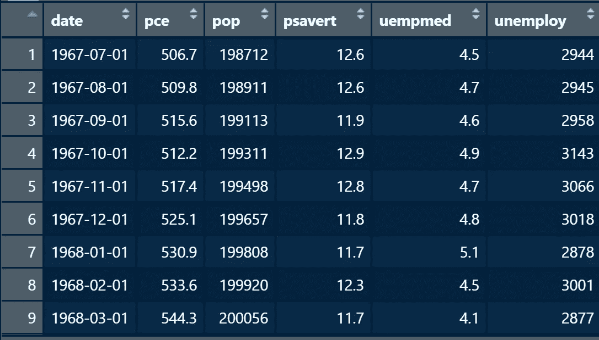

*   `date` —数据收集的月份
*   `pce` —以十亿美元计的个人消费支出
*   `pop` —总人口，以千计
*   `psavert` —个人储蓄率
*   `unempmed` —以周为单位的失业持续时间中位数
*   `unemploy` —失业人数，以千计

为了演示如何使用 R 可视化线形图，您将可视化美国人口从 1967 年到 2015 年的变化。

```
ggplot(data = economics, 
       mapping = aes(
       x = date,
       y = pop)) +
  geom_line()
```

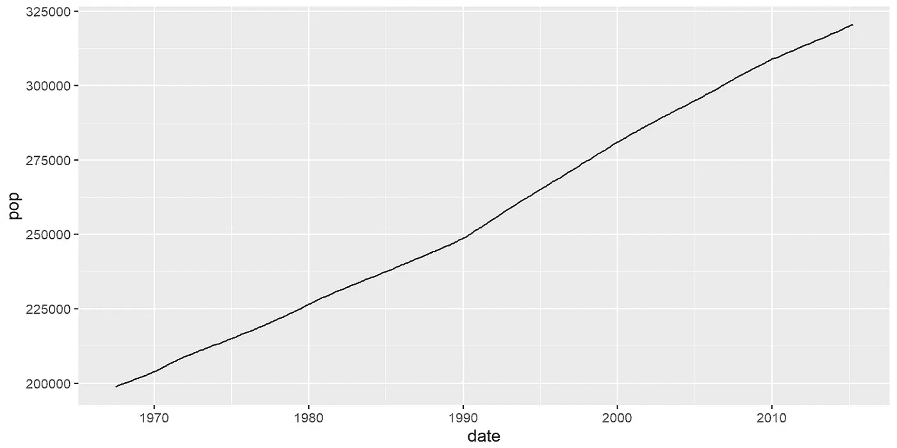

你可以看到这些年来美国人口呈上升趋势。

作为一个快速练习，我会让你想象任何其他变量。

# 标记

如果您已经注意到，您创建的图没有标题，变量的名称也显示为轴的名称。

您可以自定义绘图轴和标题，并使用；

*   `ggtitle` —用于标题标签
*   `xlab` —用于 x 轴标签
*   `ylab` —用于 y 轴标签

您在上面绘制的线形图是由重新创建的；

```
ggplot(data = economics, 
       mapping = aes(
       x = date,
       y = pop)) +
  geom_line() +
  ggtitle("Population of the United States from 1967 - 2015") +
  xlab("Date") +
  ylab("Population")
```

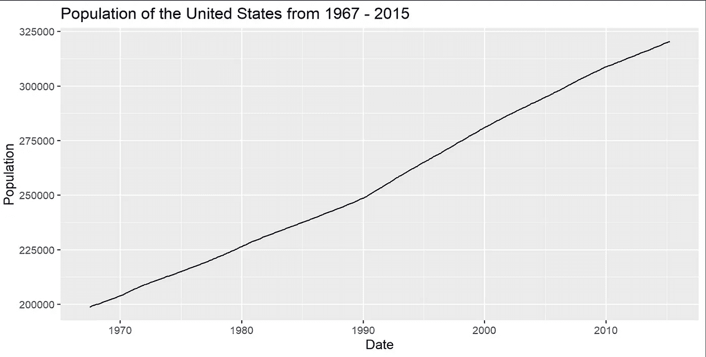

# 刻面

分面是将一个情节分割成不同的子情节，分面让你有机会查看不同类别的情节。

通过将`facet_wrap()`或`facet_grid()` 添加到可视化中，可在 ggplot2 中进行刻面。

以钻石数据集为例，假设您想知道特定切割中不同颜色下的钻石数量。

你可以使用 faceting 来显示这个特殊的信息，你可以传递带有一些参数的`facet_wrap()`函数，我将在下面的代码中解释这些参数。

```
library(ggplot2)
ggplot(data = diamonds, 
       mapping = aes(x = cut,
                     fill = cut)) +
  geom_bar() +
  facet_wrap(color ~ .)
```

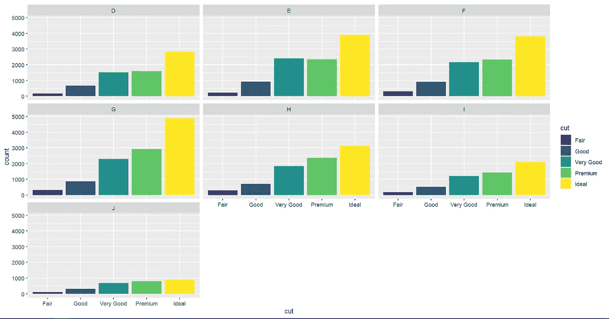

Faceting number of diamonds by cut, by color

符号被称为 Tilda，它告诉 facet 函数图形应该被变量`color`分割，就像你在上面看到的一样。

`facet_grid()`做了同样的事情，除了传递到函数中的任何变量，将图形分割成特定变量在单行或单列上的值的数量。

这与`facet_wrap()`不同，后者根据变量中值的数量将图分成几行和几列。

```
library(ggplot2)
ggplot(data = diamonds, 
       mapping = aes(x = cut,
                     fill = cut)) +
  geom_bar() +
  facet_grid(color ~ .)
```

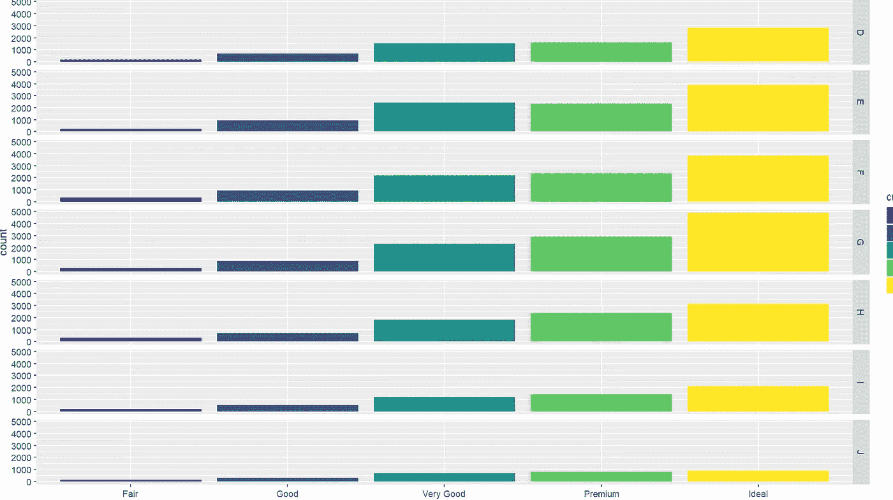

Facetting with facet_grid()

通过 L.H.S 上的 faceting 变量，该图按照颜色的数量(在本例中为 7)水平分割成一列和多行。

在 R.H.S 上传递颜色变量，通过`color`变量中的 7 种情况，该图被垂直分割成多列和一行。

```
library(ggplot2)
ggplot(data = diamonds, 
       mapping = aes(x = cut,
                     fill = cut)) +
  geom_bar() +
  facet_grid(. ~ color)
```


Vertical splitting of plot with facet_grid()

当刻面变量有很多值时，建议使用水平分割来避免轴标签相互重叠，如上所示。

# 结论

`ggplot2`是 R 编程中最常用的可视化库，在本文中，您刚刚学习了如何绘制主要的图形并解释它们。

有很多套装可以让你有机会扩展`ggplot2`的威力。

我希望在你的下一个项目中，你能融入这一点，甚至更多。

感谢阅读。

# 参考文献和相关阅读

*   [ggplot2 文档](https://ggplot2.tidyverse.org/)
*   [ggplot2 备忘单](https://posit.co/wp-content/uploads/2022/10/data-visualization-1.pdf)
*   [如何用 R 编程将一页中的多个图合并](/@adejumo999/how-to-combine-multiple-plots-in-one-page-f17c21bf930b)

# 分级编码

感谢您成为我们社区的一员！在你离开之前:

*   👏为故事鼓掌，跟着作者走👉
*   📰查看[升级编码出版物](https://levelup.gitconnected.com/?utm_source=pub&utm_medium=post)中的更多内容
*   🔔关注我们:[Twitter](https://twitter.com/gitconnected)|[LinkedIn](https://www.linkedin.com/company/gitconnected)|[时事通讯](https://newsletter.levelup.dev)

🚀👉 [**加入升级达人集体，找到一份惊艳的工作**](https://jobs.levelup.dev/talent/welcome?referral=true)