# 对英国政党会议领导人演讲的数据驱动分析

> 原文：<https://medium.com/geekculture/a-data-driven-dive-into-uk-party-conference-leaders-speeches-211afe3b1bd9?source=collection_archive---------21----------------------->

政党会议是英国政治的支柱，政治家、党员和附属人员聚集在选定的城市，制定政党议程，筹集资金，并试图进入主流媒体。这些会议的标志是领导人的讲话，现任党的领导人旨在吸引他们的党的基础，甚至通过媒体报道吸引一些新的选民。

# 数据背景

如果没有[英国政治演讲](http://www.britishpoliticalspeech.org/speech-archive.htm)提供的文字记录，这种分析是不可能的。他们将自己描述为“英国政治言论的在线档案，以及讨论、分析和批判性欣赏政治言论的地方”，并制作可追溯到 1895 年的演讲。

对于我的研究，我的目标是观察 2010 年至 2018 年党的会议领导讲话的细微差别。选择这些日期是因为它们与 2010 年大选后英国政治格局的变化相吻合，同时还为我们提供了足够的数据来进行有意义的分析。在这项研究中，我将只观察三个“主流”政党:保守党、工党和自由民主党。

在导入和整理数据后，我们可以观察到演讲中使用最多的 5 个词。

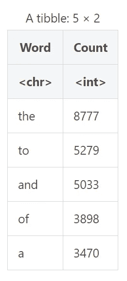

这里没有惊喜。事实上，根据牛津英语语料库，一个包含超过 20 亿单词的文本语料库，这里最常用的前 5 个单词来自英语中最常用的前 6 个单词。

用这些普通的词来进行我们的分析会产生一个枯燥的分析，所以为了抵消这一点，我们将暂时删除它们。我们使用 R 中的`tidytext`包来实现这一点，它包含了一个完整的[停止字](https://rdrr.io/cran/tidytext/man/stop_words.html)列表。这些是英语中的常用词，如果将它们包括在内，对我们分析的某些部分不会有任何帮助。创建了一个单独的数据帧来存储总共 56，989 个词的非停用词，这意味着删除了 105，883 个词。

值得注意的是，没有确定的停用词列表。相反，根据上下文，不同的单词将被视为停用词，尽管为了简单起见，我们只是使用了一个通用列表。我们将在本文后面看到一种更微妙的处理无信息词汇的方法，叫做 TF-IDF。

我们现在可以观察到最常用的 5 个非停用词。

这更像是我们对领导人演讲词汇的预期。

我们可以更进一步，通过单词云来可视化每一方的 100 个最常用的非停用词。这是在每一方的传统颜色下面做的。(蓝色代表保守党，红色代表工党，黄色代表自由民主党)。

我们可以看到，之前被确定为最常见的词在这些词云中也出现得最频繁(由它们的大尺寸表示)。唯一明显的区别是政党名称，尤其是工党和自由民主党。在这里，我们看到了词云的明显缺陷，它们几乎不允许我们观察各方之间的任何差异，也没有提供数字洞察力。我们将在以后用不同的方法来解决这个弱点。

在我们深入一些更详细的文本分析之前，我们可以快速浏览一下每位领导人演讲的字数。

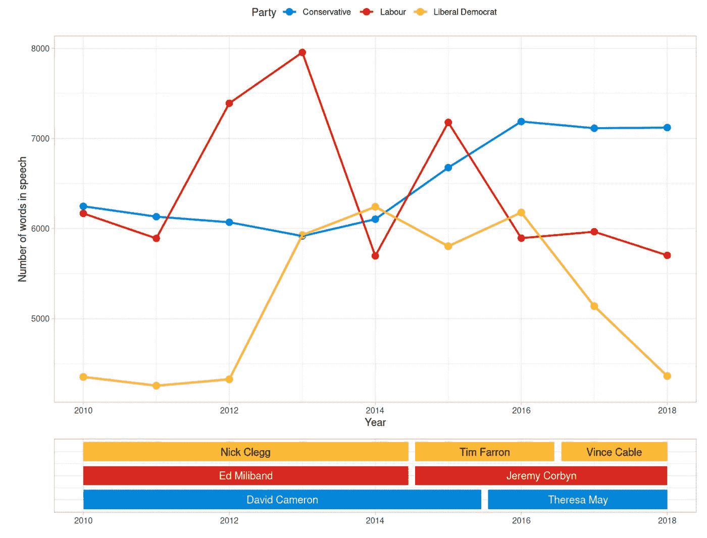

由此可见，埃德·米利班德有时是个漫步者。

# 文本分析

# 分析情绪

基本的计数和汇总很好，但是借助现代数据科学技术，我们可以走得更远。例如，我们可以推断每个演讲的情绪(不严格地说，语气是积极的还是消极的)。

我们通过参照芬恩·阿鲁普·尼尔森创建的 AFINN 词典来参考每个演讲的内容。该词典将从-5 到 5 的整数值分配给大量英语单词，负数表示负面情绪，正数表示正面情绪。这里我们为每个情感值列出一个随机单词。

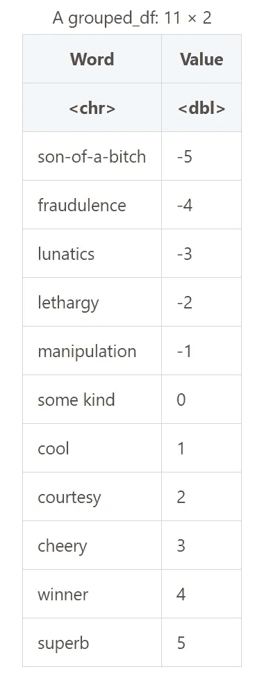

然后，我们可以对每次演讲中所有单词的情绪进行平均，并将其可视化，以查看演讲情绪随时间的趋势。这是在包含停用词的数据集上进行的，否则它可能会扭曲情感(尽管注意大多数停用词具有中性情感)。

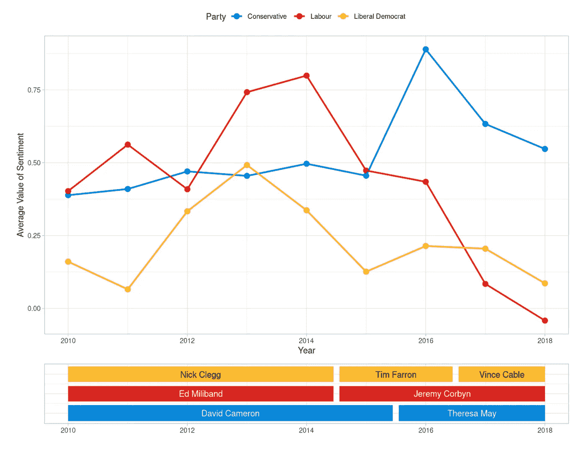

正如我们所见，这些演讲都是压倒性的积极，唯一的负分是杰里米·科尔宾在 2018 年工党会议上的演讲。其他值得注意的价值包括大卫·卡梅伦在 2010 年至 2015 年期间为保守党保持的一致性，以及特里萨·梅在 2016 年接管保守党领导权时积极性的大幅提升。

# 词频和齐夫定律

我们已经看到，原始字数本身并不是特别有用。许多缺点中的一个是较长的文本自然会有更高的字数。相反，一个更有用的指标是某个单词(也称为术语)在所有单词中出现的频率。这被称为*项频率*，定义为

为了便于我们进行跨党派的比较，我们将考察术语频率，即每个术语在该术语所属党派的所有演讲中出现的比例。我们首先来看看每个政党的词频分布。

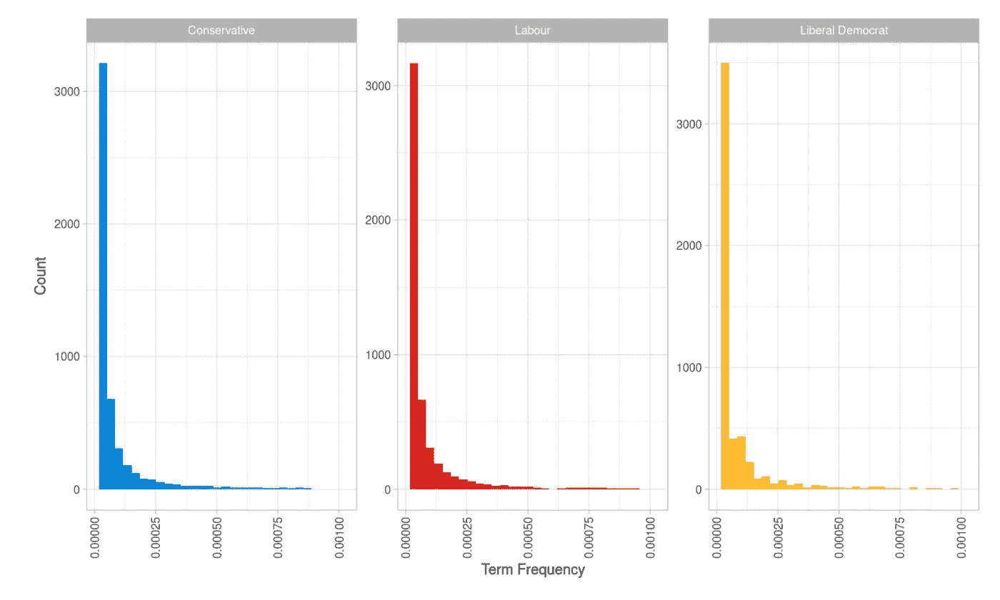

需要注意的是，这些图还有更长的尾部没有显示出来。相反，我们省略了真正流行的词，如“the”、“and”和“to ”,以便更容易看到情节的主体。

这些图都显示了每个政党的相似分布，有许多“罕见”词和较少的流行词。

事实证明，这些长尾分布在自然语言的几乎每一次出现中都很常见。事实上，20 世纪美国语言学家乔治·齐夫创造了*齐夫定律*。这使上述观察正式化，说明一个词在文本中出现的频率与其排名成反比。

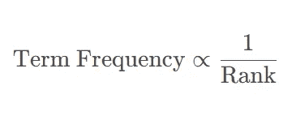

简而言之，最常用的词出现的频率是第二常用词的两倍，第三常用词的三倍。

Zipf 定律在很大程度上适用于许多自然语言，包括英语(尽管也有例外)。例如，在包含略多于 100 万个单词的美国英语文本的棕色语料库中，“the”出现的次数最多，约为 70000 次，“第二多，约为 36000 次”和“第三多，约为 29000 次”，这是根据 Zipf 定律大致预计的。

我们可以通过在 x 轴上绘制排名，在 y 轴上绘制词频，来尝试为我们自己的文本可视化这一规律，两者都是对数标度。

**为什么是圆木？**
根据定义，如果两个值 *x* 和 *y* 成反比，那么我们可以求出一个常数 *a* 使得*y*=*a*/*x .*取对数重新排列得到 log(*y*)= log(*a*)-log(*x*)。换句话说， *x* 和 *y* 成反比当且仅当它们的对数位于一条斜率为负的直线上。

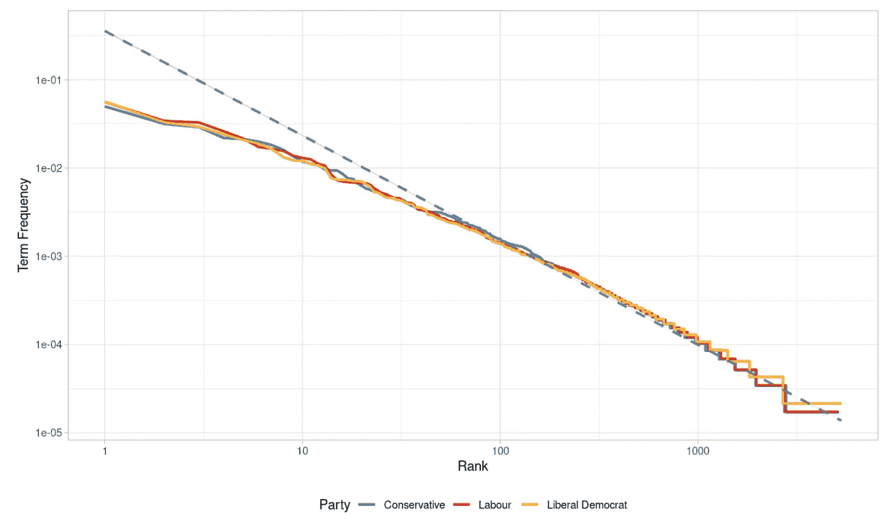

我们可以看到，三方都有类似的文本结构，很大程度上遵守 Zipf 定律。也就是说，我们可以看到我们的曲线在较低的尾部偏离了一条直线，这表明演讲中最受欢迎的词比在自然语言中使用得更频繁。此外，我们预计斜率约为 1；通过拟合线性模型(以灰色显示)，我们获得一个接近该值的系数。

# TF-IDF 分析

我们已经看到，我们可以使用停用词列表来过滤数据，只留下有意义的词。然而，这个列表是固定的，不以任何方式链接到我们的数据。我们已经看到“people”在我们的演讲中使用得非常普遍，因此并没有给我们提供有意义的见解。可以建立一个值来帮助我们看到一个词在我们的演讲中的相对频率，以此来看一个词相对于其他词在一个特定的演讲中有多重要？

我们确实可以。事实上，这项工作已经以一种叫做 TF-IDF 的价值形式为我们完成了。它的计算方法是将前面的术语频率(TF)乘以一个新值，称为逆文档频率(IDF)。

粗略地说，TF-IDF 提出了两个问题:

*   在给定的演讲中，特定术语的使用是否超出预期？
*   演讲中包含特定术语的情况很少见吗？
    如果这两个问题的答案都是肯定的，那么 TF-IDF 是大的，an 这个术语被认为是相对重要的。

我们可以计算每个演讲中每个单词的 TF-IDF 分数，然后使用这些分数来找到每个演讲中最“重要”的单词。

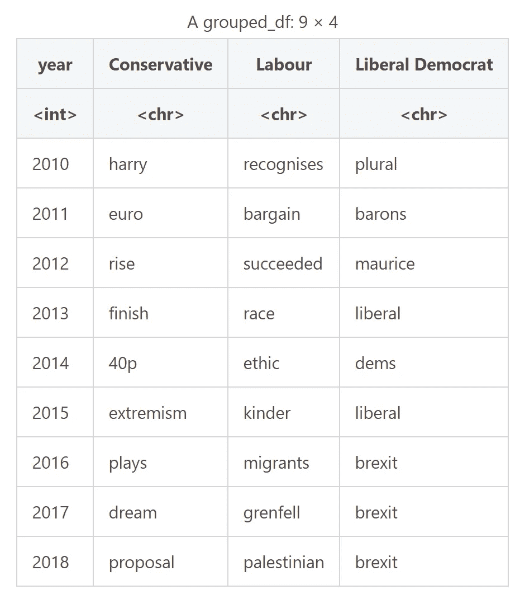

我们得到了一些有趣的结果。例如，2016 年公投后，自由民主党明显转向反英国退出欧盟战略。或者 2014 年，保守党宣布计划提高 40%的所得税起征点(即 40%的税率)。我们还看到杰里米·科尔宾在 2015 年作为领导人的首次会议演讲中提出了“更友好”的政治计划，以及 2017 年提到的格伦费尔大厦灾难。

乍一看，这里出现的诸如“哈里”和“莫里斯”之类的名字很有意思。这是指“哈利·贝考夫”和“莫里斯·里维斯”，他们分别是长期的保守党成员和一家家具店的老板，他们的店在伦敦骚乱中被烧毁。

# 复杂性考虑

我们可以通过很多方法来观察一篇文章的复杂性，或者说是一篇演讲。对于这首曲子，我们选择每个单词的平均音节数。这方面的数据取自`quanteda`包，我们可以将结果可视化。

在这个情节中，我们可以看到不同领导人之间的深刻差异。分别在 2010-2014 年和 2010-2015 年发表演讲的工党和保守党领导人埃德·米利班德和大卫·卡梅隆的复杂性远远低于最近的领导人，如工党的杰里米·科尔宾和自由民主党的文斯·凯布尔，他们的演讲加起来排在最复杂演讲的前六位。

*在这篇文章中，我们使用平均音节数作为衡量语言复杂性的指标，因为外行人很容易理解。也就是说，通过* `*quanteda*` *，还有许多更微妙和有趣的复杂性度量可用，例如 Flesch–Kincaid 可读性分数。*

# 决定选举的不同方式？

在英国,[得票最多者当选制度](https://www.electoral-reform.org.uk/voting-systems/types-of-voting-system/first-past-the-post/)经常被抱怨为不适合现代政治。现在，这不是我的位置来评论这个系统，但如果推建议另一个系统，前面提到的`Quanteda`包确实给了我们另一个选择…

我们可以计算出每年领导人党内会议发言的平均每字拼字得分！首先让我们观察一下政治家们做出的最令人印象深刻的努力:

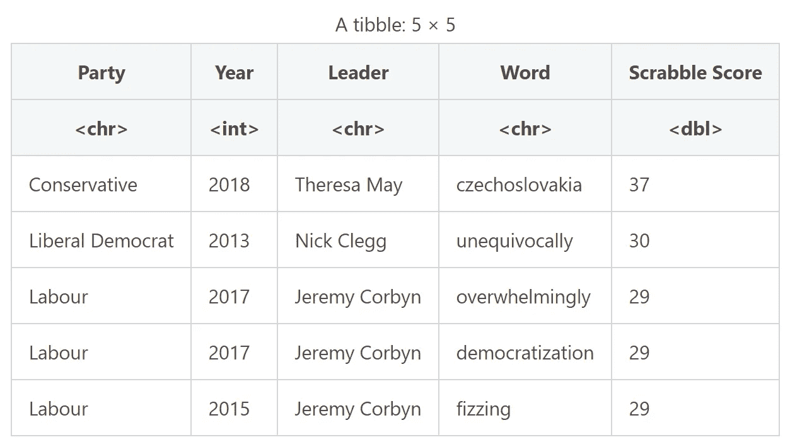

特里萨·梅在 2018 年凭借“捷克斯洛伐克”获得了令人难以置信的 37 分，但这当然会因为是专有名词而被取消资格。结果，尼克·克莱格以 30 分的“毫不含糊”保持着记录！我们也可以将每个单词的平均分数可视化如下。

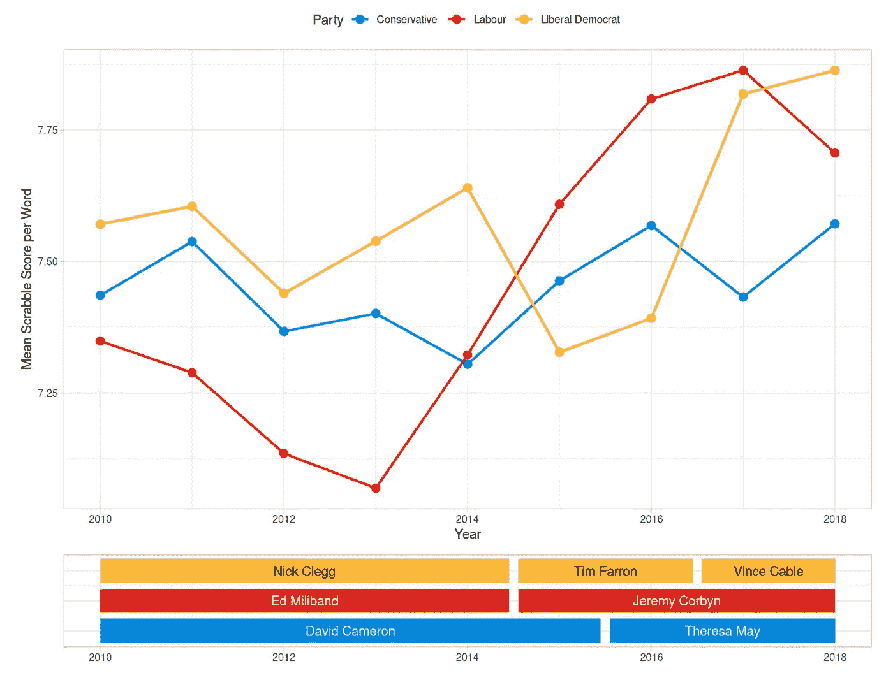

正如我们所见，如果由拼字游戏决定，自 2010 年以来一直执政的保守党将不会赢得任何一年。事实上，在杰里米·科尔宾的领导下，自由民主党将赢得我们与工党合作的 9 年中的 6 年，并赢得另外 3 年——我相信事后看来两党都会对此感到高兴！

以防有人有任何幻想，当然我的意思是拼字游戏分数是一种糟糕的决定选举的方式，我不赞成使用它——至少，一个猜字游戏会更合适…

# 外卖食品

至此，我结束了对英国政治演讲的简短介绍。虽然我刚刚开始触及自然语言处理(NLP)方法的表面，但我希望我已经展示了这些技术可以用来通过情感、TF-IDF 和音节复杂性来总结大块文本的方式的力量。

在开始这个项目时，我对 NLP 方法的经验很少，我要感谢 WDSS(特别是 Janique Krasnowska)在项目完成前对我的支持。我觉得我学到了很多东西，当然也增加了我的知识和经验。我建议任何想在他们的学位之外进行一些数据科学研究的人寻找 WDSS 的研究机会，并用双手抓住它们——我当然会寻找更多的机会！

# 附录:所有语音指标的汇总表

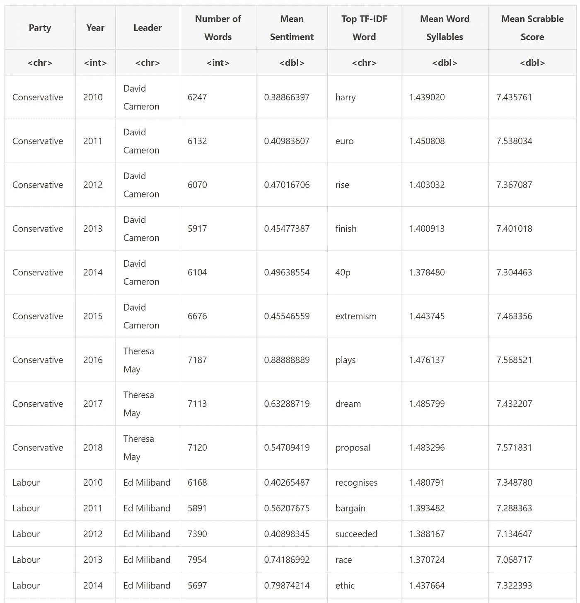

Part 1

Part 2

这篇文章是由[伊万·耶克斯利](https://www.linkedin.com/in/ewan-yeaxlee-7b13a9181/)撰写的。Dominika Daraz 的替代图像文本。由-NC-SA 4.0 抄送[下的文章。](https://creativecommons.org/licenses/by-nc-sa/4.0/)