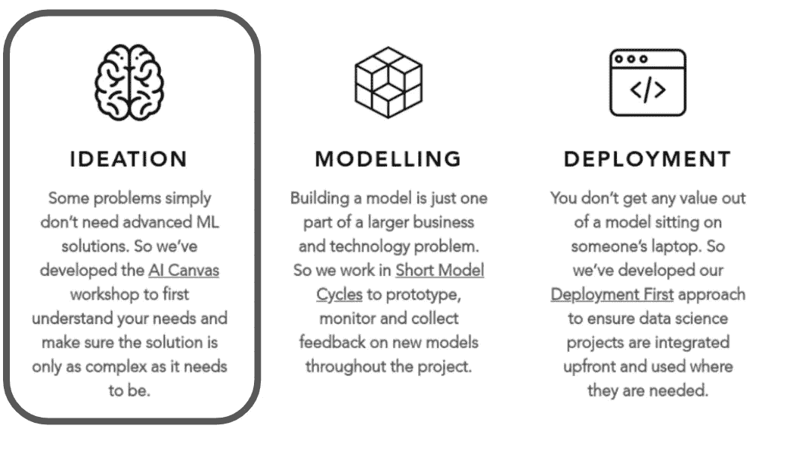
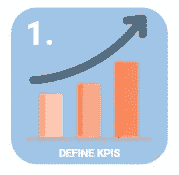
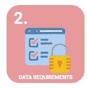
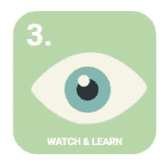

# 数据科学从业者指南(第 1 部分:范围界定)

> 原文：<https://medium.com/geekculture/a-data-science-practitioners-guide-f459eb915b5a?source=collection_archive---------6----------------------->

# 介绍

在我的工作中，我敏锐地意识到人工智能研究的力量和潜力与公司实际利用这些技术来提供实际商业价值的能力之间的脱节。

作为一名数据科学从业者，我每天都会遇到一些客户，他们被失败的人工智能项目所困扰，并且越来越怀疑机器学习(ML)提供切实价值的能力。我已经帮助许多这样的公司扭转了他们的数据产品，我想我在这个过程中学到了一些东西。

在这个由 3 部分组成的系列中，我试图提取其中的一些经验教训，以帮助其他数据科学从业者避免一些从事 ML 项目的公司最常犯的错误。该系列将被分解为关于 [(1)范围](/geekculture/a-data-science-practitioners-guide-f459eb915b5a)、 [(2)建模](/geekculture/a-data-science-practitioners-guide-part-2-modelling-1a7225f45394)、 [(3)部署](https://medium.com/r?url=https%3A%2F%2Fsamueldylantrendlerking.medium.com%2Fa-data-science-practitioners-guide-part-3-deployment-e017c780cd85)的课程。这是该系列的第一部。

The Three Phases of a Data Science project ([https://www.codepan.com/](https://www.codepan.com/))

# **什么是数据科学项目的“范围界定”?**

数据科学的“范围界定”或“构思”阶段包括了解潜在的业务问题，将其与潜在的分析解决方案联系起来，并评估该解决方案是否具备实际工作所需的所有构件！这应该是任何潜在的 ML 项目过程的第一步，如果你做对了，那么下游的一切都将变得容易得多。

下面我总结了我在研究数据科学和 ML 项目时学到的五条最重要的经验:

## **1。定义项目的业务和技术 KPI 非常重要:**

不了解项目的业务和技术目标是什么(以及它们之间的关系！)那么确定一个 ML 项目实际上是有价值的，并且这个价值可以被有效地测量，是不可能的。这就是为什么尽早让相关的业务和技术利益相关者参与进来，并确保他们的项目目标一致，并且这些目标可以被有效地度量是如此重要。一旦这些目标明确，确保每个人都在同一页上，并在整个项目中保持这些业务目标的前端和中心是很重要的。你的最终目标不是创造一个高性能的模型，而是减少真实的人做真实的事情的时间/痛苦/成本！你的技术 KPI 是什么(80%的准确率是好结果还是坏结果？)完全依赖于项目的商业目标，这一点应该经常加强。

## **2。尽早提出数据需求和隐私问题会让你的生活轻松很多:**

ML 项目的理论价值经常被数据限制严重削弱。如果你有一个完美的用例，但是没有以适当的方式收集训练数据，那么建立一个 ML 模型并不是立即可行的。同样，如果数据存在，但隐私保护法规意味着它不能被查看或用于其他目的，那么你会再次发现这个项目被卡住了。最好是尽快理解和标记这些问题，并在着手构建实际项目之前制定出可能的解决方案。通常，这意味着与客户合作，将数据收集和匿名化作为(预)项目的一部分，并且可以成为在此过程中向公司传授 ML 项目的数据存储和隐私保护最佳实践的好方法。

## **3。没有什么可以替代亲眼目睹人们如何工作**

我在范围界定阶段经常做的一件关键事情是理解当前的(手动/笨重/耗时)过程是什么，以及新的 ML 驱动的过程如何改进它。要做到这一点，除了直接查看相关人员当前的工作情况，别无选择。例如，如果您正在提议一个模型，该模型将自动将客户请求的票证映射到正确的类别，而不是目前的手动方式，那么就去与执行该任务的实际人员交谈吧！这不仅有助于你思考问题所在，还可能有以前没有提到的细微差别。客户(尤其是与实际工作没有直接联系的人)并不总是看到事物的真实面目。你需要自己去发现；因此，与实际用户建立通话，并开始直接与他们交谈！这不仅会让你更熟悉你正在解决的真正难题，而且还有助于获得最终使用你的解决方案的实际用户的认同！

## **4。做时间和业绩承诺是愚蠢的:**

在确定 ML 项目的范围时，经常会有一种诱惑，那就是承诺一个模型将花费多长时间来构建或者它将执行得多好。像“我们将建立一个准确率超过 99%的模型”这样的陈述是胡说八道，应该这样对待。像“我们将能够在 2 次冲刺中建立这个模型”或者“我们将需要 1000 个数据输入的例子来开始建模”这样的陈述也是如此。事实是，像这样的问题只能凭经验来回答(即，你需要查看数据，然后才能估计一个模型有多精确，或者你需要多少数据输入)。相反，你能做的是承诺探索不同的选项，并在给定的时间内给出这些选项可行性的具体答案。例如(一旦你有了数据访问权),你就可以在项目中写一个 2 周的关口，明确交付成果，评估对于给定的用例使用 ML 的可行性。这不仅更容易估算，而且给客户提供了他们需要的证据和选择，以决定是否继续为整个 ML 项目融资。为此，将 ML 项目划分为多个阶段也是有帮助的，在每个阶段的结尾都有“门”,你希望在那里回答像这样清晰可定义的问题。这样的关卡会让你和客户以一种基于证据的方式知道项目是如何进行的，如果继续下去是有意义的，以一种敏捷的方式适应或停止项目。盖茨是双赢的，可以帮助双方降低 ML 项目的风险，因此即使在范围界定阶段，也值得讨论盖茨在哪里以及为什么有意义。

## **5。诚实是最好的策略:**

最后，也可能是最重要的，我学到的关于确定 ML 项目范围的最有价值的一课是诚实和开放是最好的政策。在对人工智能相对幻灭的时期，许多公司因失败的“人工智能”项目的昂贵投资而损失惨重，客户真正看重的是诚实和公正的建议，即人工智能是否以及在哪些方面对他们的业务真正有意义。事实上，有些问题根本不需要先进的 ML 解决方案，诚实面对这一点——即使这意味着放弃一个特定的项目，使用一个更简单/更便宜的解决方案——对于与客户建立信任至关重要，从长远来看总是有回报的！任何项目的目标都是解决人们的问题，而不是为了解决问题而开发‘复杂’的人工智能解决方案。与客户建立这种信任和理解也许是任何 ML 项目成功的最重要的基础，从长远来看会带来更有成效和可持续的关系。

我发现，与客户一起参加早期发现研讨会来浏览像 AI canvas 这样的框架，确实有助于在构思阶段确保您在与客户一起确定项目范围时没有忘记重要的业务和技术主题:

AI Canvas ([https://www.codepan.com/](https://www.codepan.com/))

# 结论

在任何成功的 ML 项目中，范围界定都是绝对关键的一步，如果你做对了，那么下游的一切都会变得容易得多。

我希望这篇文章是有帮助的！如需了解更多关于 ML 项目范围的信息或任何其他信息，请直接联系我。期待您的来信，并在这个系列的下一部分中再见。