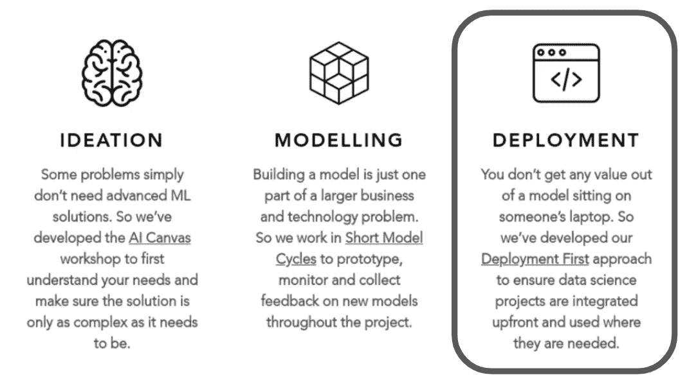
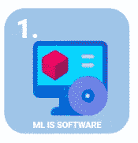
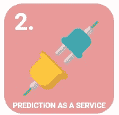
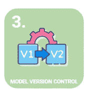
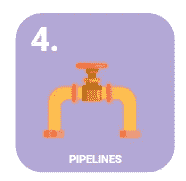
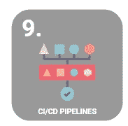
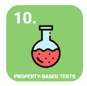

# 数据科学从业者指南(第 3 部分:部署)

> 原文：<https://medium.com/geekculture/a-data-science-practitioners-guide-part-3-deployment-e017c780cd85?source=collection_archive---------9----------------------->

# 介绍

在这个由 3 部分组成的系列中，我试图总结一些经验教训，以帮助其他数据科学从业者避免一些从事 ML 项目的公司最常犯的错误。该系列将被分解为关于 [(1)范围](/geekculture/a-data-science-practitioners-guide-f459eb915b5a)、 [(2)建模](/geekculture/a-data-science-practitioners-guide-part-2-modelling-1a7225f45394)、 [(3)部署](https://samueldylantrendlerking.medium.com/a-data-science-practitioners-guide-part-3-deployment-e017c780cd85)的课程。这是那个系列的第三个。

The Three Phases of a Data Science project ([https://www.codepan.com/](https://www.codepan.com/))

# 数据科学项目的“部署”到底是什么？

数据科学项目的“部署”阶段实际上包括将您的模型投入生产并呈现在真实用户面前。

部署是棘手的，有许多不同的方面。事实上，许多关于部署的概念和工具都是从软件开发中借鉴来的。我想提前说一下，这篇文章并不是一个完整的部署指南，它更关注 ML 部署的概念和原则，特别是与传统软件应用程序相比，部署 ML 模型的一些特性。ML 部署是一项跨学科的活动，就像生活中的所有事情一样，因此最好作为团队的一部分来完成！

也就是说，下面我总结了我在 ML 项目部署阶段学到的十条最重要的经验:

## **1。ML 软件还是软件**

当你把它全部拆开时，ML 模型就像任何一个传统软件一样，只是一些花哨的功能。它们接受输入(数据)并给出输出(预测)，中间只是一堆混乱的统计数据和矩阵乘法。从这个意义上说，所有相同的软件最佳实践原则和设计模式也适用于 ML 产品。我的第一个也可能是最有用的建议是和团队的其他成员一起设计模型部署架构！在部署软件时，数据工程师、软件开发人员和系统架构师可能比你知道得更多，所以要利用他们的知识！在部署阶段，有许多考虑要考虑，特别是如果你在一个客户系统中工作(对不起，是一个 web 应用程序的梦想，数据不能离开我们的前提，所以我们希望你在本地部署等等。)因此，您可以尽可能多地利用其他利益相关者的经验来帮助选择合适的部署技术和设计模式，以便更好地完成手头的工作。

## **2。预测“作为服务”是一个有用的概念**

如上所述，在软件开发中有一些普遍可靠的趋势，在大多数情况下，这也是 ML 部署的一个很好的经验法则。例如，将您的预测模型视为一项(微)服务通常会非常有帮助。例如，你可以将你的模型输入/输出包装在一个 RESTful API 中(如果是一个更大的项目，我喜欢使用 [FastAPI](https://fastapi.tiangolo.com/) 或 [django](https://www.djangoproject.com/) ，但基本上是任何已知的具有标准化输入和输出的协议)，然后将应用程序 Dockerized，这样它就可以作为一个独立的容器进行部署。这不仅会使部署您的模型变得容易得多(您现在可以直接使用任何现成的容器部署架构/运行容器的云服务)，而且还会使软件开发人员更容易将您的预测服务与其他后端/前端服务或全新的产品集成在一起！

## 3.模型版本控制将使您的生活变得更加轻松

另一个可以从软件扩展到 ML 部署的隐喻是版本控制和开发/登台/生产环境。了解哪个版本的代码被部署到哪个环境对于部署可维护的软件来说是至关重要的，这对于 ML 部署来说也是如此。然而，与传统软件相比，ML 模型的结果还取决于模型架构本身和用于训练它的数据(我喜欢用这个简单的等式来考虑 ML:ML =数据+模型+代码)。除非您能够有效地控制所有这三个元素的版本，否则您可能会失去对在哪里部署了什么的跟踪。事实上，我可以回忆起多个项目，在这些项目中没有被跟踪，我们最终的情况是，在生产中部署的模型出了问题，我们没有好的方法来准确地知道它是哪个模型，更不用说如何准确地再现它，以便可以检查和调试它了！谢天谢地，有一些很棒的工具可以帮你做到这一点:我个人非常喜欢用于模型版本控制的 [Mlflow(模型注册)](https://www.mlflow.org/docs/latest/model-registry.html)和用于数据版本控制的 [DVC](https://dvc.org/) (以及用于代码版本控制的 git 两者配合得非常好。

与传统软件相比，ML 部署的另一个特点是，与传统软件的微小尺寸(通常仅与脚本本身一样大)相比，经过训练的 ML 模型文件通常可能非常大(MBs 甚至 GBs)。将模型文件提交给 git repo 不是一个好主意，而且会迅速膨胀您的存储库。因此，当您定义这些模型文件将实际存在的模型版本控制系统时(提示:像 AWS S3 桶或 Azure Blob 这样的可伸缩对象存储通常是一个不错的选择)，以及它们将如何被下载并注入到您的预测服务中(在应用程序首次加载时下载模型并在每次调用预测服务时保持缓存的 API 调用在这里可能是一个不错的设置)，提前考虑是值得的。

## **4。认为管道不仅仅是预测**

当考虑部署 ML 模型时，非常值得扩展您对“模型”的定义，不仅指核心预测算法，还指转换准备好进行预测的数据所需的整个预处理管道(例如，数据清理、特征化器)以及准备好输出以供消费所需的任何后处理步骤(例如，将整数表示转换回标签字符串)。关键是要理解原始数据(在生产时)将以什么样的形式进入，并确保您的模型管道可以在这种状态下安全地接受它，并进行所有必要的转换，以做出预测并以健壮的方式传递结果。我认为[sci kit learn 的“管道类](https://scikit-learn.org/stable/modules/generated/sklearn.pipeline.Pipeline.html)实际上是一个非常好的框架，可以帮助较小的项目思考这个问题，尽管像 [Airflow](https://airflow.apache.org/) 和 [Kuberflow](https://www.kubeflow.org/) 这样的工具可以帮助你真正将管道正式化为生产过程。围绕模型的预处理和后处理“粘合”代码通常最终成为代码库的绝大部分，甚至更经常地成为最难维护的部分，因此将它视为模型的一部分并将其正式化为模块化管道对于运行紧密的部署船是至关重要的。

## **5。及早部署，经常部署！**

如果我有一条关于部署的建议，那就是:尽早部署，经常部署。毫无疑问，我在 ML 项目中看到的最常见的错误是花费太多的时间预先构建一个模型，然后在最后几周匆忙部署，结果却遇到了不可避免的相关问题。但是你可能会问，如果我还没有一个模型，我该如何部署呢？我发现的一个很好的方法是勾画出部署架构，然后构建一个“虚拟”模型并进行部署。例如，假设您计划构建一个模型，将文档分为三类:法律、财务和业务。构建完整的模型需要一些时间，而且可能很复杂。但同时，您可以创建一个简单的 python 类“DummyModel”，它将文档作为输入，就像您的模型一样，并具有一个转换方法，可以调用该方法以您的模型将返回的形式输出(在本例中，它是文档类别的单个预测，例如“Legal”)。实际的预测可以只是随机的，或者一些超级简单的启发式基线(见[我以前的帖子](/geekculture/a-data-science-practitioners-guide-part-2-modelling-1a7225f45394))；这其实并不重要。重要的是你要尽可能早地尝试和部署这个虚拟对象，并且尽可能早地解决所有的部署问题。我有时称这个概念为“部署优先”,因为它有点颠覆了只有在模型建立之后才进行部署的传统方法，我发现它在开始新的 ML 项目时非常有用。

## **6。你需要用户反馈**

您的 ML 解决方案只有在人们从中获得价值时才是好的，因此数据科学家实际上比任何人都更需要用户反馈！你会惊讶有多少次模型结果中的意外 UX 问题给不想使用产品的人带来了痛苦。也许这方面最经典的例子就是精确度/召回率的权衡:你应该错过更多的假阳性还是假阴性？这通常有时会留给数据科学家来回答，但实际上不应该！对于用户来说，错过一些相关的文档是否重要，以及重要到什么程度，例如，以不必看到不相关的文档为代价，只能通过理解用例并在产品开发周期中获得用户反馈来回答。然而，它对建模和如何优化成本函数有直接的影响。因此，至关重要的是，您的 ML 部署周期与更广泛的产品开发周期保持一致，并且您可以从这些周期中获得反馈，以改进您部署的下一个模型。

## **7。在部署中观察您的模型可以帮助您找到减轻模型性能压力的新方法**

将您的部署与产品开发周期集成的一个非常好的特性是，一旦您开始与产品 UI/UX 连接，您就会开始意识到您的模型通常是解决实际问题的唯一方式。例如，我参与了一个从文档中提取信息的项目，其中用例要求模型的准确性基本上是 100%(因为对于法律记录来说，一个错误就可能导致严重的后果)。虽然我们能够实现强大的建模结果，但在任何现实世界的 ML 问题中，完美的性能几乎是不可能的。然而，通过观察部署中的模型，并与前端和 UX 设计师合作，将模型预测概率传递到用户界面中，以便向用户突出显示模型不太确定的情况，并指导他们检查这些情况，我们能够*增强*用户工作流程，让 ML 模型承担减少用户以前必须做的繁琐的手动工作(手动检查每个文档)，同时仍然确保最终结果没有人的监督和(实际上)错误。在部署中观察您的模型有助于进一步将数据科学家与实际问题和表面创造性解决方案联系起来。

## **8。试着提前考虑监控和再培训！**

在野外，模型性能通常会迅速衰减。您的训练集可能不代表真实的数据分布，或者分布本身可能是一个移动的目标(用户首选项改变，文档结构更新等)。).因此，您的模型在生产中的表现可能比您预期的更差，尤其是随着时间的推移。解决这个问题的唯一方法是在野外坚持不懈地监控你的模型，在生产中收集实际用户数据的样本，并最终重新训练你的模型。然而，为了有效地监控，你需要提前考虑所有其他需要考虑的问题:你有办法在人们使用产品时收集反馈和新样本吗？你将如何给这些样品贴标签？你的再培训策略是什么(每次你得到一个新的样本？一旦产品评估集上的模型衰减降到 X 以下？)您将如何跟踪模型的哪个版本正在被部署？重新培训后，您的基础架构是否支持 A/B 测试来评估新的模型版本？像 [Prometheus](https://prometheus.io/) 和 [Grafana](https://grafana.com/) 这样的工具可以很好地监控生产中的模型性能，并帮助跟踪不同模型版本和 A/B 测试管道应该部署在哪里。

## **9。利用 CI/CD 管道使您的 ML 模型达到生产级别**

将模型部署与您的 CI/CD 测试管道相集成，并编写有意义的测试和日志来检查模型在进行更改或发布新的模型版本时的行为是否符合预期，这也是值得的。它还将帮助您以一种有组织和可伸缩的方式管理将哪些模型版本部署到哪些环境中。最近，我一直在研究 Github Actions 来构建这些管道(尽管现在有很多不同的 CI/CD 工具)。同样，这些都是从传统软件开发中借鉴来的良好实践，尽管我认为它们在 ML 产品中可能更加棘手，在 ML 产品中，模型的确切行为可能是随机的并且难以预测，因此在部署时结构化 CI/CD 管道的好处甚至更大。

## 10.在处理 ML 时，基于属性的测试非常有用

关于测试的话题，我发现写“基于属性的测试”(以及传统的单元和集成测试)真的很有帮助。基于属性的测试基本上是创建数据样本，这些样本可以通过您的模型来检查您是否获得了预期的输出。但是，您可以生成受您指定的属性约束的大量随机数据集，而不是预定义该数据。反过来，您可以通过您期望模型具有的属性来断言您不期望从模型得到的确切输出。例如，对于预测股票价格的时间序列回归模型，您可以断言输入属性将是表示该股票价值的最后 100 天的浮点数组，而输出属性应该是不能低于 0 美元且不能超过 10 亿美元的单个浮点。然后，我可以生成大量的合成输入，这些输入可以包含我的输入属性约束内的任何值，并监视输出属性是否仍然得到维护。这可能是捕捉未知边缘情况(如果传入空数据，或者如果所有值都是零，会发生什么)的一个好方法。更重要的是，这是发现模型的“反常”结果的好方法，可以帮助您了解系统中的弱点，并在部署中出现问题之前改进服务。也许一些输入导致您的模型预测股票的负价格，这对于用例没有任何意义，并且应该在它导致问题之前被纠正。像[假设](https://hypothesis.readthedocs.io/en/latest/)这样的库在帮助你为 ML 模型编写基于属性的测试方面做得很好，并且可以真正帮助你构建一个更健壮的 ML 部署服务。

我试图在这里更多地关注 ML 部署的概念，而不是具体的技巧、工具和技术。事实上，有大量优秀的工具来支持 ML 部署，这甚至是在你进入像 AWS、Azure 和 GCP 这样的云提供商提供的大量部署服务之前。这可能令人眼花缭乱，但我的建议是从简单开始，在遇到新的部署难题时探索不同的技术，直到构建出符合您需求的堆栈。

# **结论**

你不会从坐在别人笔记本电脑上的模型中得到任何价值。因此，认真对待部署并提前处理它是确保 ML 项目整体成功的最重要的方面之一。

我希望这篇文章是有帮助的！这是这个 3 部分系列的结尾，但是如果你想了解更多关于 ML 项目的信息或者其他任何东西，请直接联系我。期待收到你的来信。