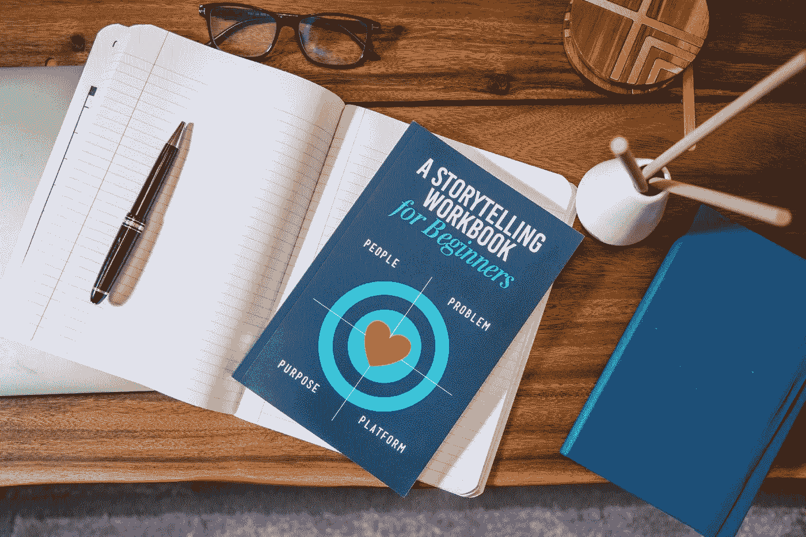

# 数据科学家讲故事指南

> 原文：<https://medium.com/geekculture/a-data-scientists-guide-to-storytelling-51c8e1110474?source=collection_archive---------6----------------------->

> *如果你想用你从数据科学中获得的真知灼见来说服别人，让别人眼花缭乱，你需要掌握讲故事的技巧*

Storytelling with data is an art that can be learnt and evolved (picture credits @rainbennet, unsplash.com)

谁不喜欢好故事？从 J.K .罗琳和斯蒂芬·金到加来道雄和尼尔·德格拉斯·泰森，任何类型的故事讲述者的巨大影响力都不会被夸大。他们精湛的故事反复强调了一个关键点——除非你从一开始就让观众着迷，并让他们从头到尾参与进来，否则你试图传达的信息，无论有多酷，都将被置若罔闻。典型的人类思维会回避分散的信息，但会无缝地调谐到令人信服的故事中。

数据科学也不例外。想想我们的数据科学家，他工作了几个月，有时包括周末，从充满质量和数量问题的数据集中获得非常新、酷和可行的见解。在完成这项具有挑战性的智力练习后，她开始向她的经理(一位非技术专业人士)展示结果。唉，后者既不欣赏数据科学家解决方案的创造性，也不欣赏数据集带来的巨大挑战。在这里，我们提出这样一个问题“数据科学家或管理者错过了什么？”。因为我们在本文中没有讨论经理培训，所以让我们只关注数据科学家。

上述场景太常见了。如果没有有说服力的故事来强调数据集的挑战和解决方案的独创性，数据科学家将很难激发同事、经理或利益相关者的热情。更危险的是，那些理解被剥离了适当上下文的零碎信息的非技术人员可能会得出他们自己的错误解释。那么，一个数据科学家如何上升为一个能够影响他人的讲故事高手呢？

正如获得任何新的有价值的技能一样，这将保证随着时间的推移进行大量的有意识的练习。这里值得玩味的一个值得注意的小字是沉湎于‘熟能生巧’。相比之下，盲目的练习只能使永久的，而不是完美的！

但是，这里有一些提示可以帮助你开始:

1.  **利用三幕故事的力量:**

*第一幕，尽可能清楚地陈述你正在努力解决的问题。*让我们挑选几个真实世界的机器学习例子来说明这一点—

(a)用于[在胸片](https://www.kaggle.com/c/siim-covid19-detection/overview/description)中识别新冠肺炎的计算机视觉解决方案，

(b)识别信用卡欺诈，

(c)预测实际的末日年月(哎哟！).这是针对那些希望在埃隆·马斯克飞往火星的 SpaceX 飞船上保留一席之地的人，名单还在继续…

第二幕，告诉你的读者或观众，为什么我们解决了问题，这是一件大事。根据上面的例子，这意味着

(a)仅使用分子测试来诊断新冠肺炎可能需要几天时间，并且可能出现高达 30%的假阴性。重要的是，在世界上的一些地区，X 射线诊断比分子诊断更容易获得。这些延迟、不确定的测试结果和访问问题都将对患者治疗产生负面影响，尤其是在资源匮乏的公共卫生环境中。我们如何利用 X 射线诊断来解决这些问题，并有可能挽救数百人的生命和数百万美元的治疗费用？

(b)每年发生 50 多万起信用卡欺诈案件，在此过程中银行和客户至少损失 100 亿美元。我们如何在欺诈发生的瞬间发现它，并防止不可挽回的损失进一步发生？

(c)对此持保留态度——地球人口约 80 亿，准确预测潜在的世界末日将使我们能够更好地优先考虑火星殖民。我们知道地球存在的上限是再过 75 亿年，从那时起它将最终被我们的太阳吞噬。然而，由于其他危险，包括全球变暖，广泛的核毁灭，致命病毒的可怕全球流行，或与重大小行星的不受欢迎的幽会，可能会更早地结束地球上的所有人类。我们能否有把握地预测其中的任何一点，并增强埃隆·马斯克的火星殖民梦想？

*第三幕。最后，你能提供什么解决问题的方案？*您的解决方案将节省多少资金、工时或生命？再一次，基于我们的例子——

(a)使用射线照片，您的新型深度学习集成计算机视觉解决方案以 95%的准确率检测新冠肺炎。此外，它在 90%的情况下将新冠肺炎肺异常与其他混淆的肺异常区分开。当与数字 X 射线一起正确部署时，它可以用于对高风险患者进行早期积极治疗。在考虑了其他相关的新冠肺炎人口数据后，你将这些精确度转化为挽救的生命数量。例如，你的解决方案将*防止十分之二的新冠肺炎死亡*，这是由于延迟启动积极的治疗方案而发生的。

(b)你的新信用卡网络安全系统将减少 5%到 10%的信用卡欺诈。虽然百分比可能看起来相对较小，但它转化为防止高达 10 亿美元被盗。

(e)你的高度复杂的、概率性的世界末日预测模型有 10 年的误差幅度。由于这将有助于围绕火星殖民调整支出战略和资源分配，它将每年为政府节省 500 亿美元。从更轻松的角度来看，这也将确保埃隆马斯克仍然是地球(或火星)上最热门的企业家之一。).

请注意，上面引用的这些数字纯属虚构，仅用于说明我们讲故事的方式。

**2。使用非技术风险承担者可以理解的语言。**在准备与可能来自其他非技术领域的利益相关者交流时，请将此技巧放在您思想的前沿和中心。一个永远安全的策略是远离使用高科技、“数据科学家专用”的行话，如 F1 分数(与 F1 赛车有关？)，超参数调优(超关于什么？)，R 的平方(这个 R 到底是什么东西？).相反，努力将这些指标翻译成另一方容易理解的语言——在您的解决方案中投入 1 美元，公司将获得多少美元的利润？或者，我们将拯救多少生命，甚至保护多少失去的工作时间？

**3。使用引人注目的数据可视化。**无论是一篇政治上激动人心的 [*《纽约时报》*](http://www.nytimes.com/) 文章，还是一篇书呆子内特·西尔弗的 [*538*](http://www.fivethirtyeight.com/) 博客文章，甚至是一篇具有科学煽动性的 [*新科学家*](http://www.newscientist.com/) 文章，伟大的数据故事通常都伴随着精心制作的数据可视化。你可以在网上、[Coursera](https://www.coursera.org/learn/python-for-data-visualization?specialization=ibm-data-science&utm_source=gg&utm_medium=sem&campaignid=1876641588&utm_campaign=10-IBM-Data-Science-US&utm_content=10-IBM-Data-Science-US&adgroupid=117357906417&device=c&keyword=&matchtype=b&network=g&devicemodel=&adpostion=&creativeid=507196710149&hide_mobile_promo&gclid=CjwKCAjwhOyJBhA4EiwAEcJdcS2YHGXOpQQGJPIIY_SzEZAXXDBKh30PXtr-2od2c25nQ74wQmg2RhoCdWEQAvD_BwE)或者你的大学图书馆找到一些关于如何制作迷人的数据可视化的优秀资源，其中[爱德华·塔夫特图书](https://www.edwardtufte.com/tufte/)在这方面已经取得了某种狂热的地位。

虽然我不想剥夺你学习数据可视化的所有乐趣，但这里有几个要点需要记住——(a)有意义地选择你的[彩色地图](https://matplotlib.org/stable/tutorials/colors/colormaps.html)，同时善待色盲人群，(b)避免在你的图中添加多余的标签，以及(c)选择正确的图来强调你试图传递的观点。一开始我经常使用的一个技巧是浏览一些流行的 python 可视化包库。从 [seaborn 的](https://seaborn.pydata.org/examples/index.html)和 [bokeh 的](https://seaborn.pydata.org/examples/index.html)图库页面中选择的额外好处是，每个图库样本都给你生成情节的代码；你所需要做的就是将代码复制粘贴到你的编程环境中，然后“修改”它以适合你的确切需求！

**4。总结你的见解。**天下没有不散的宴席，您的数据故事也不例外。拉开帷幕的一个有效方法是展示您在数据科学冒险中定期取得的进展，以总结您的故事中的关键要点。

**5。敞开提问和反馈的大门。提高你讲故事技巧的一个重要的成长思维方式是征求反馈。不是所有的评论都是有帮助的，甚至是善意的，但是你很可能会得到改进你手艺的新方法的种子。还记得我们在这篇文章的开始就同意刻意练习吗？**

拥抱用数据讲故事的优雅和力量，实践和发展，愿原力与你同在！！！