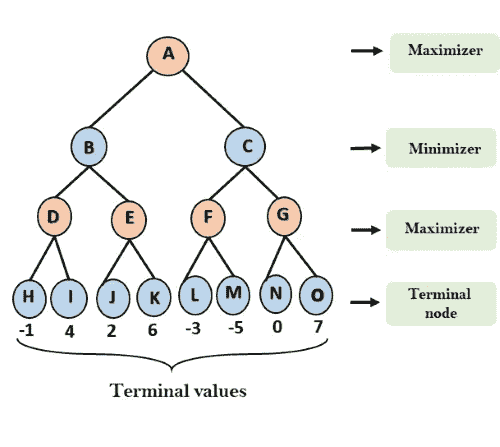
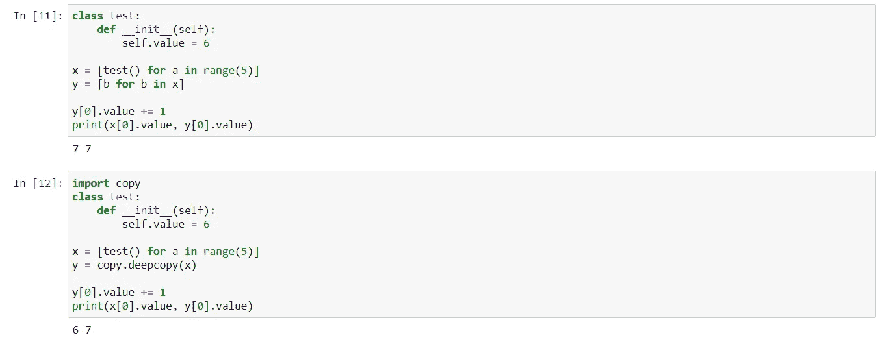
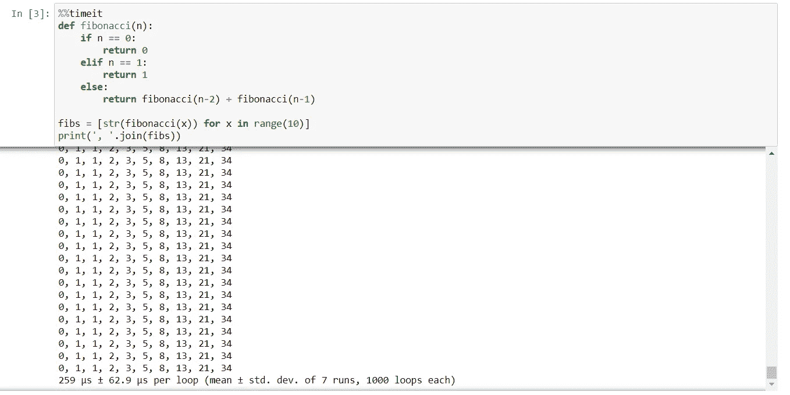
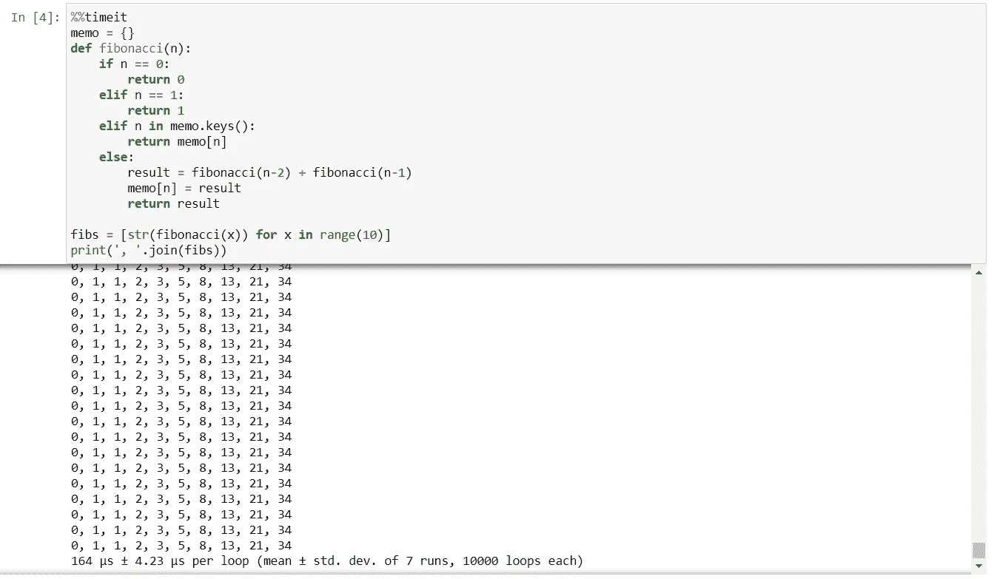

# Python 中对象和递归的一次尝试

> 原文：<https://medium.com/geekculture/a-foray-into-objects-and-recursion-in-python-738d9372d6b8?source=collection_archive---------75----------------------->

[Source](https://www.amazon.com/Hasbro-4430-Connect-Four/dp/B00000IWI1)

自从我上次学习和尝试 Python 已经有一段时间了。我最初通过 YouTube 视频自学，大约 13 岁时，我们的主和救世主堆栈溢出。那时候，除了满足自己的好奇心和创造一些让我真正感到自豪的小项目，我没有别的目标。此外，我对人工智能的想法很着迷，特别是那些在各种游戏中“计算机控制”角色背后的想法。我既讨厌在回合制游戏中被人工智能踢屁股，又对它们的工作方式着迷。

进入极大极小算法。我不太确定我最初是如何遇到这个概念的，但很可能是在学习递归和递归函数时偶然发现的。

在计算机科学中，特别是在编码中，当一个函数为了计算或创建它的输出而调用它自己时，它被称为递归的。结果，函数*重复地递归*，直到到达某个终止点(通常可通过在该实例中给予函数的输入来识别)，其中返回一些预定的(或容易确定的)输出，允许所有嵌套的函数最终返回它们的值，从内部开始并向外移动。

也许这方面最著名的例子是一个函数，它给出了斐波那契数列中的第 n 个数字。该数字列表由以下规则定义:

1.  第一个斐波那契数列是 0。
2.  第二个斐波那契数列是 1。
3.  第 *n* 个斐波那契数等于第( *n-2* )个和第( *n-1* )个斐波那契数之和。

从上面可以清楚地看到，为了确定任何 Fibonacci 数超过前两个的值，必须首先计算它前面的两个。为了计算这些，在序列中在*之前的数字*也必须被确定，等等。因此，为了计算*任何*斐波纳契数，似乎必须从头开始。

本质上，这正是递归函数所做的。它调用自己，在开始返回一个又一个结果之前，深入到自己的“嵌套”中，朝着最终目标努力:初始输入的结果。取下面的函数，它以 *n* 为输入，返回第 *n* 个斐波那契数:

fibonacci(n) returns the *nth Fibonacci number via recursions.*

这里，`fibonacci(n)`返回前两个斐波那契数的和(通过调用自身找到)，除非到达一个具有已知或明确定义结果的终点(在这种情况下，如果`n== 0`或如果`n== 1`)。

最小最大算法是类似的，它是一种为简单的回合制游戏创建人工智能的方法。在这里，输入是人工智能需要知道(或知道)的关于游戏的所有信息，例如棋盘状态、轮到谁了等等。输出是产生最高分数的移动选择(可以是 Connect 4 中的一列，或者是井字游戏中网格上的一个点)。有趣的是:每一步棋的得分都被计算为对方玩家在未来任何一步棋中可以允许的最低得分。每个延续的分数(也就是下一步棋之后的一步棋)都是由人工智能在延续的*或*中所能达到的最高分数决定的。

本质上，极大极小算法着眼于未来，检查每一条分支路径。只有在终端节点(赢或输，每个都被赋予一定的值)，它才能开始回到现在，在*对手*将控制的回合中选择未来选项中的最小值，在*人工智能本身*将控制的回合中选择最大值。请参考下图。

[Source](https://www.javatpoint.com/mini-max-algorithm-in-ai). The minimax algorithm alternates between picking the maximum and the minimum of the options it sees.

假设橙色节点是人工智能的回合，蓝色节点是对手的回合。每个玩家轮流从树上接下来的两个选项中选择。人工智能寻求尽可能高的数量，而对手寻求最低的数量。

人工智能本质上首先深入研究终端节点，找到它们的值。然后，因为这些终端节点之前的转弯是橙色的，所以它为每个橙色节点挑选蓝色选项中的最大值。因此，D 被分配 4，E 被分配 6，F 被分配-3，G 被分配 7。现在看来倒退了一步。由于这些节点是蓝色的，它选择了最小的(因为对手正朝着它的损失努力)。所以，B 被赋值为 4，C 被赋值为-3。现在，它着眼于现在(在一个实际的实现中，可以看到未来的更多层，而不仅仅是三层)，并在其选项中选择最高的一层。所以，它选择了选项 b。

这些是极大极小算法的基础。在我年轻的时候，我被看起来如此复杂(我敢说)的未来概念迷住了。通过一套简单的步骤和规则，人工智能可以被教会玩几乎任何具有一定熟练程度(理论上完美)的回合制游戏。尽管我理解这种算法，并决心看到它开花结果，但是，我花了几个小时试图在完美的 Connect 4 A.I .中实现这种算法，但一再失败，我彻底放弃了这个想法。

回顾过去，我把我的失败归因于两个无能:对对象和副本的根本误解，以及在优化方面缺乏创造力。所以，我想现在我已经对这两个领域有了更彻底的了解，我会在 8 年后再试一次。从那以后，我用一些重要的工具武装了自己。

其中第一个是对物体更强的理解。在我 8 年前的尝试中，为了创建多个列对象，我编写了一个名为`column`的类。我认为游戏中的移动归结为选择一列，这是有意义的。然而，当极小极大算法开始递归循环时，麻烦出现了。

为了访问和编辑每一列，我在`minimax()`的顶部写了`global colname`(不太好看)。然后，我将所需的列分配给一个变量名，比如说`column_played`，向列添加一部分，然后继续循环。我没有意识到为列对象创建一个新变量实际上并没有创建一个新对象。因此，对新的、假设的列变量所做的任何编辑都可以追溯到真实的、当前的游戏中。

这种怪癖的一个例子如下:

Assigning an object to a variable doesn’t copy the object. Thus, changes made affect any variable assigned to the given object.

然而，这还不是全部。我还将每个专栏编辑成一个名为`board`的列表。因此，即使我对`board`进行了适当的复制，新列表仍然会引用相同的旧对象。我需要的是一个*深度副本*，演示如下:

Changes to a deep copy leave the original list of objects entirely untouched.

现在知道了这一点，我开始写 Connect 4，决心这次要让它成功。此外，为了索引和内置函数的简单性，我放弃了`column`类，而是选择使用 NumPy 数组。

我很快写了一个简单的 Connect 4 游戏，设计为在终端中运行(没什么花哨的)。在看到它对两个人类玩家正常工作后，我开始实现最小最大算法…

立刻遇到了许多障碍中的第一个:

That’s a lot of calls!

事实证明，Python 对函数调用自身的次数有限制。默认情况下，该值设置为 1000。对于一个标准的 6x7 Connect 4 网格，在 4，531，985，219，092 个棋盘状态下，我的 minimax 算法试图调用自己*远远超过* 1000 次。

所以，我设定了算法的深度限制。我发现，在没有不合理的长时间等待的情况下，我能走的最远距离是 5 步。到达深度 5 后，我告诉程序简单地随机移动并继续前进。

通过这种改变，成功地避免了递归限制。然而现在，人工智能只不过是一个随机发生器。除非一个有保证的赢或输(作为一个终端节点)可以在未来的 5 步棋中被发现，否则它走的棋完全是随机的。因此，人工智能只会在游戏接近尾声时玩 Connect 4 的智能游戏，此时它一直玩得很差，所以它的失败是不可避免的。我需要找到一个答案。

进入记忆化，这是一种通过避免重复调用来加速递归函数的技术。我知道你在想什么。但是 Andre，我认为重点是重复呼叫！一切都会得到解释。

考虑上面的`fibonacci()`。每次调用函数时，对于大多数数字来说，函数必须调用自己*两次以上*。要是它能记住给定输入的结果输出就好了…

多好的主意啊。我们来实施吧。

The memo serves to store the results of inputs that the function has “seen” before.

这里，每次`fibonacci()`接收到一个新的输入，它检查输入`n`是否存在于字典`memo`的键中，该字典被初始化为空。如果不是，函数照常运行，只是将计算结果添加到`memo`中，并将输入作为键。如果是，它就使用`memo[n]`返回存储的结果。

除了有助于避免递归限制之外，这种技术还可以显著提高函数的速度，因为它不再需要计算已经回答过的问题的答案。它有效地实时编写自己的备忘单！比较有记忆和没有记忆的函数的运行时间:

A hefty 259 microseconds without memoization…

164 microseconds!? Boy howdy!

将近 100 微秒被剃光！如果我运行这段代码 2，100，000 次，我将节省足够的时间来做一整袋爆米花！

[Source](https://www.reddit.com/r/MemeRestoration/comments/ejqdod/depressed_kid_in_sonic_costumethe_problem_of/)

所以，我让人工智能循环播放我。每次算法想出一个不只是随机选择的走法(不是随机的意思是赢、输、平或保存在备忘录中的棋盘状态)，它都会将该走法存储在一个字典中，其关键字等于棋盘状态的元组，它正在玩什么字母，等等。此外，我意识到在 Connect 4 中看到的许多板状态是彼此相同的。任何镜像(左右翻转)都是等效的，只需要反向移动选项。此外，任何状态都与通过翻转每个棋子的字母(X 或 O)并像控制那个新字母一样弹奏所获得的状态相同。所以，我写了一个名为`flip_letters()`的函数，它接收一个板子，然后吐出一个正确的、*翻转的*副本。然后，我用`numpy.fliplr()`创建了一个翻转版的棋盘阵列。除了这样做的结果之外，我还将这两个更改添加到了备忘录中。

上述等价的结果是，该算法填充备忘录的速度比它本来的速度快 4 倍左右！

大约 10 场比赛后，我可以看到算法开始越来越快地工作。我突然想到，我没有时间和人工智能玩几十到几百个游戏，只是为了让它更新自己的备忘单，达到一个像样的游戏水平。

在做了一些研究后，我发现了一个[解决方案。我可以简单地把备忘录保存在我电脑上的一个文件里。这样，即使在我停止并重新运行程序后，人工智能也会记住它以前所有的“训练游戏”。](https://stackoverflow.com/questions/19201290/how-to-save-a-dictionary-to-a-file/32216025)

仁慈的上帝赐予人工智能完美而永恒的记忆，我迫不及待地开始和它玩一个又一个游戏。不可否认，这很快就变得无聊了，人工智能学得很慢。这时，我的朋友杰里提供了一些投入。“嘿，为什么不让人工智能自己玩几百次呢？AlphaZero 不就是这么做的吗？”他说，指的是打败冠军和人工智能伙伴的著名国际象棋人工智能。

所以我就是这么做的。在设置人工智能玩 200 场游戏并等待几个小时后，我回来检查它的进度。

首先，它现在玩得更快了。移动之间 30 秒钟的等待已经一去不复返了。据我估计，人工智能现在平均需要 10 秒左右的时间来思考一个动作，当比赛接近尾声时(即当需要考虑的“未来”更少时)，它会以极快的速度进行比赛。

其次，我保存涡轮发动机字典的文件非常大。在我写这篇文章的时候，它在我的硬盘上占据了相当大的 305 MB，而且它还远远没有增长完。事实上，它目前只包含少得可怜的 158 万个董事会状态。如果你问我，这个大男孩文件只是为了快速游戏而做出的一个小小的牺牲。

总的来说，我对这个项目非常满意。编写、调试和解决问题这个简单的单人游戏 Connect 4 的过程向我介绍了三个新的库(`pickle`、`copy`和`os`)，同时允许我重新熟悉一个新的库(`numpy`)。此外，我能够测试并应用我新获得的关于 Python 对象及其副本的知识。最终的结果是一个我可以引以为豪的程序，因为它既弥补了我青春期前的自我，又锻炼了我的迷你肌肉。