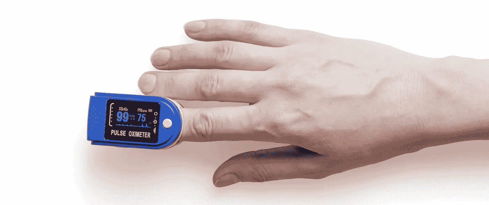

# 基本医疗保健 IT 标准和法规指南

> 原文：<https://medium.com/geekculture/a-guide-to-the-essential-healthcare-it-standards-regulations-edd77a40fa70?source=collection_archive---------22----------------------->

20 世纪 80 年代，ERP 和 EHR 开创了医疗保健 IT 的现代时代。今天，临床护理、病人安全和质量改进几乎完全交给了计算机。

然而，尽管有一系列可用的通信技术，但没有管理和传输医疗保健数据的通用方法。阻碍顺利数据交换的最大障碍是无序采用医疗数据标准来存储、编码和共享临床信息。

虽然联邦政府一直在推进医疗保健系统的整合，但导航众多医疗保健 IT 标准的需求依然存在。

这篇博文列出了重要的医疗 IT 标准和法规，供[医疗软件公司](https://itrexgroup.com/services/healthcare-software-development/)和医疗机构在开发和推广医疗技术时牢记。让我们开始吧！

# 管理数据安全的医疗保健 IT 标准

# HIPAA

曾经作为保护失业工人健康保险的法案，HIPAA，或[健康保险携带和盈利法案](https://www.cdc.gov/phlp/publications/topic/hipaa.html)，现在可能是保护医疗保健信息的最著名的立法。它为存储、共享、管理和记录个人可识别健康信息(PHI)设定了标准。

因此，任何涉及操作医疗保健数据或提供处理此类数据的软件的实体都必须确保符合必要的医疗信息技术法规。HIPAA 由几个部分组成:

*   安全规则
*   隐私规则
*   违反通知规则
*   总括规则
*   实施规则

与医疗保健软件相关的是安全、隐私和违规通知规则。

## HIPAA 安全规则

安全规则概述了保护 PHI 的安全措施，包括三个部分:技术、物理和管理安全措施。

**技术保障**

技术保护措施要求医疗保健组织在电子 PHI 传输到内部服务器之外时对其进行加密。组织可以自由选择适当的方法来实现以下要求:

*   访问控制(必需)确保有权访问 PHI 的每个用户都有唯一的名称和密码。医疗保健数据标准还要求制定在紧急情况下管理 PHI 发布和披露的程序
*   ePHI 认证(可寻址)需要建立机制来确认 PHI 是否被更改或破坏
*   加密和解密(可寻址)为发送到内部服务器之外的消息提供加密和解密功能
*   活动日志和审核控制(必需)记录 PHI 访问尝试，并记录数据被访问后所做的更改
*   自动注销(可寻址)可防止设备无人看管时泄露个人健康信息

**实物保护**

物理安全措施侧重于保护对 PHI 的物理访问，并制定了保护移动设备和工作站的措施。医疗保健组织需要实施:

*   设施访问控制(可寻址)
*   定位和使用工作站的指南(必需)
*   移动设备使用程序(必需)
*   清单和硬件策略(可寻址)

**行政保障**

行政保障规定了保护公共利益的高级措施。他们要求:

*   进行风险评估(必需)
*   引入风险管理政策(必需)
*   培训员工安全处理健康数据(可寻址)
*   制定应急计划(必需)
*   测试应急计划(可寻址)
*   限制第三方对数据的访问(必需)
*   报告安全事件(可解决)

## HIPAA 隐私规则

HIPAA 医疗保健数据标准的隐私规则概述了如何使用和披露 PHI 的措施。根据隐私规则，医疗保健组织应该:

*   培训员工，确保他们知道哪些信息可以在组织的安全机制之外共享，哪些不可以
*   实施适当的措施以保持 PHI 的完整性
*   在将患者的健康信息用于营销、筹款或研究之前，确保收到患者的书面许可

## HIPAA 违规通知规则

违反通知规则要求医疗保健组织在患者的 PHI 受到损害时通知患者。它还要求各实体及时通知卫生与公众服务部 PHI 违规事件，并在违规事件影响超过 500 名患者时向媒体发布通知。

# 高科技

《健康信息技术促进经济和临床健康法案》于 2009 年签署。新的医疗保健 IT 法规旨在促进“医疗信息技术的采用和有意义的使用”,并制定了更严格的 HIPAA 执行措施。该法案要求医疗保健提供商进行安全审计，以调查他们是否遵守 HIPAA 的隐私和安全规则。

因此，HITECH 可能被视为 HIPAA 的执行部门。医疗保健 IT 法规还为医疗保健组织提供了财务激励，以消除转向 EHR 的成本，并对医疗保健提供商和软件供应商提出了更严格的数据安全要求和处罚。根据 HITECH，必须通知患者未经授权访问他们的数据，个人健康信息只能通过安全的方法共享。

# GDPR

《通用数据保护条例》是控制欧盟所有问题数据的重要医疗保健 IT 法规之一，健康信息也在其范围之内。值得记住的是，GDPR 不仅适用于总部设在欧盟的组织，也适用于欧盟以外的组织，以防他们针对 EU-的个人。组织为确保 GDPR 合规性而采取的关键步骤包括:

*   任命一名专门的数据保护官
*   通过进行数据保护影响评估来评估与数据相关的风险(DPIA)
*   设计并推出数据安全策略
*   在 72 小时内通知数据泄露。

# 医疗保健 IT 法规将医疗设备和软件作为医疗设备进行控制(SaMD)

# 美国食品和药物管理局

美国美国食品药品监督管理局监管从食品到药品到化妆品的一切。医疗 IT 供应商感兴趣的是，该实体为医疗设备和用作医疗设备的软件应用程序审查和设置医疗 IT 标准。因此，如果您的软件涉及执行一项医疗任务，并且无意中使用该软件必然会带来高风险，您将需要获得 FDA 的许可。

受 FDA 监管的软件示例可能包括帮助控制血压袖带充气和放气的应用程序，或指导胰岛素泵胰岛素输送的移动应用程序。您可以在这里[查看所有使您的产品获得 FDA 批准的特性。](https://www.fda.gov/media/80958/download)

另一方面，如果你的软件不符合医疗设备的定义或对公众构成低风险，你可能不需要申请 FDA 批准。从 FDA 认证中排除的应用程序可能包括帮助患者自我管理病情而不提供具体治疗建议的移动应用程序，或帮助医疗保健提供商自动化日常任务的移动应用程序。为了获得食品和药物管理局的批准，

*   将您的设备或 SaMD 分类

在您的[医疗保健应用开发](https://itrexgroup.com/services/healthcare-app-development/)之旅开始时，对您的软件或设备进行分类。根据您产品的特性，它可能属于 I 类、II 类或 III 类，这决定了要执行的医疗软件法规。a 类设备取决于其预期用途，更重要的是，取决于其风险。第一类涵盖风险最低的设备，第三类涵盖风险最高的设备。要确定产品类别，您可以直接进入[分类数据库](https://www.accessdata.fda.gov/scripts/cdrh/cfdocs/cfpcd/classification.cfm)并按名称搜索设备。

或者，您可以转到[面板列表](https://www.fda.gov/medical-devices/classify-your-medical-device/device-classification-panels)，按您的设备所属的面板或医疗专业进行搜索。此外，由于高达 74%的 I 类设备免于上市前通知程序，请通过在[医疗设备豁免](https://www.accessdata.fda.gov/scripts/cdrh/cfdocs/cfpcd/315.cfm)页面上搜索来检查您的产品是否属于这种情况。如果您正在开发具有全新预期用途的医疗设备或 SaMD，我们建议您直接联系 FDA，讨论可能适用的医疗保健信息技术法规。

*   实施必要的控制

I 类医疗器械需要实施一般控制，即:

1.  机构注册和医疗器械列表( [21 CFR Part 807](https://www.accessdata.fda.gov/scripts/cdrh/cfdocs/cfcfr/CFRSearch.cfm?CFRPart=807)
2.  质量体系条例( [21 CFR 第 820 部分](https://www.accessdata.fda.gov/scripts/cdrh/cfdocs/cfcfr/CFRSearch.cfm?CFRPart=820))
3.  标签要求( [21 CFR 第 801 部分](https://www.accessdata.fda.gov/scripts/cdrh/cfdocs/cfcfr/CFRSearch.cfm?CFRPart=801))
4.  医疗器械报告( [21 CFR 第 803 部分](https://www.accessdata.fda.gov/scripts/cdrh/cfdocs/cfcfr/CFRSearch.cfm?CFRPart=803)
5.  上市前通知( [21 CFR 第 807 部分](https://www.accessdata.fda.gov/scripts/cdrh/cfdocs/cfcfr/CFRSearch.cfm?CFRPart=807))
6.  报告更正和删除( [21 CFR 第 806 部分](https://www.accessdata.fda.gov/scripts/cdrh/cfdocs/cfcfr/CFRSearch.cfm?CFRPart=806))
7.  研究器械临床研究的研究器械豁免要求( [21 CFR 第 812 部分](https://www.accessdata.fda.gov/scripts/cdrh/cfdocs/cfcfr/CFRSearch.cfm?CFRPart=812)

二类器械需要执行上述一般控制、[特殊控制](https://www.fda.gov/medical-devices/guidance-documents-medical-devices-and-radiation-emitting-products/class-ii-special-controls-documents)和[上市前通知](https://www.fda.gov/medical-devices/premarket-submissions-selecting-and-preparing-correct-submission/premarket-notification-510k)。III 类设备需要实施一般控制和[上市前批准](https://www.fda.gov/medical-devices/premarket-submissions-selecting-and-preparing-correct-submission/premarket-approval-pma)。一旦您准备好了所需的文档，就提交它以供考虑。*注:截至 2022 年初，该实体正在起草* [*规范远程数据采集和临床研究*](https://www.fda.gov/regulatory-information/search-fda-guidance-documents/digital-health-technologies-remote-data-acquisition-clinical-investigations) *数字健康技术的指导意见。指南还没有最终确定，但我们会继续关注它。*

# 医疗保健内容结构标准

# HL7

HL7 由 Health Level Seven International 开发，这是一个提供框架和相关健康信息法规的非营利实体，负责处理不同医疗保健系统之间的医疗数据交换。标准是 EHR 的支柱。由于 EHR 是一个分布式系统，依赖多个子系统之间的平稳交互来构成特定的医疗保健流程，HL7 充当这些子系统之间的链接。HL7 医疗保健 IT 标准有两个版本。

*   HL7 版本 2: HL7 v2 适合集中式患者护理系统和分布式环境，其中患者数据驻留在部门子系统中。随着 HITECH 的签署，HL7 版本 2.5.1 被特别选为满足特定认证的标准。
*   HL7 版本 3: HL7 v3 采用了一种新的方法来交换临床信息，这种方法依赖于以 XML 语法编写的消息。HL7 v3 的目标是增加 HL7 标准在世界范围内的采用，消除模糊性，并创建一个更精确的标准，避免遗留问题。因此，与 HL7 第 2 版相比，HL7 第 3 版具有一致的数据模型，并为用于不同临床功能的应用程序和消息定义了明确的角色。

HL7 版本 3 主要用于没有传统通信要求、没有 HL7 版本 2 的历史使用记录的应用，或者在政府对 HL7 版本 3 的使用有严格要求的地区。两个版本的医疗保健数据标准共存，在同一机构中同时部署多个版本的标准是很常见的。

# 消息传输标准

# FHIR

建立在 HL7 之上的快速医疗保健互操作性资源描述了电子健康记录的数据格式和 API。该标准提供了一组基于 HTTP 的 RESTful APIs，让医疗服务提供者共享 XML 和 JSON 格式的数据。该标准适用于各种环境，从移动应用程序到云应用程序，再到基于 EHR 的数据共享。FHIR 的一个基本要素是资源。

根据其类型，资源可以包含有关患者人口统计、药物、护理计划、过敏等数据。当组合在一起时，资源构成了不同的临床和管理工作流。尽管医疗保健提供商对 FHIR 成熟度的反应不一，但预计到 2024 年，FHIR 将接管其他医疗保健数据交换标准。原因是 FHIR 提供了构建用于访问医疗保健数据的标准化应用程序的可能性——无论哪个 EHR 支撑着基础设施。

# DICOM

DICOM，即医学中的数字图像和通信，促进了医学图像和相关数据在软件和硬件之间的交换。与 JPEG 或 TIFF 等不包含图片上下文数据的标准图像文件相比，DICOM 文件具有更复杂的结构。

它们包含元数据，提供关于患者和图像采集参数的信息。DICOM 适用的系统是多种多样的:从 CT 和 MRI 扫描仪到图像存档和通信系统(PACSs)到放射信息系统(RISs)。

# 处理医疗保健技术解决方案时要记住的关键事项

疫情已经推动许多医疗保健组织和健康创业公司以数字为先。因此，进入医疗保健市场的技术解决方案数量大幅增加。作为医疗保健技术的提供商和用户，您能做些什么来确保相关解决方案符合所有必需的医疗保健 IT 法规？我们编制了一份需要牢记的基本提示清单。

# 给医疗保健技术供应商的提示:

*   开发一种新的技术解决方案需要对医疗保健系统的复杂性和特殊性有深刻的理解。因此，在深入研究产品设计之前，一定要了解产品将被使用的环境，包括组织设置、相关的利益相关者群体和利益相关者关系。评估与使用你开发的医疗技术相关的风险也是至关重要的。了解风险将有助于您概述必要的医疗保健 IT 标准。
*   要使你的产品获得批准，你需要向监管机构提交所有类型的文件。因此，当构思、设计和开发您的解决方案时，记录开发过程。要确定您需要遵循哪些文件和程序，请咨询[卫生与公众服务部、监察长办公室(OIG)](https://www.hhs.gov/regulations/index.html) 、[药品执行管理局(DEA)](https://www.dea.gov/) 和[美国食品药品监督管理局(FDA)](https://www.fda.gov/) 。
*   在实际进入市场之前，考虑进行外部合规性测试。与了解医疗保健软件法规的供应商合作有助于降低将您的产品推向市场的风险。

# 给医疗机构的建议:

为了确保您使用的技术符合所有必要的医疗软件法规，建立一个全面的组织范围的合规性计划至关重要。

*   为此，成立一个多学科委员会，并任命一名首席合规官(CCO)来指导合规工作。
*   第二步，让委员会制定完成合规所需的必要政策、流程和时间表。
*   确保您的合规路线图包含定期的内部和外部审计。让第三方审计员审查您的合规性流程有助于发现漏洞、漏洞和工作流程效率低下。
*   为了最大化您的合规性工作，推出一个强大的员工教育计划，并确保您的员工被教导始终遵守相关的医疗保健 IT 标准。
*   最后，通过定期评估合规计划的有效性，确保你的努力结出硕果。

# 而不是结论

随着医疗保健技术接近其发展势头，创新技术如[医疗人工智能](https://itrexgroup.com/services/ai-for-healthcare/)、 [IoMT](https://itrexgroup.com/services/iot-healthcare-solutions/) 和 [RPA](https://itrexgroup.com/services/robotic-process-automation/) 获得更多关注，监管机构致力于制定医疗保健 IT 标准。随着标准变得越来越精确和复杂，医疗创业公司和医疗保健组织要找到与其产品相关的内容并保持合规性变得非常棘手。

> *因此，如果您想开发一个医疗保健解决方案，检查所有需要的合规性框，* [*联系 ITRex 专家*](https://itrexgroup.com/contact-us/) *。我们将帮助您实现顶级安全和不折不扣的安全性。*

*原载于 2022 年 3 月 22 日 https://itrexgroup.com***。**