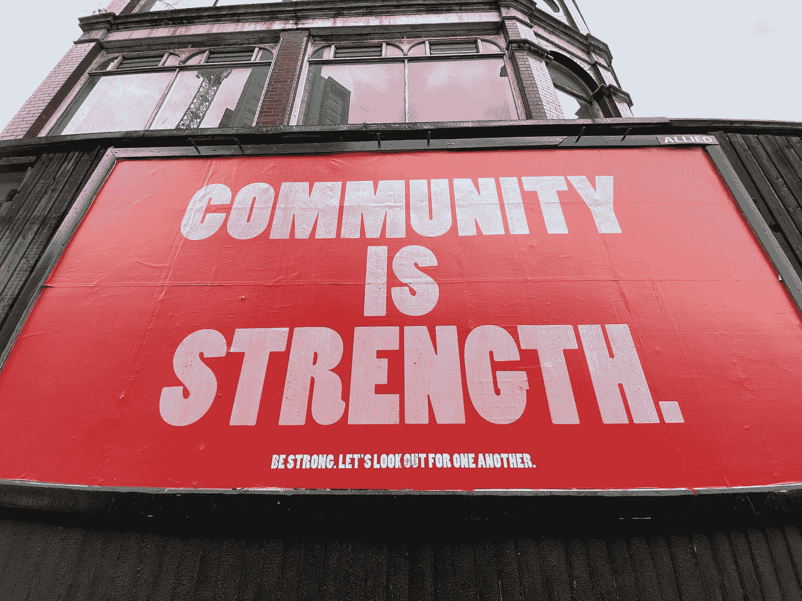

# 构建可扩展的数据工程师、分析师和科学家社区的最佳实践

> 原文：<https://medium.com/geekculture/a-practical-guide-to-building-a-sustainable-data-ai-community-354b5d8c37e8?source=collection_archive---------3----------------------->

## 了解如何围绕顶级数据社区专家的产品，建立由数据工程师、数据分析师、机器学习工程师和分析工程师组成的可持续数据社区。

Photo by [John Cameron](https://unsplash.com/@john_cameron?utm_source=medium&utm_medium=referral) on [Unsplash](https://unsplash.com?utm_source=medium&utm_medium=referral)

欢迎回到本文关于数据社区的第二部分。

在文章的第[部分](https://pub.towardsai.net/the-data-community-as-a-service-part-1-1bd268add482)中，我们了解了作为数据爱好者或实践者加入数据社区、数据社区即服务以及数据科学家、数据分析师和数据工程师活跃数据社区的好处。

**为什么这篇文章的第二部分是**？

> 我从[非洲数据社区时事通讯](https://africandatacommunitynewsletter.substack.com/)、[非洲数据社区](https://datafestafrica.com/)、 [Lagos MLOps 社区](https://www.meetup.com/lagos-mlops-community/)以及目前的 [Pycon 非洲](https://africa.pycon.org/)大量参与了数据分析、数据工程和机器学习领域的社区建设。

我觉得有必要就此写一篇文章，因为我也觉得这是数据空间中很少写或谈论的东西，但它的需求从个人到公司一直在增长。

有趣的事实是，社区建设可能看起来很容易，直到你开始或参与其中，然后你就会看到任务、要求、困难和不可预测，特别是当它围绕着一种产品时，你需要交付、带来价值并随着时间的推移为公司建立参与度。

数据空间中的社区建设是促进该领域合作和发展的重要组成部分，通过将热衷于数据工作的个人聚集在一起，社区可以帮助推动该领域的创新和进步。

> 这也有助于培养成员之间的归属感和支持感，这对那些刚开始涉足该领域的人来说很重要。

**这篇文章是给谁看的？**

*   对构建和管理数据社区感兴趣的入门级、经验丰富的开发人员倡导者和社区经理。
*   数据工程师、数据分析师、数据科学家和机器学习工程师。
*   对围绕数据工程、人工智能、机器学习和数据分析领域的产品构建或管理数据社区感兴趣的创始人、首席执行官、数据产品经理和公司。

# 我们会学到什么？

*   关于如何建立和培养伟大的数据社区的典型原型:来自三位数据社区专家的最佳实践。
*   Community Builder ToolKit:帮助更轻松地构建和管理数据社区的软件工具。

# 关于如何建立和培养一个伟大的数据社区的原型:来自三(3)位专家的最佳实践

> 这部分采访了三位来自不同顶级数据公司的数据社区专家:: [IterativeAI](https://iterative.ai/) 、[decai](https://deci.ai/)和 [DeepgramAI](https://deepgram.com/) ，分享他们在构建数据社区方面的经验。

**讨论的问题** *:*

*   作为数据相关产品的新开发人员倡导者或社区经理，在建立或启动数据社区之前，需要检查哪些关键问题？
*   你如何衡量你的社区的成功？
*   你从构建数据社区的经历中学到的最大教训是什么？
*   作为社区建设者、管理者或开发者倡导者，什么能给人成就感和成功感？
*   你认为哪个平台或工具帮助你有效地构建了一个数据社区？
*   让数据从业者参与并与您的社区建立信任的关键策略是什么？

[**詹尼·菲格雷多**](https://twitter.com/jendefig?s=20&t=StIz3X7GHPCywuLzeLDrew)*——*詹尼！是 Iterativeai 和 WIDS(数据科学领域的女性)的社区经理、普吉特湾大使和数据圈领导团队的成员。

她分享了自己在数据科学和机器学习领域担任社区经理的经历。

**作为数据相关产品的新社区经理，在建立/启动数据社区之前，需要检查哪些关键问题？**

*   我是自己开始还是有一个小团队？
*   我每周能投入多少时间来建立社区？
*   社区是已经建立起来了还是我们要从零开始？
*   你能找到与你提议的社区重叠的其他社区吗？这些社区能帮助你通过合作建立追随者？

这些最初的问题将帮助你规划下一步。

*   **了解你的受众**:满足需求，看看缺少什么，问问你如何建立一个社区来帮助满足需求，然后为此开发一个流程。

**注意**:这可能看起来不同，取决于你是在开发一个产品，实践，还是玩一个社区。

你如何衡量你的社区的成功？

*   衡量标准可能很棘手，也取决于识别什么对你的社区有价值。

你不希望用一个实际上对社区没有价值的标准来评估你的社区。

如果您的社区是:

*   不断增长的会员和参与度(参加会议的人数)。
*   增加消息和不一致服务器或 Slack 的计数。
*   增加成员间的帮助，而不是组织成员间的帮助。
*   增加志愿者的参与。
*   成员通过社交和其他渠道增加对社区的分享。

你做得很好。

随着您不断地了解越来越多对您的社区有价值的东西，那么您需要选择反映这一点的指标。

从构建数据社区的经历中，你学到的最大教训是什么？

所有社区都是如此，不仅仅是数据社区。

一致性就是一切。

如果你不一致，社区就会失败。

我曾悲伤地目睹这种事情发生过不止一次。

因此，你需要从我提到的第一个问题开始，这样你就可以评估你可以开始什么，并保持一致。

你会有很多关于编程和不同参与可能性的好主意。

你需要从一小部分你能坚持做的事情开始，然后在你建立社区和志愿者基础的时候积累其他想法。

如果人们真的想在社区中分享他们自己，他们需要知道他们可以信任这个正在建造的地方。

不一致会侵蚀这种信任。

一致性是关键。

**作为一名社区建设者/管理者，什么能给人成就感和成功感？**

对我来说，最好的部分是当你看到人们分享，在社区内建立内部笑话，并互相了解，互相帮助和照顾。

然后，你处于良好氛围指数领域。

**你认为哪些平台/工具在你构建数据社区的过程中帮了你的忙？**

*   **Meetup.com**对我来说是一个大问题，在数据/数据科学领域得到了验证。
*   **不协调**和**松弛**进行常规沟通。

**让数据从业者参与您的社区并与之建立信任的关键策略是什么？**

*   **了解他们对我们的需求**:我们创建的在线课程是必需的，并且发展迅速。
*   **培养和表彰优秀的社区成员**:我以不同的方式做这件事(我需要比我做的更多，但这又回到了一致性问题上)。

照亮做出贡献的人有助于那些做出贡献的人感觉良好，并为新加入社区的人树立榜样。

它变得令人向往，最终这些被正确赏识的人会继续想要为社区做贡献。

一个来自卡内基梅隆大学的女孩最近联系我，希望在那里建立一个数据科学领域的女性团体。

她在寻求如何开始的建议，以下是我给她的建议:

我的建议是从小事做起，从时间的角度来看，你可以承诺做些什么，建立你的网络/联系，然后通过建立你的志愿者基础来扩大你的活动和产出。

相对容易开始的是:

*   **学习小组**——针对某一特定主题。
*   **期刊俱乐部** —小组开会讨论关于数据科学的期刊文章。
*   **读书会**——每周决定一本书，讨论到结论。

在您建立势头时(按计划和建立联系的时间顺序):

*   每月技术讲座。
*   快速建立关系网——在现场找到 5-7 名女性，安排她们坐在有 5-10 分钟时间的桌子旁。
*   最多可以有四个人坐在一张桌子上，向这些女性提问。我们发现这对不同级别的参与者来说效果更好，也不那么令人紧张，因为他们不仅可以从桌面上的人那里学习，还可以互相学习。
*   数据马拉松/黑客马拉松。
*   项目—端到端数据科学项目。

接下来的部分是专门询问关于女性数据科学社区的问题，但我的想法是真实的，是任何社区都应该考虑的问题，这些社区首先引入学生，这些学生希望培养他们的工作技能，然后他们得到这些技能。

他们中的许多人正在寻找工作和社区。

他们有多余的时间投入到组织的志愿者工作中，帮助组织成长并参与项目。

这项工作最终会让他们被雇佣，然后他们就没有时间再去支持这个组织了。

你必须不断建立一个新的学习者和过渡管道，有时间来支持组织。

一旦你得到足够的赞助，你就可以把一些工作(网络/营销等)外包出去。).

我们现在正处于数据圈的那个阶段。

对于试图安排谈话，这都是关于网络的，但是试着寻找你所在地区已经在会议上发表过演讲的女性。

他们很可能会说是，因为他们已经准备好了可以展示的话题。

当他们吸引人们来看他们的时候，你就和到场的人联系，看看还有谁愿意做演讲。

你有不同的内容——一个长时间的研讨会与两个 20-30 分钟的问答演示，或者对于更初级的人来说，一个晚上 10 分钟的闪电谈话，让人们练习演示，这对所有参与者都有帮助。

这让整个团队不再被吓倒，开始互相了解。

打破一些障碍，如果你能找到一个可以谈论冒名顶替综合症的人，就去做吧。

作为这个数据科学人群中的女性(通常是内向的人)，而且经常从其他领域过渡，这是我们面临的最大的事情，而且是这样的浪费时间！所有人类都有这种感觉。

我们必须与自己内心的这些感受作斗争，而这类演讲者有助于把团队团结在一起。

[**哈普瑞特·萨霍塔**](https://twitter.com/DataScienceHarp)**——**哈普瑞特是 Deci AI 的开发者关系经理，数据科学播客艺术家的主持人，多年来一直担任 ML 开发者倡导者和数据科学家。

Harpreet 分享了他在机器学习和人工智能领域的社区经验。

**作为数据相关产品的新开发者倡导者，在建立/启动数据社区之前，需要检查哪些关键问题？**

我认为最重要的是理解公司当他们想到社区时意味着什么，以及建立公司社区的最终目标是什么。

如果你开始一份新的工作，认为公司和你一样理解社区，那么当没有人接受你的行动计划时，你可能会感到惊讶。

你还需要确定你的社区在为谁服务。

清楚地了解你所在社区的理想成员是什么样的。

*   他们在哪里工作？
*   他们在哪里闲逛(实际的和虚拟的)？
*   他们的痛点、拦路虎、欲望是什么？
*   他们睡觉时担心什么？
*   他们醒来时兴奋的是什么？然后想想你将如何为这些人增加价值。

**您如何衡量您所在社区的成功？**

这取决于几个因素，但我建议从问自己开始:

*   你现在的数字是多少？
*   您希望实现多大的增长？
*   你更关心发展你的特定渠道还是创造一个整体积极的品牌体验？

或许两者都有一点？

你每个季度都必须完成某些目标吗？

一些具体数字:

新成员的增长率。

成员总数。

社区流失。

您还需要查看“社区激活指标”

*   有多少新成员被激活？

当一个新成员明白这个社区是什么以及为什么它适合他们时，他们就被“激活”了。

通常，这反映在他们至少发送一个消息或者在最初的几个通道之外探索服务器。

不激活的新成员保持不活跃，所以要努力改善这一点。

*   你如何让新成员更容易加入你的社区？
*   下周会保留多少新成员？

保留率衡量有多少新成员在第一天之后仍留在服务器上。

要提高这个数字，重点提高激活度，让你的社区更活跃。

如果你有论坛，你可以看看:

*   页面视图
*   每日活跃用户/每月活跃用户
*   喜欢的数量
*   接受的解决方案数量

**您从构建数据社区的经历中学到的最大教训是什么？**

这非常困难，需要很多时间，而且很有可能你会失败。但你还是应该试试。

**作为一名开发者倡导者，什么能给人成就感和成功感？**

当有人评论说他们喜欢某个活动或网上研讨会，问我关于会议的任何事情，或者某个内容对他们有用时。

这就是我们在这里的最终目的，成为人们有用的资源。

[**贝卡·霍罗特·魏格尔**](https://twitter.com/BekahHW?s=20&t=Lg2rkftKCOGdUxPrVqPL7w) —贝卡是 Deepgram 的一名开发者和社区构建者。

贝卡创建了开发者社区**虚拟咖啡**，在播客和会议上发言，并且拥有软件工程方面的经验。

她还领导着 Deepgram 社区论坛。

**作为数据相关产品的新社区经理，在建立/启动数据社区之前，需要检查哪些关键问题？**

*   你满足了什么需求？
*   你是如何做一些不同于其他社区的事情的？
*   如果你想做同样的事情，你需要问自己为什么。你将如何改善其他社区的做事方式？
*   你为什么把他们放在一起？
*   他们打算一起做什么？
*   社区的基调是什么？
*   你想达到什么目的？
*   你的社区将住在哪里？
*   谁是您的目标受众(数据新手、有经验者等)。)?
*   你将如何支持他们？

**你如何衡量你的社区的成功？**

围绕社区有很多关于度量的讨论，但是我们经常忘记度量并不等同于社区健康或成功。

*   你的社区怎么样了？
*   你的成员怎么样了？

理想情况下，你首先关心的是人，这不容易用数字来表示，因为社区是生活、变化和复杂的，要有一个繁荣的社区，你需要一个健康的社区。

作为其中的一部分，我确定了一些方法来帮助判断社区的健康状况:

*   真实联系
*   支持响应
*   横向指导

**您从构建数据社区的经历中学到的最大教训是什么？**

清晰的沟通和诚实对于建立一个支持性的社区是至关重要的。

**作为一名社区建设者/管理者，什么能给人成就感和成功感？**

看到其他人成功是因为他们得到了社区的支持。

**您认为哪些平台/工具帮助您构建了数据社区？**

我最喜欢的三个:

*   开源代码库
*   充气台
*   一款云视频会议软件

个人互动和自动化之间的平衡使得社区构建者的生活变得更加容易。

我们也使用**松弛**。它并不完美，但很有效。

**让数据从业者参与并与您的社区建立信任的关键策略是什么？**

最重要的是一致性。

即使没有人出现，也要继续出现并谈论它。

这使得人们可以安静地观察，直到他们感到舒适，你不会成为另一个一夜之间消失的社区。

# 六(6)个社区构建工具包:帮助社区构建/管理更容易的软件工具

社区构建或管理实际上与工具无关，但使用工具是构建和管理可持续数据社区的一种手段。

1.  [**Meetup**](https://www.meetup.com/about/)**:**Meetup 是一个搜索和建立本地社区的平台。数据从业者使用 Meetup 结识相似领域的新朋友，学习新东西，寻找支持，并一起追求自己的激情。

它是如何工作的？

*   选择你感兴趣的领域，例如，数据工程、数据科学或机器学习。
*   结识您所在地区与您志同道合的人，例如尼日利亚拉各斯的数据科学家
*   与他们交流并分享想法，例如尼日利亚拉各斯的数据科学家分享 MLOps、NLP 等资源

2. [**GitHub 讨论**](https://github.com/features/discussions) **:** GitHub 讨论是一个围绕开源项目进行协作的交流论坛。

社区成员可以提问和回答问题，分享想法，进行开放式对话，并参与互相帮助。

**3。**[**Discord**](https://discord.com/)**:**Discord 是开源团队用来构建和管理开发者社区的流行工具。Discord 也是一个免费的开源语音和文本聊天工具。

对于开源项目来说，这是一个非常有用的工具。它有助于分享想法、提出问题以及与数据从业者建立个人关系。

4.**[**Slack**](https://slack.com/about):Slack 是将兴趣、信息和工具相似的人聚集在一起完成工作的协作枢纽。**

**从大数据公司到较小的数据创业公司，全球数百万人使用 Slack 连接到他们的数据团队，统一他们的系统，并推动他们的业务向前发展。**

****5。** [**观念**](https://www.notion.so/help/guides/what-is-notion) **:** 观念是一个你可以分享你的想法、写作和制定适当计划的空间。管理大型项目，完全按照你想要的方式去做。**

**时间管理、任务优先级和组织技能是作为开发者倡导者/社区构建者/管理者所需要的基本技能。**

**用观念来安排你的任务可以帮助解决这个问题。**

****6。** [**缓冲**](https://buffer.com/) **:** 社交媒体在与数据社区的互动中发挥了很大的作用，需要使用类似缓冲的工具使生活变得更加轻松。**

**另一个与社区互动和建立社区的好方法是通过 Buffer，这是一个应用程序，可以让你预先安排你想在一周内最佳时间发布的社交媒体内容。**

**有了 Buffer，你可以坐下来为几个社交媒体应用程序安排一周的内容，为你节省宝贵的时间。**

**Buffer 会为您完成剩下的工作，推动您与所需社区的互动。**

****类似工具** : [TweetDeck](https://tweetdeck.twitter.com/) 和 [Hootsuite](https://www.hootsuite.com/) 。**

# ****总结****

**构建数据社区没有明确的模板，但是从社区专家的上述回答中可以观察到一些重要的模式。**

****一些主要的要点是** *:***

1.  **构建数据社区时，从小处着手，一致性是关键。**
2.  **了解和理解你的听众。**
3.  **测量指标时要小心。社区指标应该反映对社区最重要的东西。**
4.  **表扬杰出的社区成员。**

# **结论**

**我们讨论了构建和培育成功的数据社区的最佳实践和策略、衡量成功的重要性以及使用工具和平台来帮助社区构建和管理。**

**我们采访了三位数据社区专家，他们分享了构建数据社区的经验和教训。**

**恭喜你！现在，您已经非常了解如何通过顶级数据社区专家的最佳实践来构建和培养一个优秀的数据社区，您还非常了解有助于更轻松、更有效地构建数据社区的社区构建工具。**

**我迫不及待地想看到您采纳我在本文中解释的内容，并开始在数据工程、数据分析和机器学习领域与他们一起兴风作浪。**

**在 LinkedIn 上与我联系**

**在推特[上与我联系](https://twitter.com/GiftOjeabulu_)**