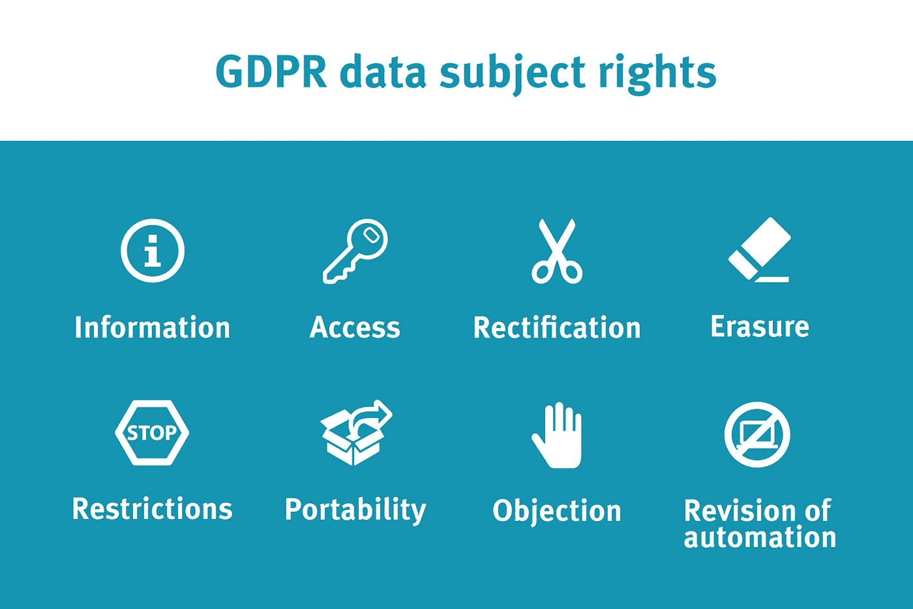

# GDPR 简介

> 原文：<https://medium.com/geekculture/a-quick-introduction-to-gdpr-bc80022673e0?source=collection_archive---------16----------------------->

Photo by [Bernard Hermant](https://unsplash.com/@bernardhermant?utm_source=medium&utm_medium=referral) on [Unsplash](https://unsplash.com?utm_source=medium&utm_medium=referral)

如果您是在欧盟开展业务的组织的一员，您必须遵守的一项重要法规是 GDPR 法规。

GDPR 代表通用数据保护条例(GDPR)。其主要目标是加强个人对其个人数据的控制和权利。

> GDPR 是一个法律框架，要求企业在欧盟成员国境内进行交易时保护欧盟(EU)公民的个人数据和隐私。— [来源](https://www.forbes.com/sites/andrewrossow/2018/05/25/the-birth-of-gdpr-what-is-it-and-what-you-need-to-know/?sh=56ec5dd355e5)

作为一名在全球 SAAS 公司工作的产品经理，遵守隐私法规仍然是我们重点关注的领域之一。对于任何希望确保其组织符合 GDPR 法规的人来说，这里有一个关于 GDPR 的快速复习。它将帮助您了解 GDPR 是什么，以及公司应该如何将它融入他们的发展过程。

# 哪些公司需要遵守 GDPR？

GDPR 适用于向欧盟公民提供商品和/或服务的所有组织。

因为它关系到保护“数据主体”的权利，所以每一家收集欧盟公民个人数据的公司都必须遵守。

因此，即使您的组织不是建立在欧盟，但收集欧盟公民的个人数据，GDPR 将适用于你。

违反规定会受到*的严厉处罚*。这包括高达全球收入 4%或 2000 万欧元的罚款，以较高者为准。罚款金额将取决于所犯的违法行为。

# 根据 GDPR，什么是个人数据？

理解 GDPR 法案中“个人数据”的含义是很重要的。

[《GDPR》第 4 条](https://gdpr.eu/article-4-definitions/)对“个人数据”给出了如下定义

> “个人数据”是指与已识别或可识别的自然人(“数据主体”)相关的任何信息；
> 
> 可识别的自然人是指可以直接或间接识别的人，特别是通过参考诸如姓名、身份号码、位置数据、在线标识符等标识符或该自然人的身体、生理、遗传、精神、经济、文化或社会身份所特有的一个或多个因素。

因此，如果您正在收集任何可以帮助您直接或间接识别个人身份的信息，则该信息被称为“个人数据”。

# 与 GDPR 相关的基本定义

以下是与 GDPR 相关的一些基本定义:

*   **处理** —这是指对数据进行的任何操作。这包括收集、记录、存储、处理等。
*   **控制者** —这是决定如何以及为什么收集和使用数据的人。(*控制者通常是一个组织*
*   **处理者** —代表控制者并根据他们的指令处理数据的独立个人或组织。
*   **数据主体—** 指个人数据被存储的个人。

# GDPR 授予的数据主体权利

GDPR 赋予每个人八项数据主体权利。这些权利与他们存储在组织中的“个人数据”相关。

Eight data subject rights — [Image Source](https://www.linkedin.com/pulse/gdpr-new-eu-regulation-personal-data-protection-know-john-papadakis/)

1.  **知情权—** 该权利允许个人了解正在收集的数据、收集或处理数据的人员、预期用途、保留时间、保留时间等。
2.  **访问权—** 此权利允许个人请求访问其个人数据。
3.  **更正权—** 此权利允许个人请求更正他们可能发现不准确或不完整的数据。
4.  **删除权—** 该权利允许个人要求删除其个人数据(*前提是不与针对该权利的合法理由*相冲突)
5.  **限制处理的权利—** 此权利允许个人要求组织停止处理其个人数据。
6.  **数据可移植性权利—** 该权利允许个人以结构化和易读的方式访问其个人数据(存储在组织中)。
7.  **反对权—** 该权利允许个人反对处理其个人数据(*前提是不与反对该权利的合法理由*)相冲突。
8.  **与自动决策和分析相关的权利—** 这意味着，如果自动决策对个人有重大的法律影响，个人现在有权不接受自动决策。(*但是，如果处理是履行合法合同所必需的或基于明确的同意，则不适用*

有关与每个数据主体权利相关的注意事项，请参考以下文章:[链接](https://dataprivacymanager.net/what-are-data-subject-rights-according-to-the-gdpr/)

# GDPR 的七项基本数据保护原则

为了建立良好的数据保护实践，GDPR 制定了七项数据保护原则供组织遵守。这些是 GDPR 的核心，并作为指导原则来确保组织间的合规性。这七项原则是:

> [**1。合法、公平和透明**](/golden-data/what-does-lawfulness-fairness-and-transparency-mean-under-eu-dp-law-a385d249d754) :为了合法处理数据，必须确定处理数据的具体理由(“合法依据”)。公平意味着处理必须以人们合理期望的方式进行。透明意味着从一开始就清楚你是谁，你如何处理数据。
> 
> [2**。目的限制**](/golden-data/what-is-purpose-limitation-under-eu-data-protection-law-fff4406ffe6) :收集实体必须清楚说明收集数据的目的。因此，为一个目的收集的数据不应用于新的、不相容的目的。
> 
> [**3。数据最小化**](/golden-data/what-is-data-minimization-under-eu-data-protection-law-b0e30fbb856e) :组织应该只存储必要的和与应该完成的数据处理相关的数据。
> 
> [**4。准确性**](/golden-data/what-does-accuracy-mean-under-eu-data-protection-law-dbb438fc8e95) :这意味着控制者和处理者应采取合理的措施，以 I)确保存储在他们那里的个人数据的准确性，ii)确保个人数据的来源和状态清晰，iii)仔细考虑对信息准确性的任何挑战。
> 
> [**5。存储限制**](/golden-data/what-does-storage-limitation-mean-under-eu-data-protection-law-fc6459ecb26c) :数据的存储时间不应超过其收集目的或用途所必需的时间。因此，公司应该对存储设置限制，并制定明确的保留期和存储政策。
> 
> [**⑥。完整性和保密性**](/golden-data/what-does-integrity-and-confidentiality-mean-under-eu-data-protection-law-2b7bbc3cf421) (安全性):保护数据的责任在于控制器和处理器。他们必须确保采取适当的安全措施来防止数据泄露。
> 
> [**7。责任**](/golden-data/what-does-accountability-mean-under-eu-data-protection-law-af630e40648b) :该原则要求控制者和处理者对他们的处理活动以及他们如何遵守数据保护原则负责。该原则的两个关键要素意味着控制器和处理器 i) **负责**合规性 ii)必须能够**证明**合规性。

# 结论

GDPR 是一项里程碑式的立法，将个人隐私权置于中心位置。在用户的个人数据方面，它赋予个人权利，并让公司承担义务。

它也成为全世界不同国家类似法律的典范。

虽然数据可能是“新的石油”，但在推动公司前进的过程中，公司谨慎安全地使用这种石油非常重要。

# 参考

*   [https://www . Forbes . com/sites/andrewrossow/2018/05/25/the-birth-of-gdpr-what-it-and-what-you-need-to-know/](https://www.forbes.com/sites/andrewrossow/2018/05/25/the-birth-of-gdpr-what-is-it-and-what-you-need-to-know/)
*   [https://www . LinkedIn . com/pulse/gdpr-new-eu-regulation-personal-data-protection-know-John-papadakis/](https://www.linkedin.com/pulse/gdpr-new-eu-regulation-personal-data-protection-know-john-papadakis/)
*   [https://data privacy manager . net/what-are-data-subject-rights-by-the-gdpr/](https://dataprivacymanager.net/what-are-data-subject-rights-according-to-the-gdpr/)
*   [https://www . techtarget . com/search security/tip/7-确保 GDPR 合规的最佳实践](https://www.techtarget.com/searchsecurity/tip/7-best-practices-to-ensure-GDPR-compliance)