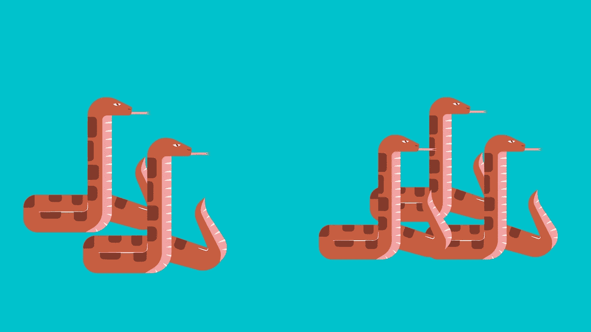

# 从 Python 2 升级到 Python 3 的现成计算工具

> 原文：<https://medium.com/geekculture/a-ready-reckoner-to-upgrade-from-python-2-to-python-3-fab370515c70?source=collection_archive---------12----------------------->

## 简要介绍如何将您的环境和服务代码库从 Python 2 迁移到 Python 3。



Python 2 to Python 3

开发人员经常面临这样的情况，他们需要将他们的应用程序和相关环境升级到各自栈的较新版本。
在这篇博客的第一条路径中，我将重点介绍如何升级运行 python 2.7 的 ubuntu `16.04`服务器，以使用 python 版本`3.7`启动应用程序。在第二部分中，我将讨论如何将应用程序代码库从 Python 2 迁移到 Python 3。

# 迁移服务器

这些是从基于 Python 2 的环境更新到 Python 3 环境时可以遵循的一般步骤。

第一步是给机器加上`deadsnakes` PPA。这包含了为 Ubuntu 打包的最新 Python 版本。

```
add-apt-repository ppa:deadsnakes/ppa 
```

接下来，安装所需的 python 版本——我将使用版本`3.7`作为例子

```
apt update
apt install python3.7
```

在成功执行最后一步之后，创建一个 python 3 安装的符号链接，这不是系统默认完成的事情，如果您的应用程序依赖于使用`python`命令，这将非常方便

> 如果需要多个 python 3 安装，这可能会派上用场。

```
# different versions can be specified here and priorities be set 
update-alternatives --install /usr/bin/python3 python3 /usr/bin/python3.7 2
```

成功创建符号链接后，需要安装 python 3 dev tools 和 python 3 pip 来构建和管理包。

```
apt-get install python3-pip python3-dev
python3 -m pip install --upgrade pip
```

还可以安装更具体的 python-dev 工具，以建立与已安装 python 版本的直接兼容性，如下所示👇

```
apt-get install python3-pip python3.7-dev
python3.7 -m pip install --upgrade pip
```

最后一步，安装 Python 3 的虚拟环境。

```
pip3 install virtualenv
```

# 自动化

上述步骤可以组合成一个 shell 脚本，并与应用程序执行集成在一起，或者可以在机器上手动执行。

```
**#!/usr/bin/env bash** add-apt-repository ppa:deadsnakes/ppa -y
if [ $? -eq 0 ]; then
    echo "PPA installed correctly"
else
    echo "Failed to install PPA"
fi
apt update
if [ $? -eq 0 ]; then
    echo "Apt Update Passed"
else
    echo "Apt update failed"
fi
apt install python3.7 -y
update-alternatives --install /usr/bin/python3 python3 /usr/bin/python3.7 2
if [ $? -eq 0 ]; then
    echo "Python version 3.7 installed. Use python3 --version to check that correct version is installed"
else
    echo "Failed to install python version 3.7"
fi
apt-get install -y python3-pip python3.7-dev
python3.7 -m pip install --upgrade pip
if [ $? -eq 0 ]; then
    echo "Python 3.7 pip and dev tools installed"
else
    echo "Failed to install python 3.7 pip and dev tools"
fi
pip3 install virtualenv
if [ $? -eq 0 ]; then
    echo "Installied pip3 virtaul environment"
else
    echo "Failed to install pip3 virtual environment"
fi
pip3 install --ignore-installed PyYAML
if [ $? -eq 0 ]; then
    echo "Successfully upgraded to python3"
else
    echo "Failed to upgrade to python3"
fi
```

# 迁移应用程序代码库

可能有许多工具可以帮助应用程序代码库的自动化迁移，其中之一是`2to3`，它可以用来修改代码以与 python 3 兼容。

下面是如何使用这个工具修改代码以与 python 3 兼容。

```
pip install 2to3
cd <your project directory>
# first have a look at the modifications this will make
2to3 .
# to modify in place
2to3 -w .
```

> 注意:2to3 将尝试纠正您的导入到 python 3 约定，这可能不总是正确的，因为它假设导入来自包。所以在应用之前检查一下 2to3 将要做的修改是很好的。关于这个实用程序的更多细节可以在[这个](https://docs.python.org/3/library/2to3.html)官方文档中找到。

## 迁移到 Python 3 不可能这么简单，对吧..？

上面的步骤将修改导入和通常的语句，比如 python 3 版本的`print`，但是其他一些代码区域，比如错误处理、比较和字符串处理，可能仍然需要一些工作。

让我们更详细地看看这些。

## 整数比较

所以 python 2 没有对类型进行硬检查来进行比较，所以类似下面这段代码的东西实际上会起作用

```
a = "2"
if a >= 0:
  print "True"
else:
  print "False"
```

但是同样的方法在 python 3 中不起作用，所以您需要修改上面的代码，将字符串转换为整数，以便进行类似的比较。

```
a = "2"
if int(a) >= 0:
  print("True")
else:
  print("False")
```

## 错误处理

关于 Python 3 中错误处理的细节可以从这里的文档[中阅读。但是在一个非常简单的层面上，可能必须修改错误日志或传播。这方面的一个例子如下](https://docs.python.org/3/tutorial/errors.html)

```
Python 2try:
  <code block>
except <Error> as exp:
  print exp.messagePython 3
try:
  <code block>
except <Error> as exp:
  print(exp)
```

## 字符串和字节的区别

在 python 2 中，字符串和字节之间的区别没有被很好地定义，但是到了 python 3 中，这种区别就很明显了，而且它们可能不能互相替代。

## 这会导致什么样的问题？

这可能会导致许多问题，因为 python 2 允许自由使用字符串对象，而原本应该是一个字节，反之亦然。

例如，如果您以前以二进制模式打开一个文件，并试图用字符串填充它，它在 python 2 中可以工作，但在 python 3 中将停止工作。

```
file = NamedTemporaryFile(mode="w+b", delete=False)
file.write("some string")
file.close()
```

上面这段代码在 python 2 中运行良好，但在 python 3 中会出错。您可以对其进行如下修改，这样它就可以工作了

```
file = NamedTemporaryFile(mode="w+", delete=False)
file.write("some string")
file.close()
```

类似地，如果您将任何东西作为 byte 对象传递，而期望的是 string，那么代码将会失败。

为了在 python 3 中正确处理这个问题，这样的修改应该会有所帮助

```
try:
  x = x.decode("utf-8")
except (UnicodeDecodeError, AttributeError):
  pass
```

## 还有什么需要注意的吗？

将任何代码库迁移到 python 3 时所面临的问题可能不仅限于上述场景，它们可能会基于所讨论的代码库收缩或扩展。但是上述场景确实涵盖了迁移过程中可能出现的大量问题。

此外，可能会出现一些与`Method Order Resolution or (MRO)`相关的问题。当一个类派生自多个类时，这就开始起作用了，这也可能对从 python 2 到 python 3 的代码库迁移带来挑战。

# 尾注

通过处理这些场景，人们可以成功地将其代码迁移到 Python 3。我在这里要提到的一件事是，拥有一个好的测试套件设置将真正有助于问题的早期检测和解决，也有助于获得对迁移健康状况的信心。