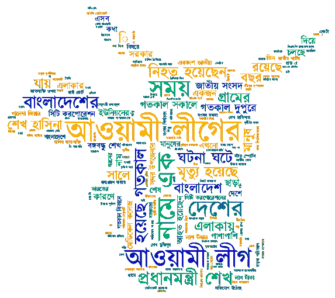
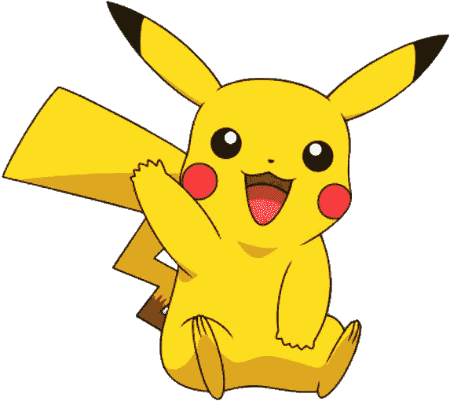

# 创建任意形状的孟加拉文字云的简单指南

> 原文：<https://medium.com/geekculture/a-simple-guide-to-creating-a-bengali-word-cloud-of-any-shape-d118ec523e30?source=collection_archive---------38----------------------->



Pikachu-shaped Bengali word cloud

词云(也称为标签云或文本云)是直观解释文本数据以快速了解数据的最简单方法之一。词云是词频的图形表示，它对源文本中出现频率更高的词给予更大的重视[ [1](https://www.betterevaluation.org/en/evaluation-options/wordcloud) ]。每个单词的重要性通过它的大小和颜色表现出来。

以自定义形状可视化单词云将使其更加引人注目，因此传达快速见解并以孟加拉语创建它与以其他语言创建它几乎是一样的。现在，让我们深入了解单词云的生成过程。

# 装置

生成孟加拉文字云需要安装两个模块:

1.  [**字云**](https://amueller.github.io/word_cloud/) **—** 用于生成字云。
2.  [**bnlp 工具包**](https://bnlp.readthedocs.io/en/latest/) **—** 用于处理孟加拉文字。

```
pip install wordcloud
pip install bnlp_toolkit
```

# 资料组

我们将使用 Kaggle 的孟加拉新闻数据集[ [2](https://www.kaggle.com/shakirulhasan/bangla-news-datasets-from-bdpratidin) ]进行演示。数据集可以在 [**这里找到**](https://www.kaggle.com/shakirulhasan/bangla-news-datasets-from-bdpratidin) 。该数据集包含连续 1000 天的《孟加拉国报》的超过 107k 篇孟加拉语新闻文章。

# 导入必要的库

我们将从 bnlp-toolkit 以及其他库中导入孟加拉语停用词和标点符号。

```
import numpy as np
import pandas as pdimport cv2
import reimport matplotlib.pyplot as plt
from wordcloud import WordCloud
from bnlp.corpus import stopwords, punctuations
```

# 预处理文本数据

新闻数据集下载解压后，会有一个名为`1000DaysNews.csv`的 CSV 文件。首先，读取 CSV 并检查数据。

```
df = pd.read_csv('1000DaysNews.csv')
print(df.columns)
print(df.shape)
df.head()
```

数据框包含“id”、“新闻 id”、“标题”、“描述”、“类别”、“日期”、“文章”列，其形状为(107642，7)。现在我们已经对数据有了一些了解，我们可以前进到预处理步骤。

为了生成单词云，我们将在“描述”列上工作。首先，通过使用正则表达式删除标点符号和数字来清理文本。

```
def clean(text): text = re.sub('[%s]' % re.escape(punctuations), '', text)
    text = re.sub('\n', '', text)
    text = re.sub('\w*\d\w*', '', text)
    text = re.sub('\xa0', '', text) return textcleaned_text = df['description'].apply(lambda x: clean(str(x)))
```

Word cloud 将类似字符串或字节的对象作为`generate()`方法的参数。然而，`cleaned_text`是一个熊猫系列类型的物体。所以，我们必须将`cleaned_text`转换成`string`类型的对象。

```
refined_sentence = " ".join(cleaned_text)
```

# 准备图像遮罩

制作自定义形状的单词云需要一个白色背景和黑色前景对象的图像遮罩。在这里，我们将准备一个代码，使用任何透明的图像作为遮罩，以获得所需的形状的单词云。



Left: Transparent Pikachu image [[3](https://www.vhv.rs/viewpic/hxxbxxR_pikachu-png-file-pokemon-the-highest-grossing-franchise/)] / Middle: Extracted from alpha channel / Right: Generated mask

首先，我们将提取透明图像(RGBA)的阿尔法通道，它会给我们一个背景是黑色和前景物体是白色的图像。之后，我们将使用`cv2.bitwise_not()`方法反转背景和前景色。现在，我们可以很容易地从透明图像中制作出蒙版。这个函数也适用于非透明图像。但是，在这种情况下，图像的背景必须是白色的，前景对象必须是黑色的。

```
def get_mask(img_path): img = cv2.imread(img_path, -1)
    if img.shape[2] == 3:
        return img
    return cv2.bitwise_not(img[:, :, 3])
```

# 词云生成

现在，我们已经准备好了掩码和文本数据，我们可以轻松地从中创建所需形状的单词云。首先，我们需要一个孟加拉字体来生成孟加拉语的单词云，因为单词云的默认字体是 ***Droid Sans Mono*** 字体，它不支持孟加拉语。孟加拉字体列表可以在 [**这里**](https://www.omicronlab.com/bangla-fonts.html) 找到，我们将使用 ***Kalpurush*** 孟加拉字体生成单词云。其次，我们需要定义一个自定义的 regexp，以便 word cloud 可以处理孟加拉语文本。

```
mask = get_mask("pikachu.png")
regex = r"[\u0980-\u09FF]+"wc = WordCloud(width=800, height=400,mode="RGBA",background_color=None,colormap="hsv",       mask=mask,stopwords = stopwords,
font_path="kalpurush.ttf",regexp=regex).generate(refined_sentence)plt.figure(figsize=(15, 7))
plt.imshow(wc, interpolation='bilinear')
plt.axis("off")
plt.show()result = wc.to_file("Bengali_word_cloud.png")
```

现在，我们将传递我们创建的掩码、自定义的 regexp、孟加拉字体路径和孟加拉停用词列表来创建一个单词云对象，然后调用`generate()`方法来生成一个自定义形状的孟加拉单词云。

由于孟加拉语处理资源匮乏，我希望这篇文章能有助于后续工作。

代码链接-[https://colab . research . Google . com/drive/15h 32 yusq 5 ywvji 8 oync 9 bvmawgpswyd 2？usp =共享](https://colab.research.google.com/drive/15h32YuSQ5YwVji8OynC9BvMaWGpsWyD2?usp=sharing)

# 参考

[1]Word Cloud-[https://www . better evaluation . org/en/evaluation-options/Word Cloud](https://www.betterevaluation.org/en/evaluation-options/wordcloud)

[2]孟加拉新闻数据集来自 BD-practidin-[https://www . ka ggle . com/shakirulhasan/Bangla-News-Datasets-from-bdpractidin](https://www.kaggle.com/shakirulhasan/bangla-news-datasets-from-bdpratidin)

[3]皮卡丘透明图-[https://www . vhv . RS/view pic/hxxbxxR _ 皮卡丘-png-file-pokemon-the-high-grossing-franchise/](https://www.vhv.rs/viewpic/hxxbxxR_pikachu-png-file-pokemon-the-highest-grossing-franchise/)

[4] Kalpurush 孟加拉字体-[https://www.omicronlab.com/download/fonts/kalpurush.ttf](https://www.omicronlab.com/download/fonts/kalpurush.ttf)

[5]标签云-【https://en.wikipedia.org/wiki/Tag_cloud 