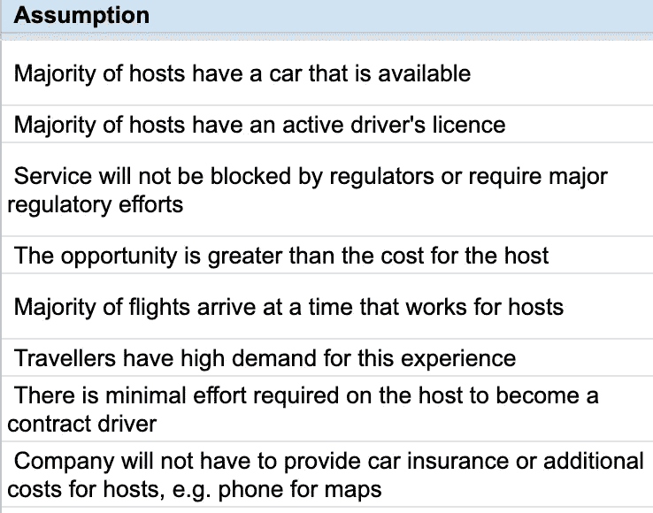
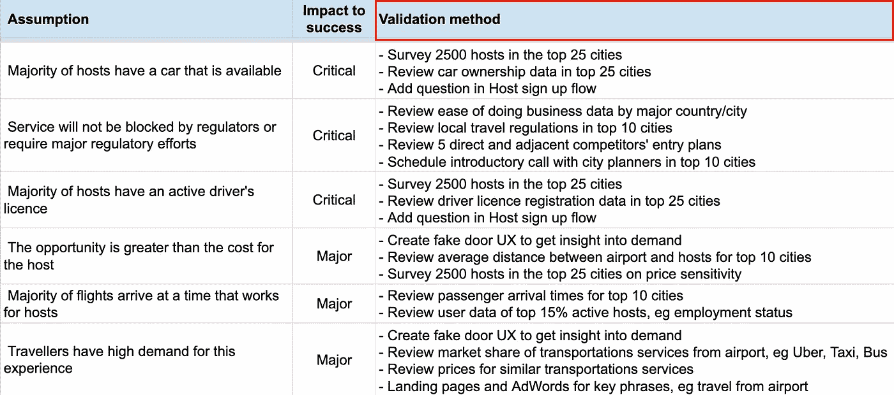

# 降低产品开发风险的简单方法

> 原文：<https://medium.com/geekculture/a-simple-method-to-de-risk-product-development-8f7c9545dacb?source=collection_archive---------12----------------------->

许多科技公司都是从个人痛点开始的。迫使某人采取行动的挫折。

对于德鲁·休斯顿来说，这一刻是在从波士顿到纽约的巴士上。这位年轻的企业家忘记了他的记忆棒，抹去了 4 小时通勤时间将是富有成效的任何希望。

正如他所说:

*“我非常沮丧——真的是对我自己，因为这一直在发生。我就想，天哪，我再也不想有这种问题了。我打开编辑器，开始写一些代码。”*

这是文件托管网站 Dropbox 的起点。

确定了刺激因素后，下一个挑战是验证他的假设:这个问题被广泛经历过吗？用户会很容易理解他的解决方案吗？他们会不止一次使用它吗？

构建一个成熟的产品会推迟回答这些关键问题。休斯顿需要的是一个快速的方法来证明(或反驳)他的关键假设:这是否有超过一个观众的吸引力？

为了做到这一点，他[制作了一个简单的视频](https://www.youtube.com/watch?v=dR7tJ8wAI3M)演示该软件将会做什么。这导致等候名单上的注册人数增加了 15 倍，证实了广泛的需求。

然后，他逐步测试了其他假设，结果是 Dropbox 达到了产品市场契合度、可伸缩性，并于 2018 年在纳斯达克上市。

休斯顿进行的去风险化强调了在大笔投资前确认关键假设的重要性。分阶段的过程可以在广泛的承诺之前评估一个想法的吸引力和有效性。

早期评估产品信心的一个简单方法是**假设审核**。这种方法让团队在软件开发生命周期的早期强调、区分优先级并验证核心信念。它对产品发布特别有用，我们将在下面讨论它如何让您的组织受益。

# 假设引导开发

新公司和新产品是由假设推动的。创新者以不同的方式看待世界，采纳很少有人认同的关键信念。

*   Airbnb 认为房主会乐意租给陌生人。
*   Snapchat 认为转瞬即逝的照片是一种新的交流方式。
*   Udacity 认为，向专业化、高强度教育的转变正在进行。

但是摸下巴并不能建立公司；最终，假设需要变成行动。产品团队可能犯的错误是使用*未经*验证的信念作为开发的指南。

强大的产品团队知道如何隔离和测试有风险的假设。他们希望在大规模开发开始之前，用数据或反馈来抵消不确定性。假设继续影响构建，但是由于积极的措施，它们所依赖的基础已经被巩固了。

# 什么是假设审计？

假设审核是一种强调将决定解决方案成功与否的关键信念的练习。主要目标是通过快速验证假设来增加产品的可信度。

## **第一步:收集**

首先，您需要创建一个跨职能团队。这些人将帮助开发和讨论假设。

该小组应该很小(7-10 人之间)，包括研发部门以外的人员。这些人可以是来自支持、销售、客户成功或营销部门的团队成员，他们对同一机会有不同的看法。

## 步骤 2:草拟假设

一旦确定了合适的人选，就该开始概述你的信念了。这一过程分为两次会议。

第一次会议着眼于概述将刺激你的产品增长的假设。要回答的问题是:我们的产品要取得成功，什么是*正确的*？要激发想法流，先提出以下问题:

*   我们的产品需要解决什么问题？
*   用户需要做什么？
*   需要什么技术、数据或外部服务可用？
*   哪些规定对我们有利？
*   我们的竞争对手需要做什么？
*   需要有哪些分销或合作伙伴渠道？

让小组遵循发散和收敛的方法。使用这种技术，研究和构思是独立完成的(发散)，然后与更广泛的团队一起分享(汇聚)。这粉碎了偏见，包括[群体思维](https://www.psychologytoday.com/gb/basics/groupthink)、[社交游手好闲](https://www.simplypsychology.org/social-loafing.html)，以及[河马效应](https://www.forbes.com/sites/bernardmarr/2017/10/26/data-driven-decision-making-beware-of-the-hippo-effect/#3979b84680f9)。

要求小组成员准备好在第一次会议上提出他们的假设。项目负责人(如总经理、项目经理)应捕捉所有想法，并留出时间进行澄清。

收集完所有输入后，添加以下两列:

“对成功的影响”衡量一个假设对产品轨迹的重要性，可以分为以下几个选项:

为了进一步说明，我们来看一个例子。

一家类似于 Airbnb 的房屋租赁公司正在寻求推出一项服务，让主人可以从机场接客人。东道主获得了一点额外的现金，疲惫的游客获得了内心的平静。

产品负责人希望确保这是一个可行的解决方案，并进行假设审核。在组建了一个熟悉机会的团队后，团队提出了一些成功所需的假设:

Question being answered: What has to be right for our product to thrive?

## 步骤 3:评估假设

如果第一次会议是关于集合想法，那么第二次会议是关于将想法付诸行动。本次后续会议的目标是分析并决定如何最好地验证重要假设。

在会议间隙，要求成员添加他们对每个假设的影响和验证方法。

开始第二次会议，回顾每个假设的影响；创建表格会有所帮助。

回到机场接机的例子:

允许团队成员解释他们的理由，并努力达成一致的影响。作为领导，你的工作是深入挖掘，并在对话中增加心理摩擦，以求快速解决问题。寻找不适，以便更好地理解机会中的细微差别。

一旦确定了影响，最后一步是寻找验证关键假设的(快速)方法。目的是使用尽可能少的工程资源，利用替代研究方法。时间是最重要的，并且只测试具有关键或重大影响的假设。

可能的验证技术包括:

*   审查内部/产品数据
*   市场调查
*   调查
*   登录页面
*   假门 UX——这涉及到创建一个看似真实的功能(如按钮)来衡量实际用户的兴趣(点击率)。

继续以机场接机为例，一旦团队就关键假设和影响达成一致，他们就可以概述验证选项:

上面提到的方法都是例子，你没有时间去做所有的事情。为每个假设选择 1 或 2 个，并创建成功标准。分配负责人和审核日期，然后开始。

就是这样！经常以模糊方式讨论的假设已经具体化为可操作的见解。

进行假设审计有几个重要的好处。首先，项目风险不仅被识别，而且被积极地管理和早期减轻。第二，与关键利益相关者的先发制人的合作将有助于你开发产品和建立进一步的动力。

任何新想法都包含着不确定性。产品的成功取决于个人或团队对客户对新解决方案的反应的假设。

要了解这些信念的核心，不仅需要强调假设，还需要验证假设。尽早这样做可以在投入昂贵的资源之前确认市场需求和产品信心。