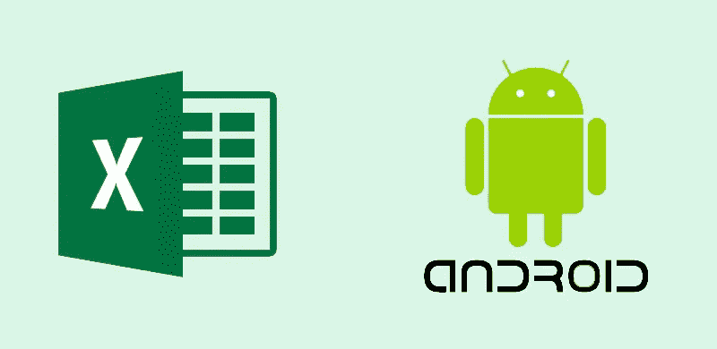

# 在 Android 应用程序中使用 Excel 的简单方法

> 原文：<https://medium.com/geekculture/a-simple-way-to-work-with-excel-in-android-app-de2e85cc899e?source=collection_archive---------10----------------------->

## 第 2 部分-阅读 Excel 表格



Copied from [More App](https://moreapp.com/en/blog/transform-excel-into-android-app/)

所以，在今天的文章中，你将学会用一种非常简单易行的方法在 Android 应用程序中阅读 excel 表格。要学习如何在 Android 中编写 excel 表格，请遵循本文的第一部分。要使用 excel 工作表，首先我们需要添加来自 [Apache POI](http://poi.apache.org/download.html) 的库。

在应用程序级梯度文件中，添加以下依赖关系。

```
//Apache POI for excel
implementation 'com.github.SUPERCILEX.poi-android:poi:3.17'
compileOnly 'org.apache.poi:poi-ooxml:3.17'
```

## 先决条件

先前了解:
1-科特林
2-在 Android 中读取文件

## 读取 Excel 文件

> 阅读 Excel 工作簿

要读取 excel 文件，我们首先需要从 app 目录中获取文件。

> 将 Excel 文件转换为工作簿

要读取 excel 文件，我们需要将其转换为 XSSFWorkbook 的 Workbook 对象。然后我们将使用 XSSFWorkbook 对象读取工作表和单元格值。

> 获取工作表

使用 workbook 对象，可以获得 excel 的所有工作表。

> 读取单元格

使用 sheet 对象，您可以获得工作表名称、所有行、所有列以及工作表中每个单元格的值。这个工作表对象将为您提供关于工作表的所有信息。

快点！！成功读取 Android 应用程序中的 excel 文件。

对于创建和写入 excel 文件，检查[第 1 部分](/geekculture/a-simple-way-to-work-with-excel-in-android-app-94c727e9a138)。更新 excel 表格的下一部分将很快发布。请关注 Android 应用程序中的更多帖子和问题解决方案。