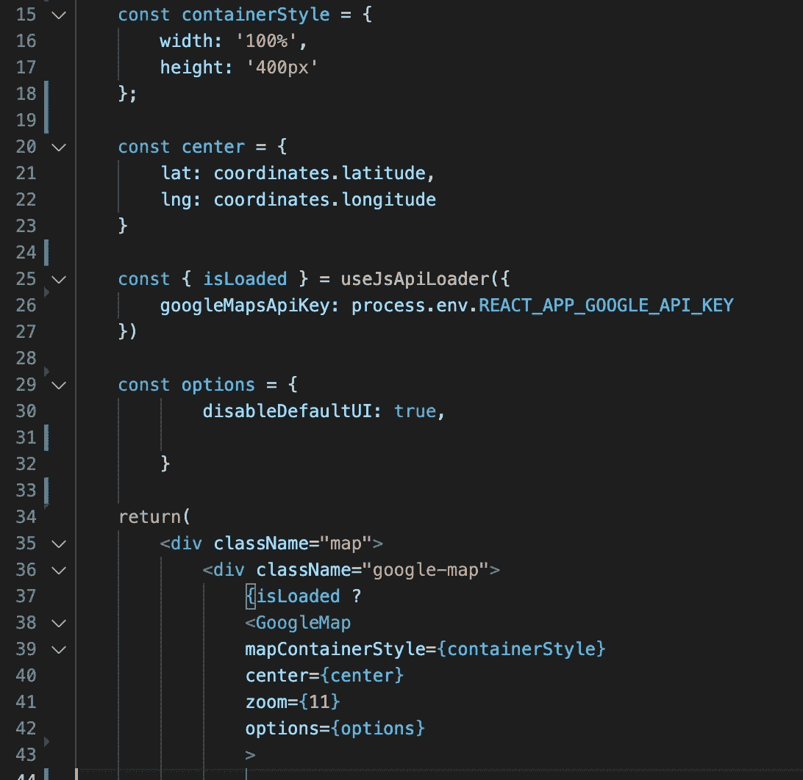
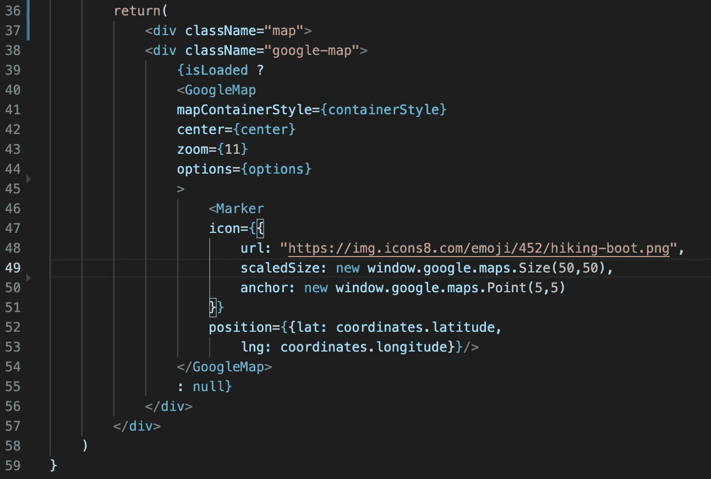

# 谷歌地图应用编程接口入门指南

> 原文：<https://medium.com/geekculture/a-starter-guide-to-google-maps-api-a0596c3fa084?source=collection_archive---------26----------------------->

作为一名新的开发人员，有一种自然的本能，去获得视觉上令人印象深刻或立即可识别的功能，几乎没有什么比绿色地图上的红色小标记更快地满足这种渴望……你知道并且喜欢它——谷歌地图！当我为我的最新项目——一个简单的徒步旅行应用程序——设计功能时，我知道这个 API 是我想要整合的一个功能。

虽然有很多关于如何使用该功能的有用文档，但我想将地图功能提炼为最简单的形式，并帮助任何希望在 React 项目中使用该 API 的人快速获得他们的功能。

**基础知识之前的基础知识**

我不会详细介绍如何为谷歌地图获取 API 密钥，因为这非常简单，谷歌已经做了很好的工作来指导你:[https://developers . Google . com/Maps/documentation/JavaScript/get-API-key](https://developers.google.com/maps/documentation/javascript/get-api-key)。我也不会讨论如何隐藏你的 API 键，但是如果你想知道最好的方法，这里有几个关于这个主题的[有用的博客](https://betterprogramming.pub/how-to-hide-your-api-keys-c2b952bc07e6)。从这一点开始，我将假设您已经得到了您的密钥，隐藏它，并准备开始映射。

**寻找最好的库**

这听起来像是一个次要的细节，但是需要花一点时间来弄清楚哪个库或包似乎很适合您的项目。Maps JS API 的文档将引导您进入[@ Google Maps/JS-API-loader](https://www.npmjs.com/package/@googlemaps/js-api-loader)。我确定这个很棒！但是我的前端使用的是 React，所以文档有点笨重，而且还有其他库使用 React 钩子来处理 API。为了使这尽可能容易，我去寻找一个地图/反应特定的库。

接下来，我找到了一个有用的[博客教程](https://blog.logrocket.com/a-practical-guide-to-integrating-google-maps-in-react/)，推荐了 google-map-react 包。更好！但是当我去安装它时，我遇到了另一个问题——这个库似乎不喜欢我有一个比 16.6 更新的 React 版本。经过进一步研究，我终于找到了完全符合要求的 [@react-google-maps/api](https://www.npmjs.com/package/@react-google-maps/api) 。对于任何对琐碎细节感兴趣的人来说，这个图书馆是对 *react-google-maps* 的重写，这是一个曾经受欢迎的图书馆，随着越来越少的维护，它似乎已经逐渐被放弃了。

你会注意到很多都有非常相似的名字，有时只是单词的顺序不同。这可能看起来很奇怪，我已经在这里开始了我们的教程，但如果你不小心，这可能是一个令人惊讶的颠簸。因此，让我们继续安装。

Installing our maps/api package

**光秃秃的最小值**

通常当在一个网站上实现谷歌地图时，我们至少会寻找一张地图和一个标记。为此，您需要将 GoogleMap、useJsApiLoader 和 Marker 导入到您的应用程序中。我们先处理地图，一会儿再处理标记。

至少我们需要建立四个属性来传递给我们的地图:1)一个容器，这样地图在我们的页面上就有一些参数，2)一个中心，这样地图就知道如何确定自己的方向，3)缩放级别，或者你最初想在地图上显示多少区域，以及 4)一个标志，告诉我们 API 何时成功加载。

第一个元素是一个容器，非常简单——您希望地图如何出现在页面上？在我的例子中，我希望我的地图以横幅的形式出现在页面上，横跨页面的宽度。对于我的一个地图视图，我希望地图根据所显示的路线集中在一个特定的路线上，所以我将路线的坐标作为道具传递下来，并将其插入到我的中心组件中。这是我们目前掌握的情况:

我们的地图组件已经完成一半了！对于缩放，这取决于地图的范围。谷歌给出了缩放级别的一些通用指南——1 是世界级别的视图，5 是洲级别的视图，10 是城市级别的视图，15 显示特定的街道，而 20 将显示建筑物级别的细节。我最终选择了 11 个，因为大多数徒步旅行可能有点偏远，所以至少展示一下城市和周围的城镇是有帮助的。

最后一个特定于 React 的元素是我们之前导入的钩子，useJSApiLoader。这个钩子加载 Google Maps API 并返回一个标志 isLoaded，它将指示 API 何时成功加载，防止出现任何渲染错误。钩子有一个必需的参数，您的 API 键！

我还将继续创建一个选项变量，从地图中删除默认 UI。默认包括像 [Pegman](https://www.buzzfeednews.com/article/justinesharrock/pegman-googles-weird-art-project-hidden-in-plain-sight) 这样的功能，卫星视图的选项，以及一个全屏按钮。这些都与我的使用没有太大的关系，并使地图更加清晰。下面是我们拥有所有基本元素后的样子，以及我们如何将这些道具传递给 GoogleMap 组件。

On line 26 you can see how to invoke a hidden API key through an environment variable

在我们的 return 语句中可以看到，一旦我们成功连接到 API，我们是如何使用从 useJsApiLoader 钩子加载的标志来呈现地图的。这是地图本身的样子:

We a few lines of code we have a map!

不错！

**标记…开始！**

它看起来很棒，但如果我们没有标记，它是谷歌地图吗？？我们很幸运，因为只需要很少的时间就能创造一个市场。我们的标记组件作为地图的子组件被传入，它唯一需要的是一个*位置*道具。在这里，我将使用相同的坐标来定位我们的中心支柱。

然后…瞧！

**额外积分**

我想让我的马克笔有点乐趣，因为我正在创建一个徒步旅行应用程序，所以我用了一只徒步旅行靴作为图标。我们可以通过利用 Marker 组件上的 icon prop 来做到这一点，并传递一个指向我们想要使用的任何图像的 url 链接。还需要指定一些其他元素，比如 *scaledSize* 设置图像的大小，以及 *anchor* (根据地图上标记的位置来定位图像的位置)。这是决赛在应用程序上的样子。

和 React 中的最终代码。

所以你有它！

并非所有的 API 都是一样的，总的来说，谷歌地图非常用户友好，有许多不同的用户指南。但是，阅读所有的文档需要时间，其中一些文档可能会混淆而不是澄清。这概述了启动和运行地图的最低要求。如果你对地图的更多高级功能感兴趣，可以看看官方文档。如果你想在这个 API 的功能上增加一些亮点，那就去看看时髦地图吧，它为谷歌地图提供了大量免费的自定义样式。

链接:

[官方 API 文档](https://developers.google.com/maps/documentation/javascript/overview)

[时髦地图](https://snazzymaps.com/)