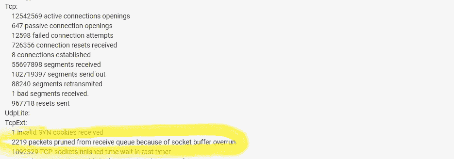

# 微软 Azure Kubernetes Pods 中一个奇怪的 TCP 丢包案例

> 原文：<https://medium.com/geekculture/a-strange-case-of-tcp-packet-loss-in-microsoft-azure-kubernetes-pods-bc4ff7698395?source=collection_archive---------18----------------------->

如果你读过我以前的文章，请注意:这是非常技术性的。

在过去的几年中，当出现数据包丢失等问题时，故障排除非常简单。通过观察连接两个端点的每个节点的数据包丢失情况，您可以尝试隔离哪个组件导致了数据包丢失。尽管原则在今天的部署架构中保持不变，但是有太多的抽象在进行，以至于您可以很容易地从真正的罪魁祸首那里抽象出来。更糟糕的是，如果您不能完全控制所有的基础架构组件，您可能会花费大量时间来回发送电子邮件，试图获得所有的诊断信息。例如，如果你在微软 Azure Cloud 上，你将无法使用老式的 ***traceroute*** ，因为这将被 Azure 网络组件禁用。

我们的故事从症状开始:*我们观察到我们的应用程序运行在 Azure 上的 Kubernetes 集群上，经历了突然的网络超时。*我们尝试查看运行应用程序的 pod 和运行在互联网上其他地方的目标远程服务器之间是否存在连接问题。通过从不同网络上的 pod 进行测试，我们很快排除了远程服务器出现一般问题的可能性。因此，要么是我们的数据包所经过的路径有问题，要么是数据包的来源有问题。我们还观察到，绕过 Azure 防火墙似乎可以减少数据包丢失。我们检查是否创建了太多的连接，以至于耗尽了防火墙上的 SNAT 限制，但发现它仍在阈值范围内。我们还在防火墙内创建了一个 Windows VM 和 *viola！*不存在丢包问题。

Many Layers of Network Stacks

这让我对 Linux 虚拟机上的数据包丢失进行了更深入的研究。这就是它变得棘手的地方，因为我们没有一个简单的 Linux 机器向互联网发送数据包。

我们有许多操作系统运行自己的网络堆栈，其中一些是混合型的。

我们开始查看在 pod 操作系统上发生了什么，查看 TCP 数据包间歇性发生了什么的最佳位置是 **netstat -st** ，因为它提供了总体统计数据，您可以确定发生的情况是否在您网络的合理范围内。如果你不是一个愿意阅读大量 Linux 代码的人，恐怕解释 netstat 中所有计数器的资源是有限的，所以如果你在 google 上找不到它，请做好钻研代码的准备。下面是我们从 netstat 获得的输出片段:

netstat -st command output

查看统计数据，可以发现网络似乎表现良好，因为计数器(如重传率)在合理的范围内(<1% retransmission ). What jumps out immediately is the highlighted line which tells you there is something wrong with the source being able to consume the data that is arriving at it. Being a buffer overrun you would think the solution is a simple increase of the kernel receive buffer. However this is not the case and [这里的](/@oscar.eriks/case-study-network-bottlenecks-on-a-linux-server-part-2-the-kernel-88cf614aae70)是一篇很好的文章，解释了为什么不是这样。

虽然我们现在似乎已经隔离了问题，并知道有一种方法可以通过调整内核参数来解决问题，但我也很好奇 Linux 和 Windows VM 之间的行为差异。我注意到的一个主要区别是使用的拥塞控制算法。出于某种不可理解的原因，Azure 中的 CentOS 图像被配置为使用*立方*作为算法。虽然这在 100 Mbps 网络中很棒，但它不能很好地应对今天的千兆字节速度后退得太快太快。在运行 Ubuntu 的 Kubernetes“节点”中，拥塞控制算法是 *htcp* 和**当我们从节点运行诊断时，我们没有遇到数据包丢失**。Windows 使用 *dctcp* 。有一些文章声称他们使用谷歌 BBR 获得了更大的带宽，这似乎真的只对我的客户端有效，可能对你的电脑有好处，并提供比 dctcp 稍微好一点的性能。我们将拥塞控制切换到 htcp，并且我们还能够证明它解决了分组丢失问题。

总之，我们了解到在当今的云基础架构系统中存在多层抽象，这使得故障排除更加困难。非常需要合适的工具来诊断这些问题，而不损害网络安全。是时候有人写一个新的规范来代替 ICMP 进行诊断了。