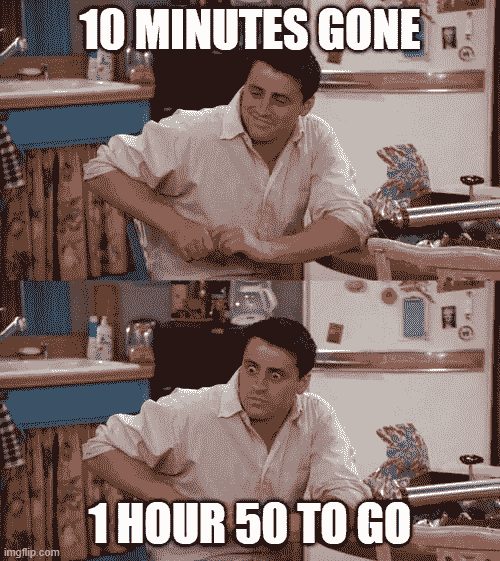
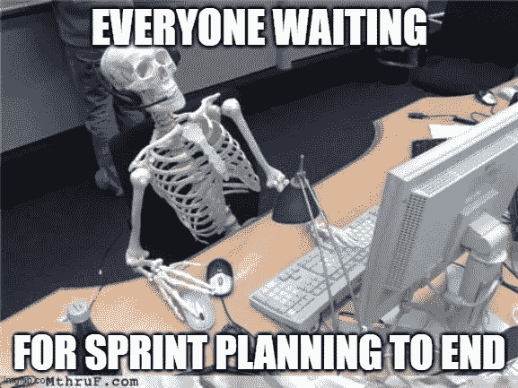

# 典型的冲刺规划会议(讽刺)

> 原文：<https://medium.com/geekculture/a-typical-sprint-planning-meeting-satire-708fb4dc8e1b?source=collection_archive---------18----------------------->

Photo by [Christina @ wocintechchat.com](https://unsplash.com/@wocintechchat?utm_source=medium&utm_medium=referral) on [Unsplash](https://unsplash.com?utm_source=medium&utm_medium=referral)

*上周我贴了一篇文章，被证明是相当成功的，讲的是一个* [*典型的敏捷冲刺看起来是怎样的*](/swlh/a-typical-agile-sprint-satire-c24baa011ff2) *。当然，这一切都很幽默，尽管有很多现实基础。现在，我认为我们应该看一看典型的冲刺计划会议。*

正如我说过的，冲刺通常始于周一可怕的…我指的是预期的和重要的**冲刺计划会议**。

所以你周一在办公室跳华尔兹，去喝杯咖啡，或者抽根烟，或者喝杯茶，或者多多祈祷，因为你知道在这个预先安排好的 2 小时会议中将会发生什么，这个会议不可避免地会持续至少 3 个半小时。

记住这一点，你安慰自己，你亲爱的 Scrum 大师通常不应该期望在 sprint 的第一天完成很多工作，所以你做到了，这很好。你只希望团队中的其他人也能理解这一点。

不管是谁，团队开始在会议室集合。你决定带着你的笔记本电脑，以便能够更容易地记笔记…并无耻地浏览网页。当尝试将笔记本电脑连接到电视屏幕时，乐趣就开始了。因为，即使物体没有感知能力，它们也能嗅到接下来几个小时的无用性，并且不喜欢与抽到了短签并决定“用他的笔记本电脑开会”的人相处。

当然，随着远程工作成为现实，你会期望这一步进行得更顺利。但是 Zoom 和 Slack 知道…他们知道。你可以打赌你即将获得的晋升(你的经理说你可能会也可能不会获得，这是基于一些你不太明白的武断规则)Zoom 和 Slack 不会愿意合作。他们就是不会。哦，你有团队？同样的情况……他们有自己的秘密组织，那里的金科玉律是:“当涉及冲刺计划时，不要顺利工作”。

无论如何，在援引了猴岛系列中的巫毒女并威胁要把毁灭战士送进任何一家不幸成为你们会议“组织者”的公司的总部后，你…加入了！

随着时间的推移，你可能会发现自己透过窗户凝视着，想知道你办公楼旁边的购物中心里的人一定在做什么。或者那些讨厌的人一直在你家窗外聊天。为什么他们可以在外面？他们可能在做什么？这是一个正在招聘的领域吗？不管是什么，它肯定比离你 1 米远的地方发生的事情更有意义。

不管怎样，当你接受那份工作的时候，你确实签了这种东西。然而，根据我的经验，在第一个 10 分钟之后，您的平均 dev 看起来是这样的:

All those college years for this?

所以，每个人都在船上，每个人都没有沉默，会议终于可以开始了…开始时有点尴尬的闲聊。

会议开始 30 分钟后，你终于可以开始讨论用户故事了。你内心绝望的乐观主义者希望，既然只剩下 1 小时 30 分钟了，一切都会进展顺利，不会有任何浪费在故事上的时间。你已经这样折磨自己五周了，完全无视老艾伯特对精神错乱的定义。

然而，第一个故事开始发挥作用。你会注意到它有一个非常清晰的描述，至少就你所知，它不会对应用程序产生太大的影响。砰，5 分，5 分钟内完成所有事情。到底能有希望吗？

你可能不知道，一个用户故事的故事点数决定了它的复杂度。数字是:0，0.5，1，2，3，5，8，13，20，40，100。敏捷使用斐波纳契数列规则直到某一点，就像大多数使用敏捷的人一样，它放弃了。

故事点数通常通过使用扑克计划卡来给出，这是一包包含上述数字的卡，加上一些其他额外的卡，一张有咖啡(意味着休息)，一张有问号(这个人不知道故事是关于什么以及它有多复杂…这张卡的使用**比它应该的**少得多， 从一个冲刺的结局来看)和一个无限，可能是灭霸在他的治疗过程中丢失的，因为他没完没了地寻找无限之石。

然而，就像几年前妮莉·费塔朵的那首歌一样，你不可避免地会问自己“为什么所有的好事都会结束？”当接下来的 3 个用户案例被过度讨论时(大约在 30 分钟到 2 天之间，在这些会议中时间似乎会有所不同)。当你凝视远方，寻找创造性的跑酷方式来摆脱这种情况时，你被要求为当前的故事提供你的故事点。

当你意识到你不知道这个故事需要什么的时候，一点不安爬了进来，所以你只是随便选了一张卡片。你决定 5，因为这是一个很好的平均数。但是当你意识到其他人都有 1 和 3 时，讨论这个故事的过程又重新开始了。你喃喃自语一些关于被“杂碎”抛弃的歌词通过一个向下的系统，然后，在另一个无休止的讨论后，你选择 3，每个人都很高兴。当然，直觉告诉你 5 会更好，但是你决定忽略它。从现在起的 10 天内，那肯定不会再回来困扰你了。

因为没有人知道什么时候停止，所以故事不断出现，并且有这样一种信念，即你可以从每次冲刺的总共 20 个故事点(通过将所有用户故事的所有故事点相加获得的数字)跳到 80 个，你可能会发现自己又开始考虑跑酷了。但是你记得你和你坐的椅子一样健壮，所以你决心意识到你每分钟内心有多渴望。

过了很久，在最终的用户故事被讨论和总结之后，你看着镜子，这是你所看到的:

Well, at least you lost a couple of pounds, right?

当你走出会议室或接听电话时，你逐渐开始看起来像一个人，停止内心的死亡，至少暂时停止，继续你的一天，感谢你又从这些恐怖节目中幸存下来。你往嘴里塞一些食物，让你的身体重新开始运作。

你也想知道一季基于 sprint 规划会议的美国恐怖故事会是什么样子，同时意识到发明敏捷的人可能在 Roanoke 的某个房子里考虑了所有这些。