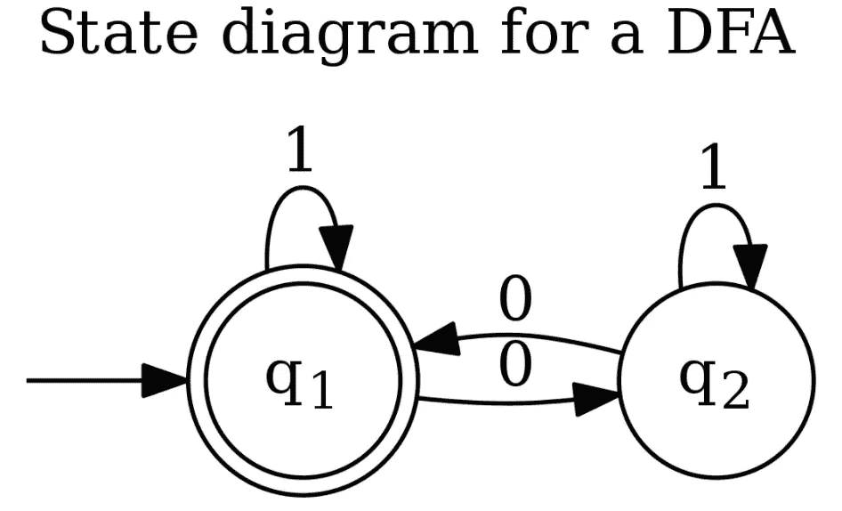

# 一种非常非常高级的计算理论方法

> 原文：<https://medium.com/geekculture/a-very-very-high-level-approach-to-computing-theory-87608e3f2153?source=collection_archive---------82----------------------->

让我们从我们所知道的计算机和计算机科学的开始说起。

这一切都始于数学家和语言学家创造分析语言和计算的方法，并演变为研究人员思考可以计算事物的处理结构的想法，就像艾伦·图灵机和阿隆佐·邱奇的λ演算(图灵机和丘奇的机器在数学上被证明是等价的)，通过所有这些研究，我们能够创造出我们所说的现代计算机以及所有的计算理论和有限自动机领域。为了阐明什么是可计算的东西，以及一个问题是否可以计算或使用计算来解决，计算理论或自动机理论的主题进入了 CS 主题。

> “一切可计算的都是可计算的。”
> **阿隆佐·邱奇和艾伦·图灵在教堂——图灵论文 1936**

但在我们开始之前，计算机理论在计算中有哪些应用，在我们的日常生活中有哪些用途？

编译器中的词法分析器、有限状态机、正则表达式、UML、搜索引擎算法都是计算理论可以帮助我们构建的东西

现在，让我们深入探讨本文中的一些起始主题:

## 字母:

当我们听到单词 alphabets 时，我们通常会想到从 A-Z 间隔开始的字符或一些附加字符，如“c ”,这取决于您的母语，但在计算理论中，字母可以被描述为一组符号，不仅包括 A-Z 字符，还包括数字[1，3，0]，特殊字符，如[*，/，$，@]甚至表情符号[💥, ❄️, 🌨，☃️]因为它们都是可以用来描述一种语言的符号。


Photo by [Amador Loureiro](https://unsplash.com/@amadorloureiroblanco?utm_source=medium&utm_medium=referral) on [Unsplash](https://unsplash.com?utm_source=medium&utm_medium=referral)

有效字母表:
{0，1} //二进制字母表
{a，b，c }//ABC 字母表
{0，1，2，3，4，5，6，7，8，9} //自然数字母表
{og，and，e，y} //分别为挪威语、英语、葡萄牙语和西班牙语的 and 单词字母表

## —语言:

像现实生活中的语言或编程语言一样，为了形式化一种语言，我有该语言的规则，例如，我不能有一个变量名，如果因为它是计算理论中的保留字，它基本上是相同的规则例如:

{w = {0，1}，其中 w|0 是偶数} //只接受包含 0 或 1 以及偶数个零的语言，例如“010010”这句话是有效的，因为我只有零和一，而零的总数是偶数

其他有效序列:

" 00" //有效，因为在语言中我没有说我必须给出任何数量的 1，我可以给出总共 0 个 1

" "//有效，因为同样地，我不要求我的语言接受 0 以上的 1，0 是偶数

001111111 //有效我的句子只能有两个 0 和 n 个 1，它才有效

现在是一个无效序列:

1011111//我没有偶数个 0 出现

## —序列/字符串:

{w = {0，1}其中| w | 0s 是偶数} //由 0 和 1 符号组成的语言，其中句子必须有偶数个 0，因此序列是我的语言接受或不接受的字符串。从上面的定义中可以看出，我可以有像 01，0010，""，11110110 等链。

## —DFA:

现在我们进入好的部分，我们开始为确定的语言创建识别器，DFA 代表确定的有限自动机，顾名思义，我们知道自动机识别某个序列的每一步



font: [https://www.bartleby.com/questions-and-answers/state-diagram-for-a-dfa-1-1-q2/b57e584e-08c8-4965-b328-60a026786d84](https://www.bartleby.com/questions-and-answers/state-diagram-for-a-dfa-1-1-q2/b57e584e-08c8-4965-b328-60a026786d84)

例如，为了分析对语言{w = {0，1}有效的序列，其中|w|0s 是偶数}我们创建这个 DFA，一个有限状态机，q1 作为它的初始和最终状态，如果我读:

STATE | R | GOES-TO |
q1 | 1 |—->q1 |//因为我的序列中可以有 n 个 1
Q1 | 0 |—->Q2 |//因为现在我有奇数个 0，所以我不能留在 Q1 中因为 Q1 是最终状态
Q2 | 1 |—->Q2 |//因为我的序列中可以有 n 个 1
Q2 | 0 |—->Q1 |//现在我们回到 Q1，因为现在我有偶数个 0

上述 DFA 的顺序及其最终验收结果:

001 //被接受
000 //被拒绝
101 //被拒绝
0101010100 //被接受
以上只是一些例子。

## —说起来容易，给我看看代码:

下面是一个用 Haskell 编写的 DFA 示例，用来识别序列中的双引号字符串

```
module StrFA wherestart = do 
   let a = "\"string\"\"oi\""
   print (fstState a)fstState [] = error "Empty input"
fstState a = sndState [] [] asndState [] tokens [] = concat (reverse list)
where
    list = map (\(x,y) -> x++" : "++ y ++ ", ") tokens
sndState previous _ [] = error "No closing string symbol in" ++ show    previous
sndState previous tokens ('"':xs) = thdState ('"':previous) tokens xs
sndState previous _ (x:_) = error "Wrong opening string format " ++ show xthdState previous _ [] = error "Wrong closing string format" ++ show previous
thdState previous tokens ('"':xs) = sndState []
(("String", (reverse ('"':previous))):tokens) xs
thdState previous tokens (x:xs) = thdState (x:previous) tokens xs
```

当然，这只是关于计算理论的一个小解释，还有很多要解释，因为我们还没有概述:NFA，正则表达式，自由上下文文法，下推自动机，图灵机，数理逻辑，等等。计算理论在计算机科学中是一个非常大的课题，也非常令人着迷，所以作为最后一条建议，现在，我强烈建议你为自己搜索更多关于这个课题的信息，敬请期待，再见。