# 向 Strapi v.3 添加刷新令牌

> 原文：<https://medium.com/geekculture/adding-refresh-token-to-strapi-v-3-2b75c01bd704?source=collection_archive---------6----------------------->


Strapi 是一个非常棒的工具。我是一个全栈开发人员，自己从头开始构建了几个 api，但 Strapi 是我创建简单 API 的绝对首选工具，同时当我的客户想要进行一些内容更新或提供支持时，它允许通过类似 CMS 的界面进行轻松管理。

Strapi 还需要做得更好的一点是，当您希望允许用户和访问者登录到您的前端并通过这种方式进行管理时，要有更持久的身份验证体验。我已经找到了几个关于如何更新现有 jwt 令牌的视频，但仍然存在一些安全问题，因为一旦 jwt 被发布，令牌可以用来更新自己，用户就没有办法阻止令牌窃贼永远访问他们的帐户。实际上，在这种情况下，即使不更改密码也不会有什么影响。

因此，我坐下来，在 Strapi 的 users-permission 插件上构建了我的扩展，以提供更好的刷新令牌体验，并认为这可能对希望实现相同系统的更多开发人员有用。现在—请注意，这将涉及一点编码经验，您应该知道我们将覆盖 Strapi 代码。如果您计划以后更新 Strapi，请记住这一点。希望在不久的将来，随着 Strapi 第 4 版的发布和他们令人敬畏的新插件 api，我们将能够以一种更优雅的方式添加这种逻辑，但我们必须等到公开测试版发布后才能看到。

# TL；速度三角形定位法(dead reckoning)

这是一篇相当长的文章，但是如果你知道你在做什么，只是想让它工作，你可以在这里找到[的要点](https://gist.github.com/imCorfitz/35252d6cadec811693b9c4a23200a1ef)。

# **让我们开始**

如果您还没有设置好您的 Strapi 环境，我们需要先做这件事。如果您的机器上已经运行了 Strapi，那么您可以跳过这一步。

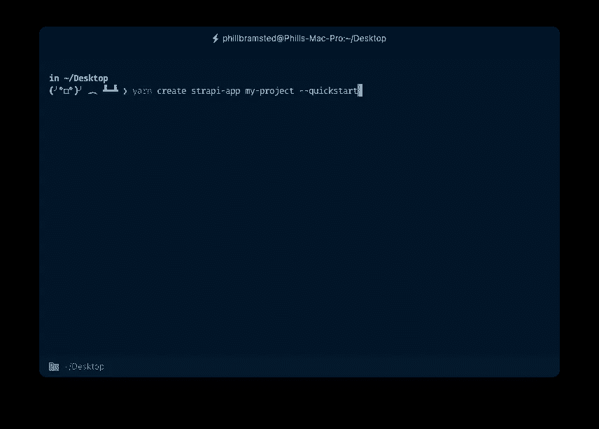

```
$: yarn create strapi-app my-project --quickstart
```

现在—我只是出于演示的目的运行快速入门，但是可以自由体验没有`--quickstart`标志的定制体验。

安装完成后，我们在`[http://localhost:1337/admin](http://localhost:1337/admin)`的浏览器中打开 Strapi，开始创建我们的第一个管理员用户。

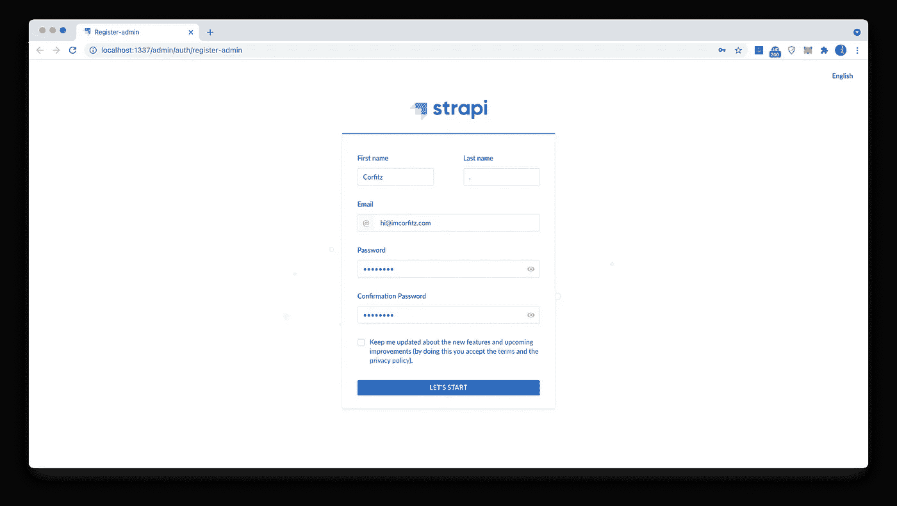

现在我们准备开始实现我们的自定义刷新令牌功能。首先，我们希望向用户集合类型添加一个自定义字段。稍后你会明白我们为什么需要它。

转到内容类型生成器，并在集合类型下选择用户。User 是 Strapi 中预先配置的插件，用于在 api 级别上管理用户和权限。在字段列表的底部，单击“向此集合类型添加另一个字段”。

选择“数字”作为字段类型，并将其命名为`tokenVersion`。选择整数作为数字格式。


单击“高级设置”选项卡，将默认值设置为 1，并选中私有字段的复选框，因为我们不需要将它暴露给 API。

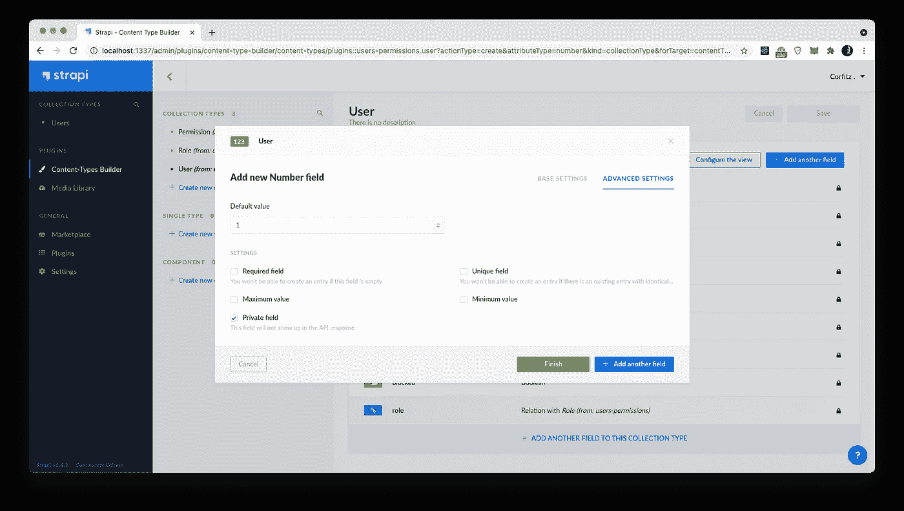

接下来，让我们在应用程序中添加一个用户。点击左侧菜单中“收藏类型”下的“用户”,然后点击“添加新用户”。填写所有字段，将其标记为已确认，并选择“已验证”作为角色。这是可以参与您的应用程序的用户的默认设置。

您会注意到我们的 TokenVersion 也显示出来了——但是您可以暂时将其保留为 1。单击 Save，让我们在 API 客户端中继续下一步。

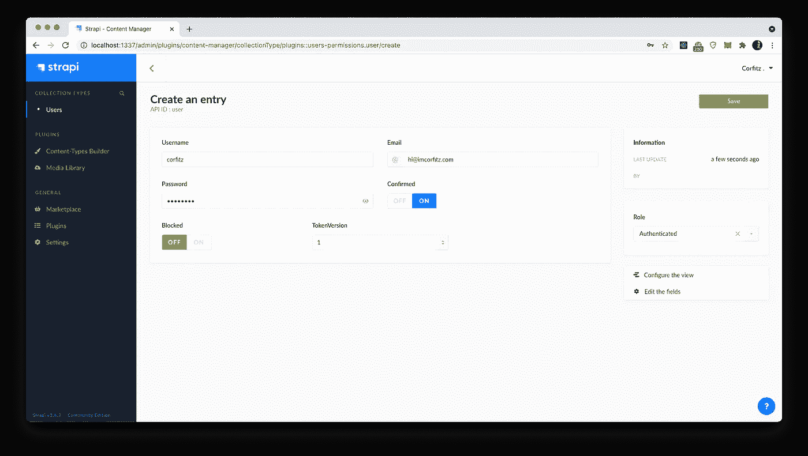

有几个很棒的工具可以帮助你测试和使用你的 API。 [Postman](https://www.postman.com/) 是一个很棒的工具，可以免费用于大多数用例。如果您使用 VS 代码作为您的 IDE，您还可以找到很棒的扩展来帮助您探索 API 并保存到您的工作区以备后用。[迅雷客户端](https://www.thunderclient.io/)是我最喜欢使用的客户端之一，尽管在大多数情况下，我使用的是一款名为 [Paw](https://paw.cloud/) 的付费软件。我真的很喜欢这种工作体验，当你使用更大的 API 时，可能是 REST 和 GraphQL，并且跨多个环境进行生产和测试，这在我看来再好不过了。

不管您选择的 API 客户机是什么，让我们继续向我们的 Strapi API 发出一个身份验证请求。为此，我们向`http://localhost:1337/auth/local`发出一个 POST 请求，用两个值“标识符”和“密码”发布一个 JSON 对象。

```
{
  "identifier": "hi@imcorfitz.com",
  "password": "Qwerty1234!"
}
```


神奇吧。一切都在按预期运行。我们已经收到了一个 JWT (JSON Web Token)和一个用户对象，其中包含关于已经过身份验证的用户的更多信息。

现在—让我们看看令牌中有什么。如果你在浏览器中打开一个新标签，然后进入 [jwt.io](http://jwt.io) ，你会找到一个可以粘贴令牌的地方。在右侧，它将显示有关令牌的详细信息，包括有效负载，这是我们在本例中要检查的内容。

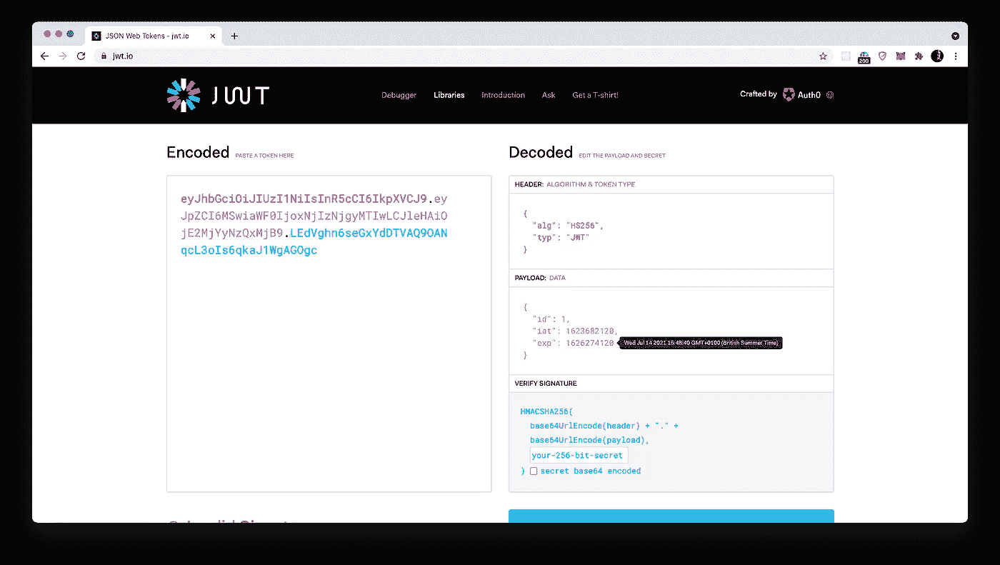

有效负载由三个属性组成:`id`包括经过身份验证的用户的用户 ID，`iat`包括这个令牌“发布于”的时间戳，`exp`告诉我们这个令牌的截止日期。如您所见，一个令牌大约有 1 个月的生命周期，这在大多数情况下是足够的，但理论上，令牌可能会在这一天用完，并导致用户体验不佳，如果他们正在提交 4 页长的多步表单，突然不再被允许访问 API。

这就是为什么我们想要一个刷新令牌，这样我们就可以从服务器请求一个新的访问令牌，并在使用我们的应用程序时保持网站的可访问性和 API 的活动。如果您以前使用过 Strapi，那么对于大多数人来说，到目前为止的一切应该相当熟悉。下一步，我们想为我们的更新令牌体验做一些准备。

# 添加新路线

我们想为 Strapi 创建两个新的端点:`refreshToken`和`revoke`。每当您的应用程序注意到当前访问令牌已过期时，就会调用刷新令牌。我们的端点将接受两个要提交的属性:

*   **令牌** | *字符串* | *用于生成新令牌的刷新令牌*
*   **renew** | *boolean |如果为‘true ’,我们还会返回一个新的刷新令牌*

如果刷新令牌已被破坏，将调用撤销端点。如果携带刷新令牌的那个令牌可以继续请求新的访问和刷新令牌，那么我们将在同一个循环中结束，所以我们需要一种方法来使它无效。在这里，我们将利用添加到用户模型中的令牌版本属性。

撤销端点应该只需要要使其无效的刷新令牌:

*   **令牌** | *字符串* | *令牌撤销*

下一步是启动我们最喜欢的 IDE(在我的例子中是 VS 代码)，然后我们想浏览到这个目录:`extensions > users-permissions > config`。在这个文件夹中，我们要添加一个名为`routes.json`的新文件，并添加以下代码:

```
{
  "routes": [
    {
      "method": "POST",
      "path": "/auth/refreshToken",
      "handler": "Auth.refreshToken",
      "config": {
        "policies": [],
        "prefix": ""
      }
    },
    {
      "method": "POST",
      "path": "/auth/revoke",
      "handler": "Auth.revoke",
      "config": {
        "policies": [],
        "prefix": ""
      }
    }
  ]
}
```

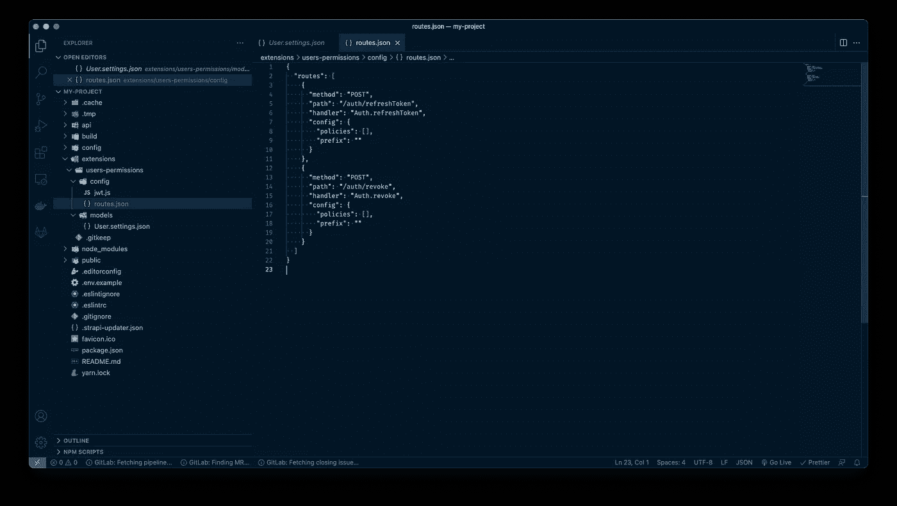

在您保存该文件之前，我们想在`extensions > users-permissions`下创建一个名为“控制器”的新目录，在这里我们将创建一个名为`Auth.js`的新文件，并添加以下代码:

```
"use strict";/**
** Auth.js controller
*
** @description*: A set of functions called "actions" for managing `Auth`.* */module*.*exports = {
 *async* *refreshToken*(ctx) {
    // *Refresh token
    ctx.send*({
      refreshed: true,
    })
  },
 *async* *revoke*(ctx) {
    // *Refresh token
    ctx.send*({
      revoked: true,
    })
  },
};
```


保存这两个文件，并检查您的终端，以验证一切仍然正常工作。您可能需要重新启动您的 Strapi 服务器。眼尖的人会发现我在创建 routes 对象时犯了一个小错误，这个对象在创建这些处理程序之前引用了 Auth 控制器中的一个处理程序。这将导致 Strapi 在保存文件时抱怨，因为 Strapi 会自动重启并重新验证代码库。但是一旦你保存了这两个文件，你应该可以再次运行`yarn develop`，让你的服务器运行起来。

接下来，我们希望进入 Strapi 并公开这两个新的端点供公众使用。我们通过进入“设置”并选择“用户和权限插件”部分下的“角色”,然后点击“公共”。


在列表底部，您将展开“users-permissions”折叠项，并注意到我们的两个新端点列在“Auth”下。启用这两个选项，然后单击“保存”。

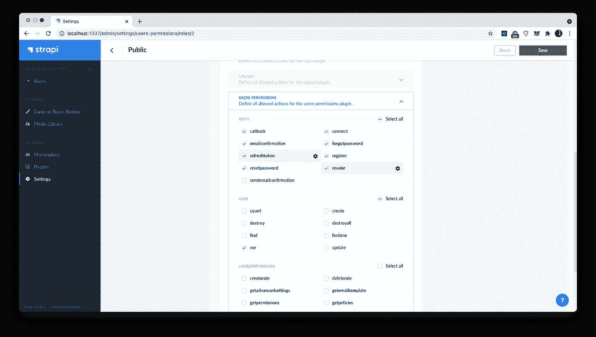

接下来—让我们回到 API 客户端，测试我们的新端点。我们设置了一个 POST 请求，添加`http://localhost:1337/auth/refreshToken`作为端点。运行它，您应该会看到一个 status 200 响应，JSON 主体包含一个属性:`refreshed: true`。

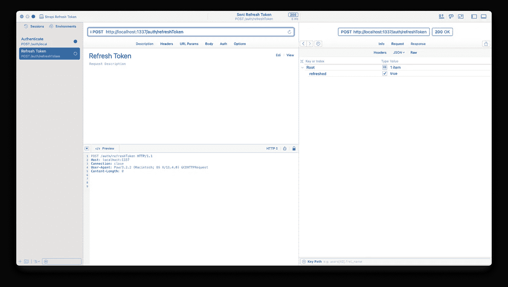

到目前为止做得很好！到目前为止，还没有什么新奇的事情发生，但是一切都运行得很好，我们现在已经为我们的定制实现建立了基础。所以让我们开始吧。

# 刷新令牌

此时，我们将对 Strapi 进行进一步扩展，因为我们想要继承整个“Auth.js”文件，并扩展一些自定义的返回数据。我们还想用刷新令牌来扩展身份验证时的返回对象。因此，我们需要在这一部分做一些自定义编码。

首先，我们将转到位于 Strapi 的“用户-权限”存储库…

[](https://github.com/strapi/strapi/tree/master/packages/strapi-plugin-users-permissions) [## 斯特拉皮/斯特拉皮

### 🚀开源 Node.js Headless CMS，轻松构建可定制的 API-strapi/strapi

github.com](https://github.com/strapi/strapi/tree/master/packages/strapi-plugin-users-permissions) 

…并在“控制器”下找到 [Auth.js](https://github.com/strapi/strapi/blob/master/packages/strapi-plugin-users-permissions/controllers/Auth.js) 文件。

我们想要复制它的所有内容并粘贴到我们自己的`Auth.js`文件中。注意，我们不能在一个文件中有两个`modules.exports`对象，所以我们只需将两个新的处理程序复制到我们刚刚粘贴的`module.exports`对象的顶部。如果你不确定如何做到这一点，你可以看看这里的要点。

在文件的顶部，就在导出的模块对象的上方，我们添加了自定义函数来生成刷新令牌。

```
const *generateRefreshToken* =(*user*)=>{
  *return strapi.plugins*["users-permissions"]*.services.jwt.issue*(
    {
      *tkv*: *user.tokenVersion*,// *Token Version* },
    {
      *subject*: *user.id.toString*(),
      *expiresIn*:"60d",
    }
  );
}
```

我们使用与 Strapi 发行普通 JWT 令牌相同的 JWT 服务，但我们添加了令牌版本，而不是有效负载中的用户 ID，然后我们将用户 ID 作为令牌的主题添加到 JWT 选项对象中，并添加一个更长的到期日期。在这种情况下，我只是将标准令牌的生命周期延长了一倍，这在大多数情况下应该足够了。这并没有真正的标准，因为一些 API 的刷新令牌可以存在数年，而另一些可以存在数月。在我们的情况下，60 天应该就可以了。

接下来，我们希望找到`Auth.js`中所有发放 JWT 令牌的地方，并用包含由我们的新函数`refresh: generateRefreshToken(user)`返回的令牌的`refresh`属性来扩展对象。(上一次我这样做的时候，我在 163，199，245，565，604 行中找到了 5 个地方来添加这个。)


如果我们再次返回到 API 客户端并运行身份验证调用，我们现在应该会看到，我们也获得了一个刷新令牌。神奇吧。

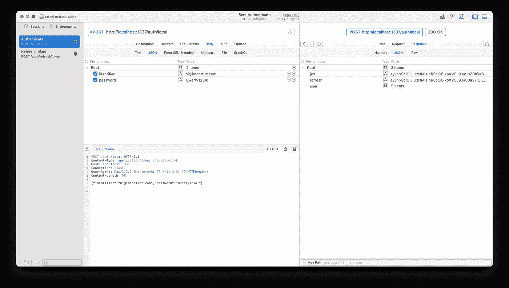

为了确保刷新令牌被正确创建，让我们再次在 jwt.io 验证其有效负载的内容。现在，我们看到离到期日期还有 60 天，它还包括`tkv`和`sub`，这是我们的令牌版本和用户 id。这太好了！

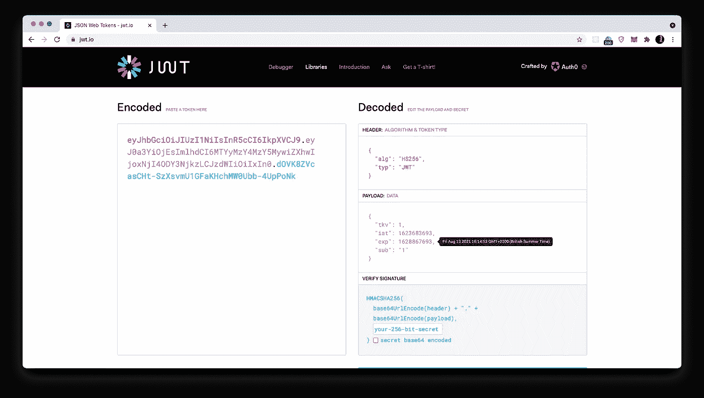

接下来，我们将实际构建我们的 refreshToken 处理程序。简而言之，它将打开刷新令牌，并从验证它是否过期开始。此后，我们根据 subject 属性获取用户，并验证刷新令牌中的令牌版本是否与用户的令牌版本相匹配。

这是我们创建更高安全级别的地方。如果刷新令牌被破坏或被盗，我们可以简单地为用户将令牌版本增加 1，然后刷新令牌将不再有效。为了获得额外的安全级别，我们还可以扩展`resetPassword`处理程序来自动增加这一级别，以使所有当前的刷新令牌无效，从而要求用户在所有浏览器和设备上再次登录。

如果一切顺利，我们就创建一个新的 jwt 令牌(如果需要，还会刷新令牌)并返回给调用者。

```
*async* *refreshToken*(ctx) {
  const *params* = *_.assign*(*ctx.request.body*);

  // *Params should consist of:* // ** token - string - jwt refresh token* // ** renew - boolean - if true, also return an updated refresh token.*// *Parse Token
  try* {
    // *Unpack refresh token* const{*tkv*, *iat*, *exp*, *sub*}= *await strapi.plugins*["users-permissions"]*.services.jwt.verify*(*params.token*); // *Check if refresh token has expired* if (Date*.now*() / 1000 > exp) *return* *ctx.badRequest*(null, "Expired refresh token"); // *fetch user based on subject* const *user* = *await* strapi*.query*("user", "users-permissions")*.findOne*({ id: sub }); // *Check here if user token version is the same as in refresh token* // *This will ensure that the refresh token hasn't been made invalid by a password change or similar.* if (tkv !== *user.*tokenVersion) *return* *ctx.badRequest*(null, "Refresh token is invalid"); // *Otherwise we are good to go.
    ctx.send*({
      jwt: *strapi.*plugins["users-permissions"]*.services.jwt.issue*({
        id: *user.*id,
      }),
      refresh: *params.*renew ? *generateRefreshToken*(user) : null
    });
  } *catch* (e) {
    *return* *ctx.badRequest*(null, "Invalid token");
  }
},
```

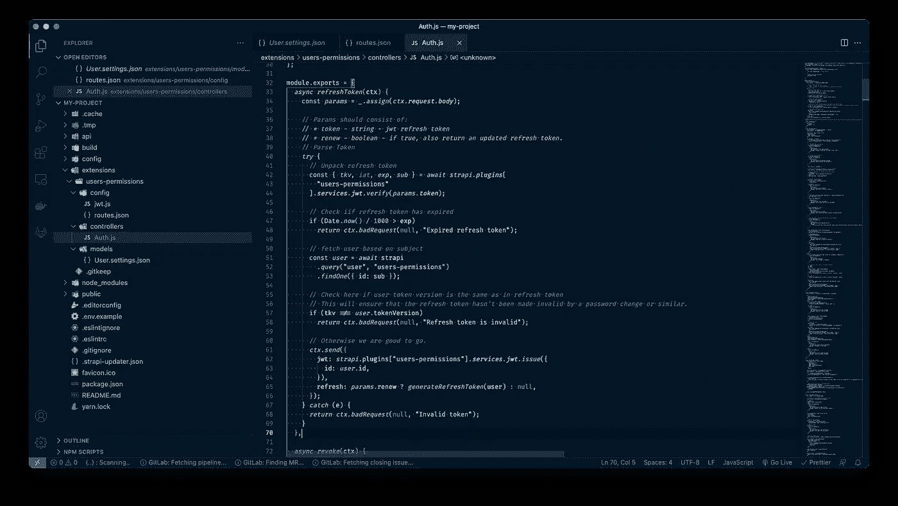

现在让我们看看当我们从 API 客户端调用刷新令牌端点时是否一切正常。这一次，我们必须确保在调用端点时在 JSON 主体中添加了“token”属性和可选的“renew”属性。如果一切按计划进行，您应该在回调中收到一个新的 jwt 和可能的刷新令牌。💪


# 吊销令牌

现在，我们将对撤销处理程序做几乎相同的操作。代码会或多或少地有一些变化。一旦我们验证了刷新令牌，我们就调用对用户的更新，将令牌版本增加 1，并向调用者返回一个简单的确认。

```
*async* *revoke*(ctx) {
  const *params* = *_.assign*(*ctx.request.body*);

  // *Params should consist of:* // ** token - string - jwt refresh token* // *Parse Token
  try* {
    // *Unpack refresh token* const{*tkv*, *iat*, *exp*, *sub*}= *await strapi.plugins*["users-permissions"]*.services.jwt.verify*(*params.token*); // *Check if refresh token has expired* if (Date*.now*() / 1000 > exp) *return* *ctx.badRequest*(null, "Expired refresh token"); // *fetch user based on subject* const *user* = *await* strapi*.query*("user", "users-permissions")*.findOne*({ id: sub }); // *Check here if user token version is the same as in refresh token* // *This will ensure that the refresh token hasn't been made invalid by a password change or similar.* if (tkv !== *user.*tokenVersion) *return* *ctx.badRequest*(null, "Refresh token is invalid"); // *Update the user.
    await* strapi*.query*("user", "users-permissions")*.update*({ id: sub }, { tokenVersion: *user.*tokenVersion + 1 }); // *Otherwise we are good to go.
    ctx.send*({
      confirmed: true,
    });
  } *catch* (e) {
    *return* *ctx.badRequest*(null, "Invalid token");
  }
},
```

让我们通过复制我们在测试中使用的 refresh token 来测试这一点，我们对 refresh token 端点进行测试，并将它作为 JSON 主体中的`token`属性传递给对`http://localhost:1337/auth/revoke`的 POST 请求。

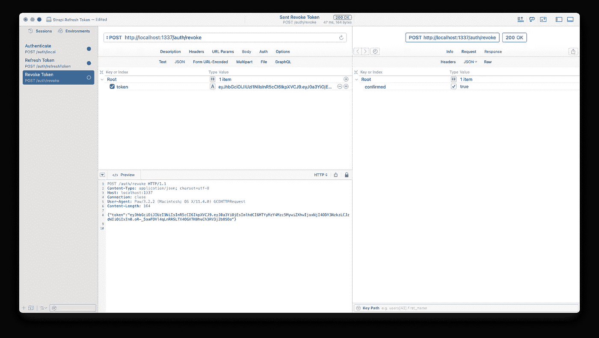

厉害！我们得到了确认。因为我们很好奇，所以让我们在 Strapi admin 中查看一下，看看用户的令牌版本是否已经更新。


好样的。令牌版本现在显示为 2，现在我们的刷新令牌在理论上应该不再有效。让我们打开我们的 API 客户机，使用与前面相同的数据再次触发刷新令牌端点调用。您看一下，错误请求，状态 400，错误消息:“刷新令牌无效”。作为开发人员，这通常不是您乐意看到的状态和 API 回复，但在这种情况下，这再好不过了。


此时，我们可以继续开发我们想要构建的 API、数据结构和新应用程序。我祝你一切顺利，并祝你今后的工作顺利！干杯！

科菲兹，等等！我使用的不是 REST apis，而是 GraphQL。我们如何在 GraphQL 中做同样的事情？

我很高兴你问了。因为我们已经有了所有的逻辑，所以只需要创建所需的变化，添加到 GraphQL API，并使用我们的新处理程序来完成这项工作。让我们设置它。

# 现在在彩色图表中

首先—如果您还没有，我们需要为 Strapi 安装 GraphQL 扩展。转到您的 Strapi admin，在 Marketplace 下，单击 GraphQL 的下载按钮。这将运行安装并重新启动服务器。可能需要几秒钟才能运行。

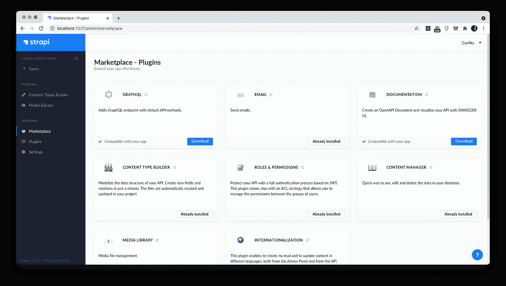

接下来，我们将返回 IDE，在`extensions > users-permissions > config`下创建一个名为`schema.graphql.js`的新文件。

我们首先在最顶端要求“lodash ”:

```
const _ = require("lodash");
```

下面我们将创建一个由 3 个属性组成的`module.exports`对象:

*   **定义** | *GraphQL 类型定义*
*   **突变** | *突变及其参数和返回值*
*   **解析器** | *解析变异调用的 JS 代码*

定义如下所示:

```
definition: */* GraphQL */* `
  type UsersPermissionsRefreshTokenPayload {
    jwt: String!
    refresh: String
  }
  type UsersPermissionsRevokeTokenPayload {
    confirmed: Boolean
  }
`,
```

这将是我们的突变:

```
mutation: `
  refreshToken(token: String!, renew: Boolean): UsersPermissionsRefreshTokenPayload!
  revokeToken(token: String!): UsersPermissionsRevokeTokenPayload!
`,
```

然后我们有了解决方案:

```
resolver: {
  Mutation: {
    refreshToken: {},
    revokeToken: {},
  },
}
```

在 refreshToken 对象下，我们将添加三个属性:

*   **描述** | *字符串* | *突变描述*
*   **解析器的** | *字符串* | *系统引用处理程序*
*   **解析器** | *函数* | *异步函数解析调用*

让我们像这样创建它:

```
description: "Refresh JWT Token",
resolverOf: "plugins::users-permissions.auth.refreshToken",
*resolver*: *async* (obj, options, { context }) => {
  *context.*query = *_.toPlainObject*(options); *await* *strapi.*plugins["users-permissions"]*.controllers.auth.refreshToken*(context);
  letoutput= *context.body.toJSON* ? *context.body.toJSON*() : *context.*body; *checkBadRequest*(output); *return* output;
},
```

*等等… checkBadRequest？那是从哪里来的？*

没错。我们也必须创建这个函数。因此，在我们文件的顶部，在我们模块导出的上方，我们将添加以下函数:

```
/**
** Throws an ApolloError if context body contains a bad request
** @param *contextBody - body of the context object given to the resolver
** @throws *ApolloError if the body is a bad request* */function *checkBadRequest*(contextBody) {
  if (*_.get*(contextBody, "statusCode", 200) !== 200) {
    const *message* = *_.get*(contextBody,"error","Bad Request");
    const *exception* =new *Error*(message);
    *exception.*code = *_.get*(contextBody, "statusCode", 400);
    *exception.*data = contextBody;
    *throw* exception;
  }
}
```

这只是一个小小的错误处理程序，如果结果是一个错误的请求，它会抛出一个错误，并提供 Auth 处理程序的详细信息。

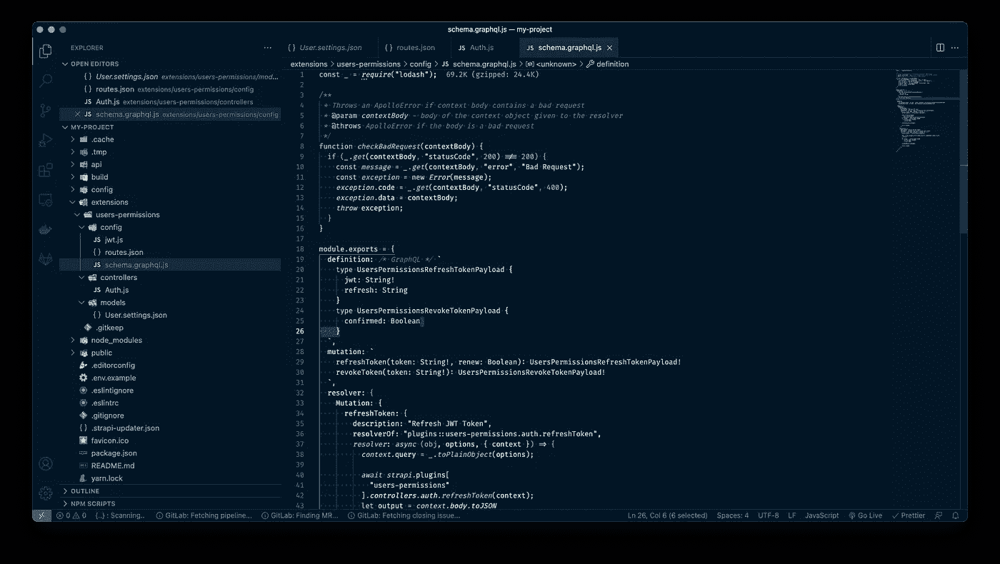

最后，让我们对我们的`revokeToken`突变解析器对象做同样的事情:

```
description: "Revoke Refresh Token",
resolverOf: "plugins::users-permissions.auth.revoke",
*resolver*: *async* (obj, options, { context }) => {
  *context.*query = *_.toPlainObject*(options); *await* *strapi.*plugins["users-permissions"]*.controllers.auth.revoke*(context);
  letoutput= *context.body.toJSON* ? *context.body.toJSON*() : *context.*body; *checkBadRequest*(output); *return* output;
},
```

就是这样！如果我们再次打开我们的 API 客户机，创建一个 GraphQL 请求，我们就可以提取模式数据，并看到我们的两个新变异实际上被添加到了我们的 GraphQL 模式中。很棒的东西。如果您的 API 客户端不支持 GraphQL 请求，您也可以访问`http://localhost:1337/graphql`,这将在您的 Strapi 服务器上打开 GraphQL playground。

让我们来测试一下！首先，我们可能需要重新进行身份验证，并获得一个新的刷新令牌，因为由于我们之前进行的撤销令牌调用，我们之前的令牌现在已经无效。

然后，我们将在我们的 GraphQL 客户端中为 refreshToken 创建一个变异查询，该查询将 refresh Token 作为“token”参数，我们只需将“renew”作为 true 进行传递。


Yis！开始看起来像一个富有成效的一天！我们得到了新的 jwt 令牌和刷新令牌。现在——让我们撤销它们吧！Muahahaha 哈哈！！！！

用 refresh 标记创建另一个对 revokeToken 变异的变异调用，让我们看看会发生什么。如果你和我一样幸运，你应该看到一个很好的数据回调，它的属性是`confirmed: true`。我们很幸福。

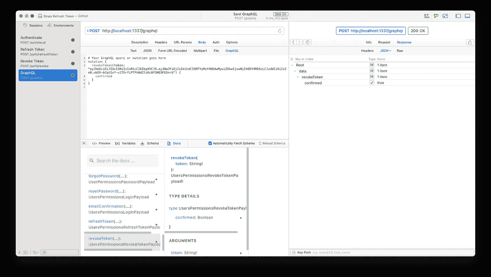

为了圆满完成，让我们再次运行我们的 refreshToken，看看它实际上已经被无效了…我相信我们完成了！

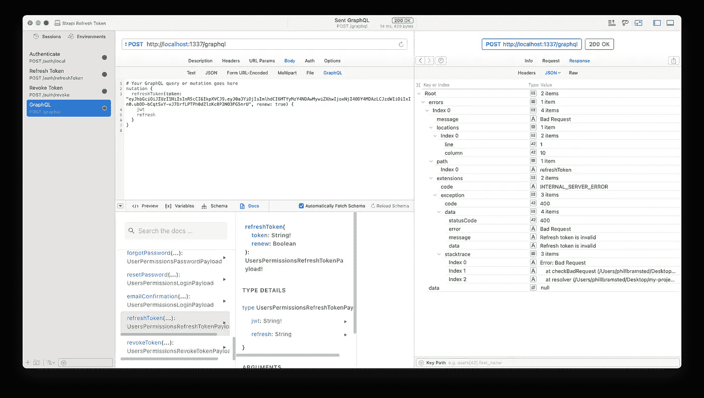

# 最后的想法

每当您允许用户从前端或应用程序使用您的 api 和数据，并希望通过在他们使用您的应用程序时保持他们的会话活动来优化 UX 时，这是对您的 Strapi 设置的一个很好的补充。

我很惊讶这个简单的实现不是 Strapi 的用户权限扩展的标准部分，但是随着第 4 版的即将到来，他们可能会向我们展示一些他们已经完成的新的和现有的东西。尽管如此，我希望这对你们中的一些人有所帮助。

祝你愉快！🤓 🥃