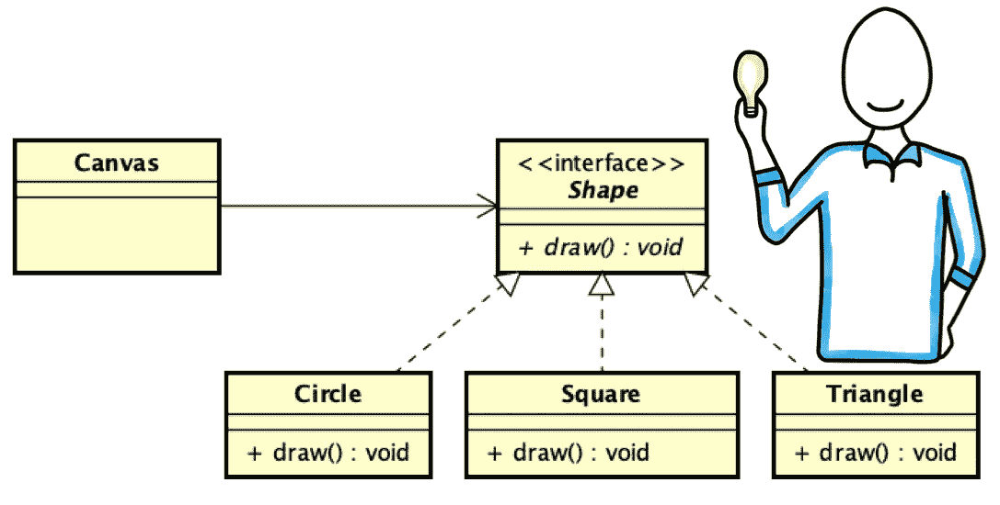
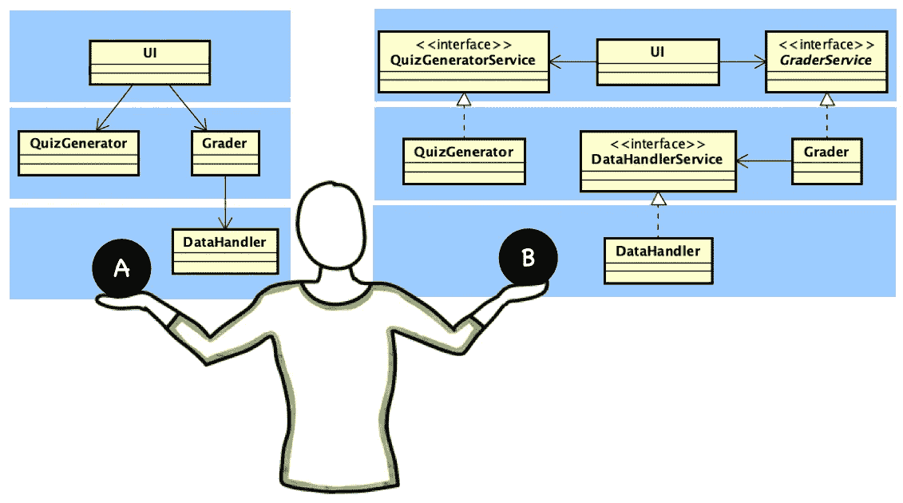

# 软件设计:10 分钟内的坚实原理

> 原文：<https://medium.com/geekculture/agile-software-design-in-a-nutshell-1d104cb4830a?source=collection_archive---------13----------------------->

Photo by [Max Duzij](https://unsplash.com/@max_duz?utm_source=unsplash&utm_medium=referral&utm_content=creditCopyText) on [Unsplash](https://unsplash.com/s/photos/code?utm_source=unsplash&utm_medium=referral&utm_content=creditCopyText)

敏捷开发是面对快速变化的需求快速开发软件的能力。敏捷性通过以下方式实现:

*   遵循提供所需纪律和反馈的**实践**，
*   编写**干净的代码**，以及
*   使用**设计原则**，保持我们软件的灵活性和可维护性；此外，当需要时，应用**设计模式**来解决特定的设计问题。

很容易识别和认同敏捷**实践**和**干净代码**方法。然而，有时候，人们错误地认为敏捷就是编码，而设计是不相关的或者不存在的。事实并非如此。

关于敏捷开发过程中的软件设计，要记住的最重要的事情是**设计随着代码**一起发展。设计每天都在不断改进和改进。在敏捷中，**软件设计是一个过程，而不是一个事件。**

是的，最有价值的资产是代码。这就是我们想要提供的产品。然而，糟糕的设计会危及产品的质量。设计，就像代码一样，应该是干净的。当设计不干净时，**会闻到**的味道，从而产生代码:

*   难以改变(僵化)，
*   容易破碎(易碎)，
*   难以重用(不可移动)，
*   杂乱无章(不透明)，

此外，超出我们需求的设计也是一种气味。因此，抽象类、接口、设计模式和其他不解决问题的基础设施元素，以及过度设计系统的元素，在需要的时候没有它们是一样糟糕的。

消除设计气味是**设计原则**的目标。设计原则是大量开发人员和研究人员几十年经验的产物。它们不仅仅是某个人的事件。当气味出现时，我们应用原理来消除它们。当没有气味时，我们不使用它们。正如罗伯特·马丁所说:

> 设计原则不是一种香水，可以随意散布在整个系统中

让我们来谈谈设计原则，它们定义了什么，以及它们如何帮助我们。有五个设计原则需要考虑:单一责任原则(SRP)、开闭原则(OCP)、利斯科夫替代原则(LSP)、依赖倒置原则(DIP)和接口隔离原则(ISP)。

每个设计原则都识别特定的气味，并有相关的推荐**启发式**解决方案。记住“启发法”是解决问题的技术或方法，它采用一种实用的方法，这种方法**不能保证是最优的、完美的或合理的**，但足以达到一个直接的、短期的目标或近似值。

**1。单一责任原则**

它指出:

> 一个类应该只有一个责任。

**问题**

为什么？因为每个责任都意味着改变的可能性。如果一个类有不止一个职责，那么这些职责就成了耦合的。因此，对一项职责的更改可能会损害或抑制该类履行其他职责的能力。这种耦合导致**脆弱的**设计，当改变时会以意想不到的方式破裂。SRP 是关于理解何时以及如何应用**解耦** *。*

**启发式**

用于实现解耦的试探法包括设计模式的使用，特别是:外观、代理和委托。

**示例**

想象一下，你需要一个软件从不同的传感器设备(心率监测器、脑机接口、皮肤电导传感器等)读取数据。).此外，您还需要存储这些信息以备将来使用。对于某些传感器，我们需要直接从串行端口收集数据。对于其他人，我们使用 WebSockets(第三方 API 帮助我们从物理设备获取数据)。为了存储数据，我们希望能够将数据存储在本地文件(文本文件)或数据库中。因此，收集数据并存储数据。简单！。

一个**新手程序员**会立即跳转到代码一个**单类*传感器*** 带有一些属性、收集数据的方法和存储数据的方法。可能方法有: *gatherDataSerialPort()* ， *gatherDataWebSocket()* ， *saveDataFile()* ，*savedatabase()*。

一个班一个责任(做传感器)，对吧？。**错了！这就是程序员和软件工程师不一样的地方。我们的例子表达了两个职责(不是一个):收集数据和存储数据。而且，我们需要分离它们。怎么会？**

嗯，我们的传感器是一个需要读写东西的东西的**门面**——一个熟悉的面孔，承担着两种责任。此外，我们可以使用一些**代理或委托**来收集数据和存储数据。然后我们可以在不同的课上处理细节和复杂性。一个可能的解决方案草案如图 1 所示。

Figure 1\. A class Sensor as a facade for two decoupled responsibilities: gathering data and storing data

我们应用 SRP 试探法是因为我们感觉到了脆弱的味道。即使是程序员新手，也迟早会注意到一个类用四种方法的初始解决方案的问题。我们创建接口和使用模式不是为了好玩或者让我们的代码看起来复杂。我们这样做是为了让我们的代码更好，可扩展，可修改，等等。

**2。开闭原理(OCP)**

它指出:

> 软件实体(功能、类、模块等。)应该对扩展开放，但对修改关闭。

**问题**

软件设计的核心目标是创建无需修改现有源代码即可扩展的实体。OCP 就是通过添加新代码来实现改变，而不是改变已经运行的旧代码。因为我们希望避免单个变更导致依赖实体的级联变更——这是一种**僵化**的味道。

让我明确一点:**封闭不可能是完全的。**总会有一些实体没有关闭的变化。因此，关闭必须是战略性的。作为一名开发人员，对应用程序随着时间的推移可能遭受的变化做出有根据的猜测。

**启发式**

满足 OCP 的简单而有效的启发是**继承**——一个行为可以在子类中扩展，而不需要修改超类。此外，一些设计模式是有帮助的，包括策略模式和模板方法模式。

**示例**

想象一下，你被要求创建一个程序在屏幕上绘制几何图形。我们要画圆，要画正方形；也许以后，我们会要求画三角形或其他东西。

我们的**新手程序员**很可能会跳转到编写一个**类，并包含**一些属性和可能的方法，如*drawcirce()*和 *drawSquare()* 。我们的程序员新手会认为，稍后会添加一个 *drawTriangle()* 等等。完美的解决方案，对吧？不，一点也不好。

*“开放扩展，关闭修改”*表示我们不希望修改类，也就是不希望将代码写入类中。这不像你在做学校的编程作业。一旦您创建了一个类并将它放到生产环境中，您就不想再接触它了。

那么，我们能做什么呢？

使用继承。创建一系列几何形状，并在每个类中放入它自己的方法 draw()。当您需要新的几何图形时，可以使用 draw()方法向族中添加一个新类。您可以扩展，并且不需要修改已经存在的内容。一个可能的解决方案草案如图 2 所示。

Figure 2\. A family of classes for geometric shapes, each with its method draw()

OCP 是灵活性、可维护性和可重用性的核心。然而，**不要在设计中加载大量不必要的抽象类和接口。仅将它们用于软件中经常变化的部分。请记住，抵制应用不成熟的抽象和创建抽象本身一样重要。**

**3。利斯科夫替代原理**

它指出:

> 子类型必须可以替换它们的所有基本类型。

**问题**

这个原则是芭芭拉·利斯科夫(1988)对以下问题提出的答案:

*   最佳继承层次结构的特征是什么？
*   有哪些陷阱会产生危及 OCP 的等级制度？

保证**一个子类将在它的超类被使用的地方一直工作**是管理复杂性的一个强有力的方法。此外，违反 LSP 是对 OCP 的潜在违反，这是事实。

子类不能替换其超类的情况是什么？当子类**删除了它从超类继承的行为**时。父母有它，但孩子把它拿走了。这是错误的，记住面向对象的陈述:孩子应该永远比他的父母更好。而且，“更好”意味着更多的行为，而不是更少。

**启发式**

当处理继承和多态时，请记住，

*   公共责任应该从公共超类继承。
*   子类不会比超类做得少——永远不要删除功能。
*   当定义一个类的家族时，总是认为:"*这两个类应该作为父类和子类连接起来，或者它们可以作为兄弟姐妹更好地工作*"
*   同样，按照这些思路，子类中的方法不会抛出其超类不会抛出的异常。

**示例**

假设你已经有了一个 ***圆、*** 并且你被要求创建一个 ***圆柱体。*** 或者，也许你有一个类 ***矩形*** ，要求你创建一个类 ***正方形*** (正方形是宽度和高度相同的矩形)。或者，您有一个类 ***LinkedList*** ，您被要求创建一个类***persistentlinked list***(将元素写出到一个流中并可以稍后读回它们的类)。

如果您想使用从 ***圆形*** 到 ***圆柱*** ，或者从 ***矩形*** 到 ***正方形*** ，或者从 ***LinkedList*** 到***persistentlinked list***的继承，即，为任何

为什么？嗯，

*   类 ***圆柱体*** 会消除方法****圆*** 中的【calculateArea()* ，因为计算面积没有意义。不可能用我们的 ***圆柱*** 对象来替换一个 ***圆*** 对象。
*   类 ***Square*** 会让方法 setWidth()和 setHeight()来修改宽度和高度两个属性(它们在正方形里是相等的吧？).因此，不可能用一个 ***方形*** 对象来替换一个 ***矩形*** 对象。
*   类***PersistentLinkedList***需要持久(可序列化)对象，而 ***LinkedList*** 不需要。此外，***PersistentLinkedList***可能需要抛出一些异常。

在大多数情况下，解决方案是将类关联为兄弟，而不是父类和子类。

请留意 LSP，因为 LSP 支持 OCP。

**4。依赖倒置原则(DIP)**

它指出:

> 高层模块不应该依赖低层模块。两者都应该依赖于抽象。

**问题**

传统的**过程化编程**创建软件结构，其中高级模块依赖于低级模块。因此，对较低级别模块的更改可以直接影响较高级别的模块，并迫使它们进行更改。当高级模块依赖于低级模块时，在不同的上下文中重用那些高级模块就变得很有挑战性。

一个设计良好的面向对象程序的依赖结构是*【倒置】*相对于传统过程方法通常产生的依赖结构。DIP 是使软件实现面向对象范例的东西。这与你使用的编程语言无关。这是关于你的心态。如果你的软件不遵循 DIP，你就是程序化编程；使用面向对象的语言并不重要。

**启发式**

罗伯特·马丁在他所谓的*好莱坞原则中指出了一个候选解决方案:*“不要打电话给我们，我们会打电话给你。”它意味着以下内容:

*   每当一个类向另一个类发送**消息**时，检查 DIP。DIP 是关于调用方法的。
*   当这样做时，依赖抽象(使用抽象类或接口)。

**例子**

假设您被要求创建一个程序，其 UI 向您显示一些问题(测验)。你要回答问题。然后你的答案需要被评分，你的分数存储在系统中。

我们的老朋友，**新手程序员**可能会跳出来创建一个初始设计:我们需要一个 UI 模块，一个提供测验(带问题)的模块，一个给他们评分的模块，以及一个负责存储分数的模块。很简单。我们可以在这里应用一个架构模式。这是一个具有 UI、业务功能和数据管理的分层架构的机会。所以，三层会好看；然而，如果您正在考虑如图 3A 所示的型号。那是**过程化编程**，不是**面向对象方法**。

什么？是的，请看一下*“高级模块依赖于低级模块。”*对于我们的问题，分层架构的面向对象实现应该如图 3B 所示，因为在那个图中，*“高级模块不依赖于低级模块；而且，所有模块都依赖于抽象。”*

Figure 3\. Procedural and Object-Oriented versions for a Layered Architecture example

DIP 是面向对象框架设计的核心原则。但是请记住，我们应用 DIP 试探法是因为我们感觉到了**不可移动性**的味道。如前所述，我们不会为了好玩而创建接口和使用模式，也不会让我们的代码看起来复杂。我们这样做是因为我们需要它来改进我们的代码。

**5。接口隔离原则(ISP)**

它指出:

> 不应该强迫客户依赖他们不使用的方法。

**问题**

ISP 处理“*fat”*接口(或抽象类)的缺点。胖接口(或抽象类)会导致它们的客户之间奇怪而有害的耦合。ISP 建议把有很多方法的接口分解成几个接口。

**启发式**

当你注意到一个接口或者一个抽象类变得越来越大时，可能是时候分离它的内容(方法)了。怎么会？两个选项:

*   创建一个新的接口(或抽象类)。如果这有意义，或者
*   通过应用委托模式进行委托。

**示例**

让我们重复使用上面的例子。我们创建一个接口 ***DataHandlerService。上面的例子说明了对数据处理模块的需求。上面的例子只是关于测验。如果这个系统发展了，我们想要处理考试和作业的分数，那该怎么办？此外，每门课程的期末成绩。此外，学生招生或教师和工作人员聘用。你明白了，对吧？是时候为数据处理创建一系列接口了。***

总之，不要忘记，在敏捷中，设计原则并不适用于大规模的前期设计。相反，它们在迭代之间使用，以保持代码和设计的整洁。在日常工作中:

1.  编写干净的代码。
2.  探测气味。
3.  利用设计原理诊断问题。
4.  需要时，通过使用适当的技术或设计模式来解决问题。

**参考文献**

对于感兴趣的读者，我强烈推荐阅读以下书籍:

*   罗伯特·塞西尔·马丁的《敏捷软件开发》(约 550 页)
*   肯特·贝克和马丁·福勒的《重构》(约 460 页)
*   E. Gamma 等人的设计模式(约 450 页)