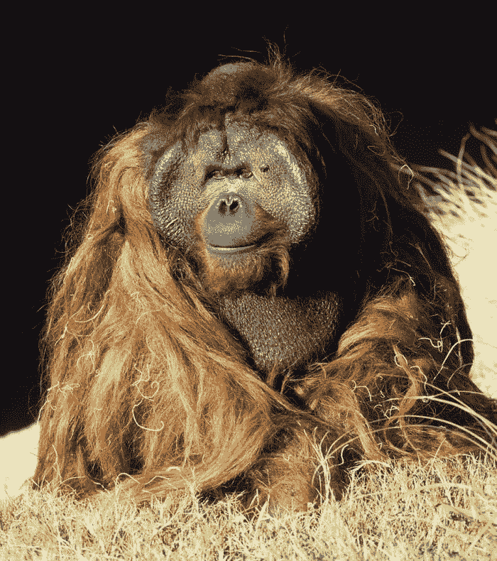
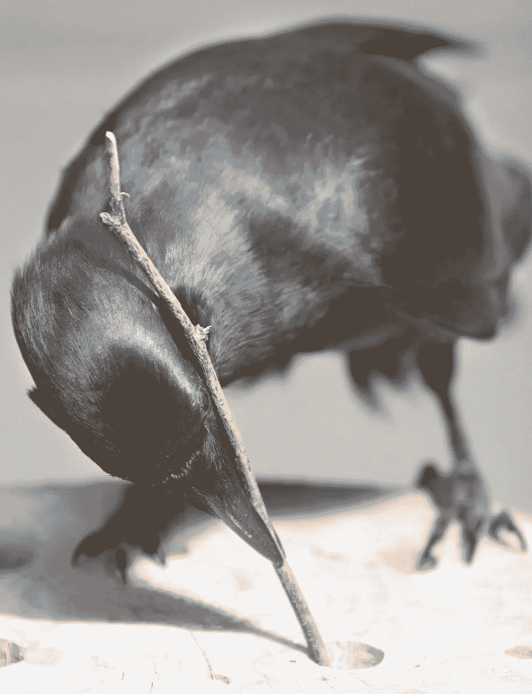
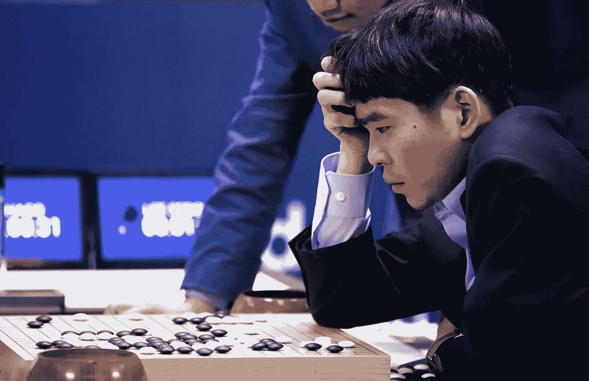

# AI 创造力。为什么人们关注人工智能的最新进展？

> 原文：<https://medium.com/geekculture/ai-creativity-why-people-are-concerned-about-latest-ai-progress-7c7489ebaaa9?source=collection_archive---------9----------------------->

如果你想要这篇文章的视觉叙述，你可以看上面的视频。

在过去的几个月里，人工智能及其与艺术的交叉获得了广泛的关注。从剧本写作到场景制作，人工智能生成的艺术成果正开始无缝衔接，并可能在几年内开始与大片积极竞争。今天我们将考虑人工创造力及其对人类的影响。随着时间的推移，这些人工智能系统变得越来越好，我们会开始越来越不欣赏艺术吗？

在说 AI 和创造力之前，我们先定义一下它是什么。创造力通常被定义为通过形成新的想法或物体来超越传统思维方式的能力。你可能会想，这和创新有什么不同？嗯，如果创造力是想法或物体的开端，那么创新就是实现它们的过程。创新不仅仅是发明，它需要积极地利用想法或让他人可以利用。我希望这有助于澄清这两个概念之间的区别。在本文中，我们对创造力的讨论将超越视觉艺术。它将包含一切需要跳出框框思考的东西。我们也可以询问是否只有人类才有创造力。人们普遍认为，它要么与智力相关，要么是智力的一个特征。也就是说，它可以在表现出某种智能的代理人身上找到。例如，1985 年，红毛猩猩肯·艾伦因一系列从动物园围栏中突围而出而臭名昭著，其中包括他的同伙维基的帮助和使用撬棍作为工具。他后来被戏称为多毛的胡迪尼。我相信即使是伟大的胡迪尼也会感到骄傲。

Ken Allen the Orangutan (*San Diego Zoo*)

据观察，乌鸦在寻找食物时也非常擅长解决问题。2002 年，研究人员发现乌鸦可以将电线或细枝弯成钩子，并用它们作为工具从管子里提取食物。

Creatures of habit? © Dr Simon Walker

有了这个以及其他动物创造性解决问题的更多例子，很难争辩说创造力只属于人类。然而，从发现火的时代到探索宇宙的复杂创新解决方案，人类在历史上展示了巨大的创造性努力。有了所有这些例子，似乎人类的想象力是无穷的，那么为什么有些人会感到这些人工智能系统的威胁。？这个人工智能时代难道不应该给人类的未来带来希望，并成为进一步增强我们创造力的一种方式吗？

让我们首先检查一些可能被称为人工智能创造力的实例，并确定这是否会最终导致我们对人工智能的过度依赖。我们将从围棋比赛中 AlphaGO 的热门棋步 37 开始。AlphaGO 是一个人工智能程序，它击败了当时的世界围棋冠军 Lee Sedol。围棋已有 2500 多年的历史，是已知最古老的游戏，目前仍在世界各地进行。这个游戏有如此多的可能移动，如果你必须在接下来的四个回合中计算所有的可能性，你会看到 3200 亿个场景的组合！你想猜猜 8 圈有多少种可能性吗？512 万亿分之一。那可是 5 亿多亿啊！完全离谱！然而，AlphaGo 在五场比赛的第二场比赛中做出了一个非常规的举动 37，震惊了专家。每个人最初都认为 AlphaGo 在这步棋上犯了一个鲁莽的错误，但前提是他们知道将要发生什么。Lee Sedol 花了大约 15 分钟来回应这一举动。这最终成为 AlphaGo 赢得比赛的一种非常具有战略意义的方式。你会说这是人工智能程序击败世界冠军的创造性举动吗？

Lee Sedol playing AlphaGo, 2016\. Lee Jin-man / AP

你怎么想呢?请在评论区留下你的看法。最近对人工智能创造力的声称包括生成既迷人又可怕的文本或图像的模型。一些人工智能模型能够生成文学作品，这些作品可能采用令人信服的新闻文章或引人注目的小说故事的形式。而其他人也可以生成从未存在过的人的真实面孔或只需要文本描述的艺术品。这些模型，尽管有时并不完美，却能让我们窥见几年后的未来。目前，许多开发人员和爱好者正在寻找新的方法，将文本的功能扩展到图像甚至视频，以构建更引人注目的故事。这是通过结合几个人工智能辅助的功能来实现的，例如着色、修复或运动等。我们可以在另一篇文章中深入讨论这些术语。

关于人工智能系统的创造力，仍然存在一些不确定性。论点是，这些系统只是基于数十亿数据的查询结果，仅此而已。他们通过将熟悉的想法进行新的组合来发现新的想法。例如，流行的数字图像生成器 DALL-E 并没有革新任何绘画风格，尽管它可以在旧风格的基础上产生新的想法。AlphaGo 的第 37 步棋是人工智能在解决问题方面可能做到的一个不朽的壮举，无论这是否真的是一个创造性的步骤。

如果人工智能可以产生新的或非传统的想法，为什么这被视为一种威胁，而不是一种提高我们创造力的方法？在人类历史的进程中，每一次创新性的突破，似乎都引领了对需要更高层次抽象的任务的新的好奇心。从工具制造、火的控制到工业革命以及其他领域，我们一直在利用创造力为自己谋利，那么现在为什么要停止呢？总的来说，创新似乎是一种我们较少关注低层次事物，而专注于高层次思考的方式。这只是人类历史上的另一个标志，我们再次使用创造性的方法，如人工智能实现来推进我们的目标。对于像图像生成这样的创造性任务，另一个关注点是虚假图像的创建和传播。在图像生成方面，当人工智能能够生成真实人物的图像，描绘对工作不安全的内容中的主题时，就有可能存在恶意。

从轻松的角度来看，社交媒体上也有更多有趣的实验性图片，比如 Jeflon Zuckergates 的这张，他的身价超过 5000 亿美元，拥有 Teslazon 和 Facesoft。难以置信的东西！

Jeflon Zuckergates by Stable Diffusion AI

同时，对文本生成中的错误信息和虚假信息的担心已经成为一个大问题，尤其是在最近几年。由于这些担忧，谷歌和 OpenAI 等公司正在限制对一些强大模型的全部功能的访问。另一方面，有人认为将人工智能中的道德和偏见的决策权留给少数公司是不明智的。这些辩论仍在继续，而且是必要的。

由于这些担忧，谷歌和 OpenAI 等公司正在限制对一些强大模型的全部功能的访问。另一方面，有人认为将人工智能中的道德和偏见的决策权留给少数公司也是不明智的。这些辩论仍在继续，而且是必要的。

你怎么看待人工智能和创造力？你认为人类最终会把我们的创造性工作留给机器吗？请在评论区留下你的想法。

谢谢大家！