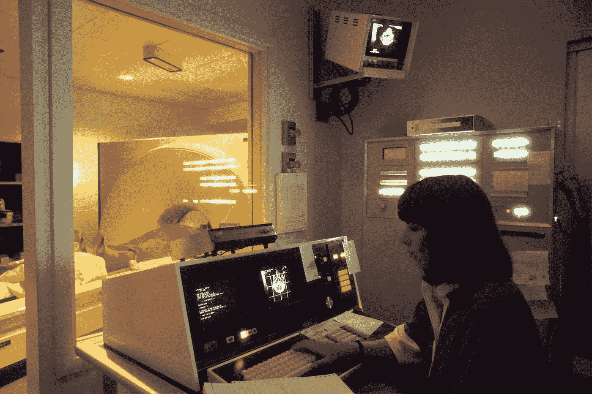
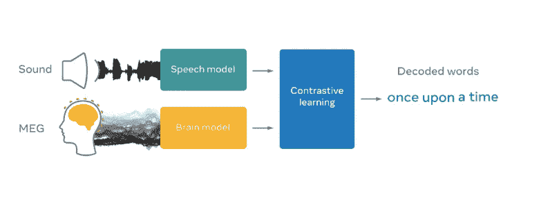

# 人工智能读心术具有惊人的准确性！是好事吗？

> 原文：<https://medium.com/geekculture/ai-mind-reading-with-surprising-accuracy-is-it-a-good-thing-f4e27b95f6d5?source=collection_archive---------8----------------------->

Photo by [National Cancer Institute](https://unsplash.com/@nci?utm_source=medium&utm_medium=referral) on [Unsplash](https://unsplash.com?utm_source=medium&utm_medium=referral)

***注*** *:如果你想要这篇文章的视频版本，有更多的视觉例子，那么点击下面的链接。*

读心术是你希望拥有的三大超能力之一吗？好吧，人工智能开始解决这个问题。这项技术还远未达到 X 教授的水平，但结果会让你大吃一惊。随着人工智能的最新进展，科幻小说和现实世界似乎在某些方面走到了一起。在这篇文章的最后，你将不再认为人工智能辅助的心灵感应是一个如此疯狂的想法。

从大脑活动中解码语音一直是神经科学家和临床医生的长期目标。由于大脑解剖结构的差异，大脑记录因人而异。其他原因是因为大脑部分的神经细胞在何时何地激活，以及在记录过程中放置传感器的位置。正如你已经知道的，分析大脑数据通常需要复杂的科学方法。跟踪大脑中发生的事情的最有效的方法是通过外科手术植入电极。哎哟！这些被称为侵入性技术，它们显然对病人有潜在的危险。在可能需要它的患者的日常生活中使用它也是非常不切实际和不舒服的。另一方面，非侵入性方法不涉及手术。取而代之的是，将电极附着在头皮上，或者将类似扫描仪的设备放在头部。非侵入性方法的缺点是它们不如侵入性技术准确，因为它们不直接与大脑相连。以前曾有人试图了解一个人在想什么，但解决方案对个人来说非常具体，即使是最简单的语言也很难表达出来。研究人员一直在寻找这个用例的更准确和更通用的应用程序，现在看来我们正朝着这个方向前进！

脸书人工智能研究实验室的科学家开发了一种人工智能模型，可以从大脑活动的无创记录中解码语音。尽管这项技术产生了嘈杂的数据，但人工智能模型仍然显示出非常有希望的结果。该实验室旨在帮助那些遭受创伤性脑损伤并且无法有效沟通的人。他们训练人工智能算法来分析 169 名健康人听英语和荷兰语有声读物的大脑活动。让我们稍微看看幕后，分析一下人工智能模型是关于什么的。测试的参与者听几个小时的有声读物，他们的大脑活动用**脑磁图**(脑磁图)或**脑电图(**脑电图 **)** 波形捕捉。脑磁图和脑电图是我们之前提到的非侵入性方法。这些波被转换成数字，因为这是计算机理解概念的方式。这些数字同时与有声读物中的实际单词相匹配。本质上，脑电波与语音波相比较，相似性被识别。

人工智能模型的结果表明，它可以以高达 73%的前 10 名准确率解码语音。这意味着，在一组 10 个可能的句子中，人工智能模型预测结果的准确率为 73%。我希望这没有让你更加困惑。73%可能看起来是一个不错的数字，但是考虑到这个问题有多复杂，这是非常非常突出的！如果你有任何问题，请在评论区留言，我会回答你。根据 Meta 的说法，该模型在 793 个单词的词汇量上进行测试，这是我们在日常对话中使用的大多数单词。这是令人兴奋的一步，因为它表明人工智能可以成功地学习解码来自大脑活动的嘈杂和可变的无创记录。这项工作是科学界利用人工智能更好地了解人类大脑的努力的一部分。

正如我们所知，强大的技术既可以用于好的方面，也可以用于坏的方面。这项技术不好的一面是，像政府这样的强大实体可能会非法地将它用于侵入性目的，如监视公民或不道德的情报收集。在这一点上，模型不具备这样的能力。作者还说，像咬紧牙齿或眨眼这样的抵抗方法会弄乱这些信号，并可能停止不必要的大脑语音解码。现在，这是一线希望，至少现在是这样。

除了 Meta，德克萨斯大学奥斯汀分校的一个小组还创建了一个人工智能模型，它也可以从大脑的非侵入式记录中解码语音。他们的技术包括使用 fMRI 大脑记录对三名参与者进行模型训练。这些录音是在听了 16 个小时的叙事故事后产生的，别担心，由于可能的疲劳，它们被分成了多个时段。作者将他们的工作分为想象的和感知的刺激。这是因为他们想调查想象一个故事和听音频或看电影之间的重叠。他们进行了一项有趣的实验，在实验中，当人们观看无声电影时，他们监测大脑信号。谁不喜欢无声电影呢？你可以在这里看到，即使电影中没有文字，人工智能系统仍然能够产生大脑正在处理的概念意义。产生的文本可能不会非常准确地匹配视觉效果，但当您考虑成千上万的单词及其几乎无限的组合时，您会开始看到结果是多么惊人。这也可能是因为大脑能够在可能发生的事情发生之前很快预测到它，所以在下一组视觉图像出现之前，它过滤了未来的可能性。与 Meta 类似，奥斯汀团队调查了该技术的恶意使用案例。他们表示，目前这项技术只有在参与者愿意合作的情况下才能发挥作用。像心算和想象一个不同的故事这样的抵抗方法似乎会降低从大脑记录中解码语音的效率。如果我们知道对方在想什么，许多关系都可以挽回。会省去很多冲突和误会，但最有可能的结果会是相反的。每个人都有他们想保持私密的想法，或者有时只是我们无意识的随机想法。像这样的想法肯定不是我们想让别人知道的。人工智能开始擅长预测甚至最困难的事情，人们对它在我们生活中的潜在影响既兴奋又担忧。像大多数伟大的技术一样，工程技术的进步在政策制定之前就已经发生了巨大的飞跃，以跟上快速发展的步伐。像 Neuralink 和 Kernel 这样的公司也在努力开发非常精确的脑机接口，在未来，这些接口可以用于治疗疾病或障碍，与数字设备连接，或关注一个人的整体健康状况。你对读心术及其十年后的潜力有什么看法？我想知道你的想法。

*感谢阅读！*

**资源:**

*博览会*

**项目网站**:【https://ai.facebook.com/blog/ai-speech-brain-activity/ 

【https://arxiv.org/pdf/2208.12266.pdf】纸 : [纸](https://arxiv.org/pdf/2208.12266.pdf)

*德克萨斯大学奥斯汀分校*

**论文**:[https://www . bior XIV . org/content/10.1101/2022 . 09 . 29 . 509744 v1 . full . pdf](https://www.biorxiv.org/content/10.1101/2022.09.29.509744v1.full.pdf)