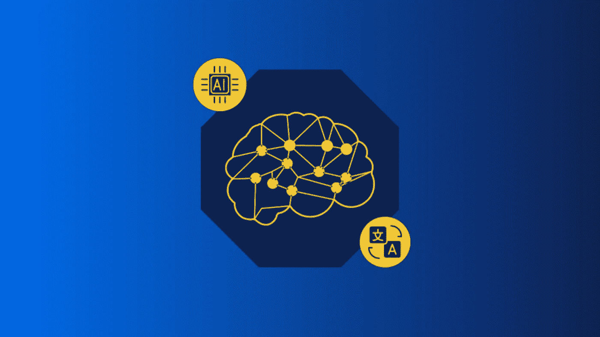

# 关于神经机器翻译的所有知识

> 原文：<https://medium.com/geekculture/all-there-is-to-know-about-neural-machine-translation-402b4e916230?source=collection_archive---------15----------------------->

成为一家全球企业意味着在正确的地方使用正确的语言。传统上，这意味着需要大量的人工翻译，将原文和内容转换成当地观众可以接受的语言。但是神经机器翻译可能会有所帮助。

在我们这个互联的世界里，事情发展得很快，对于商业来说尤其如此。内容是滚动公开的，特别是在社交媒体上，公司需要他们的消费者群和新客户立即理解他们的信息。

答案是机器翻译，换句话说，让技术来做这项工作。尽管它不能取代翻译人员，但机器翻译的优势在于它能够即时翻译语言。

但这是一项自 20 世纪中期诞生以来不断发展和改进的技术。人工智能的兴起意味着更复杂的翻译技术。毫无疑问，[翻译软件](https://www.transifex.com/blog/2022/translation-software/)对任何着眼于全球市场的企业都有好处。

但是机器翻译到底是什么，它是如何工作的？

# 什么是机器翻译？

的确，为了使用技术并从中受益，比如一个[弹性分布式数据集(RDD)](https://databricks.com/glossary/what-is-rdd) ，你不一定要理解它是如何工作的，但掌握基本原理是有帮助的。最基本的是，[机器翻译](https://www.transifex.com/blog/2021/what-is-machine-translation/)意味着文本从一种语言到另一种语言的自动转换。

它依靠计算机，确切地说，是人工智能来翻译。机器翻译起源于 20 世纪 50 年代，其非常基本的结果依赖于人类程序员强加一套技术遵循的规则。但机器翻译在 21 世纪变得越来越复杂，并开始起飞，特别是对在线业务而言。

# 神经机器翻译(NMT)

神经机器翻译(NMT)是机器翻译的最新发展。它依靠神经网络来解码文本，同时学习和发展语言知识。这意味着它可以比翻译系统更准确地翻译，翻译系统根据预设的规则和指令处理单词和短语，而这些规则和指令必须手动更新。

NMT 与早期机器翻译的不同之处在于，它的神经网络是以人脑自身的功能为模型的，就像[神经网络平台](https://databricks.com/glossary/neural-network)一样。

特别是，我们的大脑倾向于根据我们之前遇到的单词的重复模式和排列来预测单词的含义和解释，从而实现理解的飞跃。

NMT 注意到这些联系和模式的能力，加上它对大型数据库的访问，意味着就像人脑一样，随着时间的推移，一些联系变弱，而另一些联系变强。这种形式的机器学习允许整体语言知识和深度随着时间的推移在复杂性和准确性方面增长。

# NMT 是如何工作的？

当然，现成的模板也可以用于商务交流，比如[销售提案示例](https://www.pandadoc.com/business-proposal-templates/)，它们非常有用，而且节省时间。但是对于 NMT，你面对的是一个能够适应和学习的系统，它可以把一种语言中的单词转换成另一种语言中同样有影响力的单词。

正如我们已经看到的，NMT 可以通过基于它以前的经验和它所学到的东西进行预测来达到翻译的准确性。为此，它使用了神经网络。

神经网络可以处理相当大的数据块，而不需要人类操作员的监督。NMT 的神经网络分为两部分:编码器和解码器网络。另一个关键组成部分是一系列节点，就像人脑中的节点一样。

神经网络基于预测意义和用法来翻译文本；从一种语言中解码出单词，并将其编码成目标语言。

# 对企业的主要好处

当然，对于商业用户来说，NMT 功能的技术细节不如这种复杂类型的翻译的好处重要。企业关心清楚地传达他们的信息，并让这些信息产生影响。

# 客户服务

在商业运作的所有领域中，客户服务可以说是良好沟通最重要的领域。当跨越文化、国界和语言与客户交谈时，这可能是一个真正的挑战。没有足够重视提供良好的对话翻译是避免进入新市场的最大的[错误之一。](https://www.transifex.com/blog/2022/localization-mistakes/)

服务台和实时聊天都可以帮助 NMT。请求、查询和反馈的准确和快速翻译都可以由神经机器翻译来提供。该系统的美妙之处在于，随着时间的推移，NMT 会变得越来越好，因为它学习了特定地理位置的客户的特定语音模式和词汇集。

同样，机器翻译工具还没有好到可以取代翻译人员，或者在这种情况下，取代客户服务专家。但是它们在很多情况下是有帮助的。

# 准确(性)

虽然没有翻译系统可以保证 100%的准确性，但 NMT 的水平远远高于以前的机器翻译。它的预测和学习能力赋予它优势，并确保更复杂和准确的翻译。

随着 MNT，其数据库不断增长，使其能够理解单词的上下文并相应地调整解释。

然而，这种能力确实依赖于文本的清晰度以及要翻译的语言的连贯性、技术性或不寻常性。在让系统独立工作之前，尝试预测某些领域可能出现的一些技术语言或不寻常的语言，并将它们添加到软件中是一种很好的做法。

# 费用

由语言专家进行的传统翻译成本很高，根据内容的数量，这一成本可能会大幅上升。

在初次购买和安装后，NMT 的日常使用成本要低得多。本地化团队通常让机器翻译执行第一遍，然后翻译人员进来修正和改进需要改进的地方。

以这种方式工作，而不是为整个翻译项目向专业人员付费，可以帮助降低翻译预算，同时还可以节省您的时间。

# 翻译未来

正如我们所见，NMT 是机器翻译发展中的一个进化步骤。毫无疑问，将会有进一步的改进和进步。

但是，企业翻译需求的自动化并没有完全消除对熟练工人的需求。在公司如何与消费者互动方面，NMT 有其局限性。

在电话那头，仍然没有任何东西像一个真正的人一样有同情心和幽默感，而且一些交流是微妙的，需要极度的准确性和用词的小心。在这些情况下，人总是比机器做得更好。

但这实际上并不是机器翻译的功能或主要优势。当翻译进来做剩下要正确完成的事情时，mt 是用来快速通过第一关的。

即使你的机器翻译工具正确完成了 1%的翻译，而且通常比这好得多，在一个数百万字的项目中，这也可以扩展到成千上万的翻译。

作为一种专业，翻译总是需要人类和机器思维的结合，从某种意义上说，两种类型的大脑贡献不同的东西。在速度和成本效益方面，人类无法与机器相比，但人类可以检查准确性，并提供宝贵的细微语言技能，这些技能对企业的形象和全球影响力至关重要。

# 最后的想法

关于 NMT 对任何企业的潜在贡献，最后一个想法是考虑它在翻译用户生成内容方面的优势，尤其是出现在社交媒体上的内容。

NMT 可以在短时间内翻译成千上万的评论，为品牌提供一个活动或产品在全球接受程度的即时快照。诸如此类的评论可以告诉品牌，消费者对其产品或形象的评价或厌恶是什么。

这个信息很有价值。这是衡量顾客想法和感受的标准。通过这种方式，NMT 可以揭示在翻译中丢失了什么，或者一个品牌是否真正在说顾客的语言。

本文由来自 [DataBricks](https://databricks.com/glossary/hadoop) 的 [Pohan Lin](https://www.linkedin.com/in/pohan-lin-7ba9/) 供稿，他也曾在 [SME-News](https://www.sme-news.co.uk/the-relationship-between-analytics-and-demand-forecasting-in-retail/) 等领域发表。

帖子最初是[发表在](https://www.transifex.com/blog/2022/neural-machine-translation/)这个页面上的。